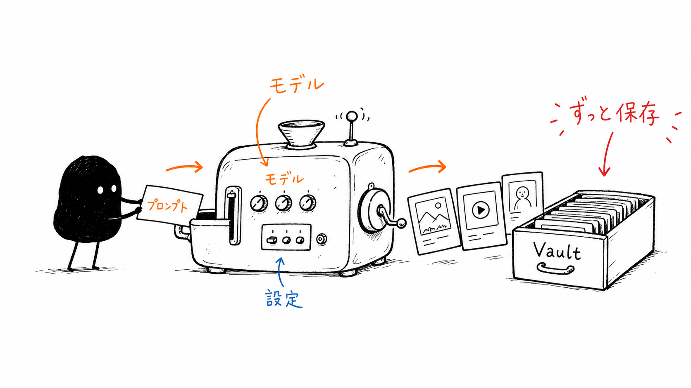
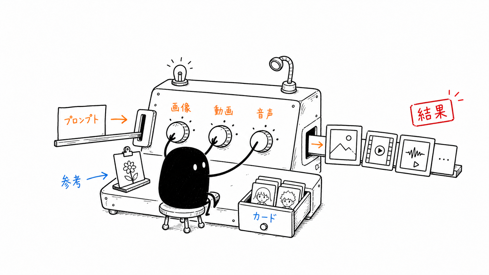
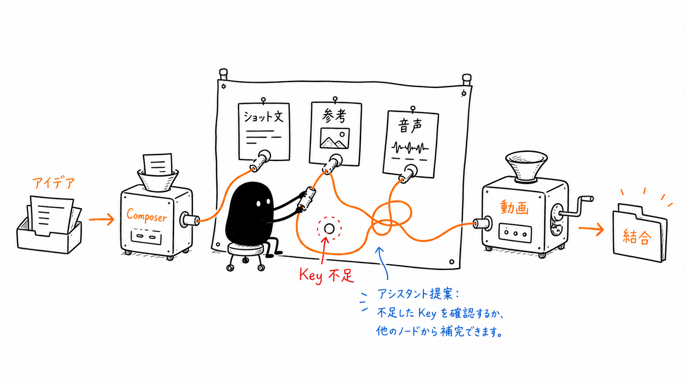
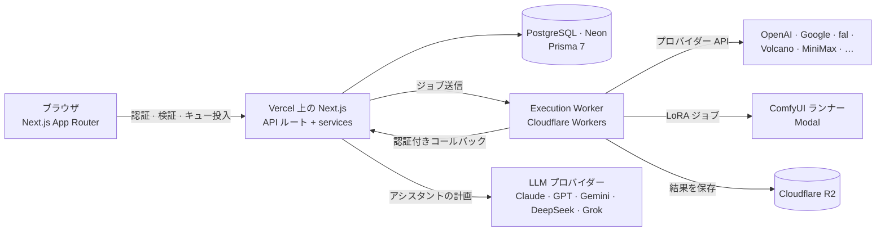

[English](README.md) | **日本語** | [中文](README.zh.md)

# ANTEI —— パーソナル AI クリエイティブスタジオ

ANTEI（コードネーム **PixelVault**）は、画像・動画・音声・3D を扱うマルチモデルの制作ワークベンチです。各社の最先端の生成モデルをひとつの画面にまとめ、すべての生成結果を永久にアーカイブし、作ったものをキャラクター・画風・声・プロンプトのレシピ・LoRA といった再利用できる資産に変えて、次の制作につなげます。

**公開版：** [www.anteisuba.com](https://www.anteisuba.com) · English / 日本語 / 中文



---

## ANTEI の特長

- **ひとつのスタジオで多数のモデル。** 画像・動画・音声・3D をひとつの作業場所で生成。各モデルが実際に対応するパラメータをそのまま扱え、最大公約数的なフォームに押し込めません。
- **制作のコントロールを最優先。** 参照画像に「人物・ポーズ・画風・内容」の役割を指定し、プロンプトはモデルごとの書き方で作成。複数カットの作品はノードキャンバスで組み立て、LoRA のレシピは元画像から忠実に再現できます。
- **何も失われない。** 生成のたびにプロンプト・モデル・パラメータ・来歴ごと永久保存し、フォルダ・カード・レシピに整理して何度でも再利用できます。
- **道具を使いこなすアシスタント。** 内蔵のオペレーターは、まず相談してから手を動かします。参照画像の確認、Web での調査、モデル固有のプロンプト作成、ワークベンチやキャンバスの編集まで行い、すべての変更は元に戻せ、有料の生成は必ずあなたが確定します。
- **あなたのキー、あなたの支払い。** 生成はあなた自身のプロバイダーキー（BYOK）で行い、キーは暗号化して保存します。リクエストが黙ってプラットフォームのキーに切り替わることはありません。

---

## 機能紹介

### スタジオ

日々の単発制作のためのワークベンチです。

- **画像**——自然言語ワークベンチとタグワークベンチ（Danbooru 形式、NovelAI ではタグをリアルタイムに検証）を並べて利用。参照画像には人物・ポーズ・画風・内容の役割を指定でき、アスペクト比と解像度はモデルごとの段階から選べます。
- **画像編集**——指示による編集、インペイント、オブジェクト置換、スタイル変換、文字描画、背景除去、要素の抽出、アップスケール。
- **動画**——テキストから動画、先頭/末尾フレーム指定、複数参照の各モード。長さ・解像度・参照枚数はモデルごとに送信前に検証します。
- **音声**——再利用できるボイスライブラリ付きの音声合成、効果音、音楽。
- **3D**——1 枚の画像からテクスチャ付き GLB を生成。先に素体メッシュを確認できるプレビュー経路もあります。



### ノードキャンバス——ディレクターデスク

長尺・複数カットの制作のためのキャンバスです：脚本 → カット割り → カットごとの画像・動画生成 → 編集デスク。

- テキスト・画像・動画・音声の 4 種類のノードを型付きのポートでつなぎ、参照や脚本が必要なカットへ自然に流れ込みます。
- 脚本ノードはカットノードへ展開でき、脚本を直せば再展開できます。
- タイムライン付きの編集デスクで、つなぎ、トリミング、字幕、レンダリングを行えます。
- 取り消し履歴はひとつだけ——あなたの操作でもアシスタントの操作でも同じように元に戻せます。



### LoRA ワークベンチ

まず再現し、それからカスタマイズ。

- Civitai と Hugging Face から LoRA を探し、個人ライブラリに取り込めます。
- 元画像のレシピ——ベースモデル、LoRA の組み合わせと重み、サンプラー、ステップ数、CFG、高解像度補正——を再現し、自前のランナーで同じ画像を生成します。
- ランナーのベースモデルは Anima（Base / Turbo）、WAI-Illustrious-SDXL、Pony Diffusion V6 XL、SDXL 1.0、Z-Image Turbo、Krea 2 Turbo。ベースモデルの系統ごとに、その流儀でプロンプトを書きます。
- Modal 上の ComfyUI ランナーで動作します（サイト全体で共有する月間枠、キー不要）。

### アシスタント

画像・LoRA・動画・キャンバスの 4 つのワークスペースが、同じオペレーターエンジンを共有します。

- **まず相談、指示されてから実行。** 質問には答えを、指示には変更を。本当に判断が分かれるところだけ、短い選択式の質問で確認します。
- **5 つの動詞：** 見る（参照画像と結果の確認）、調べる（出典付きの Web 検索）、尋ねる、変更する（プロンプト・モデル・仕様・キャンバスのノード）、生成を依頼する——生成の依頼は必ず確認カードで止まります。有料の生成を始められるのはあなただけです。
- **プランナーのモデルは自由に選択：** Claude（Opus 5.5 / Sonnet 5.5 / Fable 5.1）、OpenAI GPT-6 シリーズ、Gemini 3.x Flash、DeepSeek、Grok。
- ラウンドごとのまとめと任意の長期記憶により、履歴全体を再送しなくても決定事項が次のターンへ引き継がれます。

### ライブラリ

- **素材（Assets）**——生成・アップロードしたすべてのファイル。入れ子のフォルダ、一括操作、その場で開ける詳細表示。
- **カード（Cards）**——キャラクター・画風・ボイスのカード。生成やカットをまたいでも人物と見た目を揃えられます。
- **プロンプト（Prompts）**——バージョンと作品の来歴を持つ個人レシピ。
- **ギャラリー（Gallery）**——任意の公開展示。プロンプトは、整理済みのレシピをあなたが公開したときにだけ共有されます。

### Claude 連携（MCP）

キャンバスは Model Context Protocol のエンドポイントを提供します。Claude がプロジェクトを読み、クリップを確認し、タイムラインを編集する様子を、ブラウザでそのまま見られます。MCP のツールが有料の生成を起こすことはありません。

---

## モデル

モデルの構成は頻繁に変わります。正確な一覧は [`src/constants/models/`](src/constants/models/) と [`src/services/providers/registry.ts`](src/services/providers/registry.ts) を参照してください。

| モダリティ | モデル系統                                                                                                                                                           | 経路                                                             |
| ---------- | -------------------------------------------------------------------------------------------------------------------------------------------------------------------- | ---------------------------------------------------------------- |
| 画像       | GPT Image 2 / 2.5、Gemini Nano Banana Pro / 2.1 / 2 Lite、FLUX.2 Pro / Flash、FLUX Kontext Max、Seedream 5.0 Pro / Lite、Ideogram 4.5、Recraft V4、NovelAI V4.5 / V5 | OpenAI、Google、fal、Ideogram、NovelAI、Volcano Engine、BytePlus |
| 動画       | Seedance 2.0 / 2.5、Kling V3 / O3（動画から動画への編集を含む）、Wan 3.0、HappyHorse、Gemini Omni Flash、MiniMax H3                                                  | fal、Google、Volcano Engine、BytePlus、MiniMax                   |
| 音声       | Fish Audio S2 Pro、ElevenLabs Sound Effects v2、ElevenLabs Music v2                                                                                                  | Fish Audio、ElevenLabs                                           |
| 3D         | Rodin Gen-2.5、Hunyuan3D v3 / v3.1 Pro、TRELLIS 2、TripoSR                                                                                                           | Hyper3D、fal                                                     |
| LoRA       | Anima、Illustrious / Pony / SDXL、Z-Image Turbo、Krea 2 Turbo                                                                                                        | Modal 上の ComfyUI ランナー                                      |

同じモデルを開発元と再販業者の両方が提供している場合は、開発元の API を優先します。

---

## アーキテクチャ



- **Worker 主体の実行。** Web アプリは認証・検証・ジョブの記録・送信だけを担います。時間のかかるプロバイダー呼び出し、ポーリング、アップロードは Cloudflare Worker で処理し、認証付きコールバックで結果を返すため、サーバーレス関数が生き続けることに依存しません。
- **層に分けたコード。** `constants/` と `types/`（Zod スキーマ）→ `services/`（データベースと外部 API に触れる唯一の層）→ `hooks/` → `components/`。API ルートは認証・検証・service 呼び出しの 3 つだけを行います。
- **サーバー側での保証。** 所有権の確認、利用量の記録、課金のゲートはすべてサーバー側にあります。アシスタントと MCP のツールは、構造上、有料の生成を開始できません。

| 層         | 技術                                                                                  |
| ---------- | ------------------------------------------------------------------------------------- |
| アプリ     | Next.js 16（App Router、Turbopack）、React 19、TypeScript                             |
| UI         | Tailwind CSS 4、shadcn/ui、Motion、React Flow、Tiptap                                 |
| 認証       | Clerk                                                                                 |
| データ     | Neon 上の PostgreSQL、Prisma 7                                                        |
| ストレージ | Cloudflare R2（永久アーカイブ、CDN 配信）                                             |
| 実行       | Cloudflare Workers（生成、動画レンダリング、画像プロキシ）、Modal（ComfyUI ランナー） |
| 多言語     | next-intl——英語・日本語・中国語                                                       |
| 検証       | API 契約、プロバイダーへの送信内容、モデル出力まで Zod で一貫して検証                 |
| テスト     | Vitest、Testing Library、Playwright                                                   |

---

## ディレクトリ構成

```text
src/
├── app/            ルート（App Router）と API ルート
├── components/     ui/（状態を持たない部品）· business/（状態を持つ機能部品）
├── constants/      モデル、プロバイダー、上限、ルート——まずここを確認
├── contexts/       スタジオとワークベンチの状態
├── hooks/          クライアント側の状態とデータの hooks
├── lib/            共有ユーティリティと API クライアント
├── messages/       en / ja / zh の文言
├── services/       サーバー専用のビジネスロジックとプロバイダーアダプター
└── types/          Zod スキーマと推論型
workers/            Cloudflare Workers（実行、動画レンダリング、画像プロキシ）とランナー
prisma/             スキーマとマイグレーション
docs/               ワークフロー、リファレンス、チェックリスト（docs/README.md から）
```

---

## ローカル開発

**必要なもの：** Node.js 22、npm 10 以上、PostgreSQL データベース（Neon 推奨）、Clerk アプリケーション、Cloudflare R2 バケット。

```bash
npm install
cp .env.example .env.local   # データベース、Clerk、R2、暗号化用シークレットを記入
npm run dev                  # http://localhost:3000
```

よく使うチェック：

```bash
npm run typecheck
npm run lint
npm run test:run
```

プロバイダーキーは、アプリ内の **設定 → キー** でユーザーごとに追加します。`.env.local` に必要なのは、プラットフォームのキーを使う機能（たとえばアシスタントの既定の Gemini 経路）の分だけです。実行用 Worker は `workers/execution` にある独立したパッケージで、テストも別に持っています。

---

## セキュリティとプライバシー

- プロバイダーキーは AES-256-GCM で暗号化し、そのキーを使うリクエストの間だけサーバー側で復号します。
- すべての API ルートは最初に Clerk で認証し、所有権をサーバー側で確認します。
- ユーザーが指定した URL をサーバー側で取得する際は、SSRF 対策を通します。
- 元のプロンプトは非公開のままです。公開レシピはあなたが明示的に公開したときだけ、整理されたうえでギャラリーに表示されます。

---

## ドキュメント

開発ドキュメントは [`docs/`](docs/README.md) にあります：タスクのワークフロー、領域ごとのリファレンス（キャンバス、LoRA、アシスタント、プロバイダー、モデル一覧）、リリース前のチェックリスト。

## ライセンス

このリポジトリにはオープンソースライセンスが含まれていません。All rights reserved.
