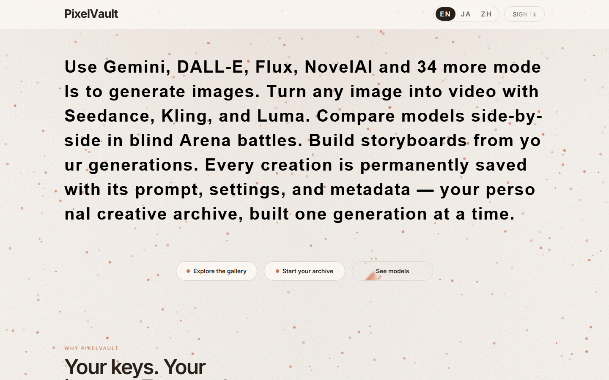
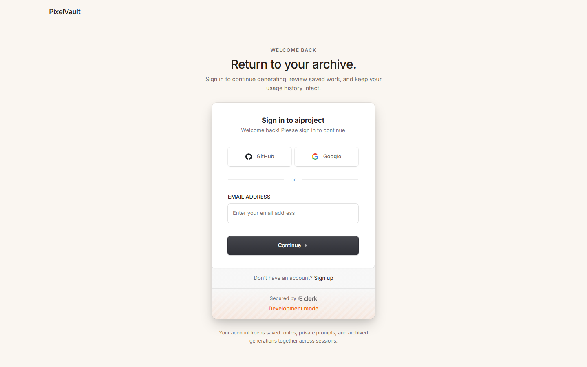
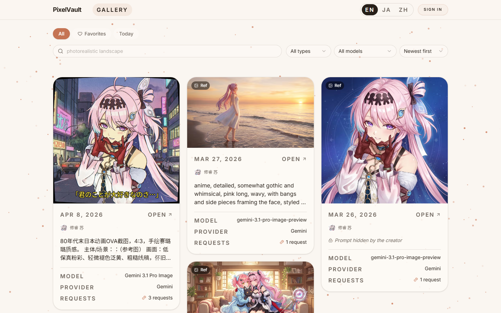
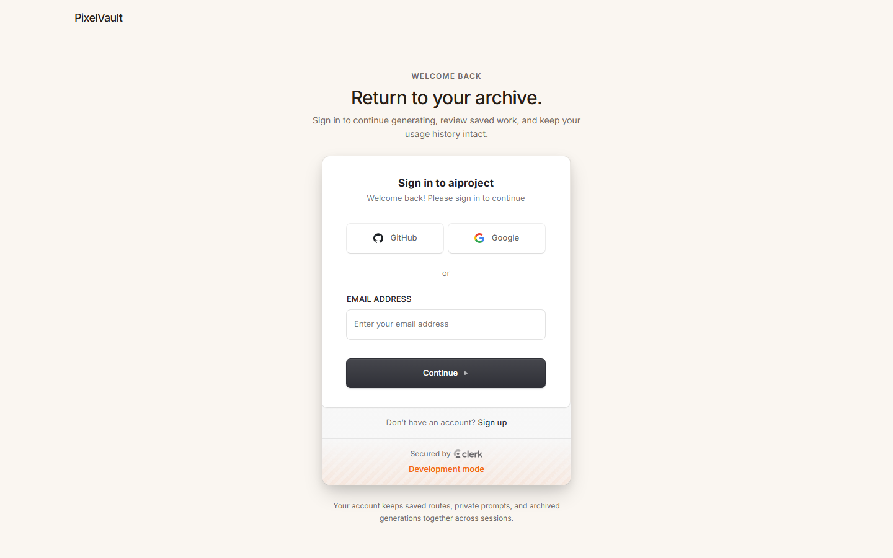

**English** | [日本語](README.ja.md) | [中文](README.zh.md)

# PixelVault — Personal AI Gallery

Generate images and videos with 20+ AI models. Compare them blind. Archive everything forever.

**Try it now:** [pixelvault-seven.vercel.app](https://pixelvault-seven.vercel.app/)

---

## What is PixelVault?

PixelVault is a multi-model AI image & video generation platform. Pick any model — GPT-Image, Gemini, FLUX, Kling, Sora, and more — generate from the same prompt, and keep every creation permanently archived with its settings and metadata.

---

## Quick Start

1. **Sign up** — Free credits are included on registration
2. **Go to Studio** — Pick a model and enter your prompt
3. **Generate** — Your image or video is created and permanently saved

That's it. No setup, no API keys needed (unless you want premium models).

---

## Features

### Studio — Create Images & Videos

Your creative workspace. Write a prompt, pick a model, and generate.

- **11 image models + 10 video models** across 6 providers
- **Prompt Enhancement** — Let AI rewrite your prompt in 5 styles (detailed, artistic, photorealistic, anime, LoRA)
- **Reference Images** — Upload an image as visual guidance for generation
- **Image Reverse** — Analyze any image to extract its generation parameters
- **Image-to-Video** — Turn any generated image into a video clip
- **Character Cards** — Save character presets to maintain consistency across generations
- **Video durations** from 3s to 120s, resolutions up to 1080p

### Gallery — Discover & Share

Browse what others have created. Find inspiration. Share your own work.

- Search by prompt text
- Filter by model, type (image/video), and time range
- Like and bookmark your favorites
- Click any image to see full details — prompt, model, settings
- Use any gallery image as a reference for your next generation

### Arena — Blind Model Battles

Which model is actually the best? Find out by voting blind.

1. Select 2–4 models and enter a prompt
2. All models generate from the same prompt simultaneously
3. Vote for the best result — **without knowing which model made it**
4. After voting, model identities are revealed with ELO rating changes
5. Check the **Leaderboard** to see overall model rankings

### Profile — Your Personal Archive

Every generation you've ever made, in one place.

- View all your creations with search and filters
- Toggle public/private visibility per image
- Stats dashboard — total generations, requests, and more
- Hard-delete with full storage cleanup when needed

---

## Available Models

### Image Models

| Model               | Tier     | Credits |
| ------------------- | -------- | ------- |
| GPT-Image 1.5       | Premium  | 3       |
| Gemini Pro Image    | Premium  | 2       |
| FLUX 2 Pro          | Premium  | 2       |
| Seedream 4.5        | Premium  | 2       |
| Ideogram 3          | Standard | 2       |
| Recraft V3          | Standard | 2       |
| Gemini Flash        | Standard | 1       |
| FLUX 2 Dev          | Standard | 1       |
| FLUX 2 Schnell      | Budget   | 1       |
| Animagine XL 4.0    | Budget   | 1       |
| Stable Diffusion XL | Budget   | 1       |

### Video Models

| Model          | Tier     | Credits |
| -------------- | -------- | ------- |
| Kling V3 Pro   | Premium  | 5       |
| Veo 3          | Premium  | 5       |
| Sora 2         | Premium  | 5       |
| Seedance Pro   | Premium  | 4       |
| MiniMax Hailuo | Standard | 3       |
| Luma Ray 2     | Standard | 3       |
| Pika 2.2       | Standard | 3       |
| Kling V2       | Budget   | 2       |
| Wan 2.2        | Budget   | 2       |
| HunyuanVideo   | Budget   | 2       |

---

## Pro Tips

**Bring Your Own Key (BYOK)** — Want to use premium models without spending credits? Add your own API keys for OpenAI, Google, Fal, Replicate, HuggingFace, and more. Keys are encrypted with AES-256-GCM.

**Prompt Enhancement** — Not sure how to write a good prompt? Click "Append" in Studio and let an LLM rewrite your prompt. Choose from 5 enhancement styles.

**Image Reverse** — Found an image you love? Upload it to "Image Reverse" and extract the generation parameters — style tags, composition details, and a ready-to-use prompt.

**Character Cards** — Creating a series? Save your character as a card (face, outfit, full body views) and reuse it across generations for visual consistency.

---

## Multilingual

PixelVault supports three languages. Switch anytime from the top navigation bar.

- **English** — `/en`
- **Japanese** — `/ja`
- **Chinese** — `/zh`

---

## Credits

New users receive free credits on signup. Each model costs 1–5 credits per generation depending on its tier. Free daily credits refresh every day.

| Tier     | Image Cost  | Video Cost  |
| -------- | ----------- | ----------- |
| Budget   | 1 credit    | 2 credits   |
| Standard | 1–2 credits | 3 credits   |
| Premium  | 2–3 credits | 4–5 credits |
