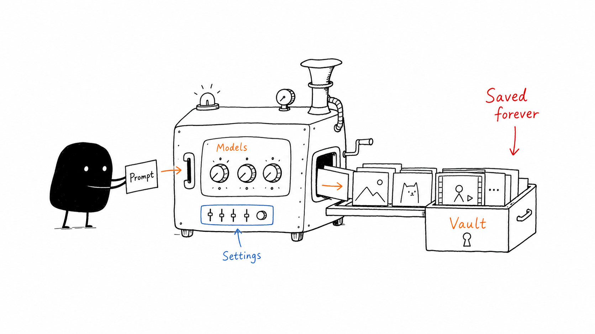
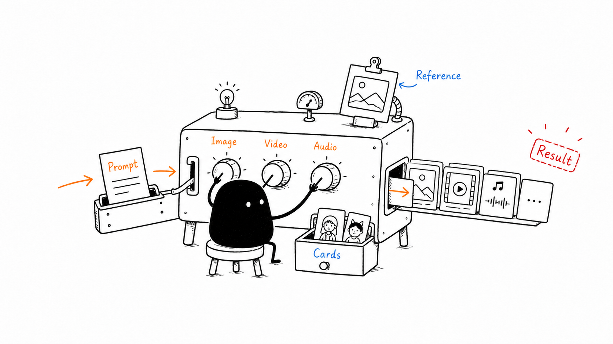
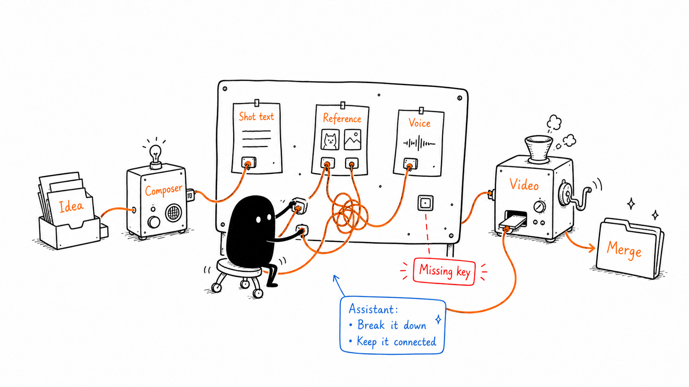
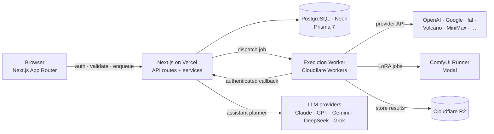

**English** | [日本語](README.ja.md) | [中文](README.zh.md)

# ANTEI — a personal AI creative studio

ANTEI (codename **PixelVault**) is a multi-model creative workbench for images, video, audio and 3D. It puts the strongest generation models behind one interface, keeps every result in a permanent archive, and turns what you make into reusable assets — characters, styles, voices, prompts and LoRAs — that feed the next piece of work.

**Live:** [www.anteisuba.com](https://www.anteisuba.com) · English / 日本語 / 中文



---

## Why ANTEI

- **One studio, many models.** Generate across image, video, audio and 3D model families from a single workspace, with each model's real parameters exposed instead of a lowest-common-denominator form.
- **Creative control first.** Reference images with explicit roles, per-model prompt dialects, a node canvas for multi-shot work, and LoRA recipes cloned faithfully from their source images.
- **Nothing gets lost.** Every generation is stored permanently with its prompt, model, parameters and lineage, then organised into folders, cards and recipes you can reuse.
- **An assistant that works the tools.** A built-in operator that discusses before acting, inspects your references, researches on the web, writes model-specific prompts and edits the workbench or canvas — with every change undoable and every paid generation confirmed by you.
- **Your keys, your bill.** Generation runs on your own provider keys (BYOK), encrypted at rest. ANTEI never silently switches a request onto a platform key.

---

## Product tour

### Studio

The day-to-day workbench for single pieces.

- **Image** — a natural-language workbench and a tag workbench (Danbooru-style, with live tag checking for NovelAI), side by side; reference images with identity / pose / style / content roles; aspect ratio and resolution tiers per model.
- **Image editing** — instruction edits, inpainting, object replacement, style transfer, text rendering, background removal, element extraction and upscaling.
- **Video** — text-to-video, first/last-frame and multi-reference modes, with per-model duration, resolution and reference limits enforced before anything is sent.
- **Audio** — text-to-speech with a reusable voice library, sound effects and music.
- **3D** — single image to textured GLB, including a mesh-first preview path.



### Node canvas — the director's desk

A canvas for long-form, multi-shot work: script → shot breakdown → per-shot image and video generation → edit desk.

- Four node types (text, image, video, audio) wired through typed ports, so references and scripts flow into the shots that need them.
- Script nodes project into shot nodes and re-project when the script changes.
- An edit desk with a timeline to assemble clips, trim, subtitle and render.
- One undo stack for everything — whether you or the assistant made the change.



### LoRA workbench

Reproduce a look, then customise it.

- Browse and import LoRAs from Civitai and Hugging Face into a personal library.
- Clone a source image's recipe — base model, LoRA stack and weights, sampler, steps, CFG, hires pass — and generate the same image on our own runner.
- Runner base models include Anima (Base / Turbo), WAI-Illustrious-SDXL, Pony Diffusion V6 XL, SDXL 1.0, Z-Image Turbo and Krea 2 Turbo; each LoRA family gets prompts written in its own dialect.
- Runs on a ComfyUI runner hosted on Modal (shared monthly quota, no key required).

### Assistant

A single operator engine shared by the image, LoRA, video and canvas workspaces.

- **Discuss first, act when told.** Questions get answers; instructions get changes; real conflicts get a short multiple-choice question.
- **Five verbs:** look (inspect references and results), research (web search with cited sources), ask, apply (edit prompts, models, specs, canvas nodes) and request generation — which always stops at a confirmation card, because only you can start a paid generation.
- **Bring your own planner model:** Claude (Opus 5.5 / Sonnet 5.5 / Fable 5.1), OpenAI GPT-6 family, Gemini 3.x Flash, DeepSeek and Grok.
- Round summaries and optional long-term memory carry decisions across turns without replaying the whole history.

### Library

- **Assets** — a private library of everything you generated or uploaded, with nested folders, batch actions and in-place detail views.
- **Cards** — character, style and voice cards that keep identity and look consistent across generations and shots.
- **Prompts** — personal recipes with versions and lineage back to the works they produced.
- **Gallery** — optional public showcase; prompts are only shared when you publish a cleaned recipe.

### Claude integration (MCP)

The canvas exposes a Model Context Protocol endpoint, so Claude can read a project, review clips and edit the timeline while you watch. MCP tools can never trigger paid generation.

---

## Models

Model availability changes often; the source of truth is [`src/constants/models/`](src/constants/models/) and the provider registry in [`src/services/providers/registry.ts`](src/services/providers/registry.ts).

| Modality | Model families                                                                                                                                                       | Routes                                                           |
| -------- | -------------------------------------------------------------------------------------------------------------------------------------------------------------------- | ---------------------------------------------------------------- |
| Image    | GPT Image 2 / 2.5, Gemini Nano Banana Pro / 2.1 / 2 Lite, FLUX.2 Pro / Flash, FLUX Kontext Max, Seedream 5.0 Pro / Lite, Ideogram 4.5, Recraft V4, NovelAI V4.5 / V5 | OpenAI, Google, fal, Ideogram, NovelAI, Volcano Engine, BytePlus |
| Video    | Seedance 2.0 / 2.5, Kling V3 / O3 (incl. video-to-video edit), Wan 3.0, HappyHorse, Gemini Omni Flash, MiniMax H3                                                    | fal, Google, Volcano Engine, BytePlus, MiniMax                   |
| Audio    | Fish Audio S2 Pro, ElevenLabs Sound Effects v2, ElevenLabs Music v2                                                                                                  | Fish Audio, ElevenLabs                                           |
| 3D       | Rodin Gen-2.5, Hunyuan3D v3 / v3.1 Pro, TRELLIS 2, TripoSR                                                                                                           | Hyper3D, fal                                                     |
| LoRA     | Anima, Illustrious / Pony / SDXL, Z-Image Turbo, Krea 2 Turbo                                                                                                        | ComfyUI runner on Modal                                          |

Where a model is offered both by its vendor and by a reseller, ANTEI prefers the vendor's own API.

---

## Architecture


```mermaid
flowchart LR
  B[Browser<br/>Next.js App Router] -->|auth · validate · enqueue| A[Next.js on Vercel<br/>API routes + services]
  A --> DB[(PostgreSQL · Neon<br/>Prisma 7)]
  A -->|dispatch job| W[Execution Worker<br/>Cloudflare Workers]
  W -->|provider API| P[OpenAI · Google · fal ·<br/>Volcano · MiniMax · …]
  W -->|LoRA jobs| R[ComfyUI Runner<br/>Modal]
  W -->|store results| S[(Cloudflare R2)]
  W -->|authenticated callback| A
  A -->|assistant planner| L[LLM providers<br/>Claude · GPT · Gemini · DeepSeek · Grok]
```

- **Worker-first execution.** The web app only authenticates, validates, records the job and dispatches it. Long-running provider calls, polling and uploads run in a Cloudflare Worker that reports back through an authenticated callback, so nothing depends on a serverless function staying alive.
- **Layered codebase.** `constants/` and `types/` (Zod schemas) → `services/` (the only layer that touches the database or external APIs) → `hooks/` → `components/`. API routes do three things only: authenticate, validate, call a service.
- **Server-side guarantees.** Ownership checks, usage accounting and the money gate live on the server; the assistant and MCP tools are structurally unable to start a paid generation.

| Layer      | Technology                                                                         |
| ---------- | ---------------------------------------------------------------------------------- |
| App        | Next.js 16 (App Router, Turbopack), React 19, TypeScript                           |
| UI         | Tailwind CSS 4, shadcn/ui, Motion, React Flow, Tiptap                              |
| Auth       | Clerk                                                                              |
| Data       | PostgreSQL on Neon, Prisma 7                                                       |
| Storage    | Cloudflare R2 (permanent archive, CDN-served)                                      |
| Execution  | Cloudflare Workers (generation, video render, image proxy), Modal (ComfyUI runner) |
| i18n       | next-intl — English, Japanese, Chinese                                             |
| Validation | Zod across API contracts, provider payloads and model output                       |
| Testing    | Vitest, Testing Library, Playwright                                                |

---

## Repository layout

```text
src/
├── app/            routes (App Router) and API routes
├── components/     ui/ (stateless primitives) · business/ (stateful features)
├── constants/      models, providers, limits, routes — check here first
├── contexts/       studio and workbench state
├── hooks/          client-side state and data hooks
├── lib/            shared utilities and the API client
├── messages/       en / ja / zh translations
├── services/       server-only business logic and provider adapters
└── types/          Zod schemas and inferred types
workers/            Cloudflare Workers (execution, render-video, image proxy) and the runner
prisma/             schema and migrations
docs/               workflow, references and checklists (start at docs/README.md)
```

---

## Local development

**Requirements:** Node.js 22, npm 10+, a PostgreSQL database (Neon recommended), a Clerk application and a Cloudflare R2 bucket.

```bash
npm install
cp .env.example .env.local   # fill in database, Clerk, R2 and encryption secrets
npm run dev                  # http://localhost:3000
```

Common checks:

```bash
npm run typecheck
npm run lint
npm run test:run
```

Provider keys are added per user in **Settings → Keys** inside the app; you only need platform keys in `.env.local` for the features that use them (for example the assistant's default Gemini route). The execution worker has its own package under `workers/execution` with separate tests.

---

## Security and privacy

- Provider keys are encrypted with AES-256-GCM and only decrypted server-side for the request that uses them.
- Every API route authenticates with Clerk first and checks ownership on the server.
- Server-side fetches of user-supplied URLs go through an SSRF guard.
- Raw prompts stay private; public recipes are published explicitly and cleaned before they appear in the gallery.

---

## Documentation

Engineering docs live in [`docs/`](docs/README.md): the task workflow, per-domain references (canvas, LoRA, assistant, providers, model catalogue) and release checklists.

## License

This repository does not include an open-source license. All rights reserved.
