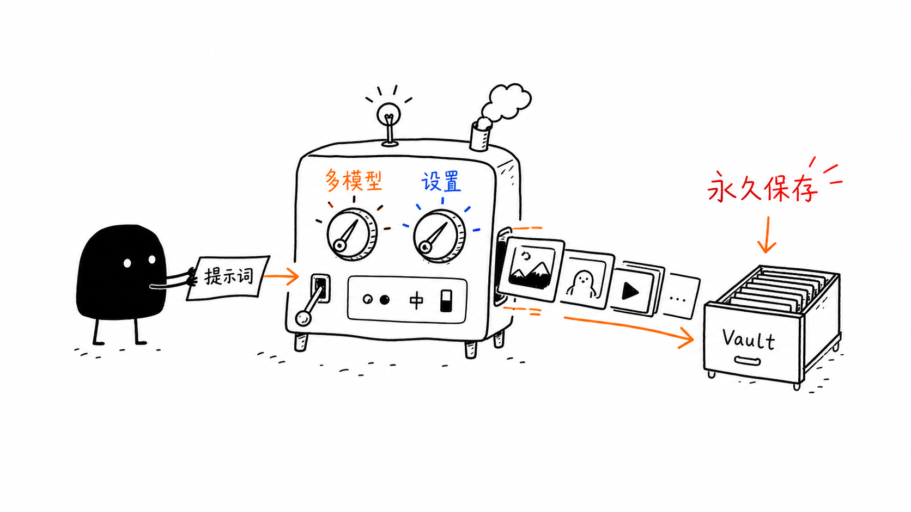
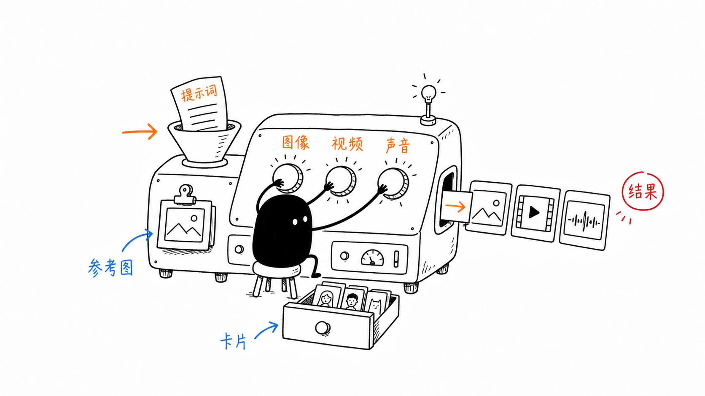
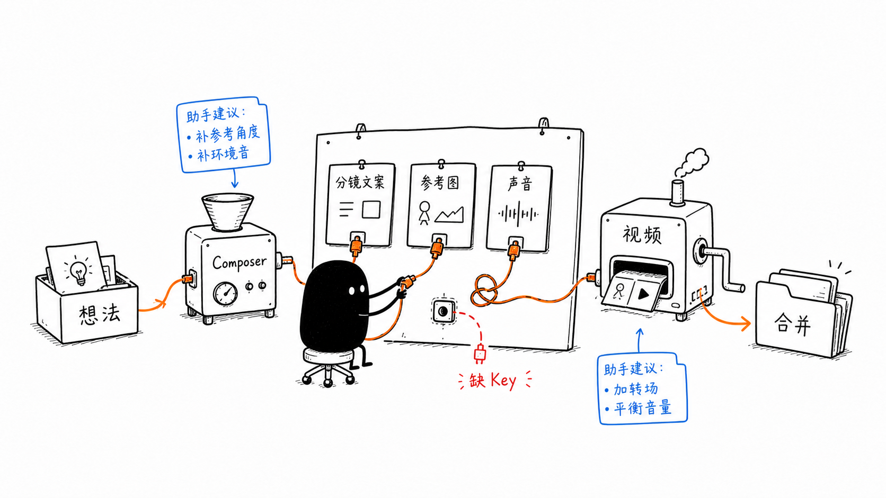
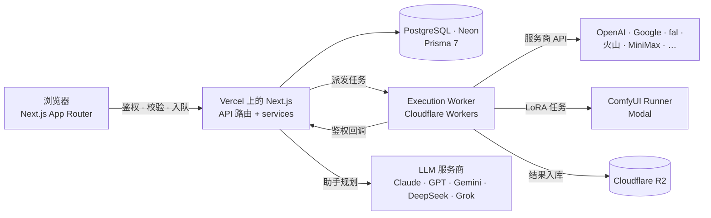

[English](README.md) | [日本語](README.ja.md) | **中文**

# ANTEI —— 个人 AI 创作工作台

ANTEI（代号 **PixelVault**）是一个面向图片、视频、音频与 3D 的多模型创作工作台。它把各家最强的生成模型收进同一个界面，把每一次生成永久归档，并把作品沉淀成可复用的资产——角色、画风、声音、提示词配方与 LoRA——为下一次创作供料。

**在线体验：** [www.anteisuba.com](https://www.anteisuba.com) · English / 日本語 / 中文



---

## 为什么是 ANTEI

- **一个工作台，多家模型。** 在同一处完成图片、视频、音频与 3D 生成，每个模型暴露的是它真实支持的参数，而不是削足适履的通用表单。
- **创作控制优先。** 参考图按身份 / 姿势 / 画风 / 内容分工，提示词按模型方言书写，多镜头作品在节点画布上编排，LoRA 配方可从来源图原样复刻。
- **什么都不会丢。** 每次生成连同提示词、模型、参数与来源关系永久保存，并可整理进文件夹、卡片与配方反复复用。
- **会动手的助手。** 内置的操作助手先讨论再动手：查看参考图、联网查资料、按模型方言写提示词、修改工作台或画布——每一步都能撤销，每一次付费生成都由你确认。
- **用你自己的 Key。** 生成走你自己的服务商 Key（BYOK），加密存储；ANTEI 绝不会把请求悄悄切到平台 Key 上。

---

## 功能一览

### 工作室（Studio）

日常单件创作的工作台。

- **图片**——自然语言台与标签台（Danbooru 风格，NovelAI 实时校对标签）并列；参考图可指定身份 / 姿势 / 画风 / 内容分工；比例与清晰度档位随模型而定。
- **图片编辑**——指令编辑、局部重绘、物体替换、风格迁移、文字渲染、去背景、元素提取与放大。
- **视频**——文生视频、首尾帧与多参考模式；时长、分辨率与参考数量按模型在发送前校验。
- **音频**——带可复用声音库的语音合成、音效与音乐。
- **3D**——单图生成带贴图的 GLB，支持先出白模的预览路径。



### 节点画布——导演台

面向长视频与多镜头作品：剧本 → 分镜 → 逐镜出图与视频 → 剪辑台。

- 文本、图片、视频、音频四类节点通过类型化端口连接，参考与剧本自然流向需要它们的镜头。
- 剧本节点可投影成镜头节点，剧本改动后可重新投影。
- 剪辑台带时间线，用于拼接、裁剪、加字幕与渲染。
- 一份撤销栈管全部改动——无论是你改的还是助手改的。



### LoRA 工作台

先还原，再定制。

- 从 Civitai 与 Hugging Face 浏览、导入 LoRA 到个人库。
- 复刻来源图的配方——底模、LoRA 组合与权重、采样器、步数、CFG、高清修复——在我们自己的 Runner 上出同款图。
- Runner 底模包括 Anima（Base / Turbo）、WAI-Illustrious-SDXL、Pony Diffusion V6 XL、SDXL 1.0、Z-Image Turbo 与 Krea 2 Turbo；每个底模家族的提示词按各自方言书写。
- 运行在 Modal 上的 ComfyUI Runner（全站共享月度额度，无需 Key）。

### 助手

图片、LoRA、视频与画布四个工作区共用同一套操作引擎。

- **先讨论，说了才动手。** 问题直接回答；指令才去改；真正的取舍冲突用一道选择题问你。
- **五个动词：** 看（检查参考图与结果）、查（联网检索并附来源）、问、改（提示词、模型、规格、画布节点）与请求生成——请求生成永远停在确认卡上，因为只有你能发起付费生成。
- **规划模型自选：** Claude（Opus 5.5 / Sonnet 5.5 / Fable 5.1）、OpenAI GPT-6 系列、Gemini 3.x Flash、DeepSeek 与 Grok。
- 每轮结论与可选的长期记忆把决定带到后续轮次，无需重放整段历史。

### 资产库

- **素材（Assets）**——你生成或上传的一切，支持嵌套文件夹、批量操作与就地详情。
- **卡片（Cards）**——角色、画风与声音卡，让身份与画风在多次生成、多个镜头之间保持一致。
- **提示词（Prompts）**——个人配方，带版本与作品血缘。
- **画廊（Gallery）**——可选的公开展示；提示词只有在你发布清洗后的配方时才会公开。

### Claude 集成（MCP）

画布提供 Model Context Protocol 端点：Claude 可以读取项目、查看片段、编辑时间线，你在浏览器里实时看着它改。MCP 工具永远无法触发付费生成。

---

## 模型

模型阵容变化频繁，以 [`src/constants/models/`](src/constants/models/) 与 [`src/services/providers/registry.ts`](src/services/providers/registry.ts) 为准。

| 模态 | 模型家族                                                                                                                                                             | 通道                                                       |
| ---- | -------------------------------------------------------------------------------------------------------------------------------------------------------------------- | ---------------------------------------------------------- |
| 图片 | GPT Image 2 / 2.5、Gemini Nano Banana Pro / 2.1 / 2 Lite、FLUX.2 Pro / Flash、FLUX Kontext Max、Seedream 5.0 Pro / Lite、Ideogram 4.5、Recraft V4、NovelAI V4.5 / V5 | OpenAI、Google、fal、Ideogram、NovelAI、火山方舟、BytePlus |
| 视频 | Seedance 2.0 / 2.5、Kling V3 / O3（含视频改视频）、Wan 3.0、HappyHorse、Gemini Omni Flash、MiniMax H3                                                                | fal、Google、火山方舟、BytePlus、MiniMax                   |
| 音频 | Fish Audio S2 Pro、ElevenLabs 音效 v2、ElevenLabs Music v2                                                                                                           | Fish Audio、ElevenLabs                                     |
| 3D   | Rodin Gen-2.5、Hunyuan3D v3 / v3.1 Pro、TRELLIS 2、TripoSR                                                                                                           | Hyper3D、fal                                               |
| LoRA | Anima、Illustrious / Pony / SDXL、Z-Image Turbo、Krea 2 Turbo                                                                                                        | Modal 上的 ComfyUI Runner                                  |

同一模型既有官方直连又有转售渠道时，优先走官方 API。

---

## 架构



- **Worker 优先的执行。** Web 应用只负责鉴权、校验、记录任务与派发；耗时的服务商调用、轮询与上传都在 Cloudflare Worker 里完成，再通过鉴权回调报告结果，不依赖某个 Serverless 函数一直活着。
- **分层代码。** `constants/` 与 `types/`（Zod schema）→ `services/`（唯一接触数据库与外部 API 的层）→ `hooks/` → `components/`。API 路由只做三件事：鉴权、校验、调用 service。
- **服务端保证。** 归属校验、用量记账与付费闸全部在服务端；助手与 MCP 工具在结构上无法发起付费生成。

| 层     | 技术                                                                    |
| ------ | ----------------------------------------------------------------------- |
| 应用   | Next.js 16（App Router、Turbopack）、React 19、TypeScript               |
| 界面   | Tailwind CSS 4、shadcn/ui、Motion、React Flow、Tiptap                   |
| 认证   | Clerk                                                                   |
| 数据   | Neon 上的 PostgreSQL、Prisma 7                                          |
| 存储   | Cloudflare R2（永久归档，CDN 分发）                                     |
| 执行   | Cloudflare Workers（生成、视频渲染、图片代理）、Modal（ComfyUI Runner） |
| 多语言 | next-intl——英文、日文、中文                                             |
| 校验   | Zod 贯穿 API 契约、服务商载荷与模型输出                                 |
| 测试   | Vitest、Testing Library、Playwright                                     |

---

## 目录结构

```text
src/
├── app/            路由（App Router）与 API 路由
├── components/     ui/（无状态组件）· business/（有状态的业务组件）
├── constants/      模型、服务商、上限、路由——先看这里
├── contexts/       工作室与工作台状态
├── hooks/          客户端状态与数据 hooks
├── lib/            共享工具与 API client
├── messages/       en / ja / zh 文案
├── services/       仅服务端的业务逻辑与服务商 adapter
└── types/          Zod schema 与推导类型
workers/            Cloudflare Workers（执行、视频渲染、图片代理）与 Runner
prisma/             schema 与迁移
docs/               工作流程、参考文档与检查清单（从 docs/README.md 进入）
```

---

## 本地开发

**环境要求：** Node.js 22、npm 10+、一个 PostgreSQL 数据库（推荐 Neon）、一个 Clerk 应用和一个 Cloudflare R2 存储桶。

```bash
npm install
cp .env.example .env.local   # 填入数据库、Clerk、R2 与加密密钥
npm run dev                  # http://localhost:3000
```

常用检查：

```bash
npm run typecheck
npm run lint
npm run test:run
```

服务商 Key 由每位用户在应用内的 **设置 → Key** 中添加；`.env.local` 里只需要为用到平台 Key 的功能配置（例如助手默认的 Gemini 路由）。执行 Worker 在 `workers/execution` 下是独立的包，有自己的测试。

---

## 安全与隐私

- 服务商 Key 以 AES-256-GCM 加密，只在使用它的那次请求中于服务端解密。
- 每个 API 路由先经 Clerk 鉴权，并在服务端校验资源归属。
- 服务端抓取用户提供的 URL 时经过 SSRF 防护。
- 原始提示词保持私有；公开配方需要你主动发布，并在进入画廊前清洗。

---

## 文档

工程文档在 [`docs/`](docs/README.md)：任务工作流、各业务域参考（画布、LoRA、助手、服务商、模型目录）与发布检查清单。

## 许可

本仓库未附带开源许可证，保留所有权利。
