# 画布 UI 草稿全集（视觉稿）

> 这些是会话里逐张确认过的画布 UI 视觉稿（SVG）。在 VS Code / 浏览器里打开本文件即可看图；每张的文字规格见 [`../canvas-baseline.md`](../canvas-baseline.md) §13。
> 最后更新：2026-06-16。配套：`canvas-baseline.md`（决策+规格）、`docs/plans/execution-roadmap-2026-06.md`（引擎路线）。

## A1 · 画布整体布局

近黑去暖 + 点阵 · 顶栏默认模型 chip · 节点+composer · 右固定助手 · 底部工具条(中键平移) · minimap 放大。
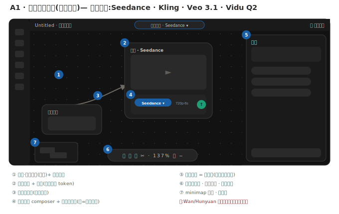

## A2 · 空画布引导

空态不留死白 = 一句引导 +「跟助手聊大纲」反相白丸 + 手动加节点；助手 dock 默认开呼应。
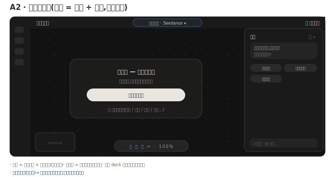

## B2 · model-aware composer

节点自带；两级切换器（品牌换面板 / 变体收窄）；Seedance 真参数；切换弹「将映射/将忽略」预览。
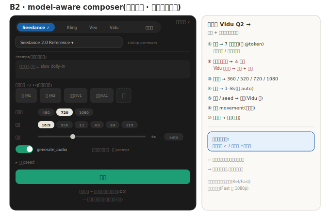

## B3 · 节点 ⤢ 展开详情

每节点 ⤢ → 全屏详情；声音展开 = 台词+音色(继承角色)+语速/语调/情绪。
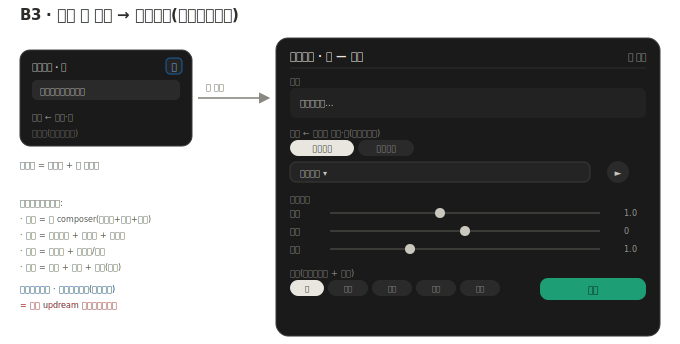

## B4/5/6/7 · 元素节点组

角色/背景/声音 → 镜头参考槽；类型化绑定；声音→无配音模型标灰。
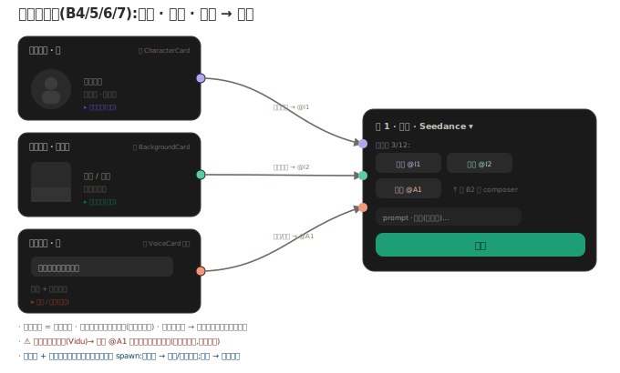

## C · 连线 / 端口 / 状态

端口=图标+极淡类型色；连线全中性+明度；状态去黄(仅失败红)。
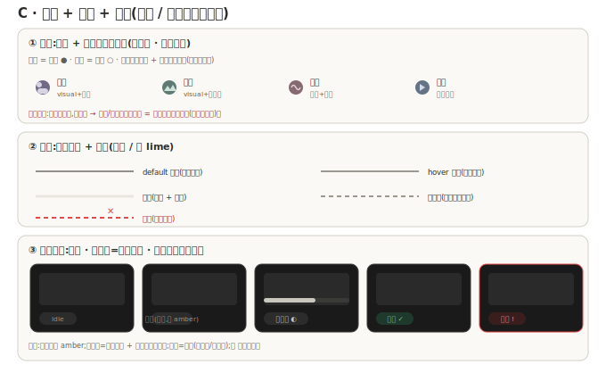

## D · 交互控件

工具条真接线+光标 · 中键平移 · 选中浮动条 · minimap 可交互。
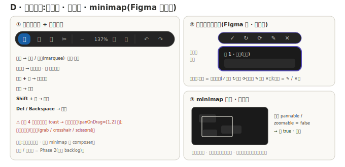

## E1 · 助手 dock（精简）

默认安静：1 句起手 + 3 短 chips + 精简输入；反问卡按需浮现。
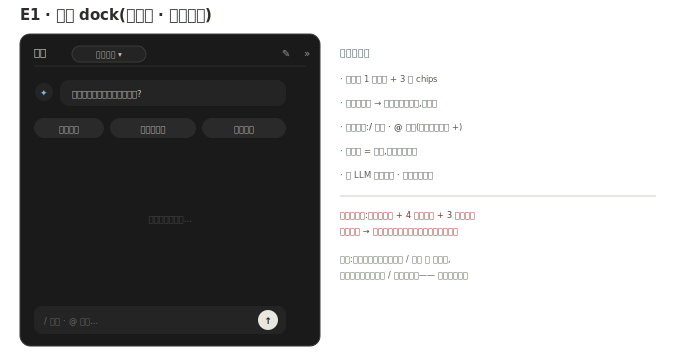

## E1 · 助手 dock 展开态

三态 折叠/默认/展开；展开 = 左对话 + 右剧本/大纲(ScriptDoc)工作区。
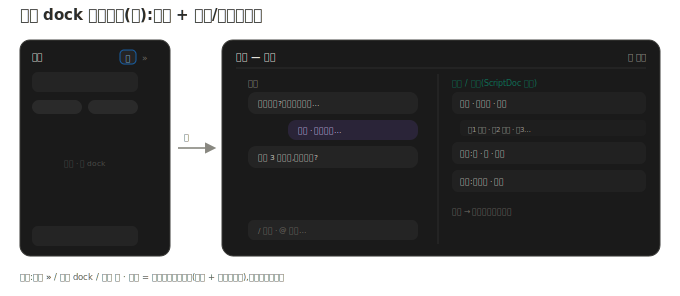

---

# 原理流程图（讲设计为什么这么做）

## 自动生成流 · UI 并进开发路线

助手写 ScriptDoc → 确认 → 投影 scriptDocToGraph spawn 角色/声音/镜头节点（助手不直接戳节点）。
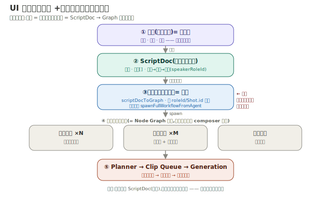

## 能力契约 + 类型化绑定（切换怎么接住）

绑定与模型无关；每模型一份能力契约；切换 = 重映射，不兼容大声标灰不静默丢。
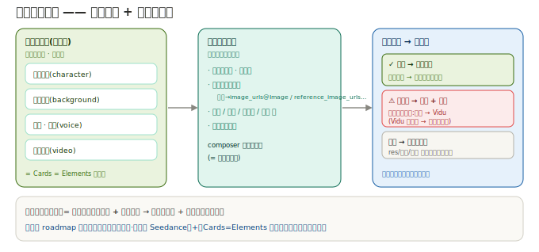

## 两级模型选择

上层品牌换面板，下层变体收窄；t2v/首尾帧是模式不占两级。
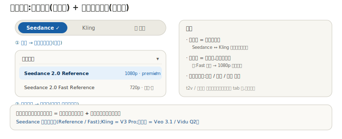

## 声音绑定到角色（角色 = 视觉 + 听觉身份）

音色属角色、台词属镜头；声音节点继承角色音色不重挑。
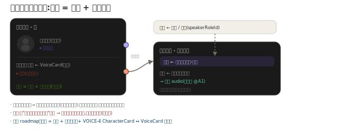

## 元素视觉 + 听觉对称

角色音色集 / 背景环境音；镜头最终音频 = 角色语音 + 背景环境音，按模型能力混合。
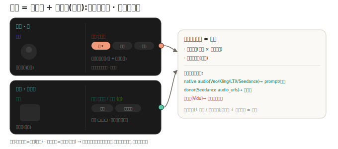

## 反问澄清卡

助手出结构化提问 → chips → 回填 ScriptDoc；够了确认 → 触发自动生成。
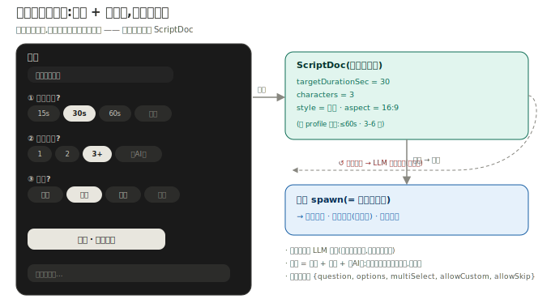

---

# 实操态草稿（「必画」5 张 · 用起来会撞到的）

## 必画① · 节点态实样

生成中(进度在节点)/ 失败(红描边+文案+重试)/ 完成(结果+审阅动作)。去黄,仅失败用红。
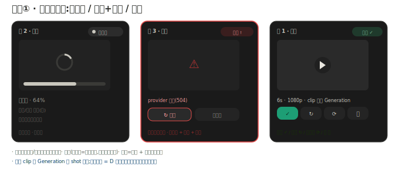

## 必画② · 加节点菜单 / 节点面板

分类元素/生成/编排 + 搜索 + 图标极淡类型色；＋按钮 / 右键 / 连线松手即建。
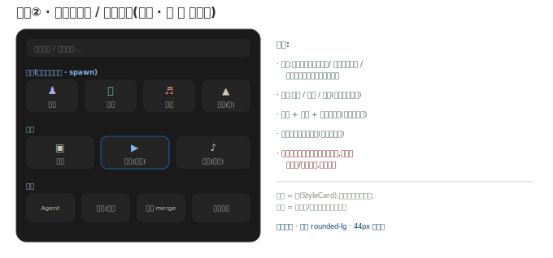

## 必画③ · 参考槽填充

上传 / 资产库(route-backed overlay) / 粘贴；连线也会自动填槽；显示 @token + N/12。
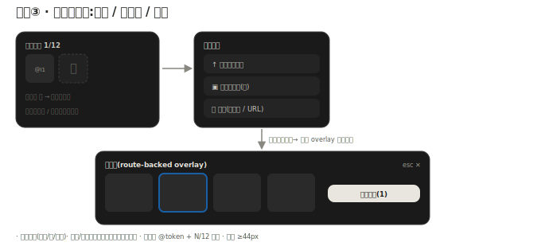

## 必画④ · 缺 key → QuickSetupDialog

缺 key 不禁用 UI,内联配置(贴 key / 用平台额度);显式 BYOK 不静默回退（CLAUDE.md 硬规则 8）。
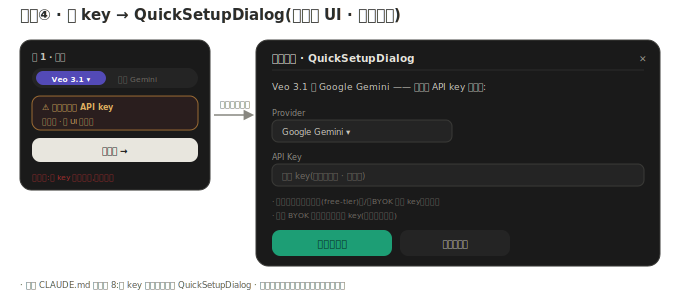

## 必画⑤ · 成片预览 + 审阅循环

route-backed 预览 + 通过/重试/重生成/存;clip 落 Generation 带血缘;全镜 approved → 拼接成片。
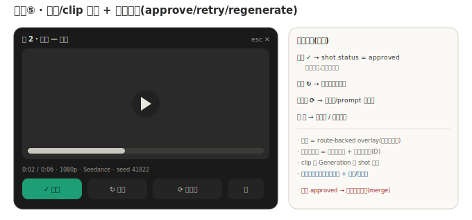

---

# 每个节点的详样

各类节点的紧凑卡详细长相（角色/背景/声音/镜头/图像/Agent），展开态见 B3。
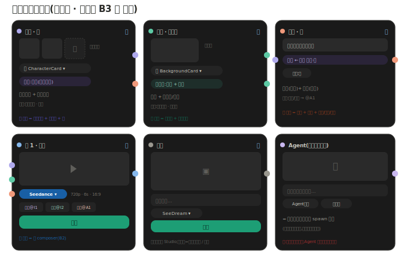

---

# 打磨态草稿（「补画」6 张）

## 补画① · 拖拽接线 + 端口高亮

从输出口拖出 → 兼容输入口高亮、不兼容变灰/红✕；松到空白处弹加节点菜单。
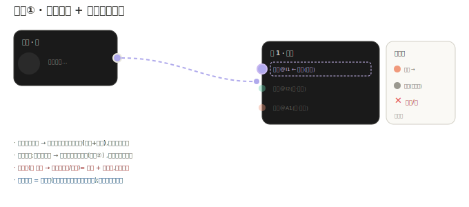

## 补画② · 多选/框选/批量 + 场景分组

框选 + Shift 加减 + 批量条（对齐/分组/改模型/删）；镜按「场」分组（对应 Scene→Shot）。
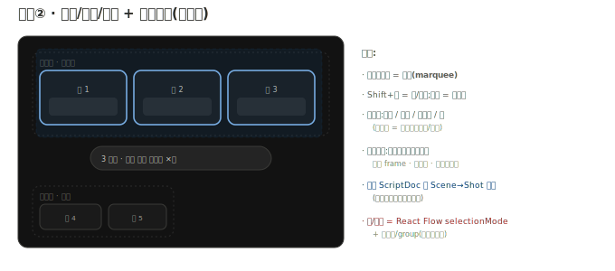

## 补画③ · videoMerge 合成节点

顺序拼接 + 尾裁（无 head-trim）；原生多镜优先、merge 后备；成片落 Generation final。
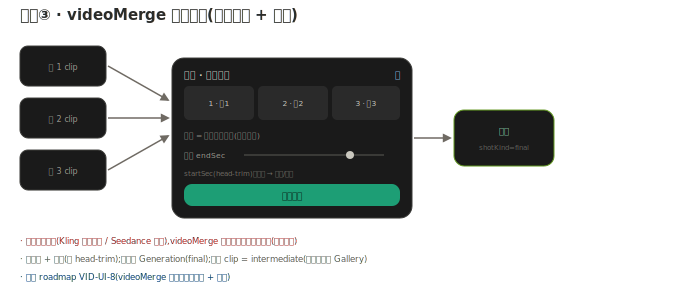

## 补画④ · 卡片选择 + 风格挂载

选卡 overlay（角色/声音/画风/背景）→ 绑定；风格走卡，挂为「画风」chip。
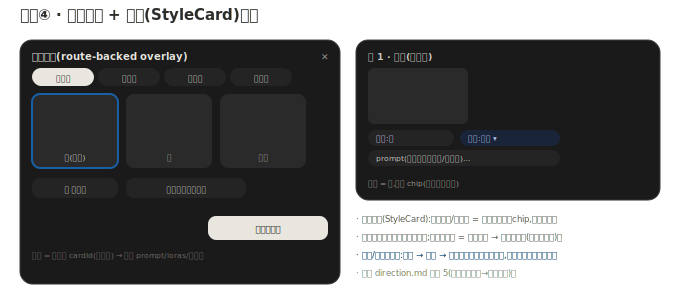

## 补画⑤ · 画布 token 规范实样

node-\* 色板（中性化）+ 端口类型色 + 状态色 + 密度/圆角 token。
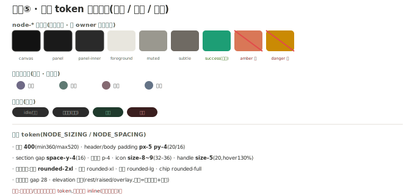

## 补画⑥ · 顶栏完整 + 对话管理

项目切换/重命名/保存态/默认模型/排列/添加节点 + 助手多轮对话历史。
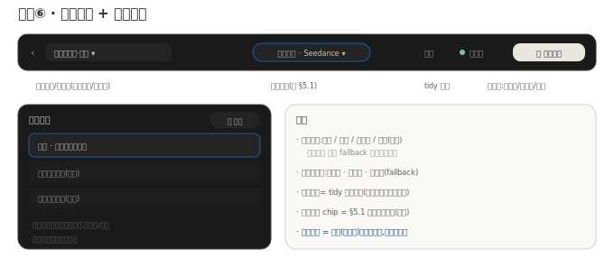

## 补画⑦ · 项目管理（顶栏切换项目）

点项目名 → 项目卡（迷你画布缩略 + 节点数 + 最后编辑 + 同步态）；切换/新建/重命名/删除；本地与服务端不混、「仅本地」明确标记。
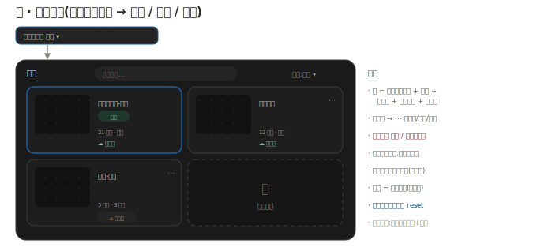
