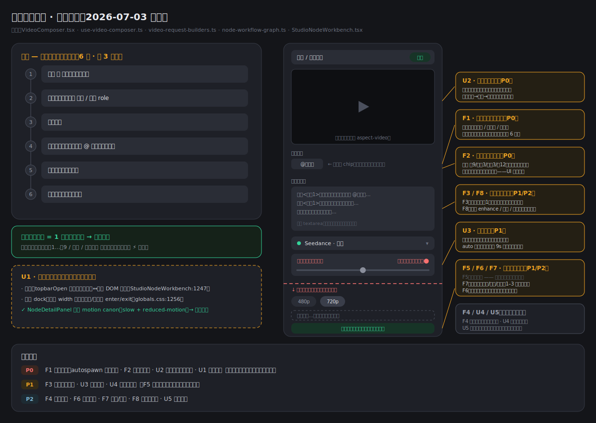
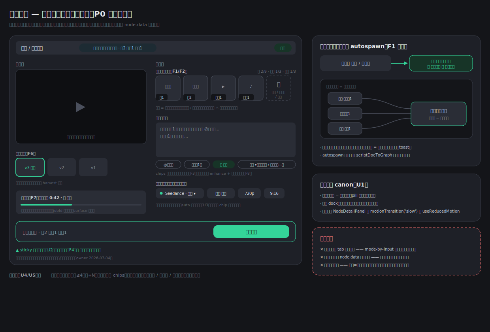
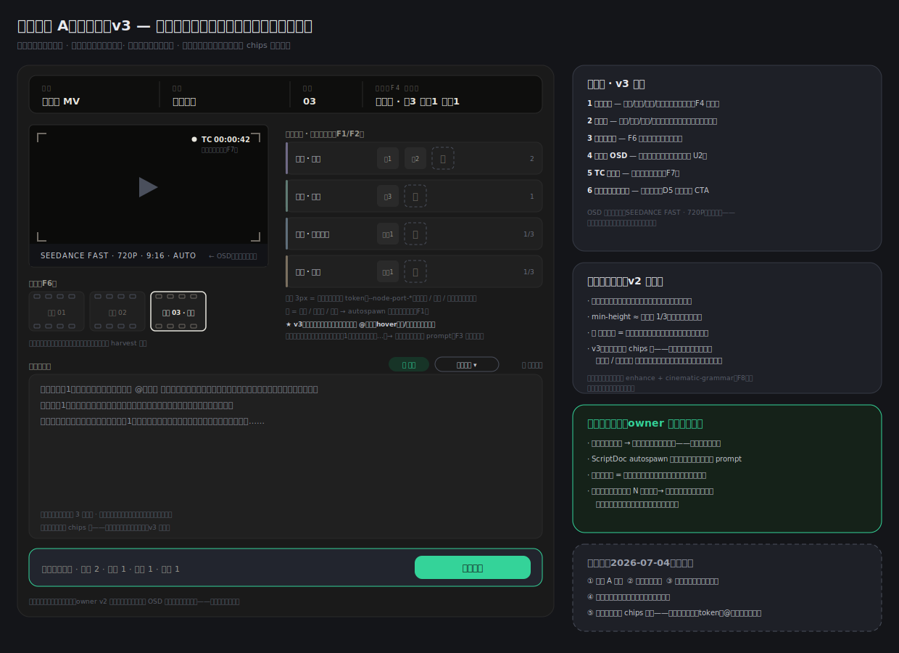

# 画布视频生成审查 — 功能 + UI（2026-07-03）

> 性质：audit only，本次未改任何代码。
> 范围：`/studio/node` 画布上的视频节点（SeedanceNode + VideoComposer + NodeDetailPanel）及其外壳（顶栏/助手 dock 收放）。
> 前提共识：**视频节点是画布最重要的节点**——画布的存在意义就是把角色/背景/镜头/声音汇到视频出口。本审查以「怎么让用户更快、更可控地生成出想要的视频」为唯一标尺。
> 总结图：[问题地图](node-video-review-problems.svg) · [目标形态](node-video-review-target.svg)

---

## 一句话结论

当前视频节点把「参考素材」完全外包给了画布连线：**加一张参考图要 6 步、跨 3 个面板**，而且送进模型的实际载荷（哪几张图、什么顺序、有没有被裁掉）在 UI 上完全不可见。竞品（截图：即梦系 Seedance 前端）用「编号缩略图槽位 + 直接上传」把同一件事做成了 1 步。修复方向不是抄竞品的平面表单——画布图结构是我们的差异化——而是给图结构加一条**快速通道**：在视频节点内上传/选素材时自动生成上游节点并自动连线（autospawn 已有先例），槽位只是图的投影视图。

---

## 证据基线（现状怎么工作的）

| 事实                                                                            | 出处                                                                                                     |
| ------------------------------------------------------------------------------- | -------------------------------------------------------------------------------------------------------- |
| 视频节点的参考只来自上游连线节点，节点内无任何上传/选素材入口                   | `src/hooks/node/use-video-composer.ts:85-183`（harvest 全部走 `getUpstreamNodes`）                       |
| 参考在卡片上只显示为文字 kind chips（「角色」「背景」…），无缩略图              | `src/components/business/node/composer/VideoComposer.tsx:464-475`                                        |
| 详情面板的参考区 = 可点 @token chips，未命名的节点连 token 都没有               | `VideoComposer.tsx:495-541`、`use-video-composer.ts:122-183`                                             |
| 送模型时静默裁剪：image ≤9、video ≤3、audio ≤3、总量 ≤12（超限先裁图片）        | `src/services/providers/fal/video-request-builders.ts:449-490`、`src/lib/node-workflow-graph.ts:429-431` |
| 图片参考顺序 = keyframe 先、visual 后的隐式 harvest 顺序，UI 不展示编号         | `src/lib/node-workflow-graph.ts:140-155`                                                                 |
| 生成模式（文生/参考生）由 `hasReferenceInputs` 隐式推断切 `_REFERENCE` model id | `use-video-composer.ts:199-212`、`src/lib/video-model-resolver.ts`                                       |
| 重新生成直接覆盖 `mediaUrl`，节点上无版本历史                                   | `src/hooks/node/use-node-media-generation.ts:301-305` + workflow 写回                                    |
| 生成中只有脉冲图标+「生成中」，无耗时/进度/取消                                 | `src/components/business/node/nodes/SeedanceNode.tsx:86-92`                                              |
| 生成按钮无成本预估                                                              | `VideoComposer.tsx:411-426`（竞品显示 ⚡1350）                                                           |
| 顶栏收放 = 条件渲染直接换 DOM，无过渡                                           | `src/components/business/node/StudioNodeWorkbench.tsx:1247-1274`                                         |
| 助手 dock 只有 width transition（dock↔expanded），开/关无 enter/exit            | `StudioNodeAssistantDock.tsx:422-434`、`globals.css:1256-1261`                                           |
| 详情面板已有完整 motion canon（AnimatePresence + slow + reduced-motion）        | `src/components/business/node/node-detail/NodeDetailPanel.tsx:131-155`                                   |

---

## 功能问题（怎么才能更好地生成视频）

### F1 · 参考素材没有快速通道 —— 【P0，最大摩擦点】

**现状**：想给视频加一张自己的参考图，完整路径是：
① 画布 + 添加图片节点 → ② 详情面板选角色/背景 role → ③ 上传图片 → ④ 给节点命名（不命名 @token 不可插入）→ ⑤ 拖连线到视频节点 → ⑥ 回视频节点写提示词。参考视频、声音同理。竞品是点槽位直接上传，1 步。

**为什么疼**：这是「为生成视频而做的画布」上生成视频的第一步。每多一步，用户就更倾向回竞品。对「我手里已经有图/有视频/有音色」的用户（截图里的你自己就是），画布目前是纯负资产。

**建议（保持图建模，不做节点外的内联字段）**：

- 视频节点详情面板增加「参考素材槽位区」：图片槽（按模型上限）、视频槽、音频槽，每个槽支持 **本地上传 / 素材库选择 / 粘贴**。
- 槽位落素材时**自动创建对应上游节点并自动连线**（图片→image 节点带 role、视频→videoReference 节点、音频→voice 节点），自动起名（`参考图1` 等，可改）。`scriptDocToGraph` 的 autospawn 已是同一模式的先例。
- 画布图结构仍是唯一事实源：槽位区只是「以本视频节点为焦点的上游投影」，连线党看到的图和槽位党看到的列表永远一致。删槽位 = 删连线（节点保留，给 toast 说明）。
- 这符合「本属属性的东西别编码成节点类型」的反例镜像：参考**本来就是图关系**，所以不搬进 `node.data` 内联数组，而是把创建图关系的成本降到 1 步。

### F2 · 实际发送的参考载荷不可见、不可控 —— 【P0】

**现状**：fal 上限 image 9 / video 3 / audio 3 / 总 12，超限**静默裁剪**（先裁图片）。顺序由 harvest 隐式决定。UI 上：卡片只有「角色」两个字，详情面板只有 @token 文字 chips。用户不知道发了几张、什么顺序、哪张被丢了。

**建议**：

- 槽位区按**最终 payload 顺序**渲染编号缩略图（图1、图2…视频1…音频1），计数徽标 `5/9`。
- 超限的条目留在列表但置灰 + ⚠「超出模型上限，不会发送」——呼应现有的「不静默丢」原则（rebind preview 已经这么做了，`VideoComposer.tsx:757-800`）。
- 支持拖拽排序、单槽临时禁用（不删连线）。排序/禁用状态写在视频节点 `data` 上（这是该节点的属性，不是图关系）。

### F3 · 提示词的编号语言和参考对不上 —— 【P1】

**现状**：你在截图里手写 `<图片1>` `<视频1>`，但 UI 提供的是 @名字 chips；`图片1` 到底是哪张由 harvest 顺序隐式决定，改一根连线编号就漂移，prompt 里的 `<图片1>` 悄悄指向另一张图，用户不可能发现。

**建议**：F2 的编号缩略图就是解药的一半；另一半：

- chips 插入的 token 与槽位编号统一（点「图2」插 `<图片2>` 或 `@名字`，两套都行但要**同一套**）。
- 顺序变化时扫描 prompt 中的编号 token，失配的给内联警示。shot 侧已有 `buildShotReferenceLegend`（`node-workflow-graph.ts:225-238`）可复用成视频侧的「引用图例」。

> **v3 更新**：此条大部分被「部门条=插入源」方案吸收——token 统一为 @名字，编号只活在发送时自动注入的图例里，漂移问题从根上消失。详见「视觉方向提案 → v3 修订」。

### F4 · 生成模式不显性（文生/图生/首尾帧/全能参考） —— 【P2】

**现状**：mode-by-input 隐式推断（有参考 → `_REFERENCE` 模型）。keyframe 节点只是「排在参考首位」，没有明确「首帧/尾帧」语义。竞品有 5 个显式 tab。

**建议**：**不抄 tab**——mode-by-input 少一个用户决策，是更好的设计；但要把推断结果**回显**出来：面板/底栏一个模式 chip（「参考生视频 · 图2 视频1 音频1」），让用户确认系统理解对了。首尾帧给 keyframe 槽位加显式 first/last 标记（字段建模，不新增节点类型）。

### F5 · 无成本预估 —— 【已搁置】

> 2026-07-04 owner 拍板：**积分/成本体系暂不做**，此条搁置仅留档，不进任何批次。

**现状**：生成按钮只有「生成视频」。竞品在按钮旁常驻 ⚡1350。
**留档建议**（将来做积分时再启用）：生成按钮内或旁边显示预估 credits，参数变化实时更新；成本口径走服务端。

### F6 · 重新生成覆盖旧结果，无版本历史 —— 【P2】

**现状**：`mediaUrl` 直接覆盖。而「调 prompt → 重跑 → 对比」是视频生成的核心循环，旧版本在节点上不可达（generation 记录在库里，但没有 UI 入口）。
**建议**：节点 `data` 保留 generation 历史（id 列表即可，媒体本来就在 R2/库里），详情面板预览下方一条版本缩略图带，点选切换当前输出；「设为当前」影响下游 harvest。

### F7 · 生成中反馈弱、不能取消 —— 【P2】

**现状**：脉冲图标 + 「生成中」+ 一条装饰性进度轨。视频生成动辄 1–3 分钟，无耗时、无预估、无取消，用户只能干等或刷新。
**建议**：显示已耗时（jobId 轮询已存在，surface 它）；提供取消（至少 UI 级放弃并标记 stale）；生成中允许关面板/离开，节点卡片继续显示状态（现状已部分支持，明确化即可）。

### F8 · 提示词裸奔，已有的 prompt 基建没接进来 —— 【P2】

**现状**：视频 composer 的 prompt 是裸 textarea。而项目里已有 LLM enhance、cinematic-grammar 模块、prompt-guard、酒馆式词库。竞品用户被迫手写【画风隔离】【角色锁定】【肢体逻辑】这类结构化段落（你的截图 3 就是）——这正是模板该干的活。
**建议**：prompt 区加「✨ 增强」（走已有 enhance + cinematic-grammar）和常用约束模板 chips（画风锁定/动作参考/肢体逻辑…），插入为可编辑文本，不做黑盒。

---

## UI 问题

### U1 · 顶栏/助手收放无过渡动画 —— 【P0，用户点名】

**现状**：顶栏 `topbarOpen ? <CanvasTopBar/> : <button/>` 条件渲染硬切（`StudioNodeWorkbench.tsx:1247-1274`）；助手 dock 的 `node-canvas-panel-motion` 只有 width transition，开↔关同样是硬切。而 `NodeDetailPanel` 已经有完整 motion canon。
**建议**：把 NodeDetailPanel 的 canon（`AnimatePresence` + `motionTransition('slow')` + `useReducedMotion`）推广到两处外壳：顶栏收起 = 向上淡出、收起 pill 淡入；助手 dock = 自右侧滑入滑出（移动端自底部）。这是「澄清状态/连续性」的正当动效，符合 Anti-slop 红线。

### U2 · 详情面板信息架构：预览吃掉首屏，生成按钮沉底 —— 【P0】

**现状**（你的截图 1 就是证据）：视频预览 `aspect-video` 通栏置顶，参数被压到折叠线下（画幅比例被截断），生成按钮在整个滚动区最底部。核心动作路径「看参考 → 改 prompt → 点生成」每一步都要滚。
**建议**：detail 布局改为「媒体列 + 操作列」双栏（预览+版本带在左，参考槽位/prompt/参数在右），或预览可折叠为小窗；**生成按钮 sticky 在面板底部**，与模式回显（F4）合成一条常驻操作栏。

### U3 · 时长控件文案重复 + auto 态滑杆歧义 —— 【P1】

**现状**（截图 1）：「自动（由模型决定）」出现两次——值文案一次、开关 label 一次；auto 时滑杆 disabled 但拇指停在中位（看起来像选了 9s）。`VideoComposer.tsx:802-837`。
**建议**：开关 label 缩为「自动」；auto 态滑杆整体降透明并隐藏拇指，或收起滑杆只留数值行。

### U4 · 卡片摘要弱：文字 chips 无缩略图 —— 【P1】

**现状**（截图 2）：卡片参考区只有「角色」文字 chip；摘要 `720p · 自动 · 9:16` 单薄。竞品全线缩略图。
**建议**：卡片显示参考缩略图小队列（≤4 张 + 「+N」），与 kind 角标叠加；模型 chip 与参数摘要合并为一行，给缩略图腾空间。卡片仍然只读——编辑一律进详情面板，维持 B2/B3 分工。

### U5 · 视频节点空态没有把「加参考」当入口 —— 【P2】

**现状**：空预览只有图标 + 「暂无视频」文案（`SeedanceNode.tsx:76-84`）。用户不知道下一步是连线还是去哪上传。
**建议**：空态改成动作前门（呼应 A2 空态前门先例）：「上传参考图 / 从素材库选 / 连接上游节点」三个入口，前两个直接走 F1 的 autospawn 通道。
（置信度说明：空态具体文案未逐 key 核对 i18n，方向判断基于组件结构。）

---

## 落地顺序建议

| 批次     | 内容                                                               | 理由                                                                   |
| -------- | ------------------------------------------------------------------ | ---------------------------------------------------------------------- |
| **P0**   | F1 参考槽位+autospawn、F2 载荷可视化、U2 面板信息架构、U1 外壳动画 | F1/F2/U2 是同一次详情面板重构，一起做省两遍手术；U1 独立小件、用户点名 |
| **P1**   | F3 编号语言统一、U3 时长控件、U4 卡片缩略图                        | 都是 P0 结构落定后的贴面活                                             |
| **P2**   | F4 模式回显、F6 版本历史、F7 进度/取消、F8 提示词增强、U5 空态前门 | 各自独立，可按价值逐个上                                               |
| **搁置** | F5 成本预估                                                        | owner 2026-07-04：积分体系暂不做                                       |

依赖关系：F3 依赖 F2（先有编号槽位才有统一 token）；F4 的模式 chip 放进 U2 的 sticky 操作栏；U5 复用 F1 的上传/选素材通道。

## 明确不建议做的

- **不抄竞品的五 tab 模式切换**（F4 已述）：mode-by-input 更少决策，只补回显。
- **不把参考搬进 `node.data` 内联数组**：参考是图关系，内联数组会造出「槽位里的图」和「连线来的图」两套事实，长期必然分叉。
- **不在卡片上做编辑**：卡片=只读摘要、详情面板=编辑 的 B2/B3 分工保持不变。

---

## 视觉方向提案 —「导演台」（2026-07-04 补，待 owner 拍板）

Owner 对目标线框的反馈：**功能齐全，但 UI 没特色**。诊断：线框只回答了「放什么、放哪里」，没回答「这是谁家的面板」。特色不能靠加彩色/渐变（无彩 canon + anti-slop 红线堵死了这条路），只能靠**把系统里已有的叙事语言变成可见的形**——而画布的语言其实早就定了：导演台、助手=导演脑、cinematic-grammar 运镜语法、镜头（shot）、Take。竞品的槽位是「万能参考」的无名格子；我们的参考天然就是**摄制组的部门**（角色=选角、背景=置景、视频=动作参考、声音=配音），这是图结构送的、竞品抄不走的叙事。

### 方案 A「导演台」装置清单（推荐）

同一功能骨架（槽位/双栏/sticky 栏全部保留），换上六个摄制语言装置：

1. **场记板头** — 面板头做成 call-sheet 字段行：`项目 · 镜头 · 版本 03 · 模式 参考生`（v2：字段纯中文）。微型标签（沿用现有 `tracking-nav-dense` 体系）+ tabular 数值。模式回显（F4）不再是一个孤立 chip，而是场记板的一个字段——信息本身成为装饰。
2. **部门条参考区** — 参考槽不做匿名网格，做四条**部门条**：`选角（角色）/ 置景（背景）/ 动作（参考视频）/ 配音（声音）`（v2：纯中文，owner 拍板），一一对应上游节点类型；每条左缘 3px 用**现有端口低饱和类型色 token**（`--node-port-*`），让连线、端口、面板三处同色同义——画布语义延伸进面板，这是最核心的特色装置。F1 的 autospawn 槽位、F2 的编号/计数徽标全部装在部门条里。
3. **Take 胶片版本条** — F6 版本历史的形：带齿孔描边的胶片格，`TAKE 01 / 02 / 03`，当前 Take 提亮描边。齿孔只用描边灰阶，不加色。
4. **监视器 OSD** — 参数不再堆右栏：预览按监视器处理（四角括号取景标记），参数烧在预览下缘一条 OSD 行 `SEEDANCE FAST · 720P · 9:16 · AUTO`，点击任一段展开对应编辑控件。参数「贴着它作用的画面」显示，一眼读全（也顺手解决 U2 的参数折叠问题）。
5. **TC 时间码生成态** — 生成中不用泛用 spinner：预览右上角 `TC 00:00:42` 跳动 + 中性脉冲点，像监视器在录制。时间码同时就是 F7 要的「已耗时」——动效严格属于状态澄清型，canon 合规。
6. **色彩零新增** — 全部用现有 `node-*` 灰阶 + 端口低饱和色 + 绿生成钮（canvas-baseline D5 已批准例外）。生成按钮文案**维持「生成视频」**（v2 owner 拍板，不改「开拍」），禁用原因替换文案的现有行为保留。OSD 中的型号/规格（`SEEDANCE FAST · 720P · 9:16`）保留英文——那是技术参数不是叙事词汇。

### 备选方向（简述与舍弃理由）

- **B「接触印样 / 暗房」**：版本与参考全用胶片印样语言（暗房灯桌、印样边框编号），呼应首页深窗裱框。弱点：气质偏「陈列面」，是画廊的语言不是工作台的语言；动词感弱，和「生成」这个动作贴不紧。可取之处（印样编号角标）已并入 A 的槽位编号。
- **C「监视器 HUD」**：参数全部叠加在预览画面上，全屏取景器。弱点：文字压媒体，可读性与 a11y 风险大，竖版 9:16 视频时 HUD 无处可放。可取之处（OSD 参数行、四角括号）已按克制剂量并入 A。

### v2 修订（owner 2026-07-04 第二轮反馈，已拍板）

1. **方向 A 通过**，带以下修订。
2. **部门条纯中文**：选角 / 置景 / 动作 / 配音；场记板字段同步中文化（项目 / 镜头 / 版本 / 模式）。
3. **按钮保留「生成视频」**，不改「开拍」。
4. **提示词区加大**（owner：「这边区域感觉太小了，一般文本需要的空间比较大」）：prompt 从右栏移出，改为**全宽大文本区**——横跨面板整宽、min-height ≈ 面板高的 1/3、自动增高，另配 ⤢ 全屏编辑逃生口；chips 行（@引用 / 编号 / ✨增强 / 运镜语法）贴文本区下缘。右栏只剩部门条，与左栏媒体列高度自然对齐。
5. **与助手的分工边界**（owner 指出「剧本这边在助手这里也有」）：长文写作（大纲 → 分镜，两道门流程）归**助手**；ScriptDoc autospawn 生成节点时**回填**各镜头 prompt；面板提示词只做**本镜头精修**——所以文本区要「够大好改」，不必「大到能写剧本」。面板 prompt 区可加一个来源提示（「由剧本第 3 镜生成」），点击回跳助手对应分镜，形成双向通道。

### v3 修订（owner 2026-07-04 第三轮）：部门条与引用 chips 合并

Owner：「这两处是不是可以合到一起，都是节点引用，然后让提示词去参照。」成立——部门条槽位与 prompt 下方的引用 chips 是**同一批上游引用的两次呈现**，合并后部门条成为唯一引用源：

1. **单击槽位 = 在提示词光标处插入该引用**（沿用 `VideoComposer` 现有 `insertReferenceToken` 的光标拼接逻辑）；hover 浮出 ×（删连线）/ 临时禁用；拖拽 = 排序；＋ = 上传 / 素材库 / 粘贴（autospawn）。
2. **原 chips 行取消**；✨增强 与 运镜语法 是提示词工具不是引用，上移到文本区工具栏（与 ⤢ 全屏编辑同排）。
3. **顺带解决 F3 的 token 语言选择**：插入 token 统一为 **@名字**（autospawn 自动起名兜底；未命名槽位插入前先就地命名）；发送时按槽位顺序**自动注入引用图例**（「图1＝角色『弗洛洛』…」，复用 `buildShotReferenceLegend` 模式）。prompt 里用名字绑定、编号只活在自动图例里——连线增删造成的编号漂移不再破坏 prompt，F3 的失配警示需求缩水到只剩「改名」场景。
4. 空间收益：chips 行消失，prompt 文本区进一步长高。

### Canon 合规声明

无新增品牌彩色；衬线不进产品 UI（call-sheet 字段用现有 Satoshi 大写微标签，不用 Fraunces）；动效全部状态型（时间码/录制点/Take 切换）；圆角阶梯、`node-*` token、D5 绿钮例外均不动。

附图：[视觉方向 mock](node-video-review-style-direction.svg)。

---

## 附图

-  — 现状 6 步流程 vs 竞品 1 步；详情面板问题热点标注。
-  — 重构后的详情面板线框（槽位区/双栏/sticky 操作栏）+ autospawn 机制示意。
-  — 方案 A「导演台」六装置套在同一骨架上的效果示意。

## 验证说明

本次为纯审查，未改代码，UI 确认阶梯不适用。所有「现状」结论均来自源码逐行核对（出处见证据基线表）；三张截图（详情面板 / 卡片 / 竞品）作为视觉证据与源码互证。
