# Layout Shell

Last updated: 2026-06-02

This document records the current layout-shell facts for PixelVault. It focuses
only on `AppSidebar`, `MobileTabBar` / `MobileCollapsedRail` / `MobileHeader`,
`StudioWorkspaceUI`, and `EditWorkspaceShell`.

It is a current-state audit, not a final design-system rule and not a request to
change UI code.

## Current

### Main App Shell

The shared main shell lives in `src/app/[locale]/(main)/layout.tsx`.

Current implementation facts:

- The shell wraps all `(main)` routes with `SidebarProvider`.
- It mounts `AppSidebar`, `MobileCollapsedRail`, `MobileHeader`,
  `SidebarInset`, and `MobileTabBar` in one shared layout.
- It reads the `sidebar_state` cookie and user-agent on the server to decide the
  initial desktop sidebar state.
- Mobile user-agent gets `defaultSidebarOpen = false`; non-mobile defaults to
  open unless the cookie exists.
- The outer wrapper uses `min-h-svh overflow-x-hidden bg-background`.
- The main content inset uses `pt-11 pb-12 pl-11 md:pt-0 md:pb-0 md:pl-0`.

Source:

- `src/app/[locale]/(main)/layout.tsx:31`
- `src/app/[locale]/(main)/layout.tsx:41`
- `src/app/[locale]/(main)/layout.tsx:50`
- `src/app/[locale]/(main)/layout.tsx:54`

### Breakpoint Behavior

The mobile breakpoint is strict `< 768px`.

Source:

- `src/hooks/use-mobile.ts:3`
- `src/hooks/use-mobile.ts:16`
- `src/hooks/use-mobile.ts:18`

Observed behavior:

| Viewport | Shell mode                 | Main offset                                                    | Notes                                      |
| -------- | -------------------------- | -------------------------------------------------------------- | ------------------------------------------ |
| 375      | mobile rail/header/tab bar | `left=0`, content starts visually at `44px` because of `pl-11` | no horizontal overflow reported            |
| 390      | mobile rail/header/tab bar | `left=0`, content starts visually at `44px`                    | no horizontal overflow reported            |
| 430      | mobile rail/header/tab bar | `left=0`, content starts visually at `44px`                    | no horizontal overflow reported            |
| 768      | desktop sidebar            | sidebar `191px`, main rect `left=192`, `width=768`             | visible content is clipped to the viewport |
| 1024     | desktop sidebar            | sidebar `191px`, main rect `left=192`, `width=864`             | same rect pattern, less severe             |
| 1440     | desktop sidebar            | expanded `191px`; collapsed `47px`                             | works as expected                          |

Important: `scrollWidth` did not report horizontal overflow at 768/1024 because
the shell hides overflow on the outer wrapper. The screenshot shows the 768px
Studio content being clipped, so absence of horizontal scroll is not proof that
the layout is good.

### AppSidebar

`AppSidebar` is the persistent global navigation surface.

Current implementation facts:

- Uses shadcn sidebar primitives with `collapsible="icon"`.
- Desktop expanded width is `12rem`; observed width is `191px`.
- Desktop collapsed width is `3rem`; observed width is `47px`.
- Toggle writes `sidebar_state=false` / `true` cookie.
- Keyboard shortcut is `meta/ctrl + b`.
- Header contains brand link and sidebar trigger.
- Nav renders regardless of auth state; protected links rely on route auth.
- Primary group: Gallery, Prompts, Assets, Card Management.
- Tools group: Image, Video, Audio, 3D, Edit, LoRA, Node Editor.
- Arena is pinned after tools.
- Coming Soon expander contains Enhance, Analyze, and Storyboard.
- Mobile Sheet width is `min(13rem, calc(100vw - 8rem))`; observed width at
  390px is `208px`.
- Mobile link clicks call `setOpenMobile(false)`.
- Signed-out footer shows Sign In.
- Signed-in footer shows credit badge, free quota, user menu, and locale switcher.
- API Keys opens a lazy-loaded `ApiKeyManager` inside a Sheet.

Source:

- `src/components/layout/AppSidebar.tsx:93`
- `src/components/layout/AppSidebar.tsx:122`
- `src/components/layout/AppSidebar.tsx:146`
- `src/components/layout/AppSidebar.tsx:156`
- `src/components/layout/AppSidebar.tsx:199`
- `src/components/layout/AppSidebar.tsx:281`
- `src/components/layout/AppSidebar.tsx:303`
- `src/components/layout/AppSidebar.tsx:435`
- `src/components/layout/AppSidebar.tsx:625`
- `src/components/layout/AppSidebar.tsx:772`
- `src/components/ui/sidebar.tsx:28`
- `src/components/ui/sidebar.tsx:30`
- `src/components/ui/sidebar.tsx:31`
- `src/components/ui/sidebar.tsx:33`
- `src/components/ui/sidebar.tsx:85`
- `src/components/ui/sidebar.tsx:91`
- `src/components/ui/sidebar.tsx:96`
- `src/components/ui/sidebar.tsx:183`
- `src/components/ui/sidebar.tsx:209`
- `src/components/ui/sidebar.tsx:257`

Current interaction facts:

- Desktop toggle works after first-run onboarding is dismissed or completed.
- First-run onboarding overlay blocks pointer events globally, including the
  sidebar trigger.
- In mobile mode, the collapsed rail disappears while the full sidebar Sheet is
  open.
- The bottom mobile tab bar remains mounted behind the sidebar overlay.
- The mobile Sheet hides the default Sheet close button; the visible close path
  is the sidebar trigger rendered inside the Sheet header, overlay dismissal, or
  navigation link click.
- The signed-in user menu is a custom motion popover with `aria-haspopup` and
  outside `mousedown` dismissal. The API Keys Sheet itself uses the shared Sheet
  primitive.

Signed-in account menu keyboard QA:

- Chrome signed-in session showed the account button as a visible
  `button[aria-label="View Profile"]`.
- Enter opens the custom menu.
- Space opens the custom menu.
- Tab moves focus from the account button into the menu items: View Profile,
  then API Keys.
- Escape did not close the menu during QA.
- ArrowDown did not move focus from API Keys to Sign Out.
- Menu items are plain buttons without menu roles in the inspected DOM.
- The visible account button and the menu item both expose "View Profile" text /
  naming, so broad `getByRole('button', { name: 'View Profile' })` is ambiguous
  once the menu is open.

Evidence:

- `docs/screenshots/layout-shell/account-menu-signed-in-desktop.png`
- `docs/screenshots/layout-shell/account-menu-keyboard-evidence.json`

### MobileTabBar / MobileCollapsedRail / MobileHeader

`src/components/layout/MobileTabBar.tsx` owns all mobile shell chrome.

Current implementation facts:

- `MobileCollapsedRail` is fixed at `left=0`, full height, width `w-11`
  (`44px` observed).
- The rail is icon-only; links have `aria-label` and `title`, but no visible
  text labels.
- The rail contains primary links, tool links, vertical locale switcher, and
  account/sign-in entry.
- The rail uses the same route inventory as the desktop sidebar, including
  Studio Image/Video/Audio/3D/Edit/LoRA/Node and Arena.
- `MobileHeader` is fixed at `left-11 right-0 top-0`, height `44px`.
- `MobileHeader` title is derived from the active route.
- `MobileTabBar` is fixed at `left-11 right-0 bottom-0`, height `48px` plus
  `env(safe-area-inset-bottom)`.
- Bottom tabs wait for Clerk `isLoaded` before rendering tab contents.
- Signed-in bottom tabs: Create, Gallery.
- Signed-out bottom tabs: Gallery, Sign In.

Source:

- `src/components/layout/MobileTabBar.tsx:32`
- `src/components/layout/MobileTabBar.tsx:35`
- `src/components/layout/MobileTabBar.tsx:99`
- `src/components/layout/MobileTabBar.tsx:180`
- `src/components/layout/MobileTabBar.tsx:272`
- `src/components/layout/MobileTabBar.tsx:317`
- `src/components/layout/MobileTabBar.tsx:333`
- `src/components/layout/MobileTabBar.tsx:343`
- `src/components/layout/MobileTabBar.tsx:346`
- `src/components/layout/MobileTabBar.tsx:365`
- `src/components/layout/MobileTabBar.tsx:371`

Observed mobile geometry:

| State     | Viewport | Rail           | Header                 | Bottom tab bar | Studio content width |
| --------- | -------- | -------------- | ---------------------- | -------------- | -------------------- |
| Studio    | 375      | `44px` visible | `44px`                 | `331px x 49px` | `331px`              |
| Studio    | 390      | `44px` visible | `44px`                 | `346px x 49px` | `346px`              |
| Studio    | 430      | `44px` visible | `44px`                 | `386px x 49px` | `386px`              |
| menu open | 390      | rail hidden    | visible behind overlay | still mounted  | Sheet `208px` wide   |
| Edit task | 390      | `44px` visible | `44px`                 | `346px x 49px` | `346px`              |

### StudioWorkspaceUI

`StudioWorkspaceUI` is the persistent visual shell for the standard Studio
workspace.

Current implementation facts:

- Mounted once by `src/app/[locale]/(main)/studio/(workspace)/layout.tsx`.
- Shared only by `/studio/image`, `/studio/video`, and `/studio/audio`.
- `/studio/edit`, `/studio/enhance`, `/studio/lora`, `/studio/node`, and
  `/studio/3d` are outside this `(workspace)` layout.
- Restores `studio-workflow-mode` from `localStorage`.
- Persists workflow mode back to `localStorage`.
- Closes all panels on mount.
- Reads prompt prefill from `sessionStorage`.
- Scrolls `#studio-prompt` into view when prompt prefill exists.
- Renders a skip link to `#studio-prompt`.
- Renders `role="tabpanel"` with `id=studio-panel-${outputType}` and
  `aria-labelledby=studio-tab-${outputType}`.
- Renders `StudioFlowLayout`, `StudioCommandPalette`, and `OnboardingTooltip`.

Source:

- `src/app/[locale]/(main)/studio/(workspace)/layout.tsx:4`
- `src/app/[locale]/(main)/studio/(workspace)/layout.tsx:23`
- `src/components/business/StudioWorkspaceUI.tsx:17`
- `src/components/business/StudioWorkspaceUI.tsx:37`
- `src/components/business/StudioWorkspaceUI.tsx:44`
- `src/components/business/StudioWorkspaceUI.tsx:51`
- `src/components/business/StudioWorkspaceUI.tsx:66`
- `src/components/business/StudioWorkspaceUI.tsx:73`
- `src/components/business/StudioWorkspaceUI.tsx:79`
- `src/components/business/StudioWorkspaceUI.tsx:97`
- `src/components/business/StudioWorkspaceUI.tsx:103`
- `src/components/business/StudioWorkspaceUI.tsx:105`

Studio flow and dock facts:

- `StudioFlowLayout` is a vertical flex layout.
- Canvas gets responsive horizontal padding.
- Dock is rendered after canvas and kept in normal flow on desktop.
- `.studio-layout-v2` uses `min-height: calc(100svh - 3.5rem)`.
- `.studio-dock` is `position: relative` by default.
- At `max-width: 768px`, `.studio-dock` becomes `position: sticky; bottom: 0`.
- Because CSS uses `max-width: 768px`, the 768px desktop-sidebar layout still
  gets the mobile sticky dock behavior.

Source:

- `src/components/business/studio-shared/chrome/StudioResizableLayout.tsx:18`
- `src/components/business/studio-shared/chrome/StudioResizableLayout.tsx:28`
- `src/components/business/studio-shared/chrome/StudioResizableLayout.tsx:30`
- `src/components/business/studio-shared/chrome/StudioResizableLayout.tsx:35`
- `src/app/globals.css:593`
- `src/app/globals.css:614`
- `src/app/globals.css:624`

Observed Studio facts:

- 390px mobile: rail/header/bottom tab plus Studio dock fit without horizontal
  overflow.
- 390px mobile: the prompt/dock card remains reachable above the bottom tab bar.
- 390px focused prompt in desktop automation keeps `visualViewport.height=844`;
  this environment does not summon a real mobile OS keyboard.
- 390x520 simulated keyboard-shrunken viewport keeps the Generate button above
  the bottom tab bar, but the prompt and dock extend behind the bottom tab bar.
- 768px: desktop sidebar is active, but the Studio main rect extends beyond the
  visible viewport and is clipped.
- 1440px expanded: sidebar `191px`, main `1248px`.
- 1440px collapsed: sidebar `47px`, main `1392px`.

First-run onboarding fact:

- With fresh storage, `OnboardingTooltip` renders a fixed backdrop at `z-40` and
  a dialog at `z-50`.
- That backdrop intercepts pointer events outside the tooltip, including the
  desktop sidebar trigger.
- This is expected from the current source, but it means first-run screenshots
  and interaction tests must be labeled separately.

Source:

- `src/components/business/OnboardingTooltip.tsx:103`
- `src/components/business/OnboardingTooltip.tsx:164`
- `src/components/business/OnboardingTooltip.tsx:174`
- `src/hooks/use-onboarding.ts:10`
- `src/hooks/use-onboarding.ts:43`

Mobile keyboard / visual viewport evidence:

- `docs/screenshots/layout-shell/studio-mobile-prompt-focused-390x844.png`
- `docs/screenshots/layout-shell/studio-mobile-prompt-keyboard-sim-390x520.png`
- `docs/screenshots/layout-shell/mobile-keyboard-visual-viewport-evidence.json`

Limitation: this is not a physical phone keyboard test. Headless Chromium focus
does not shrink the visual viewport the way iOS/Android virtual keyboards do, so
the 390x520 capture is a stress simulation, not final mobile-keyboard proof.

Real-device mobile virtual-keyboard evidence:

- User-provided deployment screenshots were captured against `anteisuba.com` on
  2026-06-02.
- Exact device model, OS version, and browser version were not captured.
- The screenshots show a real mobile browser chrome, Chinese locale UI, and a
  real system virtual keyboard.
- Studio Image, Audio, and Video modes each have a keyboard-closed and
  keyboard-open screenshot.
- Route paths are not visible in the screenshots, so mode labels are inferred
  from the active rail icon, onboarding copy, and selected Studio controls.

Observed real-device keyboard facts:

| Studio mode | Keyboard closed                                                                 | Keyboard open                                                                            | Result    | Notes                                                                             |
| ----------- | ------------------------------------------------------------------------------- | ---------------------------------------------------------------------------------------- | --------- | --------------------------------------------------------------------------------- |
| Image       | visible prompt card, Send/Generate action, bottom app tabs, and browser toolbar | keyboard covers the lower half; keyboard accessory bar sits over the prompt card         | fail risk | prompt card is mostly behind the keyboard; primary action is not safely reachable |
| Audio       | visible prompt card and Audio controls                                          | keyboard covers the lower half; prompt card is clipped behind the keyboard/accessory bar | fail risk | visible editing area is too small to confirm caret/action reachability            |
| Video       | visible prompt card and Video controls                                          | keyboard covers the lower half; prompt card is clipped behind the keyboard/accessory bar | fail risk | same pattern as Image/Audio                                                       |

### EditWorkspaceShell

`EditWorkspaceShell` is the shared shell for every `/studio/edit/*` task page.

Current implementation facts:

- Wraps task pages with `ImageEditProvider`.
- Uses `usePathname()` to detect overview vs task route.
- Task routes render a Back to tasks link.
- Renders a dismissible error banner when `maskEditError` or `bannerError`
  exists.
- Keeps the hidden file input inside the shell.
- Keeps source image state and paste target in the shell so it survives task
  navigation.
- Task pages use `grid lg:grid-cols-[minmax(0,1fr)_360px]`.
- Below `lg`, source and task controls stack vertically.
- Source empty state offers Choose from assets, Upload image, and paste.
- Source image uses `max-h-[70svh]`.
- Asset picker opens through `AssetSelectorDialog`.

Source:

- `src/app/[locale]/(main)/studio/edit/layout.tsx:1`
- `src/app/[locale]/(main)/studio/edit/layout.tsx:16`
- `src/components/business/studio/edit/EditWorkspaceShell.tsx:26`
- `src/components/business/studio/edit/EditWorkspaceShell.tsx:31`
- `src/components/business/studio/edit/EditWorkspaceShell.tsx:57`
- `src/components/business/studio/edit/EditWorkspaceShell.tsx:72`
- `src/components/business/studio/edit/EditWorkspaceShell.tsx:90`
- `src/components/business/studio/edit/EditWorkspaceShell.tsx:99`
- `src/components/business/studio/edit/EditWorkspaceShell.tsx:107`
- `src/components/business/studio/edit/EditWorkspaceShell.tsx:132`
- `src/components/business/studio/edit/EditWorkspaceShell.tsx:152`
- `src/components/business/studio/edit/EditWorkspaceShell.tsx:274`
- `src/components/business/studio/edit/EditWorkspaceShell.tsx:289`

Observed Edit facts:

- 390px `/studio/edit/inpaint`: rail/header/bottom tab remain visible; source
  card and task panel stack vertically; no horizontal overflow reported.
- 390px Edit content starts after the mobile rail/header offsets and extends
  below the viewport naturally, requiring vertical scroll.
- 1440px `/studio/edit/inpaint`: sidebar expanded, source section and tool panel
  render side by side.
- Edit does not render `.studio-layout-v2` or `.studio-dock`; it is a separate
  page shell inside the global `(main)` shell.

### Route Loading / Error States

Current `(main)` route-level loading files:

- `src/app/[locale]/(main)/arena/history/loading.tsx`
- `src/app/[locale]/(main)/arena/leaderboard/loading.tsx`
- `src/app/[locale]/(main)/arena/loading.tsx`
- `src/app/[locale]/(main)/assets/loading.tsx`
- `src/app/[locale]/(main)/gallery/loading.tsx`
- `src/app/[locale]/(main)/storyboard/loading.tsx`
- `src/app/[locale]/(main)/studio/loading.tsx`
- `src/app/[locale]/(main)/u/[username]/loading.tsx`

Current `(main)` route-level error files:

- `src/app/[locale]/(main)/arena/error.tsx`
- `src/app/[locale]/(main)/error.tsx`
- `src/app/[locale]/(main)/gallery/error.tsx`
- `src/app/[locale]/(main)/storyboard/error.tsx`
- `src/app/[locale]/(main)/studio/error.tsx`
- `src/app/[locale]/(main)/u/[username]/error.tsx`

Source facts:

- Error pages share the same editorial structure: icon, title, description,
  retry button, and home/back destination.
- Error copy is centralized in `ErrorBoundary` messages for `en`, `ja`, and
  `zh`.
- Error pages call `Sentry.captureException(error)` in `useEffect`.
- Loading pages are not unified. They mix shadcn `Skeleton` and manual
  `animate-pulse` blocks.
- `studio/loading.tsx` uses a fixed horizontal skeleton layout:
  `flex h-[calc(100svh-4rem)] gap-4 p-4`, left skeleton `w-64 shrink-0`, and a
  flex content column.
- `assets/loading.tsx` intentionally uses a dark Krea-like surface.
- `gallery/loading.tsx` uses manual card skeletons instead of the shared
  `Skeleton` component.
- `arena/leaderboard/loading.tsx` uses `grid grid-cols-3` at all widths for the
  top stat skeleton row.

Browser-trigger facts:

- Delaying App Router RSC requests for Gallery and Assets did issue delayed
  `_rsc` requests, but the visible page stayed on Studio rather than reliably
  showing route `loading.tsx`.
- Forcing the Gallery RSC request to return 500 did not reliably render
  `gallery/error.tsx`; the page eventually showed Gallery content. Therefore
  loading/error visual conclusions here are based on source inspection, with
  browser trigger attempts recorded as non-authoritative evidence.

Evidence:

- `docs/screenshots/layout-shell/route-loading-error-visual-qa-evidence.json`

## Problems

### Medium: 768px Enters Desktop Sidebar Too Early

At exactly 768px, `useIsMobile()` returns false, so desktop sidebar is active.
The sidebar occupies `191px`, while the main rect remains `768px` wide and starts
at `left=192`. The right side of Studio is clipped by the viewport. The outer
shell hides horizontal overflow, so this does not show up as a scrollWidth issue.

This is the clearest layout-shell defect found in this pass.

Evidence:

- `docs/screenshots/layout-shell/studio-image-768-clean.png`
- `docs/screenshots/layout-shell/layout-shell-evidence-clean.json`

### Medium: Mobile Has Three Persistent Chrome Layers

Mobile Studio and Edit both show:

- left rail,
- top header,
- bottom tab bar.

Studio then also adds its own dock. The layout currently works at 390px without
horizontal overflow, but the chrome density is high and leaves the core creator
surface narrow. This is especially visible on 375px/390px where content width is
only `331px`/`346px` after the rail.

This needs product/design direction before implementation: keep rail-first,
bottom-tab-first, or a reduced hybrid.

### Medium: First-Run Onboarding Blocks Global Navigation

The onboarding backdrop is global and intercepts pointer events. It blocks the
desktop sidebar trigger until dismissed or advanced. That may be intentional for
guided onboarding, but it should be explicitly approved because the app shell
feels temporarily locked.

### Medium: Account Menu Keyboard Behavior Is Not Menu-Like

The signed-in user menu is not a Radix DropdownMenu. Signed-in Chrome QA showed
Enter/Space activation and Tab traversal work, but Escape did not close the menu
and ArrowDown did not move focus between menu items. Menu items also lack menu
roles. This is not broken enough to block basic pointer use, but it is not a
complete keyboard menu pattern.

### High: Real Mobile Keyboard Covers The Prompt/Dock

At 390x844, the automated focused Studio prompt is above the bottom tab bar. In
the 390x520 keyboard-shrunken stress check, the Generate button remains above
the bottom tab bar, but the prompt bottom and dock bottom overlap the bottom tab
bar area.

User-provided real-device deployment screenshots confirm this is not just a
headless stress artifact. When the system virtual keyboard opens in Image,
Audio, and Video modes, the keyboard and keyboard accessory bar cover most of
the prompt dock. The primary Send/Generate action is not safely visible or
reachable in the captured keyboard-open states.

This should be treated as a layout-shell / Studio dock interaction issue before
mobile Studio design direction is finalized.

Evidence:

- `docs/screenshots/layout-shell/real-device-studio-image-keyboard-open.jpg`
- `docs/screenshots/layout-shell/real-device-studio-audio-keyboard-open.jpg`
- `docs/screenshots/layout-shell/real-device-studio-video-keyboard-open.jpg`

### Medium: Studio Loading Skeleton Is Not Mobile-Safe By Source

`studio/loading.tsx` uses a horizontal flex skeleton with a `w-64 shrink-0` left
column and no mobile stacking rule. Inside the mobile shell, where content width
is already reduced by the 44px rail, this can overflow or waste the first screen.

### Low: Loading States Are Fragmented

Route loading files mix shared `Skeleton`, manual `animate-pulse`, editorial
surfaces, and dark overlay surfaces. Some differences are product-specific
(`assets/loading.tsx` mirrors the dark Assets browser), but the route-level
loading system has no documented shared rule yet.

### Low: Mobile Rail Is Discoverable Only By Icons

Rail entries have `aria-label` and `title`, so accessibility names exist, but
there are no visible labels until the full Sheet opens. This is compact, but it
puts a lot of product IA behind icon recognition.

### Low: Mobile Bottom Tabs Render Empty Until Clerk Loads

`MobileTabBar` always renders the fixed nav container, but tab contents are
conditional on `useUser().isLoaded`. During Clerk loading, the bottom bar can
reserve space without visible actions.

### Low: Layout Shell Has i18n / A11y Hardcoded Text

Most visible shell text uses `next-intl`, but these strings are currently
hardcoded:

- `StudioWorkspaceUI`: `Skip to prompt`.
- `sidebar.tsx`: `Sidebar`.
- `sidebar.tsx`: `Displays the mobile sidebar.`
- `sidebar.tsx`: `Toggle Sidebar`.

`StudioWorkspaceUI` also references `aria-labelledby="studio-tab-${outputType}"`,
but current source search only found the reference, not matching `studio-tab-*`
ids.

## Target Direction To Confirm

Do not implement these yet. These are the design directions that need user
confirmation.

### Keep

- Keep the locale-prefixed route shell.
- Keep `StudioWorkspaceUI` mounted once for `/studio/image`, `/studio/video`,
  and `/studio/audio`.
- Keep Edit as a separate shell from the standard Studio workspace.
- Keep API Keys inside the sidebar account area, not inside Studio-local chrome.
- Keep mobile safe-area handling for bottom navigation and dock.
- Keep sidebar collapse persistence through `sidebar_state`.
- Keep mobile link-click closing behavior.

### Improve

- Decide a clearer tablet breakpoint strategy. 768px should not combine desktop
  sidebar width with clipped Studio content.
- Decide whether mobile should be rail-first, bottom-tab-first, or a reduced
  hybrid. Current three-layer mobile chrome is functional but heavy.
- Give the mobile rail a more discoverable navigation story if it remains the
  primary mobile navigation.
- Make onboarding's global navigation lock an explicit product decision.
- Replace or harden the custom signed-in user menu if keyboard behavior is not
  sufficient.
- Decide how Studio prompt/dock should behave when the mobile visual viewport
  shrinks under a virtual keyboard.
- Normalize route loading-state rules, especially Studio mobile loading.
- Move shell helper strings into translations.
- Resolve the `studio-tab-*` labeling mismatch or remove the tabpanel semantics
  if there is no actual tablist.

### Future Feeling

The shell should feel like a quiet creator workstation:

- persistent navigation that does not fight the canvas,
- creator-first mobile viewport,
- minimal chrome on narrow screens,
- clear current location,
- route changes without remounting the core Studio workflow,
- account / credits / API key controls present but visually secondary.

## Do Not Break

- Locale routes: `/en`, `/ja`, `/zh`.
- Shared `(main)` layout ownership of sidebar, mobile rail, header, and bottom
  tab bar.
- `SidebarProvider` state and `sidebar_state` cookie behavior.
- Mobile `openMobile` Sheet behavior and link-click close behavior.
- Safe-area padding for bottom tab bar and Studio dock.
- `StudioProvider` persistence across `/studio/image`, `/studio/video`, and
  `/studio/audio`.
- `StudioModeSync` page-level mode switching.
- Studio replay/prefill behavior from URL and session storage.
- Edit source image state persistence across `/studio/edit/*` task pages.
- API key management staying behind the authenticated sidebar account flow.
- Server-owned auth/credits/provider boundaries.

## Screenshot Evidence

Captured on 2026-06-02 against local `http://localhost:3000`.

Capture rules:

- LocatorJS disabled through `LOCATOR_OPTIONS`.
- Clean screenshots also set `pixelvault:onboarding-completed=true`.
- First-run screenshots are kept separately because onboarding is real current
  UI and blocks global pointer interaction.
- Signed-in account-menu QA was captured through the user's Chrome profile.
- Mobile keyboard QA includes one real automation focus check and one simulated
  390x520 shrunken viewport stress check.
- Real-device mobile keyboard screenshots were user-provided from the deployed
  `anteisuba.com` site; exact device/browser metadata was not captured.
- Browser evidence captured viewport geometry, visible DOM counts, console logs,
  and page errors before conclusions were written.
- Signed-out local Studio screenshots logged expected auth-gated `401` resource
  errors and a Next.js LCP warning, but no `pageerror` events.
- Route loading/error browser attempts are recorded, but are not treated as
  authoritative visual proof because App Router delayed/failed RSC requests did
  not reliably display route fallback UI in local dev.

Evidence files:

- `docs/screenshots/layout-shell/layout-shell-evidence-clean.json`
- `docs/screenshots/layout-shell/layout-shell-evidence.json`
- `docs/screenshots/layout-shell/account-menu-keyboard-evidence.json`
- `docs/screenshots/layout-shell/mobile-keyboard-visual-viewport-evidence.json`
- `docs/screenshots/layout-shell/route-loading-error-visual-qa-evidence.json`

### Clean State Screenshots

Desktop expanded, 1440px:

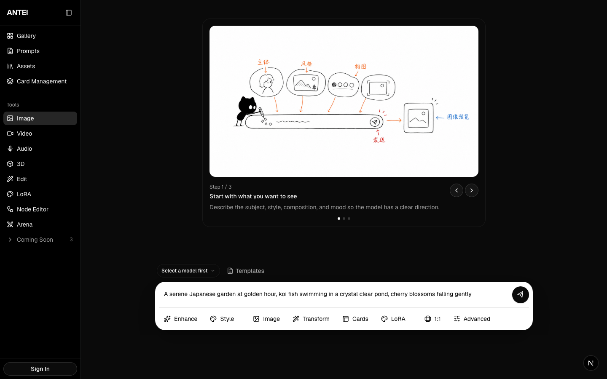

Desktop collapsed, 1440px:

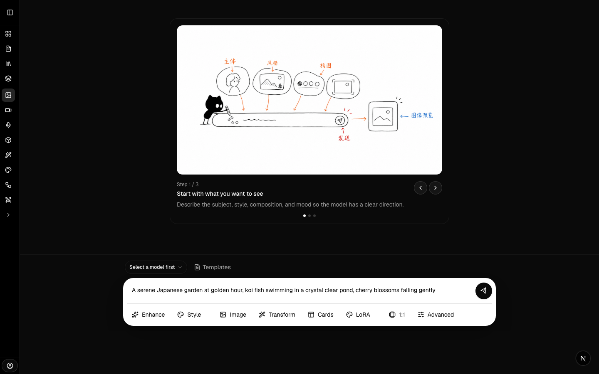

Mobile Studio, 390px:

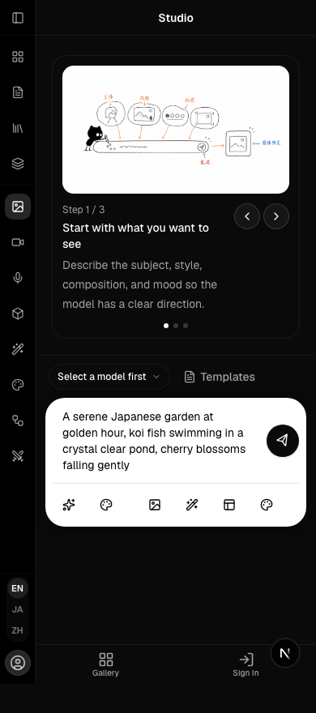

Mobile Studio menu open, 390px:

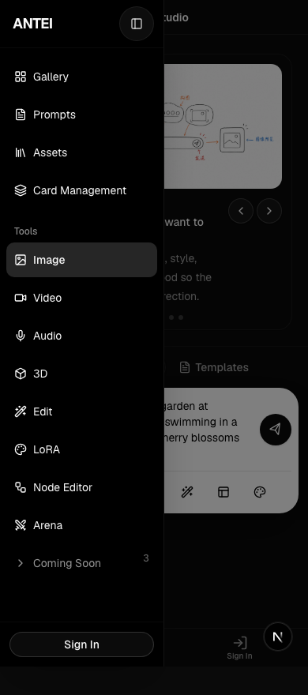

Tablet breakpoint, 768px:

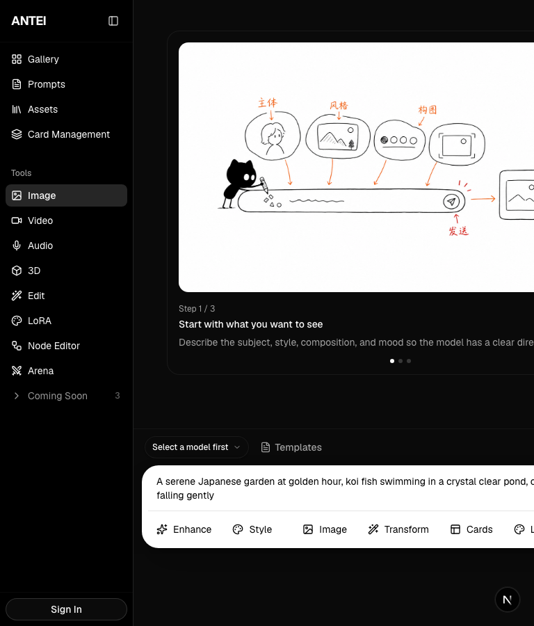

Desktop narrower workspace, 1024px:

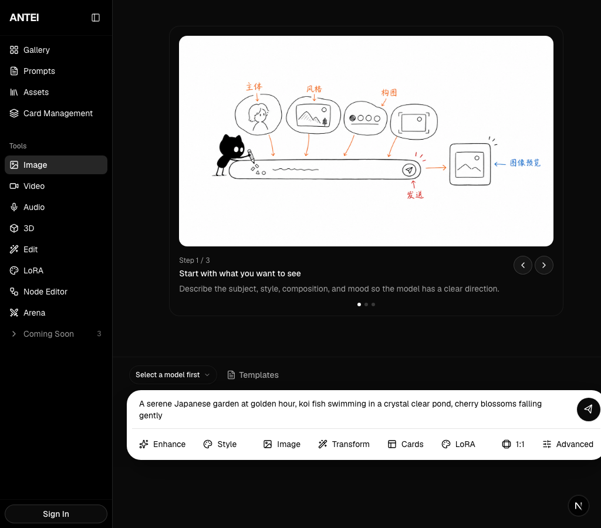

Edit task mobile, 390px:

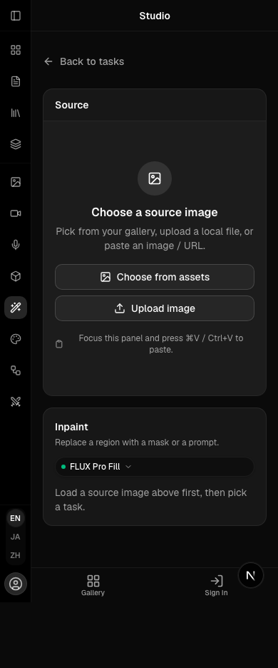

Edit task desktop, 1440px:

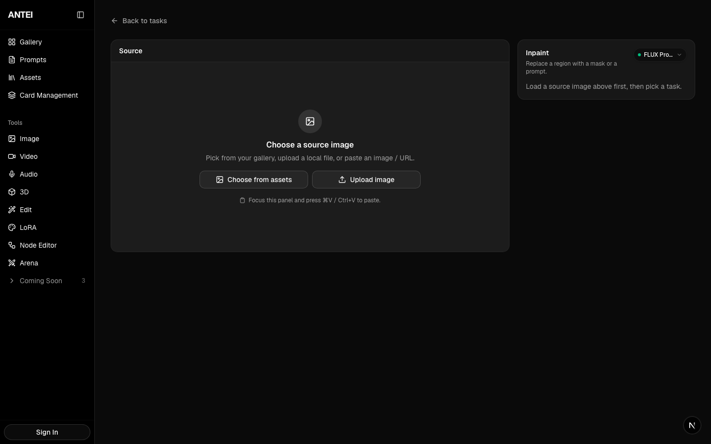

Signed-in account menu, desktop:

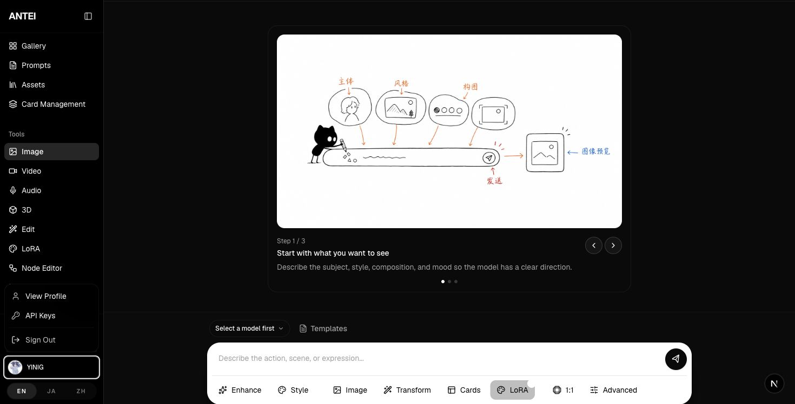

Mobile prompt focused, 390x844:

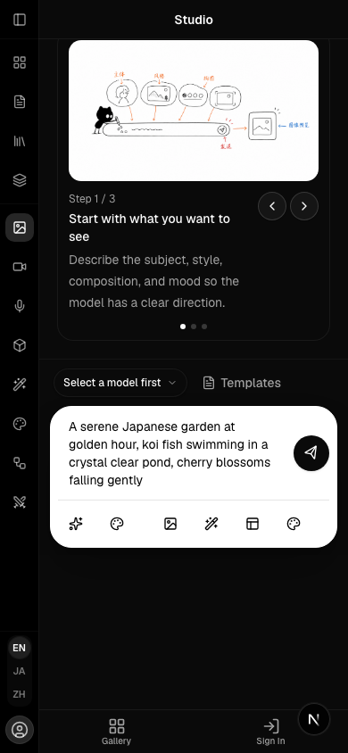

Mobile prompt with simulated keyboard-shrunken viewport, 390x520:

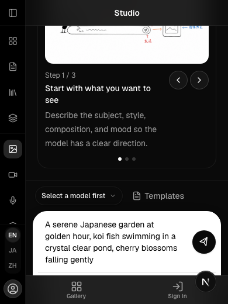

### Real-Device Mobile Keyboard Screenshots

Studio Image, keyboard closed:

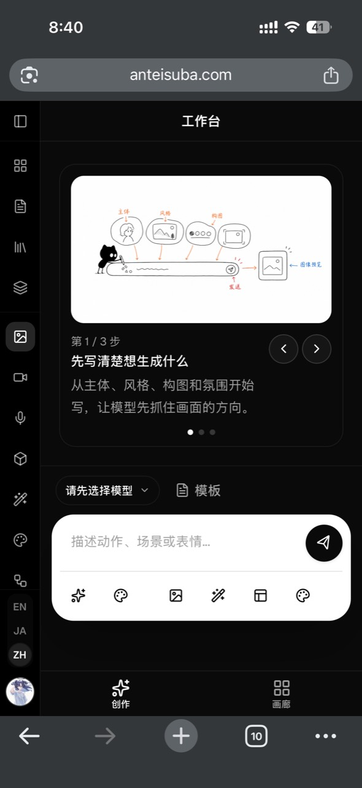

Studio Image, keyboard open:

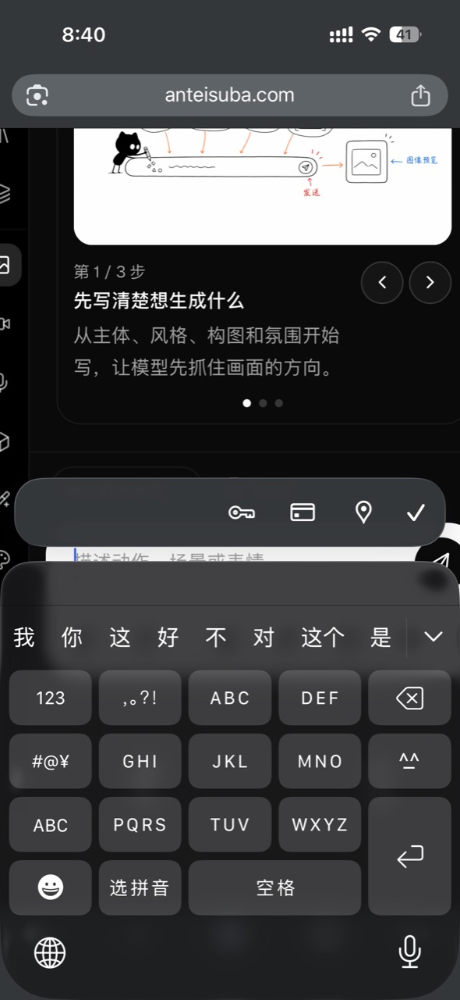

Studio Audio, keyboard closed:

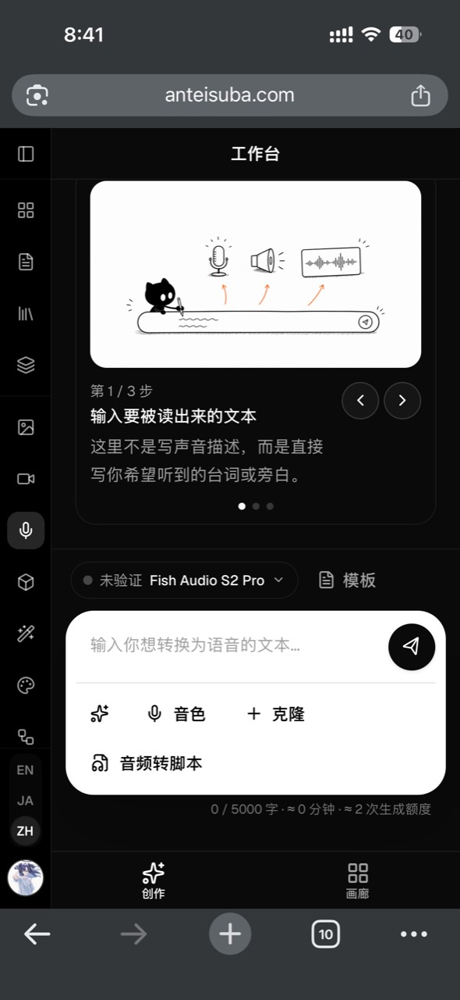

Studio Audio, keyboard open:

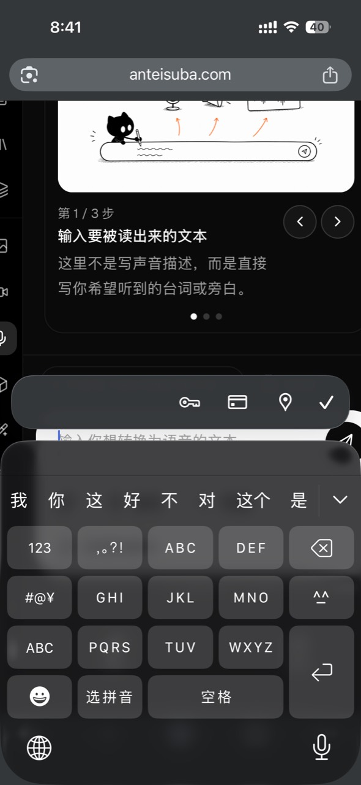

Studio Video, keyboard closed:

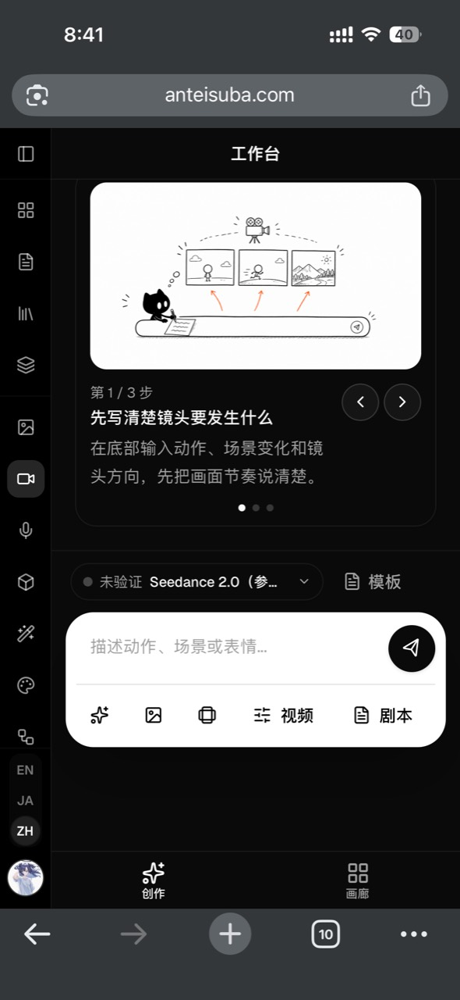

Studio Video, keyboard open:

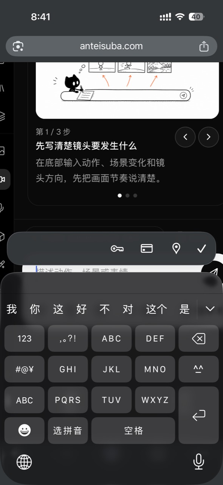

### First-Run Onboarding Screenshots

These screenshots intentionally keep first-run onboarding visible.

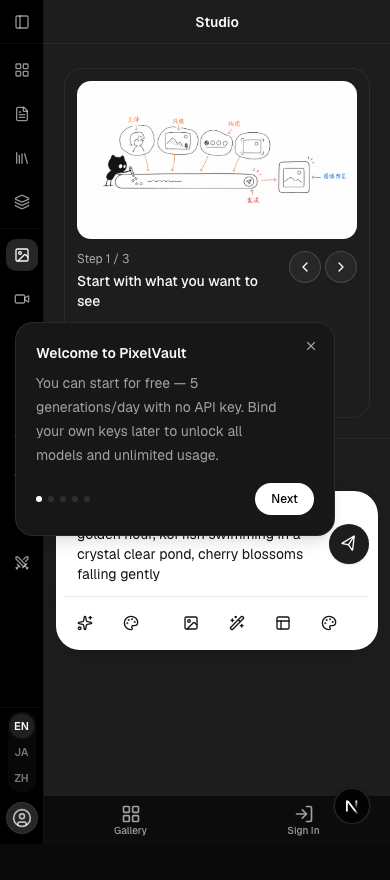

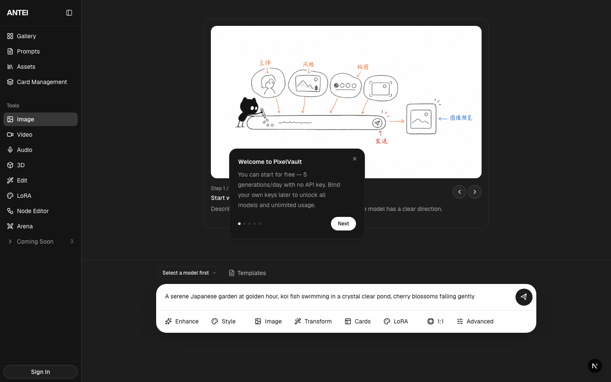

## Source Of Truth

Docs read for this pass:

- `AGENTS.md`
- `docs/README.md`
- `docs/status.md`
- `docs/design/README.md`
- `docs/design/system/README.md`
- `docs/design/system/current-ui-inventory.md`
- `docs/design/system/css-and-tokens.md`
- `docs/product/scope.md`
- `docs/domains/studio.md`
- `docs/domains/node-workflow.md`
- `docs/domains/cards.md`
- `docs/domains/projects.md`
- `docs/domains/api-keys.md`
- `docs/domains/gallery.md`

Code source of truth:

- `src/app/[locale]/(main)/layout.tsx`
- `src/app/[locale]/(main)/studio/(workspace)/layout.tsx`
- `src/app/[locale]/(main)/studio/edit/layout.tsx`
- `src/app/[locale]/(main)/**/loading.tsx`
- `src/app/[locale]/(main)/**/error.tsx`
- `src/components/layout/AppSidebar.tsx`
- `src/components/layout/MobileTabBar.tsx`
- `src/components/ui/sidebar.tsx`
- `src/components/business/StudioWorkspaceUI.tsx`
- `src/components/business/OnboardingTooltip.tsx`
- `src/hooks/use-onboarding.ts`
- `src/hooks/use-mobile.ts`
- `src/components/business/studio-shared/chrome/StudioResizableLayout.tsx`
- `src/components/business/studio-shared/chrome/StudioBottomDock.tsx`
- `src/components/business/studio-shared/chrome/StudioCanvas.tsx`
- `src/components/business/studio/edit/EditWorkspaceShell.tsx`
- `src/app/globals.css`
- `src/constants/routes.ts`
- `src/messages/en.json`
- `src/messages/ja.json`
- `src/messages/zh.json`

## Open Questions

- Should 768px stay desktop shell, or should tablet portrait use the mobile /
  compact shell?
- Should mobile keep both rail and bottom tab bar?
- Should the bottom tab bar remain visible behind the open mobile Sheet?
- Should first-run onboarding intentionally block global navigation?
- Should signed-in account actions use a shared DropdownMenu primitive instead
  of the current custom popover?
- Should Escape close the signed-in account menu and should ArrowDown/ArrowUp
  move through its items?
- Should Studio reserve or transform the bottom dock when the mobile keyboard
  shrinks the visual viewport?
- Should route loading states be normalized into shared shell-aware loading
  patterns?
- Should Arena remain pinned in the global Tools group, or move under a
  secondary/social group later?
- Should the Studio `tabpanel` semantics remain if there is no visible tablist?

## Last Verified

Verified on 2026-06-02.

Validation performed:

- Code inspection of the layout shell source files listed above.
- Browser / Playwright screenshots at 375, 390, 430, 768, 1024, and 1440 widths.
- Sidebar desktop collapse interaction after onboarding completion.
- Mobile menu open interaction at 390px.
- Edit task shell at 390px and 1440px.
- Signed-in account menu keyboard QA in Chrome.
- Mobile prompt focus check at 390x844 and simulated keyboard-shrunken viewport
  check at 390x520.
- User-provided real-device mobile virtual-keyboard screenshots for Studio
  Image, Audio, and Video modes on the deployed `anteisuba.com` site.
- Route loading/error source inspection and browser trigger attempts with
  delayed/failed RSC requests.
- Console and `pageerror` collection during screenshot capture.

Validation not performed:

- Real-device mobile virtual-keyboard QA for exact device/browser metadata.
- Real-device mobile virtual-keyboard QA for `/studio/edit/*`.
- Direct visual capture of route `loading.tsx` / `error.tsx`, because delayed
  and failed RSC requests did not reliably render those route fallbacks in local
  dev.
