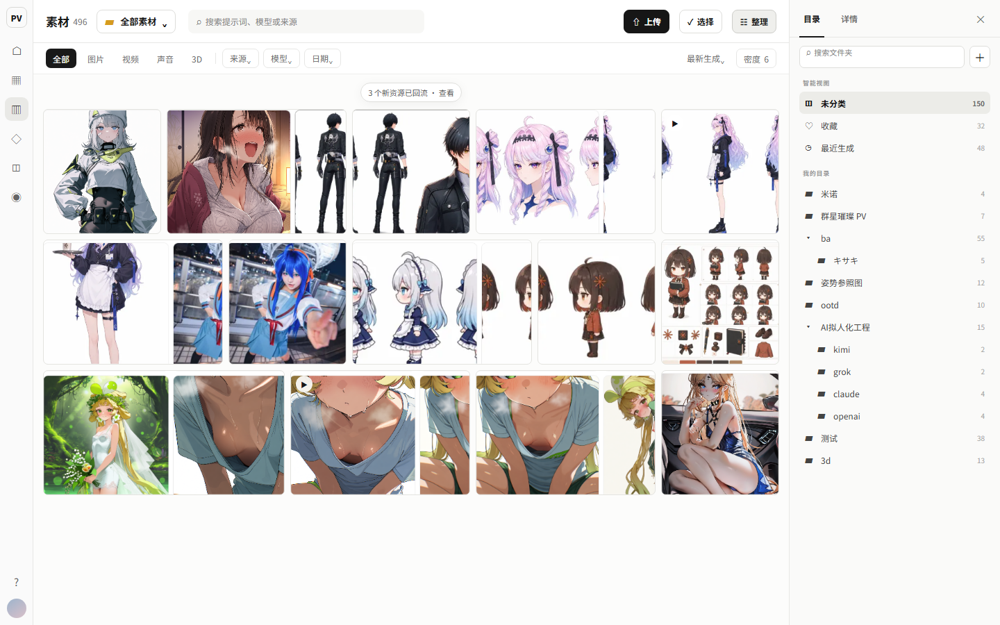
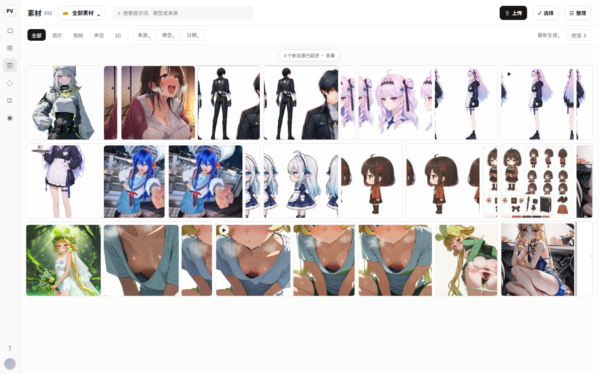
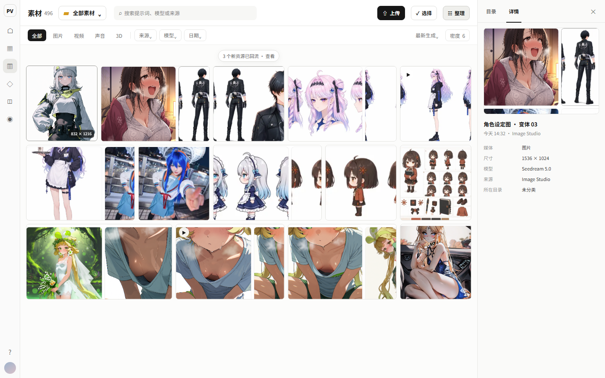
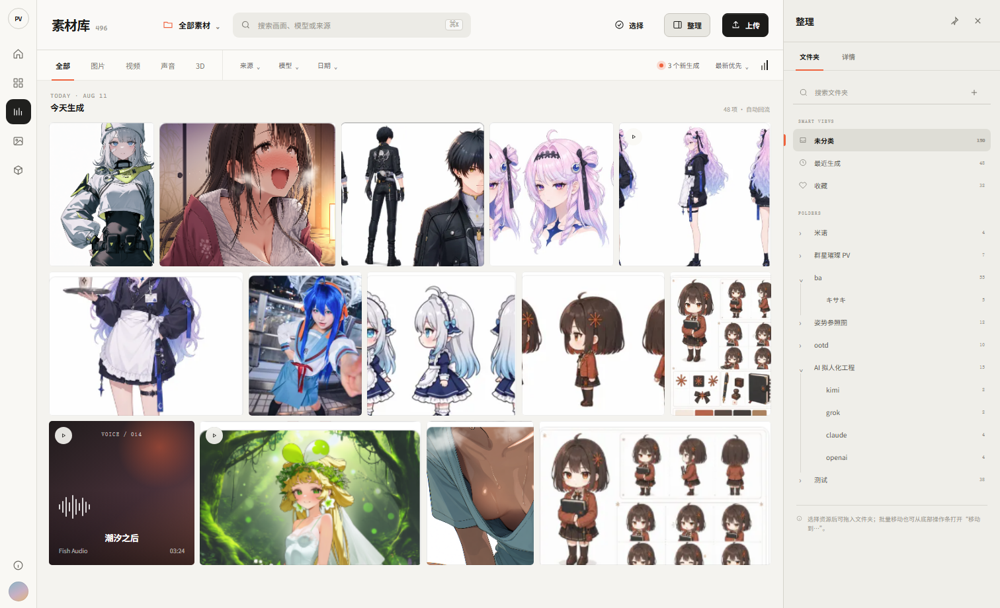
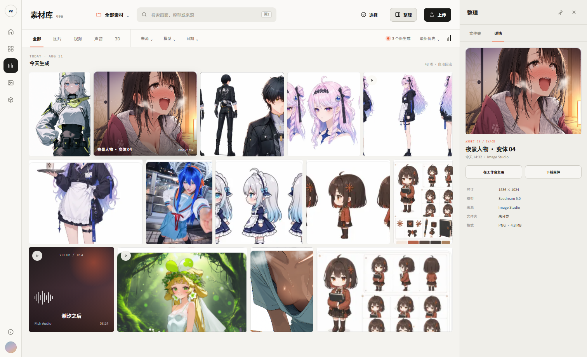

# Assets C+F 设计账本（2026-08-09）

> 状态：**设计治理进行中；域定义与共享/专属边界已确认；右侧 Dock 是当前工作方向，V1 视觉被否决，Codex V2 与 Claude 独立方案进入对比，`src/**` 冻结。**
> 来源：[`week-2026-08-07-backlog.md`](week-2026-08-07-backlog.md) §C / §F。
> 实现授权：**无**。完成三方向、关键切片、owner 确认并写入 `references/pages/assets.md` 后，才可进入施工。

## 1. 目标与范围

把 C1/C2/C3/C5/C6 与 F1/F2/F3 作为一个设计包收口：

- `/assets`：生成/上传资源回流、跨媒体分类管理、素材比例与网格、检索、文件夹、上传状态、按钮反馈。
- `AssetSelectorDialog`：文件夹定位、整体布局、单选/多选反馈和动效。
- C4 尾项：最终瓦片几何确定后，再设计存量 384px 缩略图的安全回填；它属于同一任务包，但作为独立工程切片执行。

非目标：生成能力、Gallery 公共展示、Detail Sheet 重设计、D3 虚拟化/blur-up、provider/API/credit/auth、画布并行任务。

## 2. 开工 5 问

1. **目标**：让用户在完整素材库中可靠地找、看、整理和复用素材，并在任意调用方中快速选回合法素材。
2. **影响面**：`/assets`、`KreaAssetBrowser`、`AssetSelectorDialog`、`AssetFolderTree`、`use-gallery`、Assets 路由筛选参数、三语消息；共享 picker 当前有 16 个调用文件 / 19 个挂载点。
3. **成功标准**：待结构决策与关键切片确认后定稿；最低包括不再无意裁切、检索可达、文件夹可扫描、上传/错误状态真实、picker 三契约不破、桌面与 375px 可用。
4. **禁改范围**：不改生成、provider、credit、auth、DB schema；不碰画布在飞设计与实现。C4 回填不得直接运行现有 `--force`。
5. **验证证据**：同内容三方向、关键切片真机、桌面/平板/375px、键盘/focus return、单选/多选/mediaType、上传成功/失败、相关 Vitest + lint/typecheck + visual/mobile E2E。回填另需 dry-run、限量抽样、R2/DB 核验和 live 授权。

## 3. UI scene 专属 5 问

1. **域职责**：✅ 已确认，见 §4。
2. **维护还是改版**：改版；改变页面层级、网格骨架、picker 信息架构和状态表达。
3. **方向确认阶段**：域定义、共享/专属边界与“右侧上下文 Dock”工作方向已确认；V1 仅保留结构证据，V2 与 Claude 方案待 owner 对比，尚未获得整页实现授权。
4. **共享与专属边界**：✅ 已确认。共享数据、筛选、网格、选择、上传等行为契约；完整管理页与任务型 picker 使用不同 shell，不再把完整素材页缩进弹窗。
5. **成功与证据**：最低门槛见 §2；具体比例、断点、动效和响应式契约待方向选择后写死。

## 4. 已确认的域定义

> **Owner 2026-08-09 确认：** Assets 负责“找、看、整理、复用私有素材”，不生成；picker 负责“尽快找到一个合法素材并返回原任务”，不承担完整管理。

> **Owner 2026-08-09 补充：** 所有已完成的生成资源需要回流到 Assets，由 Assets 统一承担跨媒体分类管理；图片与视频必须能按真实宽高比观看，声音资源需要封面表达。Assets 不接管生成执行本身。

这项确认只锁定职责和任务优先级，不确认任何布局、颜色、材质、文件夹位置、网格比例或动效答案。

## 5. 现状事实审计

- `KreaAssetBrowser.tsx` 当前 2198 行；`AssetSelectorDialog.tsx` 137 行；`AssetFolderTree.tsx` 663 行；`use-gallery.ts` 500 行。
- 真机 1280px 默认密度下，瓦片约 176×176；样本原图比例约 0.56–2.0，统一 `aspect-square + object-cover`，C1 的裁切属实。
- 桌面 picker 把系统区块与二十多个私人文件夹放进单行横向 rail，F1 的扫描困难属实；移动端改为分组选择器。
- 文件夹搜索、排序、拖拽整理和 picker 内上传已经存在；C3/F1 必须重组现有能力，不重造。
- `GalleryFilters` 已支持 `search/model/sort/timeRange`；Assets UI 未露出。Assets SSR 初次查询未传 `timeRange`，客户端筛选没有 URL 同步。
- `Generation` 已保存图片/视频 `width`、`height` 与音频 `duration`；当前方形 `aspect-square + object-cover` 是展示层裁切，不是数据缺失。
- 所有成功产物通过 `createGeneration` 进入统一记录，但 `LIST_GENERATION_SELECT` 未返回 `sourceSurface`，Assets 也没有来源筛选；现有来源枚举仅含 `IMAGE_STUDIO / LORA_WORKBENCH / CANVAS / EDIT`，Video / Audio / 3D / Upload 来源语义尚不完整。
- 声音封面已有 `previewUrl`、详情设置封面 API 与系统默认图回退链，但当前只是分散实现；“每条声音在展示层始终有可辨认封面”的产品规则仍需在 page 文档中正式锁定。
- 多文件上传当前串行执行，页面只有一个 `isUploading` 与 toast，没有队列、逐项结果或重试。
- `useGallery` 返回 `error`，但 `KreaAssetBrowser` 未消费；加载失败缺少页面恢复路径。
- 新上传缩略图管线已是 768px，但 `scripts/backfill-generation-previews.ts` 仍写死 384px；现有 `--force` 覆写 immutable 同名 key，并同时重做 thumbnail/preview，不能原样用于 C4 尾项。

## 6. 状态矩阵（方向稿必须共同覆盖）

### `/assets`

- 默认有内容 / 单区块空态 / 搜索无结果。
- 首次加载 / 筛选切换 / 分页加载 / 请求失败与重试。
- 文件拖入 / 单文件上传 / 多文件排队 / 部分失败 / 成功插入。
- 普通浏览 / 选择模式 / 批量动作 pending / 危险确认。
- 文件夹搜索、排序、新建、重命名、拖入资产。
- 桌面、平板、375px；详情 Sheet 只验证入口与 focus return，不在本轮重设计。

### picker

- 单选 / 多选 / 达到 maxSelection / mediaType 锁。
- 最近素材 / 搜索结果 / 文件夹结果 / 空结果。
- 内联上传、上传后自动选中、失败恢复。
- 桌面 Dialog / 移动 Drawer / 关闭后 focus return。

## 7. 决策账本

| #   | 日期       | 问题                                 | 推荐答案                                                                                     | Owner 结论                            | 权力范围                                  |
| --- | ---------- | ------------------------------------ | -------------------------------------------------------------------------------------------- | ------------------------------------- | ----------------------------------------- |
| 1   | 2026-08-09 | Assets 与 picker 分别负责什么？      | Assets = 找/看/整理/复用；picker = 快速选回合法素材                                          | ✅ 认可                               | 只确认域职责                              |
| 2   | 2026-08-09 | 完整素材页与 picker 是否继续同构？   | 不同构；共享行为，分别使用管理型与任务型 shell                                               | ✅ 认可                               | 共享/专属边界                             |
| 3   | 2026-08-09 | `/assets` 的第一任务是什么？         | 资产内容始终是主视觉；浏览/搜索是默认态，整理围绕内容按需出现；文件夹是组织与范围过滤维度    | ✅ 认可                               | 页面信息主次                              |
| 4   | 2026-08-09 | 已有全局左侧导航时，文件夹树放哪里？ | 不增加第二左栏；采用可折叠右侧上下文 Dock，顶部范围选择器负责快速切换，多选通过“移动到…”完成 | ✅ 选向并要求先做                     | 结构方向；关键切片仍待复核                |
| 5   | 2026-08-11 | V1 关键切片的视觉是否成立？          | V1 只验证结构；重做真正高保真 V2，并给 Claude 同事实独立设计用于对比                         | ❌ V1 视觉否决；要求 V2 + Claude 对比 | 不推翻已确认域事实；最终视觉/结构仍待选择 |

## 8. 三个结构方向与选向

### A. 右侧上下文 Dock（✅ owner 选定）

- 左侧只保留全局应用导航。
- 右侧使用可折叠、可调宽的 `目录 / 详情` Dock；目录服务重度整理和拖放，详情服务当前资源检查。
- 顶部用带文字的“全部素材⌄”切换浏览范围，不把“打开面板”和收藏/公开等筛选混成同一组图标。
- 多选后的常规整理走可搜索、可展开目录的“移动到…”overlay，目录树不必永久可见。

优点：内容主视觉稳定，兼容大量嵌套文件夹，也能保留拖放效率。风险：Dock、详情 Sheet 与移动 overlay 的职责必须去重。

### B. 顶部范围选择器 + 移动 overlay

页面永远不显示目录树；所有切换走顶部范围选择器，所有整理走“移动到…”overlay。最干净，但重度整理和连续跨目录拖放效率不足。

### C. 独立整理模式

默认浏览态只看内容；进入“整理模式”后切换成目录树 + 多选网格的专门工作区。职责最清楚，但浏览/整理切换成本高，也会增加一套模式状态。

成熟模式证据：Frame.io V4 的 Project Navigation / Asset Viewer / Asset Details 都可独立展开、收起和调宽；Lightroom 将照片视图、智能相册与手工文件夹区分；Eagle 以 Smart Folder 降低纯手工树负担；Dropbox 把标签与文件信息放入上下文侧栏。

## 9. 关键切片：桌面 1440px · 目录 Dock 打开

[可交互 HTML 原型](prototypes/assets-context-dock-key-slice-2026-08-09.html)

### 主状态：目录打开

### 同骨架状态

| 状态      | 契约                                                       | 证据                                                                             |
| --------- | ---------------------------------------------------------- | -------------------------------------------------------------------------------- |
| Dock 关闭 | 网格占满除全局导航外的可用宽度；“整理”仍是明确入口         |  |
| 目录打开  | 304px 贴边平面面板；智能视图与私人目录分组；不再套圆角卡片 | 主状态图                                                                         |
| 详情打开  | 点击资源后复用同一 Dock 切到详情，不再另开第二个常驻侧栏   |   |

### 结构契约

- 顶部第一层：标题与总数、范围选择器、资产搜索、上传、选择、整理。
- 顶部第二层：媒体类型、来源/模型/日期筛选、排序与密度；不再把范围、筛选和面板开关塞进相同 segmented control。
- 内容区：图片/视频按真实宽高比参与等高行布局；密度控制目标行高，不再用固定列数强制正方形。
- 回流反馈：页面打开时有新完成资源，用轻量“新资源已回流”提示，不阻断当前浏览位置。
- Dock：`目录 / 详情` 两个上下文标签；目录搜索和新建始终在目录态顶部。
- 原型中的资源图来自 owner 提供的现状截图，仅验证真实内容密度与空间关系，不构成最终缩略图裁切或视觉皮肤规范。

### 响应式契约（待关键切片确认后再出 375px 图）

- `>= 1600px`：允许 Dock 固定展开并记忆宽度/开关状态。
- `1024–1599px`：Dock 默认关闭；打开时覆盖内容，不永久压缩网格。
- `< 1024px`：目录与详情进入 ResponsiveOverlay；手机使用底部 Drawer，关闭后焦点回到触发器。

### 待 owner 只确认这一项

是否认可这个关键切片的空间结构：**左侧仅全局导航 + 中央内容优先 + 右侧可折叠 `目录 / 详情` Dock**。确认只锁定结构，不锁定原型中的字体、颜色、图标或具体缩略图裁切。

> 2026-08-11 owner 反馈：V1 UI 有点丑。该切片不再作为视觉候选，只保留 Dock 开/关/详情同骨架的结构验证。

## 10. Codex V2：编辑型私人档案馆（待与 Claude 对比）

[可交互 V2 原型](prototypes/assets-context-dock-v2-2026-08-11.html)

### 文件夹状态

### 详情状态

V2 保留 V1 的空间命题，但不继承其视觉皮肤：

- 顶部从“多组带框控件”收敛为标题/范围/搜索/动作 + 文本型筛选双层结构。
- 使用真实 SVG 图标，去掉 Unicode 占位符。
- Assets 域采用安静的中性档案台表面，作品颜色成为页面主色；橙红只标记 active、新回流和 focus。
- 网格改成连续等高行节奏，卡片只在 hover/focus 时显示名称与像素尺寸。
- 声音以独立封面卡表达，包含播放入口、provider 和时长；封面内图形只作艺术表达，不代表真实波形数据。
- 右侧 Dock 去掉嵌套卡片和“每行一个文件夹图标”，改为更强的排版、缩进、细分隔和单一 active 标记。
- 详情态以大预览和复用动作优先，元数据退为第二层。

V2 仍是候选，不写入 `references/pages/assets.md`，也不构成实现授权。给 Claude 的中立事实包见 [`assets-claude-design-brief-2026-08-11.md`](assets-claude-design-brief-2026-08-11.md)。

## 10b. Claude 独立方案（2026-08-11 交付，待 owner 对比）

按 brief 独立完成，未参考 V2 原型。三个**结构不同**的方向（非换色变体），方向文档 [`assets-claude-directions-2026-08-11.md`](assets-claude-directions-2026-08-11.md)：

| 方向         | 第一结构                          | 文件夹位置                       | 详情关系                      | 原型                                                                                                             |
| ------------ | --------------------------------- | -------------------------------- | ----------------------------- | ---------------------------------------------------------------------------------------------------------------- |
| A 灯箱馆     | 检视（暗场 justified 大河）       | 顶部 scope 树下拉 + 移动 overlay | 全屏灯箱（原图/filmstrip/←→） | [`prototypes/assets-claude-a-lighttable-2026-08-11.html`](prototypes/assets-claude-a-lighttable-2026-08-11.html) |
| B 大厅与展馆 | 收整（回流带→夹门牌→全部流三段）  | 页面本身（门牌卡 + 夹内页）      | 保持现有 Sheet                | [`prototypes/assets-claude-b-atrium-2026-08-11.html`](prototypes/assets-claude-b-atrium-2026-08-11.html)         |
| C 装配抽屉   | 操作（中央大河 + 右侧双窗格抽屉） | 抽屉上窗格常驻树（拖放目标）     | 单击=抽屉轻检视 · 双击=灯箱   | [`prototypes/assets-claude-c-bench-2026-08-11.html`](prototypes/assets-claude-c-bench-2026-08-11.html)           |

三个原型共享：justified 真实比例网格（ar clamp [0.5,2.2]，>2.2 独占整行不裁）、声音封面卡、视频 poster+时长、新回流反馈、真实素材（真机 API 抓取，比例谱实测 0.56–2.77）。已真机验证（chrome，1920 视口）：A 主状态/灯箱/scope 树，B 三段/夹内页，C 抽屉检视态/树并存。

> **2026-08-11 owner 初步反馈：认为 B 的设计比较好**，追问两题：①大分类→小分类怎么找 ②夹多了怎么管理。答案已设计并做进 B 原型（chips 直达 / 三级面包屑 / 文件夹总览页 16 夹 + 跨层搜索 / 主搜索夹结果直达），见方向文档 §3b。
> **同日四条修正已执行**（方向文档 §3c）：顶栏补视图分类 segmented（原型漏了收藏/已发布/本地上传）· 全局紧凑化 · 圆角阴影对齐本地 shadcn token（弃暖纸自定义皮）· **回流带整段删除**（降级为「全部素材」段头轻徽标）· 「馆藏」改名「文件夹」。首页=文件夹门牌行+全部素材两段。**尚未最终选向**，待 owner 亲手过原型确认。

## 11. 下一步 — ✅ 2026-08-11 全部完成，本账本收口

1. ~~Owner 对比方向选向~~ → **选定 Claude 方向 B「大厅与展馆」**（§10b），并逐条修正（§10b 引文 + 方向文档 §3b/§3c/§3d）。
2. ~~深化被选中的方向~~ → 1280 / 375 / picker / 上传 / 错误 / 空态全部成稿，真实 iframe 视口量测通过（三档行宽 ≥99.7% 铺满、无横向溢出）。响应式对照页 [`prototypes/assets-claude-b-responsive-2026-08-11.html`](prototypes/assets-claude-b-responsive-2026-08-11.html)。
3. ~~写入 page 文档并拆 task packet~~ → **[`../references/pages/assets.md`](../references/pages/assets.md)（唯一页面契约）** + **[`assets-cf-task-packet-2026-08-11.md`](assets-cf-task-packet-2026-08-11.md)（9 个切片，含硬前置「视频 poster 派生」与 C4 回填）**。

> **本账本自此只作历史证据**（被否的 V1/V2 与三方向对比）。**实现只读 page 文档与 task packet**；两者与本文冲突时以 page 文档为准。收口后按「完成即删」规矩清理（删前 grep 全仓改引用）。

## 并行边界

- 2026-08-09 审计时，C/F 相关源码无未提交修改。
- 画布相关未提交文件与 commits 不纳入本任务，也不修改。
- `src/messages/en.json` / `zh.json` 有其他任务的未提交键；未来补 Assets 三语时必须保留并精确合并，禁止整文件覆盖。
