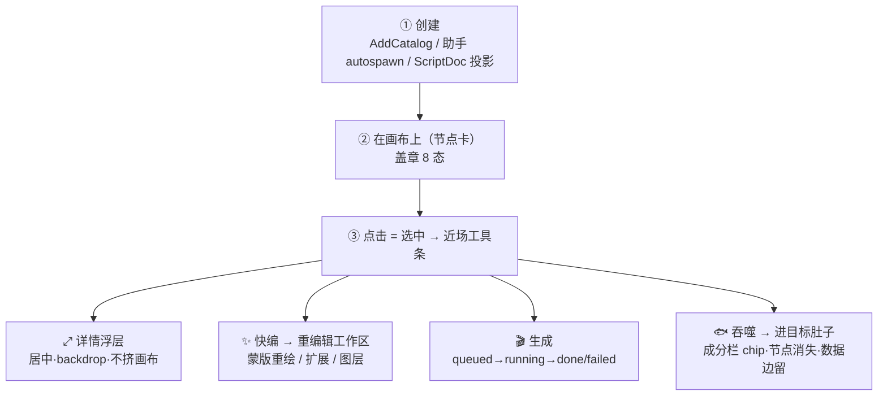

# 画布节点交互逻辑图（你确认 · 改 · 提疑问）

> 设计权力限定（2026-07-19）：本文用于确认节点生命周期、功能和当前交互回归。盖章、暗炭制片桌等外观词只描述本轮实现；未来 Canvas 视觉需重新设计，不能从本图推导。

> **这是什么**：把画布"节点点击前后 / 覆盖 / 功能"三块现状摊开成一张完整逻辑图，供你逐点确认。Opus 4.8 调查产出（2026-07-16，读 node-types / NodeDetailPanel / CanvasImageSelectionToolbar / CanvasWorkspaceLayout 核实）。
> **怎么用**：每条你可以 **✅ 对** / **✍️ 改成…** / **❓ 我有疑问**。§4 疑问点请直接在"owner 答"后写。
> **事实源**：`src/constants/node-types.ts` · `src/components/business/node/**`；长期契约 `references/pages/node-canvas.md`；模块计划 `canvas-module-function-catalog-2026-07.md`。

---

## 1 · 节点生命周期（点击前后）

- **8 态**：idle → queued → ready → running → done / failed / stale / disabled（`NODE_STATUSES`，视觉=盖章）。
- **点击后 = 近场工具条**：图片节点用 `CanvasImageSelectionToolbar`（重命名 / 分类 / ⤢展开 / 下载 / 快编 / more：超分·去背·局部重绘·扩展·图层·抠元素 / 删除）。
- **⤢ 详情 = `NodeDetailPanel`**：居中浮层 + backdrop 模糊，**刻意"不挤画布"**，按节点类型分发 body，Esc / 点 backdrop / 收起关闭。

---

## 2 · 节点类型 × 功能矩阵

| 节点(type)                                                    | 媒体 | 干什么                                             | 选中后工具                            | 主要字段                                                                           |
| ------------------------------------------------------------- | ---- | -------------------------------------------------- | ------------------------------------- | ---------------------------------------------------------------------------------- |
| `image`(role=character/background/shot/frame/closeup)         | 图   | 生成/承载图片 + 六项 AI 编辑                       | **丰富**(CanvasImageSelectionToolbar) | 按 role：prompt / location·mood·lighting / camera·composition·action / frameIntent |
| `shotText`                                                    | 文本 | 剧本镜头文本(scene/action/camera/composition)      | ❓ 待核实                             | scene·action·camera·composition                                                    |
| `seedance`                                                    | 视频 | 视频生成，吃 角色/背景/镜头图/关键帧/音色/参考视频 | ❓ 待核实(⤢详情)                      | motion·camera·duration·audioIntent·prompt                                          |
| `videoReference`                                              | 视频 | 上传参考视频(不生成)                               | ❓ 待核实                             | —                                                                                  |
| `videoMerge`                                                  | 视频 | 合并多段视频→长片                                  | ❓ 待核实                             | —                                                                                  |
| `voice`                                                       | 音频 | 音色身份(不产成品对白)                             | ❓ 待核实                             | voiceName·provider·id·style·emotion                                                |
| `composer` / `agent`                                          | —    | **待删**(旧 planner，被助手取代)                   | —                                     | —                                                                                  |
| legacy `characterImage`/`backgroundImage`/`shot`/`frameImage` | 图   | 仅兼容旧存档解析，加载时折叠进 `image`+role        | —                                     | —                                                                                  |

> ❓ 上表"选中后工具"里非图片节点全是待核实 —— 这正是疑问 A 的来源。

---

## 3 · 覆盖 / 层级关系

现状（从下到上）：

| 层        | 元素                               | 说明           |
| --------- | ---------------------------------- | -------------- |
| 底        | CanvasStage（`isolate`）+ 暖炭点阵 | 画布表面       |
| 内容      | React Flow 节点层                  | 节点卡         |
| 近场      | 选中工具条                         | 选中节点时出现 |
| 浮层 z-20 | **详情浮层 / 助手 rail(移动端)**   | 都 z-20        |
| chrome    | 顶栏 / 底栏 / Cast dock / minimap  | 各自浮层       |
| 拖拽      | 吞噬拖拽 ghost（portal）           | 最上           |

> ⚠ `canvas-modular-redesign` 自己已记："顶栏、助手、Cast、minimap、节点卡都用大圆角与同一档重投影，**多个浮层竞争层级**"。这大概率是"节点覆盖"感觉乱的根。

---

## 4 · 疑问点（请在"owner 答"后写）

**❓A 点击后不同类型节点行为不一致 = 混乱源？**
图片节点工具丰富，视频/音色/剧本/合并似乎只有 ⤢/删除。要不要给每类节点定义一致的"选中后能做什么"？

- owner 答：_（← 你写）_

**❓B "节点覆盖"你具体指哪种？**
① 详情浮层盖住画布 / ② 多浮层互盖(顶栏·助手·Cast·minimap) / ③ 吞噬后节点消失看不到去哪。

- owner 答：_（← 你写）_

**❓C 详情要不要做成三档？**
现状 = 图片工具条 + 居中浮层一档；计划 D1 = 轻菜单 / 对象任务面板 / 重编辑工作区三档。按这个补吗？

- owner 答：_（← 你写）_

**❓D legacy 节点类型 + composer/agent 残留要清吗？**
enum 里还留 characterImage 等 4 个 legacy + composer/agent(待删)。清理感知层面要不要处理？

- owner 答：_（← 你写）_

**❓E 吞噬后"节点消失"用户能理解吗？**
被吃的节点从画布消失、变成肚子里的 chip（可拆出回画布）。这个"消失"是不是你觉得混乱的一处？

- owner 答：_（← 你写）_

---

## 5 · 我的现状观察（可能的混乱点，供你确认）

1. **点击后不一致**（图片丰富 / 其他简陋）—— 最可能的混乱源，见 ❓A。
2. **多浮层竞争层级** —— modular-redesign 已识别，见 §3 / ❓B。
3. **节点类型不干净** —— legacy 4 类 + composer/agent 待删仍在 enum，见 ❓D。
4. **详情单档 vs 计划三档** —— 现状与 D1 计划有 gap，见 ❓C。
5. **shotText 定位模糊** —— 功能目录说"不重新暴露手工 shotText 入口"，但 enum/节点仍在，剧本文本节点该以什么形态存在待明确。

> 这些观察若与你的实际感受不符，直接改；补充你自己觉得乱的点到这里。

---

## 6 · 最小验证探针（吞噬 vs 连线决策用 · 交 Sonnet）

> owner 2026-07-16 选择：吞噬 vs 连线不急着大改，先用最小成本探明是**可见性问题**还是**范式问题**。背景与三选项见 memory `project-canvas-ingest-vs-edges-decision`。

**目标**：在现状吞噬上加「选中节点 → 显示其关联边（石绿细线）」，让 owner 判断补上可见性后是否就不别扭。**探针性质、可回退，不是最终融合方案。**

**落点**：`StudioNodeWorkbench.tsx`（约 L1659–1666）——现状 `workflow.edges.map((edge) => ({ ...edge, hidden: true }))` 把所有边**无条件隐藏**（这就是"连线渲染退场"）。

**改法**：从"全隐藏"改成"选中节点的关联边不隐藏"：

- 拿当前 React Flow 选中节点 id 集合；
- `hidden: !(选中集合.has(edge.source) || 选中集合.has(edge.target))`；
- 边组件 `NodeWorkflowStatusEdge` **已有 §2.3 selected 态石绿视觉**（`resolveNodeWorkflowEdgeVisual`），确保关联边渲染成石绿细线（必要时给这些边设 `selected`）。

**验收**：选中一个吃了成分的视频/镜头卡 → 其关联边以石绿细线显示指向被吃成分；取消选中 → 边隐回；吞噬现状（成分栏 chip）不受影响。tsc + vitest 绿，别提交等 owner。

**判读**：owner 点一下 —— 不别扭了 = 可见性问题 → 往**融合**走；仍别扭 = 范式问题 → 换回**连线（A）**。

---

## 7 · 给 Fable 的画布设计任务（2026-07-17 owner 拍板：画布独立任务线）

> owner 定：**画布与 LoRA 分成两条独立任务线**，各自调查/设计/执行，别混推。画布交 Fable 设计 UI/功能/连线。§6 探针不单独跑了，直接进设计（连线决策在设计里定夺）。

**核心 = 关系呈现范式的决策与设计**：owner 对现有「吞噬取代连线」动摇（不直观），倾向**重新设计连线**。三选项（A 连线做好 / B 深补救吞噬 / 融合 = 容器+按需连线）+ 4.8 推荐融合，背景见 memory `project-canvas-ingest-vs-edges-decision`。Fable 定夺并出设计。

**连带 = 节点交互**：据连线决策，把 §1–§5 现状 + §4 六疑问点一并设计掉——尤其 ❓A「点击后不同类型节点行为不一致」（图片工具丰富 / 其他简陋），这是 owner 感觉「混乱」的核心。

**边界（别重造）**：画布已有 `node-canvas.md`（视觉基准）+ `canvas-modular-redesign`（总计划 5 模块）+ `canvas-module-function-catalog`（功能 ID）+ codex 分支已实现 I3/E1/V2/A1/AS1/R1。**在现有计划上把连线决策做掉 + 调整受影响的 UI/功能**，不推倒重来。

**当前回归身份**：本轮仍按已实现的「暗炭制片桌」核对，避免业务施工中途换皮；它不再是未来 Canvas 身份约束。

**必读**：本文档 + `node-canvas.md` + `references/ui-inspiration/haivis-canvas-2026-07.md` + `canvas-modular-redesign-2026-07.md` + memory `project-canvas-ingest-vs-edges-decision`；`brand-dna.md` / `forbidden.md`。

**产出**：画布连线范式 + 节点交互的页级设计施工图（更新 `node-canvas.md` 或新页级文档），落成 Sonnet 可执行切片。

---

## 变更记录

| 日期       | 变更                                                                | 谁     |
| ---------- | ------------------------------------------------------------------- | ------ |
| 2026-07-16 | 建立节点交互逻辑图初稿 + 5 观察 + 5 疑问点                          | Claude |
| 2026-07-17 | 加 §7 给 Fable 的画布设计任务（owner 定画布独立线，探针改直接设计） | Claude |
