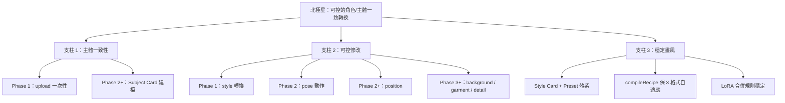

# 功能路線決策結論書

> 產出於 4 輪功能路線訪談 · 合計 17 題 · 19 個 Confirmed Decisions + 17 個 Rejected Directions
>
> 本文件是 `WBS-中長期演進計劃.md` 的 **功能側執行補充**，不替代演進計劃，只補齊「新能力長什麼樣、怎麼組織、什麼階段做什麼」
>
> 基準日期：2026-04-15
>
> Status note：本文件是**路線決策文檔**，包含已確認但未全部落地的未來能力與 Phase 規劃；判斷當前代碼現況請以 `02-現狀映射.md` 為準。

---

## 0. 速查（TL;DR）

- **北極星（三支柱）**：主體一致性 + 可控修改（動作/位置/背景/衣服/細節）+ 穩定畫風
- **主 Service**：`image-transform.service`（新建編排層，復用現有 generate-image / recipe-compiler / R2 / 韌性基座）
- **Phase 1 實作範圍**：只實作 `transformation.type = 'style'`；schema / UI / API 為 pose / background / garment / detail 完全預留
- **Provider 策略**：Multi-provider + Style Card 內綁定；短期 FLUX Redux 默認首選；不綁死單一 provider
- **Preset 初始集**：6 個（Watercolor / Oil Painting / Ghibli / Cyberpunk / Pixel / Photo-realistic）
- **可控程度**：3 pill（Light / Medium / Heavy） + Advanced 5 滑桿（Strength / Preserve Structure / Preserve Text / Preserve Composition / Preserve People）
- **結果評估**：默認 4 variants + Before-after + Fast 1x 可切（主操作旁顯性 toggle）
- **失敗處理**：寬容 — 部分成功即返回 + 失敗格 Retry + 按成功數扣費
- **輸入邊界**：JPG/PNG/WEBP · 10MB / 2048² 硬上限 · 人臉 consent modal 兜底
- **Preserve Text**：Phase 1 純 prompt + UX 標註 "best effort" · Phase 2+ Inpaint 迂迴
- **Studio 整合**：頂部新增 Input Image 區，RecipeBar D9 3-slot **保持不變**
- **視頻延伸**：Parked；僅類型簽名預留 `input.type = 'video_frame'`
- **Asset Library / Dataset Workspace**：**Parked** · Future Direction，**不在 Phase 1-3**（三個產品信號任一觸發才啟動專項訪談）

---

## 1. 全部 Confirmed Decisions（F1-F20）

| #       | 主題                          | 決策                                                                                                                                                                                                               | 來源                |
| ------- | ----------------------------- | ------------------------------------------------------------------------------------------------------------------------------------------------------------------------------------------------------------------ | ------------------- | --- |
| F1      | 第一優先目標                  | 保留原圖內容優先                                                                                                                                                                                                   | Q1                  |
| F2      | 畫風指定方式                  | Style Card 為主路徑 + Preset 新手引導（= 預置 Style Card） + Reference Image 延後 Phase 2+                                                                                                                         | Q2                  |
| F3      | 可控程度                      | 3 預設 pill（Light/Medium/Heavy） + Advanced 展開 5 滑桿                                                                                                                                                           | Q3                  |
| F4      | 結果評估                      | Before-after + 4 Variants 默認 + Fast 單張模式可切                                                                                                                                                                 | Q4                  |
| F5      | 視頻延伸                      | Phase 1-3 完全不考慮；類型簽名 `input: 'image'                                                                                                                                                                     | 'video_frame'` 預留 | Q5  |
| F6      | Provider 選型                 | Multi-provider + Style Card 內綁定；短期 FLUX Redux 默認；不綁死單一                                                                                                                                               | Q6                  |
| F7      | Preserve Text                 | Phase 1 純 prompt + UX "best effort"；Phase 2+ Inpaint 迂迴；永不做 OCR+region                                                                                                                                     | Q7                  |
| F8      | 輸入邊界                      | JPG/PNG/WEBP（HEIC 前端提示）· 2048² 硬上限 · 人臉 consent modal（不做 Face API）                                                                                                                                  | Q8                  |
| F9      | ~~Service 命名~~              | **已被 F13 覆蓋**                                                                                                                                                                                                  | —                   |
| F10     | 北極星擴展                    | 主體一致性 + 可控修改 + 穩定畫風 **三支柱**                                                                                                                                                                        | Q9 補充             |
| F11     | 可控轉換維度優先級            | C 動作 + 位置；Phase 1 聚焦「動作」做深，位置作為近鄰延伸                                                                                                                                                          | Q10                 |
| F12     | 主體一致性載體                | Phase 1 僅 `subject.type = 'upload'`；TS union 預留 `subject_card` / `character_card`                                                                                                                              | Q11                 |
| F13     | Service 命名與範圍            | `image-transform.service`（取代 F9 的 `image-restyle`）；Strategy Pattern 內部按 type 路由                                                                                                                         | Q12                 |
| F14     | Phase 1 MVP 收斂              | 架構廣義 + 實作聚焦：代碼只實作 style，schema/UI/API 殼為 5 維全預留                                                                                                                                               | Q13                 |
| F15     | 產品原則                      | 北極星廣義 · Phase 1 實作聚焦 · 抽象層為下一步能力預留接口                                                                                                                                                         | Q13 補充            |
| F16     | Fast toggle 顯性程度          | C 主操作旁顯性 pill toggle + 即時 credits 提示                                                                                                                                                                     | Q14                 |
| F17     | 失敗處理                      | B 寬容：部分成功返回 + 失敗格 Retry + 按成功數扣費                                                                                                                                                                 | Q15                 |
| F18     | Preset 初始集                 | 6 個精選（2×3 Grid）                                                                                                                                                                                               | Q16                 |
| F19     | Studio 整合                   | C Input Image 區 + RecipeBar D9 3-slot **保持不變**                                                                                                                                                                | Q17                 |
| **F20** | **Parked · Future Direction** | **Asset Library / Dataset Workspace**：用戶上傳本地圖片/文件夾 → 組織為可搜索可篩選可批量管理的資產集合 → 訓練時選素材集 → 生成結果加入素材庫。**不在 Phase 1-3**，三個產品信號任一觸發才啟動專項訪談（詳見 §9.2） | Q17 補充            |

---

## 2. 全部 Rejected Directions（RF1-RF17）

| #    | Rejected                            | 理由                                                    |
| ---- | ----------------------------------- | ------------------------------------------------------- |
| RF1  | Q1-B 風格優先                       | 「這不是我的圖」是常見失敗案例                          |
| RF2  | Q2-D 多入口混合                     | 複雜度爆炸，喪失主路徑清晰感                            |
| RF3  | Q3-A 單一強度滑桿                   | 無法區分招牌（Preserve Text）vs 照片（Preserve People） |
| RF4  | Q4-B 只 before-after 無 variants    | 風格化概率性高，用戶無選擇權                            |
| RF5  | Q5-D 完整 video-to-video stylize    | 12+ 週超規劃                                            |
| RF6  | Q6-C 自建 ControlNet 管線           | 複雜度爆炸                                              |
| RF7  | Q7-B OCR + region 強保留            | 新增 2 個技術依賴（OCR + mask gen），MVP 不值           |
| RF8  | Q8-A 最寬鬆格式                     | TIFF/8K/缺隱私兜底，線上風險大                          |
| RF9  | Q9-A 完全獨立 service               | provider/R2/計費/retry 全重寫 = DRY 失敗                |
| RF10 | Q10-A 全 5 維一起上                 | 啥都有但啥都不好                                        |
| RF11 | Q11-A 擴展 Character Card 加源圖集  | 語義污染                                                |
| RF12 | Q12-A 保持 `image-restyle` 只管風格 | 第 2 維度立即要重建，碎片化                             |
| RF13 | Q13-C 三個垂直 Phase 1 並行         | 工作量 3x，衝擊 EP-1 + WBS 3 週                         |
| RF14 | Q14-D 每次生成 modal                | 疲勞 + 違 Editorial warm 氣質                           |
| RF15 | Q15-C 智能補償靜默重試              | 計費與速度不透明                                        |
| RF16 | Q16-C 10+ Preset Phase 1            | 維護成本爆炸、與 golden set 衝突                        |
| RF17 | Q17-B 獨立 `/transform` 頁面        | 兩個 Studio，用戶困惑                                   |

---

## 3. 北極星定義（三支柱）



### 產品原則（F15）

1. **北極星廣義**：能力邊界定義為三支柱，不隨 Phase 限縮
2. **Phase 1 實作聚焦**：只把 style 這條主路徑做穩
3. **抽象層預留**：schema / UI / API / Service 接口為 pose / background / garment / detail 完全預留，Phase 2+ 只加 handler，不改接口

---

## 4. `image-transform.service` 完整 Schema

### 4.1 輸入結構

```ts
type TransformInput = {
  // 1. 輸入源（F5 預留視頻）
  input: {
    type: 'image'
    // | 'video_frame'   ← Phase 4+ 預留
    data: Base64 | URL
  }

  // 2. 主體（F10 / F12）
  subject: {
    type: 'upload'
    // | 'subject_card'       ← Phase 2+ 預留
    // | 'character_card'     ← Phase 2+ 預留
    imageData?: Base64 | URL // type = 'upload' 時必填
    cardId?: string // type = 'subject_card' | 'character_card'
  }

  // 3. 畫風（F2）
  style: {
    type: 'style_card' | 'preset'
    cardId?: string // type = 'style_card'
    presetId?: string // type = 'preset'
  }

  // 4. 轉換維度（F11 / F14）
  transformation: {
    type:
      | 'style' // Phase 1 唯一實作
      | 'pose' // Phase 2
      | 'background' // Phase 3+
      | 'garment' // Phase 3+
      | 'detail' // Phase 3+
    params?: Record<string, unknown>
    // 'pose':       { instruction: 'sitting' }
    // 'background': { description: 'library' } | { maskUrl: '...' }
    // 'garment':    { garmentImage: '...' }
    // 'detail':     { loraId: '...', strength: 0.6 }
  }

  // 5. 保留維度（F3）
  preservation: {
    structure: number // 0-1
    text: number // 0-1, "best effort" in Phase 1
    composition: number // 0-1
    people: number // 0-1
  }

  // 6. 變體數量（F4 / F16）
  variants: 1 | 4
}
```

### 4.2 輸出結構

```ts
type TransformOutput = {
  original: { url: string; width: number; height: number }

  variants: Array<{
    status: 'success' | 'failed'
    result?: { url: string; width: number; height: number; cost: number }
    error?: {
      code: string // 來自 lib/errors.ts
      i18nKey: string
      retryable: boolean
      displayMessage: string // 非技術性話術（F17）
    }
  }>

  totalCost: number // 按成功數計（F17）
}
```

### 4.3 Strategy Pattern 內部路由（F13）

```ts
function transformImage(input: TransformInput): Promise<TransformOutput> {
  switch (input.transformation.type) {
    case 'style':
      return handleStyleTransform(input) // Phase 1 實作

    case 'pose':
    case 'background':
    case 'garment':
    case 'detail':
      throw new NotImplementedError(
        `${input.transformation.type} coming in Phase 2+`,
      )
  }
}
```

---

## 5. 5 個轉換維度技術路徑

| Dimension      | Phase  | 首選 Provider / Model               | 備選                             | 狀態        |
| -------------- | ------ | ----------------------------------- | -------------------------------- | ----------- |
| **style**      | 1      | FAL · FLUX Redux                    | Gemini 2.0 · SDXL + LoRA         | 實作        |
| **pose**       | 2      | FAL · FLUX Kontext                  | FLUX Redux + OpenPose ControlNet | 預留 schema |
| **position**   | 2 近鄰 | FAL · FLUX Redux + Depth ControlNet | FLUX Kontext                     | 預留 schema |
| **background** | 3+     | FAL · SAM + Inpaint                 | FLUX Redux 局部                  | 預留 schema |
| **garment**    | 3+     | Replicate · IDM-VTON                | OutfitAnyone                     | 預留 schema |
| **detail**     | 3+     | FLUX Redux + LoRA 微調              | 自訂 strength                    | 預留 schema |

---

## 6. Preset 初始集（6 個，F18）

| #   | Preset           | Provider / Model                    | Structure / Text 默認 |
| --- | ---------------- | ----------------------------------- | --------------------- |
| 1   | Watercolor       | FAL · FLUX Redux                    | 0.7 / 0.9             |
| 2   | Oil Painting     | FAL · FLUX Redux                    | 0.6 / 0.7             |
| 3   | Ghibli Animation | FAL · SDXL + Ghibli LoRA            | 0.5 / 0.6             |
| 4   | Cyberpunk        | FAL · FLUX Redux                    | 0.5 / 0.7             |
| 5   | Pixel Art        | FAL · FLUX Redux 或 Replicate Pixel | 0.4 / 0.5             |
| 6   | Photo-realistic  | FAL · FLUX Redux                    | 0.9 / 0.95            |

**數據結構**：Preset 本質是**預置 Style Card**（F2），落地到 `src/constants/transform-presets.ts`；用戶可 "Fork" Preset 為自建 Style Card（Phase 2+）。

---

## 7. Phase 演進路徑（對齊 `WBS-中長期演進計劃.md`）

### Phase 1（0-3 週）· 主線

- `image-transform.service` 編排層建立
- `transformation.type = 'style'` 唯一實作
- `subject.type = 'upload'` 唯一實作
- 6 個 Preset seed 數據
- Studio 頂部 Input Image 區（`StudioInputImage`）
- 4 variants + Fast 1x 切換
- 寬容失敗處理（Promise.allSettled）
- 人臉 consent modal
- **對應 WBS EP**：EP-1（compileRecipe 深度對齊）· EP-3（韌性基座依賴）· EP-4（variants 按成功數扣費需特殊處理）

### Phase 2（4-8 週）· 可控擴展

- `handlePoseTransform` 實作（FLUX Kontext）
- Studio Input Image 區下方新增 `Transformation: [Style ▼]` dropdown
- 若用戶反饋需要重複使用主體 → Subject Card schema 落地
- Preserve Text Inpaint 迂迴可選上線
- **對應 WBS EP**：EP-6（Studio 體驗打磨需容納 transform dropdown）

### Phase 3+（9-12 週）· 近鄰擴展

- `handlePositionTransform` 實作（Depth ControlNet）
- Preset 體系擴充（用戶反饋驅動）

### Optional Phase 4+

- `handleBackgroundTransform`（SAM + Inpaint）
- `handleGarmentTransform`（IDM-VTON）
- `handleDetailTransform`（LoRA 微調）
- Subject Card 完整 UI / CRUD / 管理
- 視頻整線延伸（`input.type = 'video_frame'` 填實）
- **Asset Library / Dataset Workspace**（F20，待單獨訪談）

---

## 8. 對現有 7 個 Execution Packages 的影響

| EP              | 影響類型     | 具體耦合                                                                                                           |
| --------------- | ------------ | ------------------------------------------------------------------------------------------------------------------ |
| EP-1 風格一致性 | **深度對齊** | `compileRecipe` 會被 `handleStyleTransform` 調用；`WP-StyleConsistency-01/02/03` 的測試矩陣直接保護新能力          |
| EP-2 LLM 品質   | **不影響**   | image-transform 不走 prompt enhance 路徑                                                                           |
| EP-3 韌性基座   | **強依賴**   | `withRetry` / `circuit-breaker` / `R2 wrapper` 全部被 image-transform 使用；`WP-Infra-01` + `WP-Storage-01` 是前置 |
| EP-4 計費原子性 | **擴展需求** | variants 按成功數扣費需在 `$transaction` 中處理 4 並行雙寫（`WP-Usage-01` 需考慮此場景）                           |
| EP-5 Gallery    | **不影響**   | Transform 結果進 Gallery 是自然路徑，現有 Generation 模型足夠                                                      |
| EP-6 Studio     | **需擴展**   | 新增 `StudioInputImage` 組件；Studio 頁面需接入（非 RecipeBar 改動）                                               |
| EP-7 Profile    | **不影響**   | Transform 結果的隱私開關走現有 Profile 路徑                                                                        |

---

## 9. 未解問題 & Future Directions

### 9.1 Phase 1 實作中將自然落定的問題

| #   | Question                                                                           | 時機                                  |
| --- | ---------------------------------------------------------------------------------- | ------------------------------------- |
| FO1 | Fast/Preview 切換的持久化（localStorage 記憶）                                     | Phase 1 實作 StudioInputImage 時      |
| FO2 | 失敗格 Retry 是否允許換 Style（還是只重試同 Style）                                | Phase 1 實作失敗處理時                |
| FO3 | Preset "Fork" 為自建 Style Card 的 UX 時機                                         | Phase 2 Style Card 管理擴展時         |
| FO4 | 輸入圖 aspect ratio 與 variants 輸出 ratio 的策略（保留原圖比例 vs 按 Style Card） | Phase 1 實作時與 `compileRecipe` 對齊 |

### 9.2 Future Directions（F20 + 其他延伸）

#### **F20 · Asset Library / Dataset Workspace · Parked**

- **方向定位**
  用戶可上傳本地圖片或文件夾到網站 → 組織為可搜索、可篩選、可批量管理的資產集合；訓練（LoRA）時可選某素材集為來源；生成結果可一鍵加入素材庫。
- **主承擔域**
  - **強耦合**：LoRA 訓練素材源 · Subject Card 的資產支撐 · Dataset 管理
  - **中耦合**：Character / Style / Background Card 從資產反向抽象的潛在路徑
  - **弱耦合**：image-transform 的 `subject` 源擴展（透過既有 `subject_card` TS union 間接承接）
- **狀態 & 觸發**
  **Parked** · 三個信號任一觸發才啟動專項訪談：
  1. 用戶對 LoRA 訓練素材管理提出高頻明確需求
  2. Subject Card 落地後，跨 Card 搜索 / 批量成為用戶痛點
  3. 運營發現「反覆上傳同樣 reference 圖」進入 top 3 pain points
- **當前階段的最小預留**
  - 僅文檔級記錄本條目
  - 不新增 Prisma schema · 不預留空殼 service · 不新增 UI 入口
  - 既有 `subject.type` TS union 的 `subject_card` 預留（F12）即為 F20 未來接入的承接點，無需額外預留
- **不影響當前 Phase 1-3 範圍**
  Phase 1-3 的 image-transform 主線 · EP-1~EP-7 · UI 路線決策**完全不受本條目影響**。

#### 其他可能延伸（未排序）

- 視頻整線延伸（`input.type = 'video_frame'` 落地）
- Style Reference Image（F2 延後的 C 選項）
- Subject 多樣本建檔 + LoRA 自動訓練
- Preset Marketplace（用戶分享自建 Style Card）

---

## 10. 本文件邊界重申

- 本文件**不是**設計稿 — 沒有 pixel-perfect、沒有 Figma 鏈接
- 本文件**不是** roadmap — 沒有排日曆日期、沒有綁發布窗口
- 本文件**是**「功能方向的決策錨點」 — 告訴未來任何實作者「為什麼這樣做、什麼能做、什麼不能做」
- 本文件**是** `WBS-中長期演進計劃.md` 的補充 — 新能力如何融入現有 EP-1~EP-7
- 本文件**應**在以下時機更新
  - 某個未解問題（§9.1）被落定
  - 某個 Rejected（§2）被重新提起（需新訪談）
  - Future Directions（§9.2）某項被啟動前
- 本文件**不應**被擴寫成完整產品規格 — 落地細節在 `功能-實作落地清單.md`

---

## 11. 文件關聯索引

```
WBS-現狀總結.md                    ← Target State
WBS-開發計劃-3週.md                 ← P0 排期
WBS-執行包合併.md                  ← 7 個 EP
WBS-中長期演進計劃.md              ← Phase 1/2/3/4 分階段
UI-路線決策結論書.md                ← UI 側決策錨點
UI-實作落地清單.md                  ← UI 側工程化補充
功能-路線決策結論書.md（本文件）     ← 功能側決策錨點
功能-實作落地清單.md（配套）         ← 功能側工程化補充

docs/plans/ui/03-工作包細分.md             ← UI 實作 WP
docs/plans/feature/03-工作包細分.md           ← 功能實作 WP
docs/plans/qa/functional/03-工作包細分.md       ← 功能測試對齊
docs/plans/qa/ui/03-工作包細分.md         ← UI 測試對齊
```
