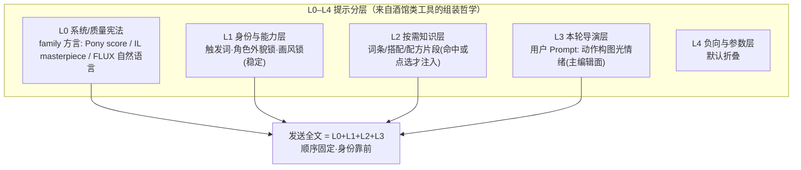
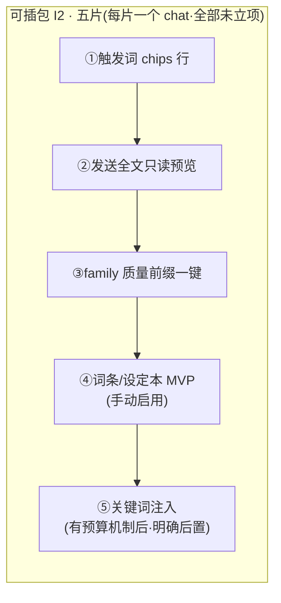

# LoRA 模块整理 — 事实 · 任务 · 疑问 · 方向（2026-07-31）

> 状态：**调研消化汇总，非实现授权**。执行入口 = [`../../research-landing-plan-2026-07-30.md`](../../research-landing-plan-2026-07-30.md) §6 可插包 **I2**（LoRA 提示分层，可拆 5 片各一个 chat）。
> 本模块调研原文：[`LoRA底模与工作流调研-2026-07.md`](./LoRA底模与工作流调研-2026-07.md) · [`LoRA提示词与角色工具对标调研-2026-07.md`](./LoRA提示词与角色工具对标调研-2026-07.md)。
> ⚠ 第二份文件名会误导：它调研的**对象**是酒馆/CAI 等角色卡产品，**产出**落在 LoRA Generate 提示分层（§4/§7）；同时其 §1–§2 的机制摘要是**角色卡模块**设计的必读材料——两头都用，别只按文件名路由。
> 稳定结论已回写：family 方言四族表 → `references/domains/lora.md` §7.1.1（2026-07-31 升格）。

---

## 0 · 一图流：提示分层与落地切片

---

## 1 · 事实调查（已核实）

### 1.1 社区底模事实（底模与工作流调研，已部分回写 lora.md §7.1.1）

| 族                       | 社区角色（2026）                                                                      | 本仓                                                                |
| ------------------------ | ------------------------------------------------------------------------------------- | ------------------------------------------------------------------- |
| **Pony（V6 系）**        | 角色 LoRA 库存与覆盖**仍最深**；依赖 `score_9, score_8_up…` 方言，缺 score 前缀质量塌 | runner Pony V6（**无 hosted 快通道**，UI 须写清「仅 Runner 忠实」） |
| **Illustrious / NoobAI** | 新默认质量 + 新角色/画风 LoRA 主产地；Danbooru + `masterpiece, best quality`          | hosted NoobAI-XL（`delta-lock/noobai-xl`）+ runner WAI-IL           |
| **FLUX.1/.2**            | 写实/通用 LoRA 生态成熟中；自然语言长句 + 保留触发词                                  | `flux-hosted` / FLUX_LORA                                           |
| **Anima DiT**            | 动画向新热；**≠ Anima Pencil XL**（不同架构，产品必须拆开）；勿套 Pony score 前缀     | runner + 来源图自动 checkpoint（产品重点线）                        |
| SD 1.5                   | 遗老                                                                                  | runner 已 `available:false`，不主推                                 |

- **硬不兼容**：LoRA 不能跨架构族混用；Pony LoRA 塞进 IL 能出图但易糊/伪影 → **产品应按 family 拦截或强警告**。
- **工作流骨架**：ComfyUI 固定图（Checkpoint → LoRA 栈 → CLIP → KSampler）；权重 0.6–1.0 常见；社区常挂 2–4 张；**本仓容量 = 全局 cap ∩ provider max**。
- **配方还原 = 本仓差异化**：源图 meta → 兼容过滤 → Runner 忠实 / hosted 近似 → 超容量/不兼容走预检。
- 对账小坑：SDXL hosted 条目 provider 现指向 Illustrious 模型 id（历史折中，选型注意）。

### 1.2 角色工具对标（提示词与角色工具对标调研）

- 共通问题 = **永久人设 vs 本轮描写 vs 世界知识 vs 临时输入**如何组装且有预算。SillyTavern 组装引擎最完整（角色卡字段 + World Info 关键词注入 + 预算 + 可导出）；CAI Definition 前部权重更高；星野/Siya = 分栏填写→合成，专家可看原始 prompt。
- **该抄**：分层设定、按需注入、注入预算、应用前可审可撤、导出可移植卡；**禁止静默改 prompt**。
- **不该抄**：Generate 做成聊天气泡主台；整本世界书塞进每次采样。
- **合成契约 8 条**（§4.2，建议级未拍板）：发送全文顺序固定身份靠前；挂载默认「建议插触发词」可关；推荐只进待确认可撤销；做同款不静默覆盖；助手只出变更卡；切 family 提示模板已切换；超 `maxPromptChars` 阻断或标红；写作/发送双视图。

---

## 2 · 开发任务

| 任务                                                               | 状态                     | 落点 / 约束                                                            |
| ------------------------------------------------------------------ | ------------------------ | ---------------------------------------------------------------------- |
| I2-① 触发词 chips 行                                               | ⬜ 未立项                | LoRA Generate 装配行/身份条；一点插入光标处或 L1 区                    |
| I2-② 发送全文只读预览                                              | ⬜ 未立项                | Prompt 主编辑面「发送视图」                                            |
| I2-③ family 质量前缀一键                                           | ⬜ 未立项                | 事实基础已升格 lora.md §7.1.1；Pony score / IL masterpiece / FLUX 说明 |
| I2-④ 词条/设定本 MVP                                               | ⬜ 未立项                | 新词条实体（名称/注入文本/触发/位置/启用）；**默认少自动多确认**       |
| I2-⑤ 关键词注入                                                    | ⏸ 明确后置               | 依赖 ④ + 预算机制                                                      |
| 跨族挂载拦截/强警告                                                | ⬜ 建议级                | `lora-model-compatibility`；IL↔Pony 默认拦截                           |
| family 文案与方言模板切换                                          | ⬜ 建议级                | 助手与空态提示按 family 换模板，禁一套方言打天下                       |
| Pony 体验补齐                                                      | ⬜ P1（产品路线建议 §2） | 快通道或文案诚实「仅 Runner」                                          |
| Generate 容量诚实 / Reference 预检 / compact 主路径 / Library 筛选 | ⬜ P1                    | 见产品路线建议 §2 UI 条                                                |
| 辅助创作（family 方言助手/触发词确认/做同款预检）                  | ⬜ P0–P1                 | **不**自动暗挂推荐 LoRA                                                |
| Train 关键切片                                                     | ⏸ P2                     | Generate/辅助稳后再做；训练 base ⊆ 可执行 family                       |

**约束**：实现时勿推翻已确认桌面结构，只在搭配条展开态 / 助手 / 词条上增量（§6）；`lora-generate.md` 的搭配条/变更卡/主面保持不动。

---

## 3 · 疑问点 / 未拍板

- §4.2 合成契约 8 条整体是「建议产品契约」，**未见 owner 拍板**；未回写 references（若要升格需另走回写流程）。
- 词条/设定本产品命名（「设定本」vs「词条」）未定；双视图是否进正式契约未定。
- Krea2 / Z-Image / Qwen-Image 作 LoRA 底：观察项，需**独立调研 allowlist + 兼容桶**后才可接，未授权前不接。
- 粗粒度兼容桶（`flux/sdxl/anima/anima-dit/other`）中 IL/Pony/Pencil 的路由归并规则「以代码为准」，文档未定死。

---

## 4 · 开发方向

- **学习优先级**：P0 = 分层 + 应用前确认 + 可撤销 + 触发词可点选插入；P1 = 词条按需注入 + 预算 + 双视图 + family 方言模板；P2 = 导出「角色/风格卡」（外貌锁+触发词+推荐底模）、分栏创建向导。
- **明确不做**：聊天 UI 取代 Generate 主台；用云 API 图模（Seedream/GPT Image）冒充 Civitai LoRA 底模；无 meta 时把任意 checkpoint 显示为「已完美还原」；为追热点把未验证 DiT/新底硬塞进 SDXL workflow。

---

## 5 · 跨模块交叉点

| 模块         | 关系                                                                                                                                                                          |
| ------------ | ----------------------------------------------------------------------------------------------------------------------------------------------------------------------------- |
| **角色卡**   | 对标调研的 §1 机制摘要 + §2 四层抽象是 Cards 设计必读；P2「导出角色/风格卡」是与角色卡三层聚合线的天然接口；卡上 `loras` = 推荐挂载不暗挂，且 **不进 Seedance**（仅出图链路） |
| **画布**     | 角色节点挂 LoRA 出设定图再进镜头/视频；「角色不崩」双保险 = 强参考 + 角色 LoRA                                                                                                |
| **Runner**   | Runner = 忠实配方通道；Pony/Anima DiT 只有 Runner 路径；动 Runner 前先读 comfy-runner HANDOFF                                                                                 |
| **模型接入** | 底模对账摘要在 `references/model-catalog.md` §④；hosted vs runner 的路由事实见模型接入模块                                                                                    |

## Last Updated

2026-07-31 · 由两份 LoRA 调研 + landing-plan I2 状态汇总成文；未改任何代码。
