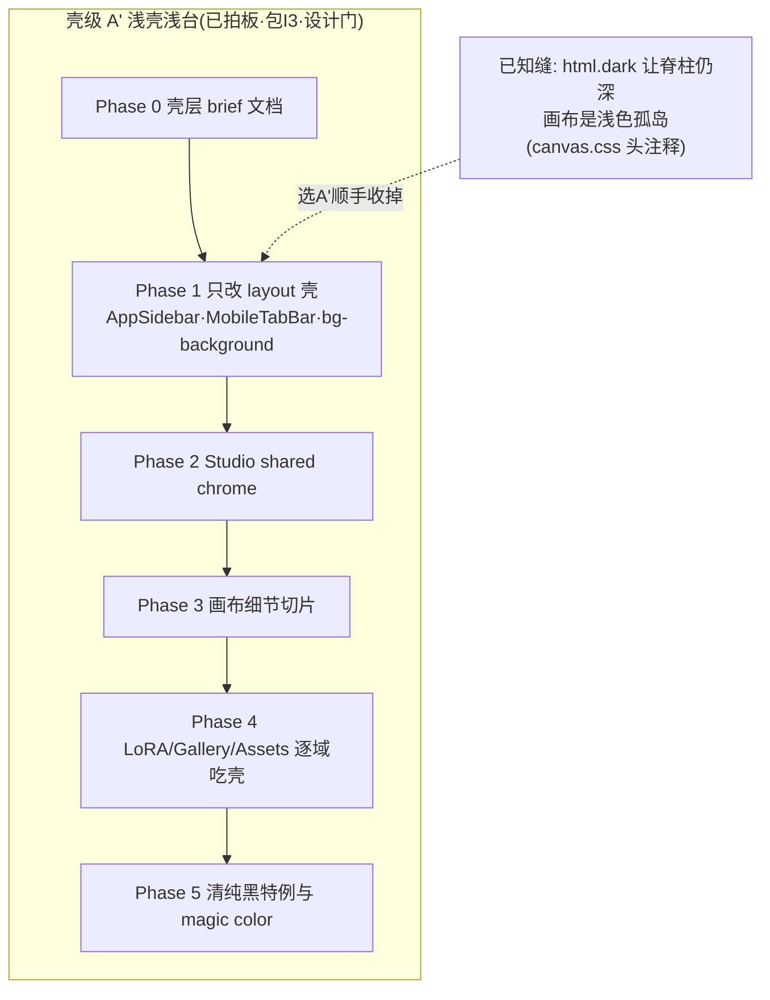
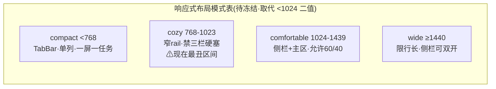
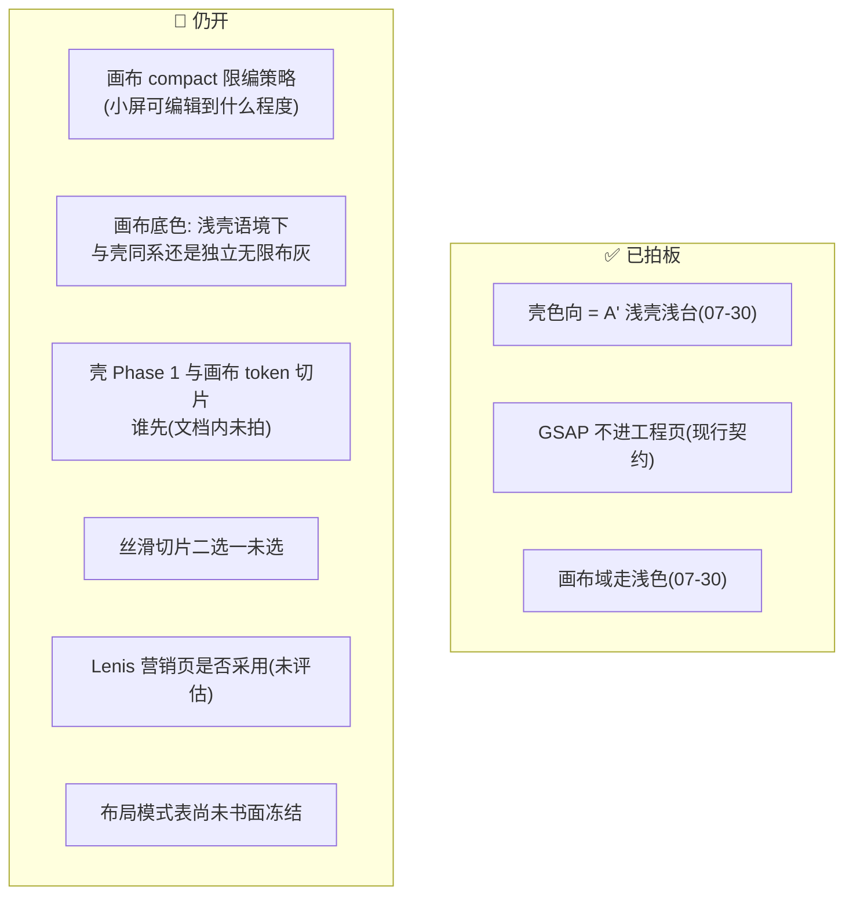

# UI与设计模块整理 — 事实 · 任务 · 疑问 · 方向（2026-07-31）

> 状态：**调研消化汇总，非实现授权**。四份调研中「UI丝滑」的规则部分已升格为 `references/interaction.md` **现行契约**（冲突时以升格版为准）；壳色向已拍板 **A' 浅壳浅台**（2026-07-30，landing-plan §0.1 #1）。
> 本模块调研原文：[`组件盘点与模型UI调研-2026-07.md`](./组件盘点与模型UI调研-2026-07.md) · [`响应式设计优秀实践调研-2026-07.md`](./响应式设计优秀实践调研-2026-07.md) · [`UI首页画布与全局策略-2026-07.md`](./UI首页画布与全局策略-2026-07.md) · [`UI丝滑交互与动效库选型-2026-07.md`](./UI丝滑交互与动效库选型-2026-07.md)。
> 执行入口：壳级改版 = landing-plan 可插包 **I3**（要过设计门）；响应式 compact 与丝滑切片 = 并行常设债。

---

## 0 · 一图流：四条线一张图

---

## 1 · 事实调查（已核实）

### 1.1 组件分层与模型 UI（组件盘点）

- **四层分层**：`ui/`（纯原语）→ `layout/` → `business/`（含 `studio-shared/` L1.5：≥2 个 Studio 工具共用）→ 域专属目录（默认不跨域）。权威说明在 `business/studio-shared/README.md`。
- **模型 UI 一级分类 = 模态**（IMAGE/VIDEO/AUDIO/MODEL_3D），已贯穿数据层（`ModelOption.outputType`）→ catalog 分文件 → hooks（`useImageModelOptions` 等）→ `BaseModelPickerPanel`/`MainModelPicker`。次级分组 = styleTag / qualityTier / provider。**原生 vs 聚合不是 UI 分类**。
- **规则**：新模型入口只走 `MainModelPicker` + 对应 hook，**禁止再写第四套 ModelSelector**（`ModelSelector` 与 `BaseModelPickerPanel` 双轨并存是已知遗留）。
- **4 个再通用候选**：媒体结果卡（多套并存）· 生成中/失败/空态 · 参考图/附件条 · 发送/请求预览（视频完整、图/音频弱）。**不适合抽**：LoRA 整树、画布 NodeShell 系、VideoComposer 品牌条、首页营销组件（营销皮肤禁止回灌 Studio）。
- **抽取判据**：≥2 真实消费者且行为一致；抽行为/a11y/状态机不抽域皮肤；无 `if (mode === 'lora')` 硬编码；不把 service 拉进 `ui/`。

### 1.2 响应式（响应式调研）

- **现状差距**：几乎只有 `<1024` 二值（`MOBILE_BREAKPOINT=1024`），**768–1023 平板最尴尬**；桌面优先债（手机靠隐藏与缩放）；JS 与 CSS 双源易漂移；缺容器查询。
- **已有的好底子**：键盘 inset（KeyboardInsetBridge）+ safe-area + `100svh` + responsive-dialog/drawer；触屏命中区清单 fine 32/36、coarse 44。
- **方法论**：三层断点职责——Viewport 管壳、Container 管部件、Input modality 管命中区/hover；验收视口 375/390/768/1024/1280/1440。

### 1.3 全局壳（UI首页画布与全局策略）

- Homepage 强在**方法**（排版是强调手段/内容优先/黑白灰细线/区块节奏）——可进壳层与品质底线，但**不可把营销留白贴进画布密度**。
- 统一边界（对齐 brand-dna）：统一 = 导航行为、semantic 表面/边框/正文、焦点/错误语义、字体栈、圆角间距 primitive；不统一 = 各域密度与皮肤。
- **壳色三方案 A/B/C 已被拍板关闭**：A'（浅壳浅台）——与 2026-07-27 已反转成浅色的画布（`--canvas-bg #f1f1f1`）同族，改动最小；不再考虑 B（会让 token 反转白做）。
- Codex 翻车模式（给执行代理的教训）：无表面 token 就乱发明灰；一次改整页；不懂创作台密度；壳与域两套黑打架。

### 1.4 交互与动效（已升格 `references/interaction.md`，以契约为准）

- **场景四档**：A 浏览（惯性鼓励）· B 工作台（列表可惯性、控件不惯性）· C 画布（视口跟引擎、禁 JS 抢 pan/zoom）· D 精密（惯性❌弹簧❌）。
- **硬原则**：跟手优先；只动 `transform`/`opacity`；时长曲线走 token（`--duration-fast/base/slow`）；`prefers-reduced-motion` 必须降级；动效只服务状态/连续性/反馈。
- **动画库硬边界**：工程页 **Motion/framer-motion 唯一**；GSAP 仅首页营销域且动态 import；复议红线四条同时满足才谈（2026-07-30 建议：不放开）。

---

## 2 · 开发任务

| 线     | 任务                                                      | 状态              | 说明                                                                                            |
| ------ | --------------------------------------------------------- | ----------------- | ----------------------------------------------------------------------------------------------- |
| 壳级   | 包 I3 · A' Phase 1（只改 layout 壳）                      | ⬜ 已拍板可随时开 | **要过设计门**；禁一天内 globals 换肤+全站搜 class 替换；改色前 `contrast-check`                |
| 响应式 | 冻结布局模式表 + 与 `lg`/1024 对齐说明                    | ⬜ P0             | 进 `references/frontend.md`（或 interaction.md 旁注）；landing-plan §4.3 称「无争议，冻结即可」 |
| 响应式 | Studio / LoRA compact 主路径专项                          | ⬜ P0             | 输入↔结果切换 + 固定出图，用户体感最大                                                          |
| 响应式 | 768–1023 cozy 专项 · 共享组件上 `@container`              | ⬜ P1             | —                                                                                               |
| 响应式 | `useLayoutMode()` 收敛 JS 断点 · 流体字号进 token         | ⬜ P2             | —                                                                                               |
| 丝滑   | 清点硬编码 `transition` → duration token 遵守情况         | ⬜                | interaction.md §5 落地五步之二                                                                  |
| 丝滑   | 切片示范（Assets 网格滚动 **或** 模型选择器展开，二选一） | ⬜ 未选           | —                                                                                               |
| 组件   | 抽「参考槽列表」+「媒体卡壳」                             | ⬜ 建议级         | 多域痛点先行，再动 LoRA/节点                                                                    |
| 组件   | `ModelSelector` 与 `BaseModelPickerPanel` 长期统一        | ⬜ 无时点         | 新代码别两边各写一半                                                                            |

---

## 3 · 疑问点 / 未拍板

---

## 4 · 开发方向

- **壳级**：先改应用壳（侧栏/顶栏/底栏/默认 surface）而非一次刷全站；壳只吸收 Homepage 的**方法**（主内容对比度高于 chrome / 发丝分隔优于重阴影 / 中性强调极少）；密度与布局留给域。
- **响应式反模式（明确不做）**：`scale(0.8)` 塞桌面布局进手机；只藏侧栏不减密度；手机依赖 hover 出「生成/保存」；画布小屏承诺桌面同等生产力；为响应式复制整份组件树。
- **丝滑方向**：浏览面「滑到停不下来」（原生惯性+虚拟化）；工作台「丝滑但精确」；画布 pan/zoom 交引擎只优化 chrome/dock。**不做**：工程页 GSAP/Lenis；精密控件加惯性；双动画运行时。
- **组件方向**：模态优先选择器架构延续；发送预览模式推广到图/音频。

---

## 5 · 跨模块交叉点

| 模块              | 关系                                                                                                                                    |
| ----------------- | --------------------------------------------------------------------------------------------------------------------------------------- |
| **画布**          | 画布 compact 限编待拍板阻塞响应式 375 切片；审阅网格（包 6）/剧本节点卡面（包 7）都要过本模块的设计门；画布浅色孤岛的缝由壳级 A' 顺手收 |
| **LoRA / Studio** | compact 主路径专项的主战场；B 档工作台 + D 档精密控件规则适用                                                                           |
| **模型接入**      | 模型 UI 只按模态分类，provider 只是标签；设置 UI 标注路由类型是模型模块的建议任务                                                       |
| **首页营销域**    | 方法来源锚（非皮肤来源）；GSAP 唯一合法落点＝首页营销域；营销皮肤与工程组件单向隔离                                                     |
| **文档治理**      | 壳级尚无单一 page SoT（audit 点名「未立法」）——I3 Phase 0 的 brief 就是补这个缺                                                         |

## Last Updated

2026-07-31 · 由四份 UI 调研 + interaction.md 升格状态 + A' 拍板汇总成文；未改任何代码。
