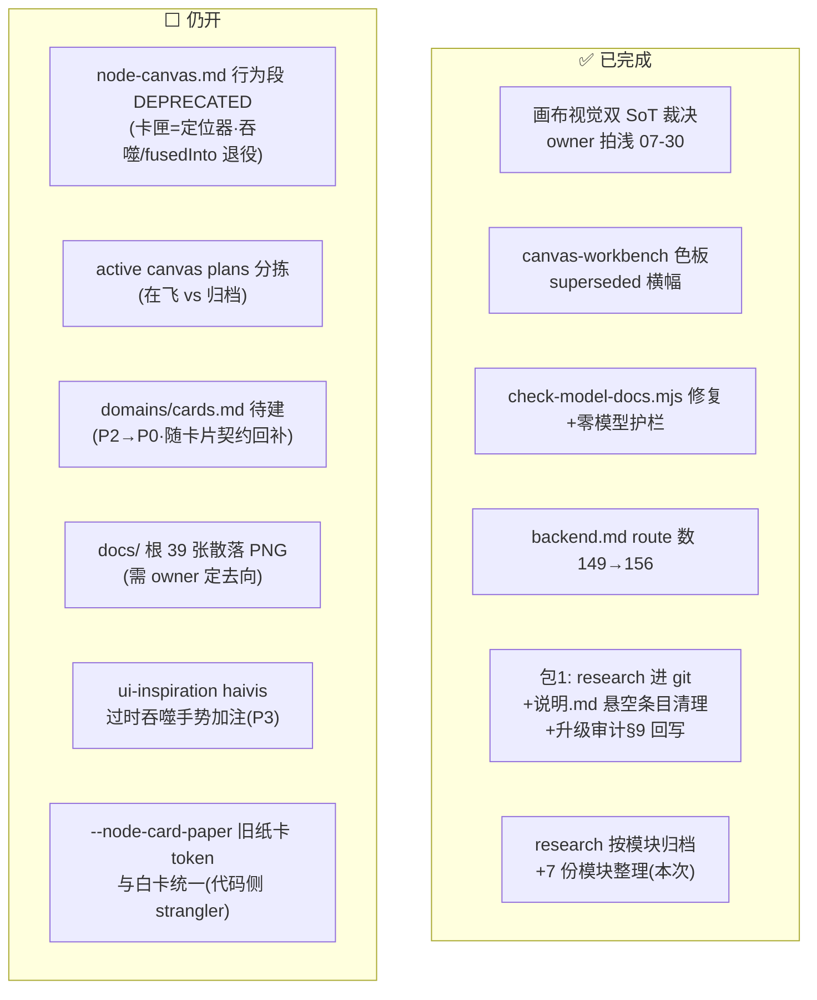

# 文档治理模块整理 — 事实 · 任务 · 疑问 · 方向（2026-07-31）

> 状态：**调研消化汇总，非实现授权**。上游 = [`文档厘清与过期冲突清单-2026-07.md`](./文档厘清与过期冲突清单-2026-07.md)（本轮 research 的自审计，2026-07-30）。
> ⚠ 该审计**自身已部分过期**：其 §5.2 P0 三项（画布双 SoT 裁决 / workbench 横幅 / check-model-docs 脚本）已完成；剩余项见下表。包 1（文档止血）已于 2026-07-31 交付（`19ee23a2`），research 目录已进 git。
> 2026-07-31 起 research 目录按模块分子目录（本次整理），索引见 [`../说明.md`](../说明.md)。

---

## 0 · 一图流：文档债清理状态

---

## 1 · 事实调查（已核实）

- **权力顺序**（§2.1）：brand-dna > forbidden UI > 已确认 page > active plan/research > archive。
- **「全局必须黑」不成立**（§2.2–2.3）：brand-dna 不规定深浅、forbidden 不禁白；「像必须黑」来自域/页历史施工图与已废止的 archive 旧品牌。首页 home.md 本就白；owner 已拍画布走浅色；Canonical 数值 SoT = `canvas-skin-spec-2026-07-26.md` + `src/app/canvas.css` 浅色段。
- **仍存三缝**（§2.5）：旧 `--node-card-paper` 奶油纸与白卡并存（strangler 节奏处理）；`--canvas-surface` 启动兜底仍 `#14120f`；app 全局 `html.dark` 让画布成浅色孤岛（壳级 A' 顺手收）。
- **docs↔代码错位 8 条**（§3）：最重 = `node-canvas.md` 行为段（卡匣实为全部节点定位器、吞噬/`fusedInto` 已退役但长文仍当主叙事）；其余 route 数（已修正）、models.ts 单文件表述（已修脚本）、`domains/cards.md` 缺位、token 双轨混杂、「助手无法建节点」需实机核（包 2 已实测更精确的版本：拿到的是类型标签）。
- **research 定位纪律**（§1.2 三禁）：不当 `references/pages/*` 施工图；不整包丢给设计代理；不与 `status.md` 抢焦点。全部 research 建议保留（决策证据），**不 bulk delete**。
- **SoT 速查**（§8）：进度=`status.md`；视觉法=`brand-dna.md`;首页=`references/pages/home.md`；画布业务=`domains/canvas.md`；调研证据=`plans/research/*`。

---

## 2 · 开发任务（清理队列，状态 2026-07-31）

| 优先级    | 任务                                                                                                         | 状态                                                                 |
| --------- | ------------------------------------------------------------------------------------------------------------ | -------------------------------------------------------------------- |
| P0        | 画布视觉双 SoT 裁决                                                                                          | ✅ owner 拍浅（07-30）                                               |
| P0        | `canvas-workbench.md` superseded 横幅                                                                        | ✅                                                                   |
| P0        | 修 `check-model-docs.mjs`（读 `models/` 目录 + 零模型抛错）                                                  | ✅ 本机 exit 0                                                       |
| P0        | 包 1 全部判据（research 进 git / 索引可点开 / §9 回写 / backend.md 156 / pipeline 校准注记）                 | ✅ `19ee23a2`                                                        |
| **P0**    | **`node-canvas.md` 行为段打 DEPRECATED + 顶部行为事实框**（卡匣=定位器、吞噬/`fusedInto` 退役，指向 status） | ⬜ 仍开                                                              |
| P1        | active canvas plans 分拣（在飞 vs 归档，`canvas-master` 作索引）                                             | ⬜ 仍开                                                              |
| P1        | research `说明.md` 索引补全                                                                                  | ✅ 包 1 已补 + 本次模块化重写                                        |
| P2→**P0** | 建 `references/domains/cards.md`                                                                             | ⬜ 随卡片契约回补（landing-plan 已把它从文档整洁问题升为脊柱硬缺口） |
| P2        | docs/ 根 39 张散落 PNG → archive 或 plans/assets                                                             | ⬜ 需 owner 定去向                                                   |
| P3        | `ui-inspiration` haivis 加「手势可能过时」注                                                                 | ⬜                                                                   |
| —         | 旧 `--node-card-paper` 与白卡统一                                                                            | ⬜ 代码侧，strangler 节奏                                            |

---

## 3 · 疑问点 / 未拍板

- **PNG 去向**：移 `archive/` 还是 `plans/assets`、是否保留——owner 定。
- **全局壳无单一 page**（「未立法」）：壳级 A' 动工时需新开壳级 page/brief（= 包 I3 Phase 0）。
- **`--node-*` → `--canvas-*` token 迁移**：需要一份迁移清单单一 SoT；色向已拍浅（前置已解除），迁移本身未做。
- 审计内部时序痕迹（§2.5 与 §5.2 对「横幅」状态描述不一致）——以已完成为准，无需处置。

---

## 4 · 开发方向（治理持续机制）

- **状态标注制**：每份文档标「现行 / 实现事实 / 历史 / 废止」四态。
- **完成即归档**：active plan 完成 → `archive/plans`；archive 保留但禁止链进默认施工必读。
- **research 证据级定位**：稳定结论**回写 `references/`**，research 只作证据；新调研按模块写进对应子目录（约定见 `../说明.md`）。
- **代码变更强制回写** page/status；「只改代码不改文档」在不做清单里。
- **禁**：用文首一句「已废」盖 200 行冲突正文（forbidden 禁止）；删 research 当清理。

---

## 5 · 跨模块交叉点

| 模块         | 它点名的文档问题                                                                                              |
| ------------ | ------------------------------------------------------------------------------------------------------------- |
| **画布**     | 最重灾区：node-canvas 行为段过期、canvas plans 堆叠、token 双轨——其中「行为事实框」是画布线每个新会话的止损项 |
| **角色卡**   | `domains/cards.md` 缺位是依赖脊柱硬缺口（服务/类型完整只有 research）                                         |
| **模型接入** | models.ts 单文件表述 + CI 周检空转（均已修）；月审机制并入 model-catalog                                      |
| **UI与设计** | 壳级无 page（包 I3 Phase 0 补）；brand-dna 不锁深浅的裁决是壳改版的法理依据                                   |
| **助手**     | 「助手无法建节点」的实机核已被包 2 取代为更精确结论（title=类型标签，见画布模块）                             |

## Last Updated

2026-07-31 · 由文档厘清审计 + 包 1 交付状态 + 本次模块化整理汇总成文；未改任何代码。
