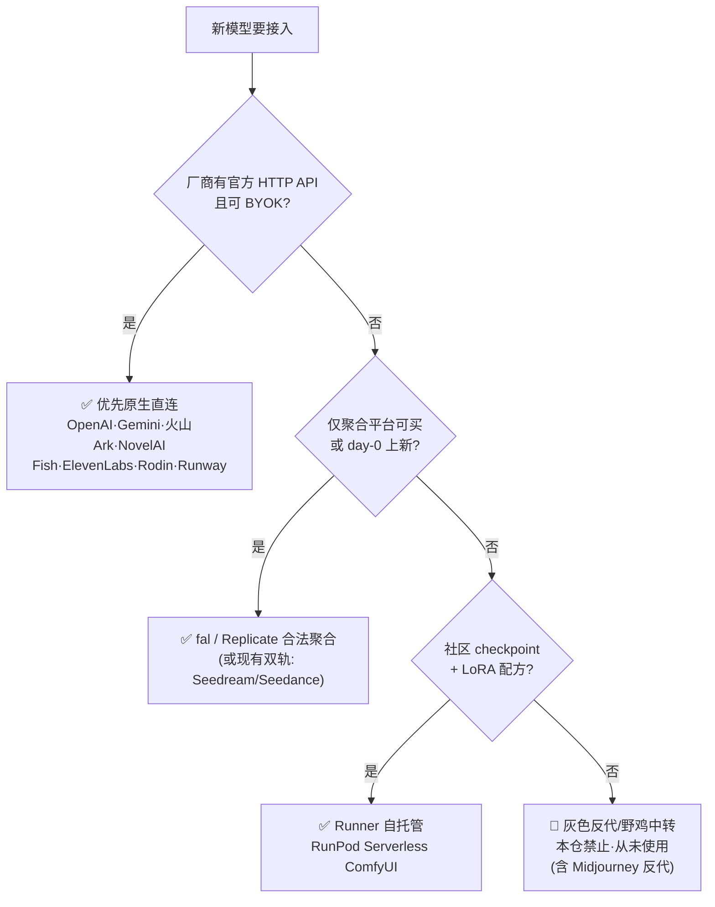
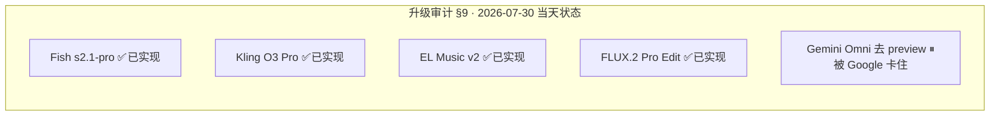

# 模型接入模块整理 — 事实 · 任务 · 疑问 · 方向（2026-07-31）

> 状态：**调研消化汇总，非实现授权**。本模块两份调研均属 landing-plan §1.1「A 类·事实澄清」——**结论已是答案，稳定部分已回写 references，不需要排期**。
> 本模块调研原文：[`模型接入原生与中转调研-2026-07.md`](./模型接入原生与中转调研-2026-07.md) · [`全站模型升级审计-2026-07-30.md`](./全站模型升级审计-2026-07-30.md)。
> ⚠ 读升级审计**别只读文首**：文首是「升级优先级」口吻，但 §9 记着当天已实现 4 项——已回写 `references/model-catalog.md` §⑧，别再当 backlog 重排期。
> 已回写：新模型默认路由策略 → `references/providers.md`（2026-07-31 升格为规则）；已实现清单 → `model-catalog.md` §⑧。

---

## 0 · 一图流：接入形态地图 + 新模型默认路由

---

## 1 · 事实调查（已核实）

### 1.1 接入形态（原生与中转调研）

- **「乱接野鸡中转」？——没有。** 全仓无第三方 key 转发站/非官方反代。本项目「中转」= fal.ai / Replicate 合法聚合 + RunPod 自托管 Runner。
- **四分类**：A 厂商原生（OpenAI / Gemini / VolcEngine Ark / NovelAI / Fish / ElevenLabs / Hyper3D / Runway / DeepSeek / DashScope / Anthropic）· B 合法聚合（fal `fal.run`/`queue.fal.run`、Replicate）· C 自托管（RunPod，走 `RUNPOD_KEY` + 月限额，无 BYOK 模型 key）· D 灰色反代（**未使用**）。
- **双轨模型**：Seedream 5.0 与 Seedance 2.0 同时有 fal 版 + 火山 Ark 直连版（国内线）。
- **速查**：GPT/Gemini 图 = 官方 API；Kling = 仅 fal；FLUX = fal（BFL 官方未接）；LoRA 底模 = Runner 或 Replicate/fal 托管权重。

### 1.2 阵容现状（升级审计 + model-catalog）

- **已实现（§9，2026-07-30 当天落地 4 项）**：Fish `s2.1-pro`（稳定 key 不变）· Kling O3 Pro（fal builder 与 V3 同形）· ElevenLabs Music v2（`generateMusic`，speech/sfx/music 三档矩阵补齐）· FLUX.2 Pro Edit（多参考分支 + object-replace/style-transfer ready）。
- **图旗舰已在当前代**：GPT Image 2（Arena 常第一）· Gemini 3 Pro Image（GA id）· Seedream 5.0 三档 · FLUX.2 Pro · Recraft 4.1——**别为升级而升级**。
- **已 retire 默认不复活**：Seedream 4.5 · Ideogram · NovelAI 4.5 · ElevenLabs 语音 v3（$100/1M 太贵）· Veo 3.1。
- **三条架构事实**（改任何模型 id 前必知，另见 memory/model-catalog）：目录 **DB-first**（`ModelConfig` 表命中即无条件覆盖代码常量，现为空表）；**退役 ≠ 删除**（`available:false`，enum 值绝不动）；**两条 id 链路**（`image-edit.service` 直发不解析；`edit-tasks`/`canvas-image-edit-capabilities` 是 externalModelId 语义）。

---

## 2 · 开发任务

| 任务                                                                   | 状态                    | 说明                                                                                                        |
| ---------------------------------------------------------------------- | ----------------------- | ----------------------------------------------------------------------------------------------------------- |
| 新模型默认路由策略回写 providers.md                                    | ✅ 已完成（2026-07-31） | 含四条边界：不再造第三条字节通道 / 不为全原生拆 fal 队列 / FLUX 走 fal 合理 / Kling 换原生=新 provider 工程 |
| 升级审计 §9 回写 model-catalog §⑧                                      | ✅ 已完成               | 防止下轮当 backlog 重做                                                                                     |
| **Gemini Omni 去 preview**                                             | ⏸ 被上游卡住            | enum 已预留 `gemini-omni-flash`，GA 时只改一行 `externalModelId`                                            |
| **火山 endpoint 月审**                                                 | ⬜ 下次 2026-08 初      | `…-260128` 日期后缀对控制台最新 ep；并入 model-catalog 月审（重点：Seedance 2.5 是否 GA）                   |
| 已实现四项 BYOK 实发 smoke                                             | ⬜ 验证债               | 上线前建议                                                                                                  |
| Kling V3 参数审计（multi-shot / 15s / native audio 是否用满）          | ⬜ 未确证               | §2.2 要求核对                                                                                               |
| Fish adapter body 字段核对（temperature / references / multi speaker） | ⬜                      | 与音频与3D模块 Fish 专线包重叠                                                                              |
| 设置 UI 标注路由类型（原生 · 聚合 · Runner）                           | ⬜ 建议级               | 减少「是不是黑中转」误解                                                                                    |
| Seedream/Seedance「fal vs 火山」产品化选择                             | ⬜ 建议级               | model id 已分裂，产品选择未做                                                                               |

**Owner 侧待办（非代码，来自包 2）**：①换一把有效 OpenAI key（GPT Image 2 现 401）②若要解画布 G3，绑一个 VolcEngine key。

---

## 3 · 疑问点 / 未拍板

- BFL 官方 API 是否值得开（`bfl` adapter spike）——**条件触发**：仅当有明确价差/合规需求；fal 仍最省事。
- 可灵官方直连——**条件触发**：仅当核心视频体验依赖可灵；前提问题未回答。
- Hunyuan3D 腾讯云官方 API「若开放」——是否开放本身未查实。
- ElevenLabs SFX 是否有更新 model 名——未见回答。
- MiniMax 语音等可选供应商——仅当 Fish 不够再评估。
- Gemini Omni GA 时间——完全取决于 Google。

---

## 4 · 开发方向

- **判据纪律**：加删模型看**公开榜单主流度**，不看内部用量（owner 纠正过）；删前必查独占能力（Recraft 矢量 / SFX 唯一音效 / Kling 唯一 extend / 火山唯一国内线）。
- **优先直连官方**（owner 长期偏好）：只在没直连或 fal 唯一/更优时才走 fal。
- **明确不做**：灰色中转（API2D / 逆向 Discord / 未授权 MJ·可灵反代）——**Midjourney 因此不接**；为「去中转」再造第三条字节通道；为「全原生」拆散 fal 统一队列与 credit 抽象；把媒体 provider 硬拐到 OpenRouter 类文本网关；再堆同质云图模。
- **后置**：BFL / 可灵直连（条件触发）；Recraft 官方 API / Hunyuan3D 腾讯云（单模型单独接维护成本高）；3D 增量模型（产品优先于模型，见音频与3D模块）。

---

## 5 · 跨模块交叉点

| 模块              | 关系                                                                                                                                                                    |
| ----------------- | ----------------------------------------------------------------------------------------------------------------------------------------------------------------------- |
| **画布**          | Seedance Reference 双轨是画布视频汇点主力；Kling O3 Pro 接入理由 =「与画布角色+参考最贴」；Gemini Omni Flash 走 Interactions API（内容数组、无时长参数）                |
| **LoRA / Runner** | Runner 的「更好」是扩 workflow/checkpoint，不是换 fal 假装社区底模；Replicate 托管 = 快试，Runner = 真配方                                                              |
| **音频与3D**      | Fish/ElevenLabs 均原生偏 BYOK；Music v2 对齐 audio-domain Phase C；3D 五模型 fal 系 + Rodin BYOK                                                                        |
| **UI与设计**      | 选择器**不**按原生/聚合一级分类（那是 adapter 层事实），UI 只显示 provider 标签/锁 key                                                                                  |
| **SoT**           | `src/constants/config.ts`（AI_PROVIDER_ENDPOINTS）· `src/constants/providers.ts` · `src/constants/models/*` · `references/providers.md` · `references/model-catalog.md` |

## Last Updated

2026-07-31 · 由两份模型调研 + model-catalog §⑧ 回写状态汇总成文；未改任何代码。
