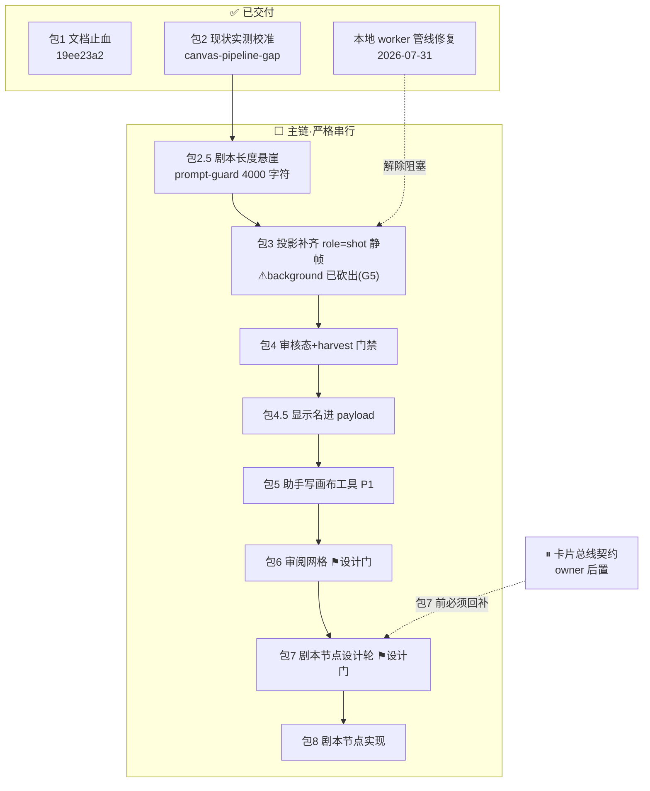
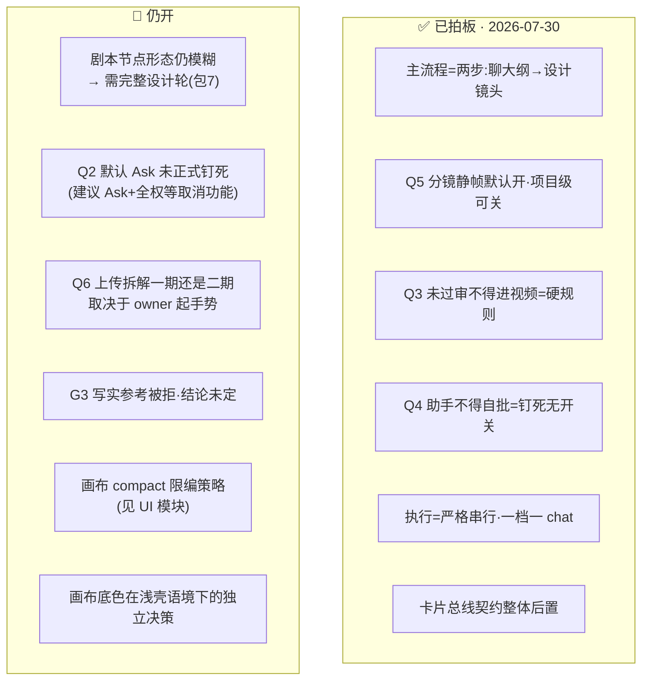

# 画布模块整理 — 事实 · 任务 · 疑问 · 方向（2026-07-31）

> 状态：**调研消化汇总，非实现授权**。执行顺序唯一 SoT = [`../../research-landing-plan-2026-07-30.md`](../../research-landing-plan-2026-07-30.md) §6（分包串行）；日常焦点仍认 `docs/status.md`。
> 本模块调研原文：[`画布媒体模型调研-2026-07.md`](./画布媒体模型调研-2026-07.md) · [`video-shotcraft与助手合并评估-2026-07.md`](./video-shotcraft与助手合并评估-2026-07.md) · [`画布与LoRA产品路线建议-2026-07.md`](./画布与LoRA产品路线建议-2026-07.md)（跨模块路线，主体在画布）。
> 实测缺口清单 = [`../../canvas-pipeline-gap-2026-07-31.md`](../../canvas-pipeline-gap-2026-07-31.md)（包 2 产出，排期只认它）。

---

## 0 · 一图流：主链管道与当前卡点

---

## 1 · 事实调查（已核实）

### 1.1 主流程比旧文档写的走得远（包 2 实测 + landing-plan §2.5）

- **两步主流程已有载体**：`ScriptDoc` 两阶段引擎（`types/script-doc.ts` 的 `stage: outline | shots`）+ `ScriptDocWorkspace.tsx`（1429 行，大纲/镜头切换、✨ 定向编辑、回退大纲）已挂在 `StudioNodeAssistantDock.tsx:579`。缺口不是「没有结构化路径」，而是**自由对话那条路不落 ScriptDoc**。
- **包 2 实测三断点**（详见 `canvas-pipeline-gap-2026-07-31.md`）：①剧本首稿之后改不动——`prompt-guard` 4000 字符**静默悬崖**，越界常只差 18 字符，表现成「有时行有时不行」；②镜头阶段没有出图落点——投影只造 `role=character`（`node-workflow-script-doc.ts:228`），07-26 结论逐字成立；③助手拿到的 `title` 是**本地化类型标签**（如「图片」），不是用户命名——`title.trim() || node.type` 兜底永不触发。
- **本地 dev 跑不出生成已修**（2026-07-31）：根因 `.env.local` 的 `NEXT_PUBLIC_APP_URL` 停在 `https://localhost:3000`，worker 用 https 回连明文 dev server → workerd 报不透明 `internal error`。已改回 `http://` 并在 `buildInternalUrl()` 加「https + loopback 拒绝派发」守卫；图、视频实测 `COMPLETED`。**包 3 阻塞解除**。

### 1.2 画布媒体模型（画布媒体模型调研）

- **Midjourney 不可接入**（§1.1）：无公开 API、企业 API 未 GA、ToS 禁自动化；第三方 MJ API 全是违 ToS 的野路子。用户「要 Mid」的真实诉求 = 好看默认 + 系列感，用合规模型 + 默认模型锁定 + 参考图/LoRA 逼近。
- **默认选型推荐**（§0/§1.3）：叙事/概念 → Seedream 5.0 Pro；写实 → FLUX.2 Pro；二次元/角色锁 → Illustrious 或 Runner+LoRA；强听指令 → GPT Image 2 / Gemini Pro Image。**全画布默认一个主模型**（跨镜一致 > 单镜炫技）；关键帧与镜头同模型；草图 Lite 定稿升 Pro。
- **「参考视频+图→同款」最近解 = Seedance 2.0 Reference**（§2.2）：图 ≤9、视频参考 ≤3 段、`@Image1`/`@Video1` 语法；本质是**多参考生成不是像素级 V2V**，话术勿承诺 100% 同款。端到端代码路径已核（§3）：harvest → `resolveEffectiveVideoModel` 切 `*_REFERENCE` → worker `buildSeedanceReference` 三数组，有单测。
- **8 条灰区**（§4.2）：**#1 图 cap 按节点当前 modelId 算**——已修（cap 按 effectivePreviewModel）；**#2 `hasReferenceInputs` 不含纯视频源**——**仍开**（= 可插包 I1，落点 `hooks/node/use-video-composer.ts:177`）；其余 6 条为排障事实（预览拼接方式、worker prepend、仅 1 图时走 `referenceImage` 等）。
- **Comfy runner 现状**：仅图（SDXL 配方/LoRA/img2img），无视频 workflow；扩 V2V = 新能力线（能做、未立项）。

### 1.3 剧本节点 + HITL（video-shotcraft §12–14，本轮最重产品设计）

- **Remotion 不并**：两条成片物理世界不同（截图+代码动画·确定性 vs 生成模型·随机+参考约束）；且服务端渲 Remotion 有商业许可问题。只做**知识蒸馏**（20–40 条运动/机位词表，Apache-2.0 保留 NOTICE）。
- **五层概念**：L0 对话（不能当真相）→ **L1 ScriptDoc（真相源）** → **L2 剧本节点壳（目录+状态机+放行开关）** → L3 执行图（审核态挂这里）→ L4 成片（只消费已过审）。
- **G0–G8 八门**：G2 分镜深稿 = ★制作放行锁版本；G3–G7 每资产审核；打回只重开该资产及直接下游。
- **审核状态机**：`completed` 后进 `awaiting_review`（新增默认态）→ `approved`（可被 harvest）| `rejected`（回炉）。**硬规则：harvest 只吃 approved**。打回载荷：`rejectReason` · `promptPatch` · `reviewedAt` · 保留上一版媒体 URL。
- **业界共性 5 条**（§12.2.6）：计划与生成分离默认有人类闸（Runway「Ask before generating」）；身份是跨镜一等公民（LTX Elements）；先锁便宜的分镜/关键帧再烧贵的视频；网格审阅是必需品；Agent 提议 ≠ 结果保证。

---

## 2 · 开发任务（状态对齐 landing-plan §6，2026-07-31）

| 包    | 任务                                                                           | 状态                                        | 关键落点                                                                                                                                                                                                                                                                                                 |
| ----- | ------------------------------------------------------------------------------ | ------------------------------------------- | -------------------------------------------------------------------------------------------------------------------------------------------------------------------------------------------------------------------------------------------------------------------------------------------------------- |
| 包1   | 文档止血 + 校准回写                                                            | ✅ `19ee23a2`                               | `docs/**`                                                                                                                                                                                                                                                                                                |
| 包2   | 现状实测校准                                                                   | ✅ 产出 `canvas-pipeline-gap-2026-07-31.md` | 真机六条实测                                                                                                                                                                                                                                                                                             |
| —     | 本地 worker 管线修复                                                           | ✅ 2026-07-31                               | `buildInternalUrl()` 守卫                                                                                                                                                                                                                                                                                |
| 包2.5 | **剧本长度悬崖**（P0-1）                                                       | ⬜ 插在包 3 之前                            | `node-script-doc.service.ts` · `prompt-guard`；⚠ 别只抬阈值，要截断/摘要策略；错误要可读（现被吞成 `INTERNAL_ERROR`；错误框 `text-red-100` 在浅画布上读不出，改前跑 `contrast-check`                                                                                                                     |
| 包3   | 投影补齐 `role=shot` 静帧（**⚠ 2026-07-31 缩范围：`role=background` 已砍出**） | ⬜ 阻塞已解除                               | `projectScriptDocToGraph`；红线=投影幂等（`scriptRef` 已有机制）；「关静帧」项目级开关同包定；先读 `ImageNode.tsx` 顶部注释（一个 type 五种呈现）。砍 background 的原因：`role===background` 会渲染成**身份卡**，而身份卡存废未定（G5）——别在存废未定的形态上批量下注；验收需多镜 ScriptDoc → 先做包 2.5 |
| 包4   | 审核态 + harvest 门禁                                                          | ⬜ 等包 3 有图可审                          | 节点态 + `awaiting_review/approved/rejected`；`harvestUpstreamImageReferences` 只吃 approved；重做=只换 seed 不新建节点；⚠ 与 G4（失败态可见性）开工前对边界                                                                                                                                             |
| 包4.5 | **显示名进 assistant payload**（P0-2）                                         | ⬜ 包 5 硬前置                              | `node-assistant-request.ts`；修显示名来源，别再加兜底；`summary` 别弄丢                                                                                                                                                                                                                                  |
| 包5   | 助手写画布工具 P1                                                              | ⬜                                          | 必须走 `node-connection-rules`；复用「应用前先询问」骨架；`set_review_state` 禁写 `approved`                                                                                                                                                                                                             |
| 包6   | 审阅网格                                                                       | ⬜ **要过设计门**                           | 12 节点批量过审/打回；375px 可用                                                                                                                                                                                                                                                                         |
| 包7   | 剧本节点设计轮                                                                 | ⬜ **要过设计门**                           | 前置=包 6 + 九类节点详情定型 + 卡片契约回补；只读 shotcraft §13                                                                                                                                                                                                                                          |
| 包8   | 剧本节点实现                                                                   | ⬜ 承包 7                                   | 含 `propose_generation_batch` 费用门；⚠ 全权连跑不得在取消功能前上线（`VideoComposer.tsx:229` 取消是 P2）                                                                                                                                                                                                |
| I1    | 视频灰区 #2                                                                    | ⬜ 可插·很小                                | `use-video-composer.ts:177` 纳入纯视频源                                                                                                                                                                                                                                                                 |

**链外登记（包 2 产出，owner 已定归属，别弄丢）**：

| 编号 | 问题                                                                                                                                                                               | 归属                                                                                        |
| ---- | ---------------------------------------------------------------------------------------------------------------------------------------------------------------------------------- | ------------------------------------------------------------------------------------------- |
| G1   | 参考图接不到素材库（节点参考槽只有本地上传/画布选择）                                                                                                                              | 画布线整体处理                                                                              |
| G2   | 视频模型选择器计数 8 实列 1                                                                                                                                                        | 🔵 在飞（owner 已单开 chat 修）                                                             |
| G3   | 写实参考图被 fal→Seedance 拒 `content_policy_violation`                                                                                                                            | **结论未定勿引用**（只有一个数据点；阻塞于 G2 或火山 key）                                  |
| G4   | 进度/取消/失败态都看不见                                                                                                                                                           | 画布线；⚠ 与包 4 有重叠先对边界                                                             |
| G5   | **身份卡存废 / 三处身份概念**（2026-07-31 新增）——`image` 一个 type 五种呈现，`character`+`background` 都渲染成身份卡；身份卡与 CastDock 职责重叠；`/cards` 角色卡是第三处身份概念 | ⏸ 归卡片总线契约（产品定义题非 bug）；已影响包 3 砍范围；也是「卡片契约不能无限后置」的证据 |

**建议级未立项**（画布媒体模型调研 §4.3/§4.4）：视频节点 6 态 UI（普通 T2V/仅图/仅视频阻塞/图+视频/超 cap overflow/切非 Seedance 说明）；工程收敛 4 条（cap 用有效 Reference modelId、写回 `*_REFERENCE`、发送预览加最终 prompt 只读块）。

---

## 3 · 疑问点 / 未拍板

- **剧本节点核心矛盾**（包 7 要解的）：它是第十类节点卡，承载的却是「目录+状态机+放行开关」这种与其它九类性质不同的东西——到底是节点、面板还是视图，就是「模糊」所在。
- **成功判据**（shotcraft §14.4，供包 7/8 对照）：①画布上有剧本节点可见阶段与待审计数 ②生成物默认待审、未过审不进 harvest ③打回后只重跑该支 ④全流程可不靠助手完成（双轨）⑤不引入 Remotion 亦可闭环。

---

## 4 · 开发方向

- **主线次序**（唯一）：校准 ✅ → 长度悬崖 → 静帧投影 → 审核态 → 助手有手 → 审阅网格 → 剧本节点设计轮 → 实现。
- **五条产品原则**（产品路线建议 §1.2）：①助手只写事实层（ScriptDoc），不直接乱戳节点 ②每步可人工改，覆盖是一等公民 ③全图默认同一主模型族 ④先图后视（关键帧质量决定 I2V）⑤成本闸（批量前预检节点数×单价）。
- **产品形态**：先做 **15–60s 短片闭环**，不做第一期无人值守长片；向导模式 + 图模式 + 运行面板三视图（§1.3）。
- **W1–W4 里程碑**（产品说法，= 助手管道 P1/P2/P3 的另一面，不是第二套计划）：半自动投影 → 依赖队列 → 视频收口 → 工作流模板。
- **明确不做 / 后置**：Remotion 进主路径（只蒸馏词表）；Midjourney；完全自动长剧；每镜换旗舰模型；P3 批量队列（先补取消）；工作流模板/批处理（W4 后置）；上传拆解分析轨（建议二期）；剧本卡内嵌时间线编辑器；12 路进度塞一张卡。

---

## 5 · 跨模块交叉点

| 模块         | 关系                                                                                                                                                    |
| ------------ | ------------------------------------------------------------------------------------------------------------------------------------------------------- |
| **角色卡**   | 卡片契约 owner 后置，但**包 7 之前必须回补**——否则剧本节点铺出的角色槽全要手填。审核门判定对象暂缩小为「节点自带媒体」（卡编译器两个纯函数已移出 W3）。 |
| **模型接入** | Seedance 双轨（fal+火山）；Kling O3 Pro 与画布「角色+参考」最贴；Gemini Omni Flash 是视频三形态之一（内容数组、无时长参数）。                           |
| **LoRA**     | 二次元/角色锁走 Runner+LoRA；「角色不崩」= 角色节点强参考 + 重要角色 LoRA；把 LoRA 焊进画布角色节点服务短片一致性。                                     |
| **UI与设计** | 包 6/包 7 要过 `ui-page` 设计门；九类节点详情设计（status.md 当前焦点）是包 7 前置；画布 compact 限编策略待拍板。                                       |
| **音频与3D** | voice 节点进 Seedance `audio_urls`；台词→TTS 是助手侧音频主线；3D 暂不进 ScriptDoc 主链。                                                               |

## Last Updated

2026-07-31 · 由三份画布调研 + landing-plan §6 状态 + canvas-pipeline-gap 汇总成文；未改任何代码。
