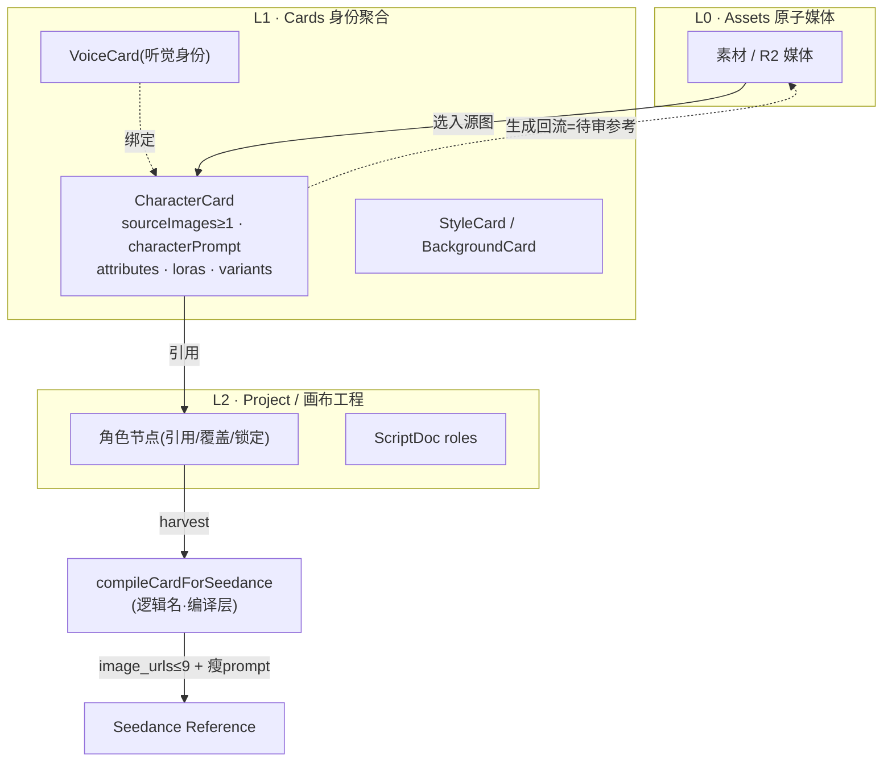
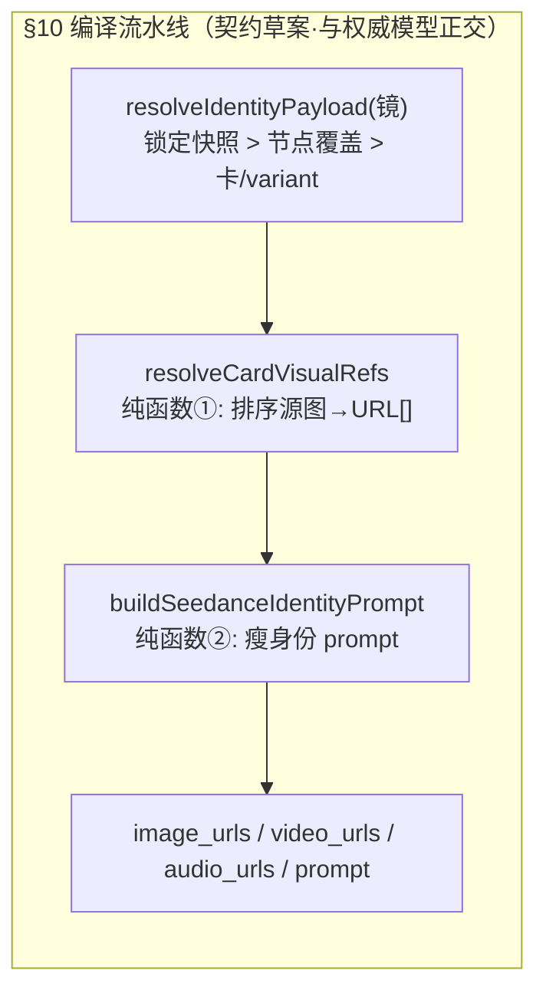

# 角色卡模块整理 — 事实 · 任务 · 疑问 · 方向（2026-07-31）

> 状态：**调研消化汇总，非实现授权**。⚠ **Owner 已于 2026-07-30 把「卡片总线契约」整体后置**（landing-plan §0.1 #2）——本模块当前不在主链上，但 **画布包 7（剧本节点设计轮）之前必须回来补**，否则「一句话铺满画布」会退化成「铺出 6 个要手动填的空槽」。
> ⚠ **后置的代价已经出现**（2026-07-31 · landing-plan G5）：owner 发现画布身份卡与 CastDock 职责重叠、`/cards` 角色卡是第三处身份概念——「身份卡存废」已归入本契约要一起回答的问题，并导致画布包 3 砍掉 `role=background` 投影。**卡片契约不能无限后置。**
> 本模块调研原文：[`角色卡片联动设计问题清单-2026-07.md`](./角色卡片联动设计问题清单-2026-07.md)（全 15 份里与画布剧本节点并列最重的产品设计之一）。
> 拍板后产出 = 新建 `references/domains/cards.md`（**现在不存在**，是依赖脊柱上的硬缺口）。
> 配套必读 = [`../LoRA/LoRA提示词与角色工具对标调研-2026-07.md`](../LoRA/LoRA提示词与角色工具对标调研-2026-07.md)（酒馆机制摘要，用于 Cards 不用于 LoRA tag 语法）。

---

## 0 · 一图流：卡 = 跨域身份总线

---

## 1 · 事实调查（已核实）

- **骨架已较完整，卡死点是联动契约**：`CharacterCardRecord` 已有 `sourceImages`/`sourceImageEntries`（多视角）、`characterPrompt`/`modelPrompts`、`attributes`、`loras`、`variants`/`parentId`、稳定性评分、cardify（生成结果转卡）。Studio context 可挂 characters/styles，生成可带 `characterCardIds`。
- **创建即有图不是偶然**：`CreateCharacterCardSchema` 强制 `sourceImages` **≥1 张**——与视频/多镜一致性主战场一致（Seedance 只认 `image_urls`，不认卡对象）。
- **联动缺口地图**（§1.3）：画布（引用还是实例化未定、回写规则不清）、Studio（「用卡生成」非一等入口、用完不回写）、LoRA（`loras` 字段与挂载栈未成统一故事）、Assets（文件夹 vs 卡 vs Project 三套聚合未融合）、Gallery（卡是否公开未定）。结论：**缺的是一张「身份从哪里来、到哪里去、谁能改」的总图**。
- **Seedance 硬事实**（§10.1）：API 没有 `characterCardId` 字段；真实输入只有 `prompt` + 三个 URL 数组。所以卡必须经**编译层**——「不需要 Seedance 官方支持卡；只需要我们当好 compiler」。
- **源图排序规则**（§10.4，总图 cap≤9）：锁定快照指定图 → 本镜节点覆盖图 → variant 精选/`referenceImages` → front/three_quarter → side/detail → 其余；多角色一镜每人 1–2 张 + `@Image1=Alice` 分别绑定。
- **字段映射纪律**（§10.3）：`characterPrompt` 薄注入或不注入（长段外貌词与图打架脸会漂）；`modelPrompts` 不进视频；**`loras` 不进 Seedance**；卡 id/JSON 不进模型。

---

## 2 · 开发任务

**当前状态：整体 ⏸ 后置（owner 2026-07-30）**。恢复时按下表：

| 序  | 任务                                                                                           | 说明                                                                                             |
| --- | ---------------------------------------------------------------------------------------------- | ------------------------------------------------------------------------------------------------ |
| 1   | Owner 拍 §9.4 三格决策表                                                                       | 见 §3；拍板后立刻产出 `references/domains/cards.md`（域职责 + 三态权威 + §10 编译契约 + 非目标） |
| 2   | 纯函数① `resolveCardVisualRefs(card\|variant\|override\|lock) → URL[]`                         | 已从画布 W3 移出，随卡片契约一起回来                                                             |
| 3   | 纯函数② `buildSeedanceIdentityPrompt({refs, actionPrompt})`                                    | 瘦身份 prompt；「瘦 prompt 胖参考」                                                              |
| 4   | 画布：角色绑定卡 → 收割合并进现有 harvest                                                      | 卡编译结果作为 harvest 图源之一                                                                  |
| 5   | 预览：「查看发送内容」展示编译后 URL 列表 + 最终 prompt                                        | 复用画布发送预览                                                                                 |
| 6   | 门禁：无图卡不得静默提交 Seedance，引导「先定妆出图」                                          | 复用 `requiresReferenceImage`                                                                    |
| —   | Assets 五条边（§3.4）：素材→卡 / 卡→相关素材 / 素材作定妆源 / 生成回流待审 / 文件夹↔卡逻辑关联 | 按价值排序，不强制 1:1 合并                                                                      |
| —   | 实现切片顺序（§6）：**画布引用 → Studio 注入 → 回流**；忌先重做卡库皮肤                        | Cards 大改版应在联动契约之后                                                                     |

---

## 3 · 疑问点 / 未拍板

### §9.4 三格决策表（owner 只需改格子；§10 编译逻辑与此正交）

| #   | 问题                        | 推荐默认                                                                                                                          | 一句话理由                                       |
| --- | --------------------------- | --------------------------------------------------------------------------------------------------------------------------------- | ------------------------------------------------ |
| 1   | 同一角色多镜，谁是权威？    | **C 混合**：默认引用卡 → 节点可覆盖本镜 → 「锁定」冻结快照（默认手动锁，解锁二次确认；UI 话术「跟随角色卡 / 本镜覆盖 / 已锁定」） | 纯卡赢冲掉用户调好的单镜；纯节点赢让卡库形同虚设 |
| 2   | 允许纯文案卡（无源图）？    | 角色卡创建 **≥1 图**（维持现状）；纯文案只做草稿层（`status=DRAFT` 禁进参考收割）                                                 | Seedance 只认图 URL，没图锁不住脸                |
| 3   | `variants` 是换装还是分叉？ | 默认「**造型/画风模式**」（同一角色）；真分叉走「另存为独立角色」（可记 derivedFrom）                                             | 业界换装 = 新 reference sheet；真分叉是少数需求  |

### 其他待 owner 的问题（§5.2–5.5 摘要）

- 入口与导航：`/cards` 大库为主还是「从画布/Studio 选角色」为主？侧栏「卡片」与画布「卡匣」是一套数据两种视图还是两套？
- 写回：生成结果默认不写回 / 询问 / 自动进「待审参考」？谁有权改 `characterPrompt`？
- 卡上 LoRA：仅展示 / 一键挂载确认 / 强制绑定？Voice 是 1 卡 1 主声还是多情绪声集？
- 范围砍刀：第一期联动建议最多 3 条（画布引用、Studio 参考注入、cardify 回流）；公开角色库/聊天试戏/完整世界书第一期不做。
- 画布侧：投影 ScriptDoc 时角色行**必须**绑已有卡，还是可内联新建？

---

## 4 · 开发方向

- **总原则**：先定联动契约与生命周期，再开 Cards 域 UI 三方向；期间少做大改版。三层模型 L0 Assets → L1 Cards → L2 工程；卡上源图本质是 Assets 引用，不是平行宇宙。
- **对酒馆/CAI**：学「身份字段化、稳定层 vs 本轮层、可带走」；不学「聊天主 UI、超长 Definition、世界书第一期做全」。
- **Prompt 纪律**：「瘦 prompt，胖参考」——反模式 = 整段 CharacterCard JSON 塞进 prompt（landing-plan §7 反模式表也点了名）。
- **能力边界话术**：可承诺 = 编译成参考图+绑定句、锁定后稳定、variant 提高换装成功率；不可承诺 = Seedance「认识」卡、100% 脸不漂、只改 `characterPrompt` 完成换装视频。
- **明确不做**：`/cards` 做成社交/聊天产品；复制整份 Generate/画布到卡页；Assets 文件夹与卡强制 1:1 物理合并；每张素材必须绑卡；Generation 表与 Card 表硬合并；卡里塞完整分镜与生成按钮全家桶。
- **后置**：Gallery「同人设」暴露卡 id（隐私默认关）；3D 定妆多视角回写卡（与音频3D模块 GLB 下游线汇合，远期）。

---

## 5 · 跨模块交叉点

| 模块              | 关系                                                                                                                               |
| ----------------- | ---------------------------------------------------------------------------------------------------------------------------------- |
| **画布**          | 最强依赖：审核门「什么算这一镜的身份图」需要 Q1 答案；卡片后置期间门禁只对「节点自带媒体」生效；**包 7 前必须回补契约**            |
| **LoRA**          | 卡的 `loras` = 推荐挂载（确认后进栈，不暗挂）；LoRA Library 可「用此 LoRA 创建/更新角色卡」；旅程 C =「卡提供视觉，LoRA 提供能力」 |
| **音频**          | VoiceCard = 听觉身份 / 音色 donor；Voice 绑定可选进 `audio_urls`                                                                   |
| **3D**            | 远期：定妆图 → GLB → 转台截帧回灌卡参考（见音频与3D模块 §8 线）                                                                    |
| **Assets/Studio** | `AssetSelectorDialog` 多选进 `sourceImages`；Studio 选卡注入参考+身份段；生成后 cardify 回流                                       |

## Last Updated

2026-07-31 · 由角色卡联动清单 + landing-plan 后置决策汇总成文；未改任何代码。
