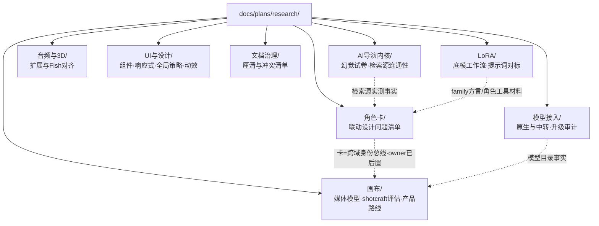

# 调研文档目录说明

本目录存放 **调查 / 可行性 / 市场与社区对账 / 路径审计** 类产出，**不是**已授权实现的 task packet。

**2026-07-31 起按项目模块分子目录**；每个模块目录里有一份《**模块整理**》——该模块全部调研的「事实调查 / 开发任务 / 疑问点 / 开发方向」汇总（带图）。**新会话进模块先读整理，再按需下钻原文。**

## 模块地图



## 约定

| 规则                     | 说明                                                                                                       |
| ------------------------ | ---------------------------------------------------------------------------------------------------------- |
| **新调研写进模块子目录** | 路径见下方「命名」；不确定归属先放最贴近的模块并在该模块整理文档登记                                       |
| **文件名必须中文**       | 主题用中文；日期用 `YYYY-MM` 或 `YYYY-MM-DD` 后缀；**禁止**英文 slug 文件名（本 `说明.md` 为目录索引例外） |
| **状态**                 | 文首标明：调研结论 / 非实现授权；可执行施工另开 `docs/plans/` 任务包                                       |
| **回写**                 | 稳定结论应回写 `docs/references/`（域/页/model-catalog 等），本目录保留证据与过程                          |
| **整理文档同步**         | 新增/大改调研后，把该模块《模块整理》对应节更新——整理是模块入口，别让它腐烂                                |
| **不放这里**             | 已拍板施工包、UI 关键切片实现 handoff、纯状态 `status.md`                                                  |

## 命名

**2026-07-31 起按模块分子目录**（原为扁平）：

```text
docs/plans/research/
  说明.md                 ← 本文件（保持在根）
  画布/        <中文主题>-YYYY-MM.md + 画布模块整理-YYYY-MM.md
  LoRA/
  角色卡/
  模型接入/
  UI与设计/
  音频与3D/
  文档治理/
  AI导演内核/
```

示例：`画布/画布媒体模型调研-2026-07.md`、`LoRA/LoRA底模与工作流调研-2026-07.md`。

⚠ **移动文件时必须同步修链接**——本目录被 `references/` 多处深链引用（providers / model-catalog / domains/lora / product 等），2026-07-31 那次重组就一次性打断了 22 条链接。改完用下面这条自查：

```bash
grep -ro '](\.\{1,2\}/[^)]*\.md)' docs/plans/research/ | sed 's/:.*](/ /;s/)$//' | while read f l; do [ -f "$(dirname "$f")/$l" ] || echo "BROKEN $f -> $l"; done
```

## 各模块文档

### 画布/

| 文件                                                                                        | 主题                                                                                   |
| ------------------------------------------------------------------------------------------- | -------------------------------------------------------------------------------------- |
| [画布模块整理-2026-07.md](./画布/画布模块整理-2026-07.md)                                   | **模块入口**：主链管道事实 + 包 2.5–8 任务状态 + 七问拍板状态                          |
| [画布媒体模型调研-2026-07.md](./画布/画布媒体模型调研-2026-07.md)                           | 画布图/视频模型、Midjourney、Seedance Reference 路径、8 灰区                           |
| [video-shotcraft与助手合并评估-2026-07.md](./画布/video-shotcraft与助手合并评估-2026-07.md) | Remotion 不并只蒸馏；**§12–14 = 剧本节点 + HITL 设计草案（全 15 份里最重的产品设计）** |
| [画布与LoRA产品路线建议-2026-07.md](./画布/画布与LoRA产品路线建议-2026-07.md)               | 跨模块路线：画布 W1–W4 里程碑、LoRA 后续、音频/3D 下一步                               |

### LoRA/

| 文件                                                                                      | 主题                                                                |
| ----------------------------------------------------------------------------------------- | ------------------------------------------------------------------- |
| [LoRA模块整理-2026-07.md](./LoRA/LoRA模块整理-2026-07.md)                                 | **模块入口**：底模事实 + L0–L4 提示分层 + I2 五切片                 |
| [LoRA底模与工作流调研-2026-07.md](./LoRA/LoRA底模与工作流调研-2026-07.md)                 | Civitai 社区底模事实与 family 方言（已升格 lora.md §7.1.1）         |
| [LoRA提示词与角色工具对标调研-2026-07.md](./LoRA/LoRA提示词与角色工具对标调研-2026-07.md) | 酒馆/CAI 组装机制 → LoRA 提示分层设计；⚠ 同时是角色卡设计的必读材料 |

### 角色卡/

| 文件                                                                                | 主题                                                                                 |
| ----------------------------------------------------------------------------------- | ------------------------------------------------------------------------------------ |
| [角色卡模块整理-2026-07.md](./角色卡/角色卡模块整理-2026-07.md)                     | **模块入口**：三层模型 + §9.4 三问 + 编译器契约；⏸ owner 已后置、画布包 7 前必须回补 |
| [角色卡片联动设计问题清单-2026-07.md](./角色卡/角色卡片联动设计问题清单-2026-07.md) | 卡 = 跨域身份总线而非孤岛；§10 卡→Seedance 编译契约                                  |

### 模型接入/

| 文件                                                                              | 主题                                                                                                                         |
| --------------------------------------------------------------------------------- | ---------------------------------------------------------------------------------------------------------------------------- |
| [模型接入模块整理-2026-07.md](./模型接入/模型接入模块整理-2026-07.md)             | **模块入口**：路由决策树 + 已实现清单 + 月审待办                                                                             |
| [模型接入原生与中转调研-2026-07.md](./模型接入/模型接入原生与中转调研-2026-07.md) | 谁原生/谁聚合/谁 Runner；默认路由策略（已升格 providers.md）                                                                 |
| [全站模型升级审计-2026-07-30.md](./模型接入/全站模型升级审计-2026-07-30.md)       | ⚠ 文首是「升级优先级」口吻，但 **§9 记着当天已实现 4 项**；已回写 `references/model-catalog.md` §⑧ —— **读文首不要重新排期** |

### 音频与3D/

| 文件                                                                              | 主题                                                          |
| --------------------------------------------------------------------------------- | ------------------------------------------------------------- |
| [音频与3D模块整理-2026-07.md](./音频与3D/音频与3D模块整理-2026-07.md)             | **模块入口**：GLB 下游链 + 音频扩展优先序                     |
| [3D与音频扩展及Fish对齐-2026-07.md](./音频与3D/3D与音频扩展及Fish对齐-2026-07.md) | 单图→GLB 已具备；音频可扩展项；Fish 官方能力对齐表（≈70–80%） |

### UI与设计/

| 文件                                                                              | 主题                                                                                          |
| --------------------------------------------------------------------------------- | --------------------------------------------------------------------------------------------- |
| [UI与设计模块整理-2026-07.md](./UI与设计/UI与设计模块整理-2026-07.md)             | **模块入口**：壳级 A' 五阶段 + 布局模式表 + 组件抽取 + 动效契约                               |
| [组件盘点与模型UI调研-2026-07.md](./UI与设计/组件盘点与模型UI调研-2026-07.md)     | 组件分层、4 个再通用候选、模型 UI 一级分类=模态                                               |
| [响应式设计优秀实践调研-2026-07.md](./UI与设计/响应式设计优秀实践调研-2026-07.md) | compact/cozy/comfortable/wide 布局模式表、本仓差距                                            |
| [UI首页画布与全局策略-2026-07.md](./UI与设计/UI首页画布与全局策略-2026-07.md)     | Homepage+画布为锚、全局壳改版策略（壳色已拍 A' 浅壳浅台）                                     |
| [UI丝滑交互与动效库选型-2026-07.md](./UI与设计/UI丝滑交互与动效库选型-2026-07.md) | 丝滑拆解、落地分层；GSAP 不进工程页；**契约已升格 `references/interaction.md`**（以该文为准） |

### 文档治理/

| 文件                                                                              | 主题                                                                                 |
| --------------------------------------------------------------------------------- | ------------------------------------------------------------------------------------ |
| [文档治理模块整理-2026-07.md](./文档治理/文档治理模块整理-2026-07.md)             | **模块入口**：清理队列状态（含包 1 交付后勘定）                                      |
| [文档厘清与过期冲突清单-2026-07.md](./文档治理/文档厘清与过期冲突清单-2026-07.md) | research 全量状态、docs↔代码错位、黑白规则冲突；⚠ 自身已部分过期，状态以模块整理为准 |

### AI导演内核/

| 文件                                                                            | 主题                                                                                                                                          |
| ------------------------------------------------------------------------------- | --------------------------------------------------------------------------------------------------------------------------------------------- |
| [幻觉试卷与连通性实测-2026-08.md](./AI导演内核/幻觉试卷与连通性实测-2026-08.md) | 切片 0 产出：**检索源连通性 25 项实测** + **幻觉试卷 14 题 × 2 臂基线**；含对任务包 §3.3/§3.4/§4.3 的 7 条修改建议。可重跑，脚本在 `scripts/` |

⚠ 本模块暂无《模块整理》——只有一份调研时整理文档纯属噪音，等第二份进来再建。对应在飞任务包 `docs/plans/ai-director-kernel-2026-08-13.md`。

---

共 **15 份**调研 + **7 份**模块整理 + 本索引。

### 已消化 / 已升格（读之前先知道）

| 调研                        | 稳定结论去了哪                                                  |
| --------------------------- | --------------------------------------------------------------- |
| `UI丝滑交互与动效库选型`    | → `references/interaction.md`（现行契约）                       |
| `全站模型升级审计` §9       | → `references/model-catalog.md` §⑧（已实现清单）                |
| `模型接入原生与中转` §5.5   | → `references/providers.md`「新模型接入的默认路由策略」         |
| `LoRA底模与工作流` 方言部分 | → `references/domains/lora.md` §7.1.1                           |
| `3D与音频扩展及Fish对齐` §1 | → `references/product.md` 3D 节（「搁置」→「可用 · 非北极星」） |

**梳理与施工顺序总入口** = [`../research-landing-plan-2026-07-30.md`](../research-landing-plan-2026-07-30.md)（15 份分类对账 + 依赖脊柱 + 分包串行执行）。模块整理**不改变**分包执行顺序，只提供「按模块进入」的第二条阅读路径。

### 索引勘误（2026-07-31）

原索引列过 `火山豆包音频模型接入调查-2026-07.md`——**该文件从未存在**（磁盘无、git 无历史），已删除该行。其内容实际散在：

- 豆包 Seed-Audio 1.0 / Seed-TTS 2.0 判断 → `模型接入/全站模型升级审计` §1.3（结论：**缓**，owner 实测效果差）
- 音频矩阵缺口 → `音频与3D/3D与音频扩展及Fish对齐` §2

如果确实需要一份火山音频专线调查，按本目录命名规范新写进 `模型接入/` 或 `音频与3D/`；**不要**因为索引里曾有这一行就假设它存在过。

---

历史调研若仍在 `docs/plans/*-research-*.md`（如 comfy-runner deployment），以该文件为准；**新文不再平铺在 plans 根目录，且须中文文件名**。

## Last Updated

2026-07-31 · **目录按模块重组**：7 个模块子目录 + 每模块一份《模块整理》（事实/任务/疑问/方向 + mermaid 图）；全仓交叉引用已同步更新；勘误与升格映射保留。
