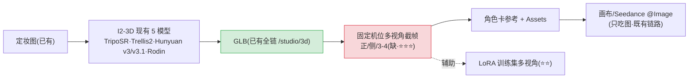
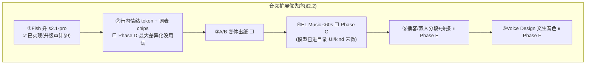

# 音频与3D模块整理 — 事实 · 任务 · 疑问 · 方向（2026-07-31）

> 状态：**调研消化汇总，非实现授权**。属 landing-plan §1.1「A 类·事实澄清」+ §5「并行常设债」（3D 去搁置 · 音频情绪两条线，不占主链）。
> 本模块调研原文：[`3D与音频扩展及Fish对齐-2026-07.md`](./3D与音频扩展及Fish对齐-2026-07.md)。
> 已回写：`references/product.md` 3D 节——「搁置」→「**可用 · 非北极星**」。音频施工基准 = [`../../audio-domain-design-2026-07.md`](../../audio-domain-design-2026-07.md)（Phase A–F）。

---

## 0 · 一图流：3D 的价值在 GLB 下游，音频的下一刀是 s2.1 + 情绪

---

## 1 · 事实调查（已核实）

### 1.1 3D：单图→GLB **早已具备**，缺的是可见性

- **全链已有**（§1.1）：`MODEL_3D_OPTIONS` 5 available；`/api/generate-3d` + status/continue/retry-mesh/cancel；`generate-3d.service.ts`（队列、mesh 阶段、R2 入库、质量检查）；`/studio/3d` → `Studio3DWorkspace`；输出 GLB 对接 ModelViewer；首页已有 3D 产品位。
- **已接模型**（§1.2）：TripoSR（快/预览/freeTier）· Trellis 2 · Hunyuan3D v3 / v3.1 Pro · Rodin Gen-2.5（**Hyper3D BYOK，$120/mo**）；另有 multiview 路径。
- **定位矛盾已解**：product.md 原写「搁置」但代码/路由全在——已回写为「可用 · 非北极星」。
- **目录判断**（§9.4）：主流名字大多已沾边，不落后一代；最大品牌缺口 = Meshy、完整 Tripo 商业 API；**「缺的是 GLB 下游，不是第 6 个同质 I2-3D」**。
- **体验事实**：3D 生成 2–12 min，UX 必须阶段态（已有 mesh/continue）。

### 1.2 音频：Fish 对齐 ≈ 70–80%，可生产

- **已有 ✅**：TTS s2-pro（2026-07-30 起 s2.1-pro 已实现）· 音色库 + 持久克隆 + 即时参考克隆 · 多 speaker `reference_id` 数组（adapter 字段齐，UI 暴露待验收）· ASR · 表现力→temperature 映射 · prosody · 时间戳流式 · VoiceCard · 画布 voice→video（进 Seedance 槽）· 音效 `ELEVENLABS_SFX_V2`（**刻意分流 ElevenLabs，不算 Fish 对齐缺口**）。
- **缺口 ❌**：音乐 Music 进了目录但 UI/kind 矩阵未做（Phase C）；播客/长音频拼接（Phase E）；**行内情绪 token 编辑器弱**（Fish 支持自由 `[tag]` 透传但 UI 没用满，Phase D）；Voice Design（Phase F）。
- **明确不做**：实时 voice agent WebSocket；DAW 式剪辑；Fish 变声当主路径。

---

## 2 · 开发任务

| 任务                                                     | 状态                           | 落点                                |
| -------------------------------------------------------- | ------------------------------ | ----------------------------------- |
| Fish 升 s2.1-pro                                         | ✅ 已实现（升级审计 §9）       | catalog `externalModelId: s2.1-pro` |
| **3D 去搁置：导航/首页入口可见**                         | ⬜ P0 产品（能力已有只差入口） | 导航 + 文档                         |
| Gallery/Assets 图「变 3D」深链 + 结果回 Assets           | ⬜ P1                          | Gallery / Assets                    |
| 角色卡多视角 → 多图 I2-3D → GLB 回写卡/资产              | ⬜ P1（角色线）                | 角色卡模块交界                      |
| **行内情绪 token + 词表 chips**                          | ⬜ 音频下一刀（Phase D）       | prompt 编辑器                       |
| A/B 变体出纸                                             | ⬜                             | 生成编排                            |
| EL Music ≤60s 完整 kind（UI + audioKind=music）          | ⬜ Phase C（模型已接）         | adapter + credit + UI               |
| 播客/双人分段 TTS + 拼接                                 | ⏸ Phase E                      | ffmpeg/拼接 spike                   |
| Voice Design 文生音色 → 候选试听 → 落 VoiceCard          | ⏸ Phase F                      | 新 endpoint 封装                    |
| Fish 专线包：对照 OpenAPI 扫 update-model / 新 body 字段 | ⬜ 若开干                      | `fish-audio.adapter`                |
| s2-pro / s2.1-pro 双档保留策略                           | ⬜ 未定                        | 见 §3                               |

---

## 3 · 疑问点 / 未拍板

- Fish **Update model** 是否已封装——「未深挖，可能缺，需对照 API」。
- 多 speaker `reference_id` 数组 **UI 是否充分暴露**——待产品验收。
- s2.1-pro 上线后 **s2-pro 保留还是弃用**——默认推荐切换策略未定。
- Seed3D / SAM3D / Hitem3D——需单独可行性。
- 调研会过期：改模型/参数前按 WORKFLOW 再拉一次官方文档。

---

## 4 · 开发方向

- **3D 核心论断**：GLB 下游 > 新模型。推荐组合（§8.3）：定妆图 → I2-3D（现有）→ GLB → 正/侧/3-4 截帧 → 角色卡参考 + Assets → 画布/Seedance 只吃图（既有）。只做「下载 GLB」永远是孤岛；做**立体定妆 + Turnaround 转台截帧**立刻接上「图→卡→视频」总线，不必等导演台。
- **主线排序**（§4）：北极星仍是画布+LoRA——3D 只「维护现网 + 入口去搁置」，**别先做导演台 3D 机位大工程**（P2 远期，排画布助手管道之后）；音频优先「s2.1 ✅ + 情绪 UI + 画布/角色绑声」，音乐/播客次之；3D 暂不进 ScriptDoc 主链。
- **明确后置**：Meshy / 完整 Tripo 商业 API；世界模型/Splat（World Labs Marble）**单独立项**——那是另一类资产（可漫游场景），别和 GLB 角色混谈；video-to-sound、MiniMax/ACE-Step。
- **明确不做**：把 Codex skill 当运行时（SaaS 不能依赖本机 agent 渲 GLB）；实时通话 agent；DAW 剪辑；完整 Blender 式 3D 节点。
- **话术校正**：不是「接入 Codex 出 3D」，而是「Image→GLB 已是一等公民；接下来做入口与角色/素材联动」。

---

## 5 · 跨模块交叉点

| 模块         | 关系                                                                                                                          |
| ------------ | ----------------------------------------------------------------------------------------------------------------------------- |
| **角色卡**   | 已规划链路 `Character → Voice → Script → Shot/Video`；VoiceCard 一键落卡 = 音色 donor；GLB 转台截帧回灌卡参考（远期汇合点）   |
| **画布**     | 脚本分段 speaker = VoiceCardId；Seedance `audio_urls` 吃生成结果（不是新 Fish 协议）；台词→TTS 是助手侧音频主线               |
| **LoRA**     | Turnaround 多视角截帧可辅助 LoRA 训练集（⭐⭐）                                                                               |
| **模型接入** | SoT = `models/model-3d.ts` · `models/audio.ts` · `fish-audio.adapter.ts`；新模型走 add-model；Rodin BYOK $120/mo 是普惠性风险 |
| **UI与设计** | 全局 `html.dark` 与浅画布的 Studio 壳观感问题（壳级 A' 改版连带，见 UI 模块）                                                 |

## Last Updated

2026-07-31 · 由 3D与音频扩展及Fish对齐调研 + 升级审计 §9 状态汇总成文；未改任何代码。
