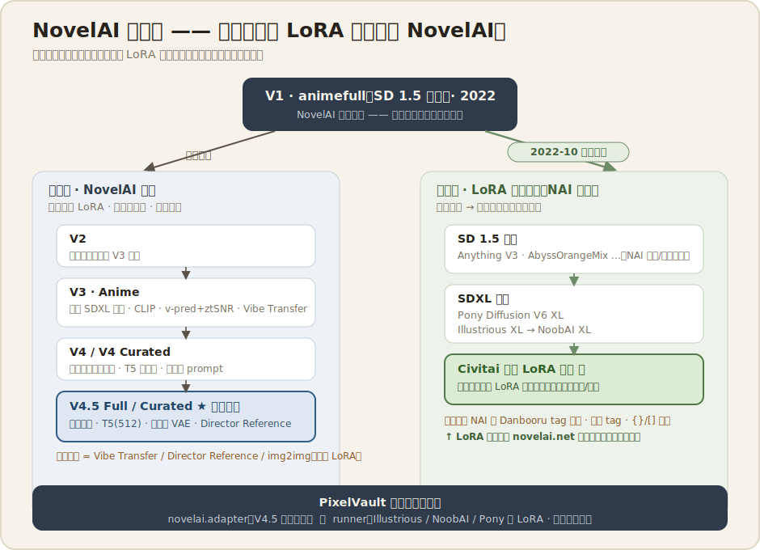
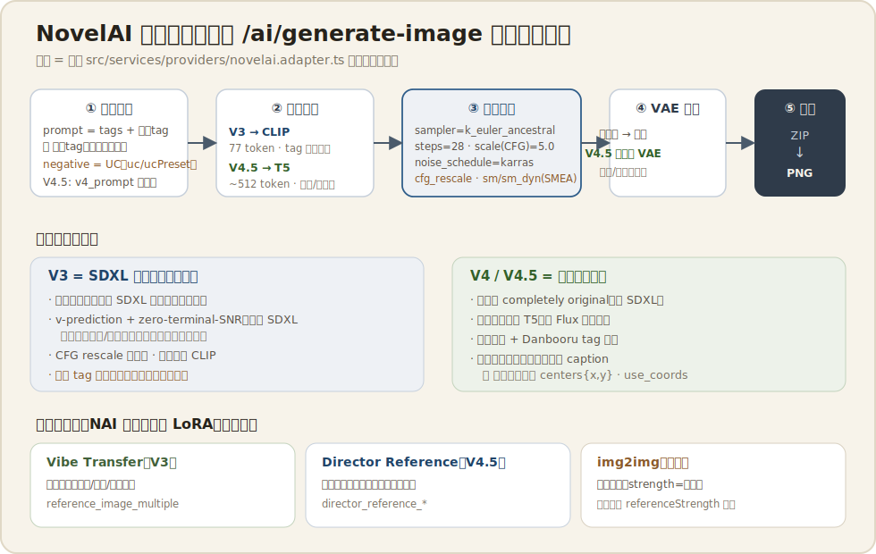
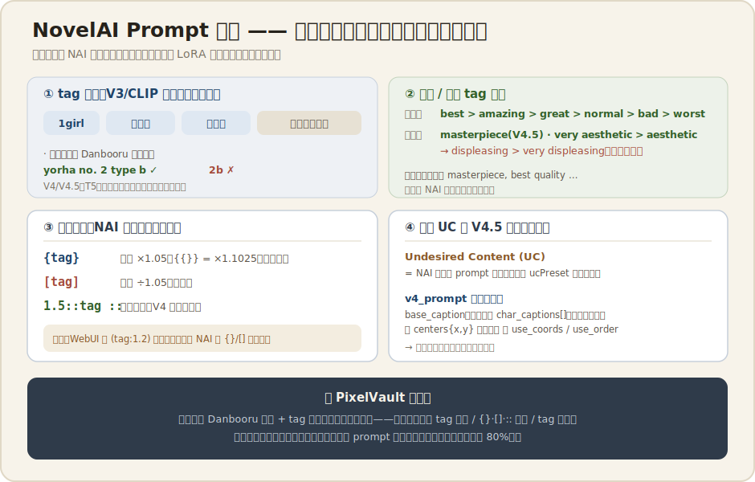

# NovelAI 图片生成机制调研

> 调研日期：2026-07-18 ｜ 类型：reference（外部知识）
> 触发：owner 观察「身边用 LoRA 生成图片的人，用的都是 NovelAI」，要求搞清 NovelAI 到底怎么生成图，以及它和 LoRA 的关系。
> 对照物：项目已接入 `src/services/providers/novelai.adapter.ts`（NAI Diffusion V4.5 Full/Curated）+ runner 开源底模线 + Danbooru 词库。

---

## 0. 一句话结论（先读这个）

**NovelAI 本体是一套「闭源、付费、动漫专精」的底模服务，它自己并不吃用户训练的 LoRA。**
真正让「LoRA」和「NovelAI」被划等号的，是下面这条历史链：

1. **2022-10 NovelAI 模型泄露** → 泄露的 `animefull` 成了几乎所有开源动漫底模的祖先；
2. **NAI 定义了动漫 diffusion 的「语法」**——Danbooru tag 体系、质量/美学 tag 阶梯、`{}`/`[]` 权重括号——这套语法今天所有动漫模型和 LoRA 都还在用；
3. **开源线**（SD1.5 时代的 Anything/AOM → SDXL 时代的 Pony / Illustrious / NoobAI）才是 LoRA 真正训练和挂载的地方，Civitai 上的动漫 LoRA 基本都基于这几个 NAI 血统底模。

所以「用 LoRA 的都在用 NovelAI」更准确的说法是：**大家用的是「NAI 定义的 tag 语法」+「NAI 血统的开源底模」+「LoRA」这一整套；NovelAI 官方服务本身是这套美学的「标杆闭源版」，但在官网里你没法挂自己的 LoRA。**

> ⚠️ 一个高频误解要先拆掉：NovelAI 确实有个叫 **"AI Modules / Custom AI"** 的自训功能，但那是给**文本故事生成**（storyteller）用的，**不是图像 LoRA**。NovelAI 的**图像**侧从来没有「上传/训练自定义 LoRA」这回事。

---

## 1. 产品定位

| 维度     | NovelAI（本体）                                                                                                     |
| -------- | ------------------------------------------------------------------------------------------------------------------- |
| 形态     | 闭源、付费订阅（Opus/Scroll/Tablet 等档），只能走官网或 API                                                         |
| 专精     | 动漫 / 二次元插画（另有 Furry 线），非通用写实                                                                      |
| 底模     | 官方自训，逐代升级 V1→V4.5，**不开放权重**（V1/V2 老权重后来才放出）                                                |
| 定制手段 | **不支持用户 LoRA**；给的是 Vibe Transfer（风格迁移）、Director/Character Reference（角色一致性）、img2img、Inpaint |
| 输出     | 生成结果打包成 **ZIP**（内含单张 PNG）返回——项目 adapter 里 `extractFirstFileFromZip` 就是在解这个                  |

一句话：NovelAI 卖的是「开箱即用、稳定高质量的动漫底模 + 一套围绕它的工作流工具」，用**闭源的底模质量**换掉了开源线里「自己配底模 + 挑 LoRA + 调参」的门槛。

---

## 2. 模型阵容与架构演进



| 代次                                | 底层架构                            | 文本编码器           | 关键点                                                                                                                                          |
| ----------------------------------- | ----------------------------------- | -------------------- | ----------------------------------------------------------------------------------------------------------------------------------------------- |
| **V1**（2022, `animefull`）         | SD 1.5 微调                         | CLIP (SD1.5)         | 就是**被泄露**的那一版，Danbooru tag + 质量 tag 体系的起点                                                                                      |
| **V2**                              | 自训（已退役）                      | CLIP                 | 过渡代，评价一般，很快被 V3 取代                                                                                                                |
| **V3**（NAI Diffusion Anime V3）    | **基于 SDXL** + 大量私有改造        | CLIP（SDXL 双 CLIP） | 有[技术报告论文](https://arxiv.org/abs/2409.15997)；引入 **v-prediction + zero-terminal-SNR + CFG rescale**；Vibe Transfer；832×1216 原生分辨率 |
| **V4 / V4 Curated**                 | **「完全原创」自研架构**（非 SDXL） | **T5**（~512 token） | 结构化**多角色 prompt**、自然语言理解、英文文字渲染                                                                                             |
| **V4.5 Full / Curated**（当前主力） | 原创架构（V4 优化版）               | **T5**（~512 token） | **自定义 VAE**、风格混合增强、多角色一等公民、`masterpiece` 美学 tag、Director Reference                                                        |

**两个架构分水岭要记住：**

- **V3 = SDXL 的「魔改超频版」**。NovelAI 没有从零造模型，而是把 SDXL 拿来做了几处关键手术（见 §3），核心是修好了 SDXL「画不出纯黑/纯白、亮度总是往中间灰塌」的老毛病。文本侧还是 CLIP，所以**「tag 顺序敏感」**（越靠前权重越大）。
- **V4 / V4.5 = 换血**。官方说是「completely original」自研架构，文本编码器换成 **T5**（和 Flux 同源思路）。T5 是纯语言模型出身，擅长长句和组合语义，所以 V4.5 能同时吃**自然语言描述**和 **Danbooru tag**，还能做**结构化多角色**（每个角色单独一段 caption + 可选画面坐标）。

---

## 3. 生成管线拆解（一次请求里发生了什么）



以项目 `novelai.adapter.ts` 实际发出的参数为锚，一次 `POST /ai/generate-image` 的链路：

**① 输入拼装**

- `prompt`（正向）：`tags + 质量tag + 画师tag` 拼成；V4.5 还可混自然语言
- `negative_prompt` / `uc`（负向 = **Undesired Content**）：adapter 默认 `lowres, bad anatomy, bad hands, ...`，并挂 `ucPreset`（V4 用 preset 4）
- V4/V4.5 额外打包成**结构化对象** `v4_prompt`：`caption.base_caption`（场景）+ `char_captions[]`（每个角色一段，带 `centers:{x,y}` 坐标）+ `use_coords` / `use_order`

**② 文本编码**

- V3：CLIP → 受 77/token 窗口与 tag 顺序影响
- V4.5：T5（~512 token）→ 长 prompt、多角色、自然语言更稳

**③ 扩散采样**（adapter 里能看到的旋钮）

- `sampler: k_euler_ancestral`（NAI 常用 Euler a；另有 DPM++ 系）
- `steps: 28`、`scale: 5.0`（= CFG guidance）
- `noise_schedule: karras`
- `cfg_rescale: 0`（配合 ztSNR 抗过曝的重标定；V3 论文的关键项）
- `sm / sm_dyn`（= **SMEA / SMEA DYN** 开关，NAI 特有的高分辨率抗崩采样，缓解超原生分辨率时「多手多身」问题；adapter 默认关）
- `dynamic_thresholding`、`skip_cfg_above_sigma` 等高级项

**④ VAE 解码**

- 潜空间 → 像素；V4.5 用**自定义 VAE**（官方宣传点之一，细节纹理/线条更干净）

**⑤ 打包返回**

- NAI 把 PNG 塞进 **ZIP** 返回 → adapter 手写了极简 ZIP 解析（`PK\x03\x04`）把图抠出来转 base64

**⑥ 图生图 / 多参考图**（adapter 已实现）

- **img2img**：`strength = 去噪强度`（越高改得越多）；项目里的 `referenceStrength`（相似度）需要 `invertReferenceStrength` 反相
- **多参考图**：V3 走 **Vibe Transfer**（`reference_image_multiple`），V4.5 走 **Director Reference**（`director_reference_*`，需把图 letterbox 补黑边到指定尺寸），Director Reference tier<3 只给 1 张

---

## 4. Prompt 语法 —— NovelAI 留给整个行业的「遗产」



这一节最关键：**下面这套语法不是 NovelAI 独有的，而是被它「定义」后，全行业（包括你朋友用的所有动漫 LoRA 底模）都在沿用。** 这正是「LoRA ↔ NovelAI」被绑在一起的语言层原因。

### 4.1 Danbooru tag 体系

- 训练数据来自 Danbooru（全球最大动漫图站），**一个 Danbooru tag 只要有 1K+ 图，NAI 大概率画得出来**。
- 角色名要用 **Danbooru 规范名**：`yorha no. 2 type b` ✅，`2b` ❌。
- 项目里的 `src/constants/prompt-tags.danbooru.generated.ts` + tag 自动补全，本质就是在复刻这套约定。

### 4.2 tag 顺序（V3 及更早，CLIP 线）

> 越靠前权重越大。约定开头顺序：`1girl / 1boy` → 角色名 → 系列名 → 其余任意。
> V4/V4.5（T5 线）对顺序敏感度下降，自然语言也能用，但 tag 打头依然是稳的写法。

### 4.3 质量 / 美学 tag 阶梯

- **质量**：`best quality > amazing quality > great quality > normal quality > bad quality > worst quality`
- **美学**：`masterpiece`（V4.5 专属）、`very aesthetic > aesthetic > displeasing > very displeasing`
- 老写法里满屏 `masterpiece, best quality, ...` 的开头，就是从 NAI 传出来的习惯。

### 4.4 权重语法（NAI 原创的括号系统）

| 写法          | 效果                                                     |
| ------------- | -------------------------------------------------------- |
| `{tag}`       | 权重 **×1.05**（每多一层再乘一次，`{{}}` = ×1.1025）     |
| `[tag]`       | 权重 **÷1.05**                                           |
| `1.5::tag ::` | 数值权重，`::` 之间的内容按前面的数字加权（V4 推荐用法） |

> 对照：WebUI/ComfyUI 生态用的是 `(tag:1.2)` 圆括号 + `[]`——那套其实是**从 NAI 的 `{}`/`[]` 演化过去的**。同一套「用括号调权重」的思路，源头是 NAI。

### 4.5 负向 = Undesired Content (UC)

NAI 把负向 prompt 叫 **UC**，还预置了几档 `ucPreset`（低质量套餐）。项目 adapter 的 `DEFAULT_NEGATIVE` 就是一份典型 UC。

---

## 5. 一致性手段（NovelAI 用来「替代 LoRA」的东西）

因为不给你挂 LoRA，NAI 用另外三招解决「同一个角色/风格反复出现」的需求：

| 手段                   | 代次 | 作用                                   | adapter 对应                                                                  |
| ---------------------- | ---- | -------------------------------------- | ----------------------------------------------------------------------------- |
| **Vibe Transfer**      | V3   | 抽取参考图的**风格/氛围/配色**注入生成 | `reference_image_multiple` + `reference_information_extracted`                |
| **Director Reference** | V4.5 | **角色一致性**（更精准地锁角色外观）   | `director_reference_images`（需补黑边）+ `director_reference_strength_values` |
| **img2img**            | 全代 | 以底图为基准重绘，`strength` 控改动量  | `buildImg2ImgParams`，`strength = 1 - referenceStrength`                      |

> 认知映射：开源线用 **LoRA** 固定角色/风格；NovelAI 用 **Vibe Transfer + Director Reference** 达到类似目的。二者解决同一个问题，路径不同——一个是「训一个权重挂上去」，一个是「喂参考图让闭源模型现场对齐」。

---

## 6. 【核心】NovelAI 与 LoRA 生态的真实关系

回答 owner 的原始问题。把两条线彻底分开看：

### 6.1 闭源线（NovelAI 本体）

`V1(泄露) → V2 → V3(SDXL魔改) → V4 → V4.5` —— 全程闭源、不吃外部 LoRA。你在 novelai.net 里**无法**加载 Civitai 上的 LoRA。

### 6.2 开源线（LoRA 真正的家）—— 全部是 NAI 的「后代」

```
2022-10 NAI 泄露 (animefull, SD1.5)
   │  ← 泄露事件直接点燃了开源动漫生成
   ├─ SD1.5 时代：Anything V3 / AbyssOrangeMix / …（都是 NAI 微调/融合的产物）
   │                └─ 第一批动漫 LoRA / hypernetwork 就长在这些底模上
   └─ SDXL 时代：Pony Diffusion V6 XL · Illustrious XL · NoobAI XL
                    └─ 今天 Civitai 上绝大多数动漫 LoRA 都基于这三家
```

- **NoobAI XL** = 建在 **Illustrious XL** 之上再大规模微调；
- **Pony V6** = 260 万+ 图训练，自带 score gating / source tag，LoRA 生态巨大；
- 它们全都吃 **Danbooru/e621 tag**、全都继承 **NAI 的 tag 语法**——所以你在这些底模上写 prompt，和在 NovelAI 里写，语感是通的。

### 6.3 结论：owner 观察的准确翻译

「身边用 LoRA 的都在用 NovelAI」——真实情况通常是下面之一或组合：

1. **他们用的是 NAI 血统的开源底模 + LoRA**（在 WebUI/ComfyUI 里），只是习惯把整个「动漫 AI 出图」这件事口头叫成「NovelAI 风」——因为 NAI 是开山鼻祖、定义了审美和语法；
2. **他们既用 novelai.net（闭源、无 LoRA）当高质量出图，又在本地用开源底模 + LoRA 做定制**，两套并用；
3. 极少数把「NAI 泄露模型/NAI 血统模型」本身直接叫「NovelAI」。

无论哪种，**LoRA 从来不是在 NovelAI 官网里挂的**——它挂在 NAI 血统的开源底模上。NovelAI 的角色是「定义了这套语言和审美的闭源标杆」。

---

## 7. 对 PixelVault 的启示

项目其实**已经同时接了这两条线**，现状很到位：

| 线                       | 项目现状                                                                                                                          |
| ------------------------ | --------------------------------------------------------------------------------------------------------------------------------- |
| 闭源线（NAI 本体）       | `novelai.adapter.ts` 接了 **V4.5 Full/Curated**，含 img2img / Vibe Transfer / Director Reference / 多角色结构化 prompt            |
| 开源 LoRA 线（NAI 血统） | runner 跑 **Illustrious / NoobAI / Pony / SDXL** 底模 + Civitai LoRA；`prompt-tags.danbooru.generated.ts` + tag 补全复刻 NAI 语法 |

**可以顺势推进的方向（列出供 owner 拍板，不替你决定）：**

1. **Prompt 助手对齐 NAI 语法约定**：质量/美学 tag 阶梯、`{}`/`[]`/`::` 权重、tag 顺序规则，作为动漫底模场景下的「推荐写法」内建进助手；项目已有 80% tag 引擎，属于补齐而非重造。
2. **LoRA 底模血统标注**：在库里把底模标成 `Illustrious / NoobAI / Pony / NAI-lineage`，帮用户判断某个 LoRA 挂哪个底模——这条 memory 里已在做（fidelity 用 `loraBaseModel` 权威信号）。
3. **概念映射对齐 UI**：把 NAI 的 **Vibe Transfer ↔ 风格卡/参考图**、**Director Reference ↔ 角色卡/角色参考图 role** 显式对应，让用户理解「闭源线用参考图、开源线用 LoRA」是同一诉求的两条路径。
4. **定位话术**：NovelAI = 「开箱即用的动漫质量锚点」；runner+LoRA = 「可定制的开源路径」。两者不是二选一，产品里可以并列呈现（NAI 出稿 → 提取风格 → 开源线用 LoRA 复现/定制）。

---

## 8. 参考链接

- NovelAI 官方模型文档：<https://docs.novelai.net/en/image/models/>
- NovelAI tag 说明：<https://docs.novelai.net/en/image/tags/>
- 权重/强弱语法：<https://docs.novelai.net/en/image/strengthening-weakening/>
- 质量 tag：<https://docs.novelai.net/en/image/qualitytags/>
- V3 技术报告《Improvements to SDXL in NovelAI Diffusion V3》：<https://arxiv.org/abs/2409.15997>
- 2022 NAI 泄露归档（历史背景）：archive.org `novelaileak`
- 项目侧实现：`src/services/providers/novelai.adapter.ts`、`src/constants/models/image.ts`（`NOVELAI_V45_FULL/CURATED`）

---

_相关 memory：`project-lora-domain-split` · `project-lora-recipe-first` · `project-comfy-runner`（NAI 血统开源底模的 runner 落地）· `project-lora-nsfw-tag-library`（Danbooru 词库）_
