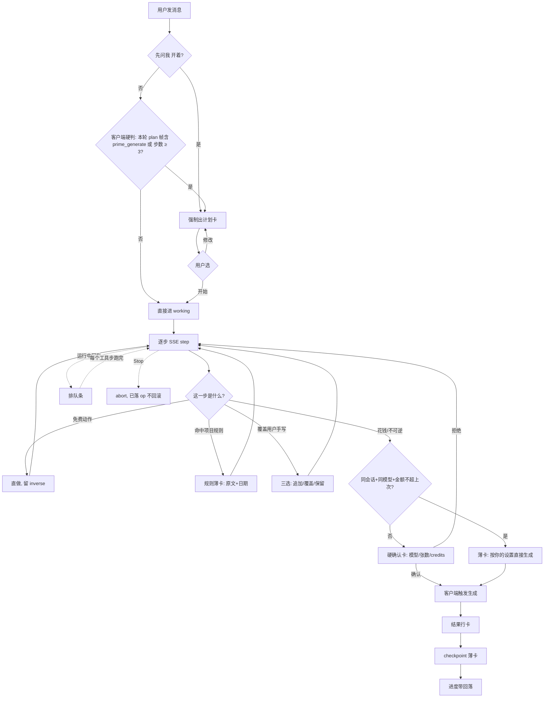

# 统一助手 · 施工基准（改版 · assistant-shell.md）

> 状态：**现行施工基准（2026-09-06 owner 定：方向 C「工作日志」+ 四期次序 + 助手设置 + 计划卡图示词表）**。
> 本文取代 2026-08-05 方向 A「统一 AI 对话助手」外壳契约。旧契约里仍然成立的条目收在 §16 历史决策表，被本轮推翻的逐条标了「⛔ 2026-09-06 推翻」。
> 引擎唯一：**Operator 工具环**（SSE 步事件、服务端零会话态）。画布助手（`src/services/node/node-assistant.service.ts`）与旧 Prompt 助手（`src/services/kernel/prompt-assistant.service.ts`）分期收编，**搬完即删，不留兼容层**（CLAUDE.md Engineering Principles 1）。
> 分期（owner 2026-09-06 确认次序）：**一 图片域面板 → 二 视频域 → 三 画布（见 [`node-canvas-v2.md`](node-canvas-v2.md)）→ 四 LoRA 收编与旧路径删除**。
> 格式对齐：`docs/templates/ui-request.md` 四列动作表 · `docs/scenes/ui-page.md` 阶段 3/6 · `docs/checklists/ui.md` 8 项 · `docs/references/ui-defaults.md` §1–§6。
> ⚠ 本文是设计契约，不是实现记录。带 `文件:行号` 的都是**现状事实**（2026-09-06 读码核过）；不带的是目标态。

---

## 0. 定位 · 范围 · 非目标

**定位**：助手是工作台上唯一那只「替你拧旋钮的手」——它不生成媒体，它把参数、提示词、参考图和 LoRA 铺到你看得见的控件上，然后把扳机留给你。

**第一期范围**：桌面 `≥1024` 图片域纵向打穿——新 UI 骨架（图标轨 / 进度带 / 卡型 / 双行输入 / @ 选择器 / 灯箱）+ 模型方言注入 + 计划卡 + @ 看图评审 + 确认后触发生成 + 项目规则卡 + 助手设置（§8）+ 计划卡图示词表（§9）+ 检索链（§7.1）+ **图片 / 视频档的移动端全屏 Sheet（§11.6，`adb0a008` 已落地）**。声音本轮只做「声音库 + Fish Audio 音色库检索与挂载」。

**非目标**：

- ❌ 音频档与 LoRA 的手机形态：这两条路由的小屏助手仍是旧 `PromptAssistantPanel` / `LoraAssistantDock`，收编排在第四期（§11.6）。⛔ 原「移动端整体下一轮、`isMobile` 一律 `return null`」已作废——图片 / 视频档的手机外壳已于 `adb0a008` 落地。
- ❌ 网上搜声音并提取（`fish-audio-voice.service.ts` 的音色检索除外）。
- ❌ 自动全量评审——只在被点名时看图。
- ❌ 改生成模型 / 计费 / 归档 / LoRA 训练流程。
- ❌ 给助手新增任何能创建 generation 的工具（钱闸，`src/constants/assistant-operator.ts:17-21`）。

---

## 1. 域定义

**核心用户**：正在某个工作台上调一张图的创作者，不是来聊天的人。
**核心对象**：这一台工作台此刻的表单（模型 / 提示词 / 比例 / 张数 / 参考位 / LoRA 栈）+ 它刚吐出来的那批结果。
**最高频任务**：说一句人话让表单变对，然后自己按生成；结果不对时指着某一张说哪里不对。
**默认入口**：工作台右侧覆盖层 / 收起态图标轨。

**助手负责**：① 读表单快照（数据源是请求带上来的客户端快照，服务端不查库）；② 按目标模型方言写提示词（§13）；③ 检索素材库 / 联网参考 / LoRA / 音色，结果一律候选态，点「选用」才落地；④ 写回看得见的控件，每步留逆操作；⑤ `prime_generate` 算价备键（`ASSISTANT_OPERATOR_TOOL_IDS.primeGenerate`）；⑥ 被点名时看图给评审卡；⑦ 读项目规则、记一条规则（§10，第一期两条新工具）。

**助手不负责**：不创建 generation、不扣 credit、不写库、不下载上传素材；不动这台工作台上没有的旋钮（没槽就 `noSuchControl` 拒，判据见 `src/constants/assistant-operator.ts` 的 `ASSISTANT_OPERATOR_REJECT_REASON_IDS.noSuchControl`）；不做跨域全局编排（域由宿主定）。

| 邻居       | 边界                                                                                                                                     |
| ---------- | ---------------------------------------------------------------------------------------------------------------------------------------- |
| **工作台** | 唯一真相：表单与生成键都在它那里。助手只读快照、只吐 op，由客户端 apply 层落地。点工作台 = 助手让位                                      |
| **画布**   | 第三期收编（§14 / §17）。结构 op 免费直落，`generate` / `set_review_state` 逐条确认；全量结构见 [`node-canvas-v2.md`](node-canvas-v2.md) |
| **素材库** | 只读（`search_assets` / `list_asset_folders` / `inspect_asset_folder`）。「打开完整素材库」就地开弹层不跳页                              |

---

## 2. 结构账本（`scenes/ui-page.md` 阶段 3 · 一次只确认一项）

| #    | 层                         | 作用                                                                                                                      | 必要性判据                                                                                                                                  | 去掉会怎样                                          |
| ---- | -------------------------- | ------------------------------------------------------------------------------------------------------------------------- | ------------------------------------------------------------------------------------------------------------------------------------------- | --------------------------------------------------- |
| 2.1  | **覆盖式面板几何**         | 右侧 fixed，top/right/bottom 各 24px，`rounded-xl`，默认 560                                                              | 开合前后主区宽度不变                                                                                                                        | 回到挤压式，每次开助手结果区重排                    |
| 2.2  | **左缘拖宽 420–860**       | `role=separator` 拖拽 + ←/→ 步进 + 宽度记忆                                                                               | 现值已在 `src/constants/studio-assistant-operator.ts:25-32`                                                                                 | 窄屏被 560 卡死；宽屏一行放不下 4 张                |
| 2.3  | **收起态 = 图标轨 48px**   | 域图标 · 状态点 · 进度环/计数 · 展开按钮                                                                                  | 收起后仍要能说「3/6」「4 张就绪」                                                                                                           | 退回胶囊：横向占位不可预期，或状态全丢              |
| 2.4  | **顶部进度带 ~40px**       | 运行中 `3/6 · 正在挂 LoRA`，点开展清单；空闲退化为 `域 chip · 会话名 · ⋯ · 收起`                                          | 长任务里「还剩几步」是唯一的耐心来源                                                                                                        | 过程折叠后进度完全不可见                            |
| 2.5  | **用户消息卡**             | 回显本轮说了什么，带 @chip 缩略图；沟里挂账户头像（§2.22）                                                                | 多轮上下文的锚                                                                                                                              | @ 指的哪张事后无法复核                              |
| 2.6  | **计划卡**                 | 阶段列表 + 1–3 待定项 + 预估 credits + 「修改 / 开始」；**出卡时机由客户端硬判**（§5）                                    | 生成前反问的唯一载体                                                                                                                        | 退回「先做了再说」                                  |
| 2.7  | **ToolGroup 折叠行**       | 「5 个操作 · 4 成功 1 失败」，点开逐条                                                                                    | 结果优先、过程自动折叠                                                                                                                      | 日志刷屏，结果被淹没                                |
| 2.8  | **反问单选卡**             | 中途缺一个决定就地问，选项即按钮                                                                                          | 比「请回复 1/2/3」少一次打字                                                                                                                | 多一轮 LLM 往返                                     |
| 2.9  | **确认卡（三档）**         | 覆盖手写三选 / 花钱硬确认（带「不再问」）                                                                                 | 拍板 3 + 新增花钱档                                                                                                                         | 手写被静默覆盖，或每次生成点两遍                    |
| 2.10 | **候选网格卡**             | 缩略 + **URL（域名可点）· 发布者 · 可否作生成输入** + 勾选                                                                | 拍板 21「浏览零下载」+ 溯源三字段                                                                                                           | 来源不可见，版权与可用性无从判断                    |
| 2.11 | **结果行卡**               | 每轮 2–4 张缩略，点选=当前，hover 出「问助手 / 放大」，卡底「按这张继续」                                                 | 面板内能判好坏，是 @ 闭环入口                                                                                                               | 面板与结果区来回扫视                                |
| 2.12 | **评审卡**                 | 内嵌被评那张图 + 否定 / 异常 / 建议三段                                                                                   | 拍板 6「证据长在结论里」                                                                                                                    | 评语脱离图                                          |
| 2.13 | **checkpoint 薄卡**        | 每轮一张：`已改 N 项 · 只回参数 / 连对话一起回`                                                                           | 拍板 18 + 14 的合并形态                                                                                                                     | 撤不到「这一轮之前」                                |
| 2.14 | **系统行**                 | 「你撤销了：××（助手已知晓）」「停顿点 · 接住排队消息」                                                                   | 撤销与排队后上下文不脱节                                                                                                                    | 助手基于已撤状态继续说话                            |
| 2.15 | **输入区上行**             | `📎 附件 · 模型 chip · 先问我 · ⏹ Stop`                                                                                   | 四个高频开关明面化；模型 chip 复用自动路由组件                                                                                              | 另造选择器 = 2026-08-19 生产事故重演                |
| 2.16 | **输入区下行**             | 输入框 + 发送；运行中不锁，回车=排队                                                                                      | 拍板 13 改口后的唯一入口                                                                                                                    | 运行中不能打字，或打字即打断                        |
| 2.17 | **排队条**                 | 浮在输入框上方，可撤回，停顿点 = **每个工具步跑完的那一刻**（已落地 `f074605d`）                                          | 「已排队」必须看得见才敢排                                                                                                                  | 用户以为丢了，重复发送                              |
| 2.18 | **@ 选择器**               | 打 `@` 唤出：最近生成在前、素材库可搜，成带缩略图 chip；**不设硬上限**，超 8 张提示「可能不准」不拦截                     | 四入口中的键盘入口                                                                                                                          | 只剩 hover 一条路，无键盘可达                       |
| 2.19 | **灯箱**                   | 结果缩略 / 参考图 / 评审证据图共用同一个（拍板 17 现值）                                                                  | 一份实现三处复用                                                                                                                            | 三种放大交互各写各的                                |
| 2.20 | **建议药丸**               | 语境化、点即发送、`minChanges` 门（已实现，`studio-assistant-operator.ts` 的 `STUDIO_OPERATOR_SUGGESTIONS`）              | 空态起手势                                                                                                                                  | 空态无可点动作                                      |
| 2.21 | **项目规则薄卡**           | 助手引用了某条项目规则时出现：规则原文 + 来源日期 + 「查看规则」                                                          | 规则是助手为什么这么做的唯一可核对证据                                                                                                      | 规则命中不可见，用户以为助手在瞎猜                  |
| 2.22 | **时间线沟里的头像**       | 用户回合 = Clerk 账户头像 / 首字母圆标；助手回合 = AI 头像。工具步 / 系统行 / 计划 / 结果仍是形状节点。对话行不显示时间戳 | 「谁在说话」是对话流唯一必须一眼看出的事；时间戳一天里全是同一分钟，占的是沟里最贵的那点宽度却零信息（沟因此由 78 收到 24，时间戳整段删除） | 20 行下来全是同款小圆点，用户回合与助手回合靠缩进猜 |
| 2.23 | **助手设置弹层**（§8）     | ⋯ 菜单「助手设置」→ `ResponsiveDialog`：名字 / AI 头像 / 语气 / 长度 / 默认行为 / 语言。用户级，一份，四域共用            | AI 头像必须有地方选；「先问我」需要跨会话默认态                                                                                             | 头像写死一个，语气不可调，「先问我」永远从关开始    |
| 2.24 | **计划卡待定项图示**（§9） | 待定项从「三个纯文字按钮」升为「34px 图示 + 标签」，图示取自封闭词表，词表外退化纯文字                                    | 一个线描比四个字快得多；封闭词表是不让模型自由发挥图标的唯一办法                                                                            | 计划卡回到三段文字，扫读成本与聊天框持平            |

---

## 3. 交互动作表（四列）

> 动效列引用 §11.4 配方名 + `src/app/globals.css:198-202` 真值。只动 `transform`/`opacity`，高度折叠用 `grid-template-rows: 0fr→1fr`，每条带 `motion-reduce:` 降级。

### 3.1 图片域 13 步脚本（27 行）

| 触发                                              | 即时反馈                                                           | 动效配方                            | 结果                                                                   |
| ------------------------------------------------- | ------------------------------------------------------------------ | ----------------------------------- | ---------------------------------------------------------------------- |
| ① 回车发第一句                                    | 用户消息落位（头像 + 卡），输入框清空，进度带亮起                  | `entryIn` base                      | 起一轮 run，SSE `open` 先到                                            |
| ② `plan_request` 到达且 `shouldShowPlanCard` 为真 | 卡从下淡入，阶段逐条 stagger                                       | `cardIn` reveal + stagger 30ms      | 停在 `awaitingPlan`（判据三条见 §5）                                   |
| ③ 点待定项「半身」                                | 边框换 primary + 勾                                                | 选中态 fast                         | 写进 `planAnswers`，「开始」转 enabled                                 |
| ④ 点「开始」                                      | 按压 + 卡收成一行摘要                                              | `scale(.98)` fast + 折叠 base       | 带 `planAnswers` + `planApproved:true` 重发，进 `working`              |
| ⑤ 点「修改」                                      | 回到可编辑态，焦点落第一个待定项                                   | 无                                  | 带 `planApproved:false` 重发 = **重新规划一次**（⛔ 不是「不发请求」） |
| ⑥ ToolGroup 行出现                                | 一行标题 + 计数，右侧耗时 mono                                     | 按词淡入 fast（opacity + blur）     | 步骤计入进度带 `1/4`                                                   |
| ⑦ 点 ToolGroup 展开                               | 箭头旋转 + 子项缩进一级列出                                        | 折叠 base（0fr→1fr，锁滚动）        | 每步入参与结果摘要                                                     |
| ⑧ 思考区跑完                                      | 停留 1000ms 后自动收起，标题变「用时 6s」                          | 折叠 base，延时 1000ms              | 结果优先，可再点开                                                     |
| ⑨ 候选网格出现，勾 2 张                           | 缩略逐格淡入；勾选格加 2px primary 环 + 角标                       | `tileIn` base，stagger 30ms         | 「选用」显示计数                                                       |
| ⑩ 点「选用」                                      | 卡收成一行「2 张已挂到参考槽」，参考位缩略弹入                     | 挂载 stagger 0.07s                  | 浏览零下载（拍板 21）                                                  |
| ⑪ 覆盖三选卡出现                                  | 卡入场，diff 两行（旧划掉 / 新），三分段按钮等宽                   | `cardIn` reveal                     | 停在 `awaitingConfirm`                                                 |
| ⑫ 点「覆盖」                                      | 按压；提示词框整段替换并高亮一拍                                   | 选中态 fast + `writeFlash` reveal   | `set_prompt` 落地，留 `inverse`                                        |
| ⑬ 项目规则薄卡出现                                | 贴在动作卡下：规则原文 + 来源日期 + 「查看规则」                   | `entryIn` base                      | 助手声明本步依据了哪条规则                                             |
| ⑭ checkpoint 薄卡出现                             | 左缘 2px applied 竖条 + applied-surface 底，「已改 3 项」+「撤销」 | 列表项进入 base                     | 本轮改动集合固化                                                       |
| ⑮ 花钱硬确认卡出现                                | `card.warn`：warning 描边 + 四要素 + 「不再问」勾选                | `cardIn` reveal                     | 流停；显示模型 / 张数 / 比例 / credits                                 |
| ⑯ 勾「本会话此类不再问」                          | 勾选框打勾                                                         | 选中态 fast                         | 写会话级偏好，作用域见 §6                                              |
| ⑰ 点「生成」                                      | 按钮转 loading，进度带切生成态                                     | loading 换图标，宽度不跳            | **客户端**触发生成（§6）                                               |
| ⑱ 结果行卡到达                                    | 2×2 逐格淡入（宽档 4 列）；进度带回落                              | `tileIn` stagger 30ms               | 该批可被 @ 与「按这张继续」                                            |
| ⑲ hover 结果 ② 点「问助手」                       | 底部渐变浮层出两颗按钮；输入框出 @chip 并聚焦                      | 浮层 opacity fast + chip fast       | 走 @ 四入口之一                                                        |
| ⑳ 发「@结果② 手指有问题」                         | 用户消息带缩略 chip                                                | 列表项进入 base                     | `critique_result` 工具环启动                                           |
| ㉑ 评审卡到达                                     | 左 80×112 嵌图，右三段短评逐段淡入                                 | 按词淡入 fast                       | 否定 risk / 异常 warning / 建议 applied                                |
| ㉒ 运行中回车插话                                 | 输入框上方 warning 虚线排队条「已排队 · 下一个停顿点处理 · 撤回」  | 排队条 `cardIn` base                | 不中断在飞任务                                                         |
| ㉓ 到达下一个工具步**跑完**                       | 系统行「停顿点 · 接住排队消息 → 插入为第 N 步」，进度带总步数 +1   | 列表项进入 base                     | abort 当前流 → 接队 → 带 `priorSteps` 起下一轮                         |
| ㉔ 点排队条「撤回」                               | 排队条淡出 + 系统行                                                | 元素移除 fast                       | 丢弃不发                                                               |
| ㉕ 点 ⏹ Stop                                      | 按钮变 destructive 一拍，进度带「已停止」                          | 按压 fast                           | abort，`stopped/aborted`，已落 op 不回滚                               |
| ㉖ 点工作台空白                                   | 面板收到 48px，内容交叉淡出                                        | width 过渡 slow + 内容 opacity fast | 折成图标轨（状态点 + 「4 张就绪」）                                    |
| ㉗ 点图标轨                                       | 反向                                                               | 同上                                | 展开回记忆宽度                                                         |

**排队的落地口径（已落地 `f074605d`，`use-assistant-operator.ts`）**：

- **停顿点 = 一步「有结论」的那一刻**，判据是 `step.status !== 'running'`——⛔ 不是「是 `done`」：被拒的那一步（`error`）同样是一个结论，它也进 `priorSteps`，在那儿停下来一样安全。只认 `done` 的话，一轮里全是被拒的步时排队条会一直挂着不动。
- 接住的顺序：**先 abort 这条流 → 接队 → 起下一轮**。先断才不会有半个事件在两条流之间穿过去；旧流的 `AbortError` 由 `aborted` 判据吞掉。
- 一步都没跑就收尾的那种轮次（纯说话、或最后一步之后才排上队）在 `done` 之后补接一次。
- ⛔ **`awaitingConfirm` / `error` 收尾时不接队**：前者接了等于替用户跳过那个问题，后者接了会把错误态擦掉而用户还没看见发生过什么。队列留着，排队条还挂在输入框上方——下一次 `send()` / 续跑会带上它。
- 接住时先插系统行再插用户消息，顺序就是用户读到的顺序：「停顿点到了」→「你那句话现在开始跑」；进度带总步数按接住的条数 +1（即时反馈，否则看起来像白排了）。

### 3.2 面板与撤销（8 行）

| 触发                            | 即时反馈                                        | 动效                           | 结果                                                    |
| ------------------------------- | ----------------------------------------------- | ------------------------------ | ------------------------------------------------------- |
| 拖左缘 separator                | 光标 col-resize，实时跟手，左上角 mono 宽度提示 | 无（精密档）                   | 宽度写 `storageKey`，缩略图列数换档                     |
| 键盘聚焦 separator 按 ←/→       | 焦点环可见，每次 20px（`widthStepPx`）          | 无                             | 同上，键盘可达                                          |
| 点提示词框 / 面板内部           | 无变化                                          | 无                             | **不收起**（`data-operator-keep` + 提示词 textarea id） |
| 点 checkpoint「撤销」           | 就地展开二选：只回参数 / 连对话一起回 / 取消    | 元素替换 fast                  | 不弹窗，不跳焦点                                        |
| 选「只回参数」                  | 薄卡变灰「已撤销 · 只回参数」+ 系统行           | 列表项进入 base                | 按 `inverse` 逆序回滚，对话保留，**结果不删**           |
| 选「连对话一起回」              | 本轮消息整体淡出                                | 元素移除 fast                  | 参数回滚 + 本轮对话截断                                 |
| 顶部「清掉助手全部改动」第 1 击 | 按钮变 destructive 并改文案                     | 选中态 fast                    | 进 3s 二击窗口（`STUDIO_OPERATOR_CLEAR_CONFIRM_MS`）    |
| 3s 内第 2 击 / 3s 不点          | 参数栏多处回落 + 生成键熄灭 / 自动变回原文案    | 回落值高亮一拍 / 颜色过渡 fast | 只清当前域；超时什么都没发生                            |

### 3.3 @ 四入口 与「先问我」（7 行）

| 触发                        | 即时反馈                                               | 动效                  | 结果                                                                                                                  |
| --------------------------- | ------------------------------------------------------ | --------------------- | --------------------------------------------------------------------------------------------------------------------- |
| 输入框打 `@`                | 就地弹选择器（最近生成在前 + 素材库搜索）              | Popover `cardIn` base | 上下键选、回车确认，成缩略图 chip                                                                                     |
| 结果缩略 hover → 「问助手」 | chip 插入并聚焦                                        | 浮层 + chip fast      | 同一条 chip 管线                                                                                                      |
| 拖一张图进输入框            | 输入行 2px primary 环 + 落点提示                       | 描边 fast             | 落下成 @chip                                                                                                          |
| chip 数 > 8                 | chip 区计数变 warning：「将看 N 张 · 超 8 张可能不准」 | 颜色过渡 fast         | **全部都看，不拦截也不截断**                                                                                          |
| 助手歧义反问                | 单选卡列出候选缩略（4 列网格）                         | 卡入场 reveal         | 点一张 → 带上下文重发；卡是 `StudioOperatorAssetChoiceCard`（已落地），驱动它的 `choice_request` 事件**接线中（3a）** |
| 「先问我」开                | 开关反相为 primary 实心，占位语加「本轮先出计划卡」    | 选中态 fast           | 本轮强制先出卡                                                                                                        |
| 「先问我」关                | 回中性                                                 | 同上                  | 回到助手自判（花钱或多步才出）                                                                                        |

**四入口 → 一条管线（已落地 `f074605d`）**：`use-studio-operator-mention.ts` 的 `addChip`。**chip 就是 `StudioOperatorAttachment`**——发送时与 📎 挂上来的那些**合成同一个数组**送出去，请求契约一行未动（`send(text, attachments)`），⛔ 没有第二套「引用」形状。**合并去重按 `id`**（`StudioOperatorPanel.tsx` 的 `submit`）：同一张图既被 📎 挂过又被 @ 提过时，助手只收到一份地址。
**chips 住 store 不住 hook 的 state**：面板会被收放法则（拍板 7）随时卸载，chip 属于「还没发出去的那条消息」——收一下面板就没了的话，用户挑好的四张图会凭空消失。
**拖图进输入框分两路**：库里的资产成 chip，其余原样交回上传通道。

### 3.4 头像 · 助手设置 · 计划卡图示（11 行）

| 触发                                          | 即时反馈                                                  | 动效                           | 结果                                           |
| --------------------------------------------- | --------------------------------------------------------- | ------------------------------ | ---------------------------------------------- |
| 用户消息落位                                  | 沟里 32px 圆头像淡入（`avatarUrl`；无则首字母圆标）       | `entryIn` base，仅 opacity     | 与 8px 大节点**同轴**（沟内 x=18px），不改沟宽 |
| 助手消息 / 计划卡 / 评审卡落位                | 沟里 32px AI 头像淡入                                     | 同上                           | 一轮里连续助手行**只第一行挂头像**，避免头像柱 |
| 头像加载失败 / 无头像                         | 直接渲染首字母圆标（`FL` 式两位）                         | 无                             | 不出破图、不出骨架屏                           |
| 点 ⋯ →「助手设置」                            | `ResponsiveDialog` 打开，焦点落「助手名字」               | 弹层自带                       | 面板不收起（`data-operator-keep`）             |
| 选一款预设 AI 头像                            | 格子 `border-primary` + `ring-2 ring-ring`，沟里即时换掉  | 选中态 fast                    | 乐观更新，保存失败回滚并出错误行               |
| 上传自定义头像                                | 选图 → 预览 → 保存；超 5MB / 非 JPEG·PNG·WebP 就地报错    | 无                             | 走 §8.3 管线                                   |
| 改语气 / 长度 / 语言 / 默认行为               | 分段控件选中态；底部 mono「已保存」                       | 选中态 fast                    | 下一轮请求带上新 persona，**不重发本轮**       |
| 「默认行为」= 总是先出计划                    | 「先问我」开关默认开，带 `title`「来自助手设置」          | 无                             | 单轮仍可关，关只对本轮生效                     |
| 计划卡待定项渲染                              | 每格 34px 图示 + 标签                                     | `cardIn` reveal + stagger 30ms | `visual` 在词表内才画图示                      |
| `visual` 不在词表 / 缺失 / 是「选哪张参考图」 | 退化为纯文字 chip（等高）/ 换成素材缩略图（`aspect-3/4`） | 同上                           | ⛔ 不猜、不回退到「随便一个图标」              |

**375px 列**：图片 / 视频档走**全屏 Sheet + 右下浮标**，配方与取舍见 §11.6；音频档与 LoRA 手机端仍是旧面板（第四期）。

---

## 4. 状态矩阵

### 4.1 面板态 × 运行态

| 面板态 \ 运行态 | idle                                                     | working                                                | awaitingPlan                     | awaitingConfirm                      | queued                       | error                              | stopped                                       |
| --------------- | -------------------------------------------------------- | ------------------------------------------------------ | -------------------------------- | ------------------------------------ | ---------------------------- | ---------------------------------- | --------------------------------------------- |
| **展开**        | 进度带退化为 `域 chip · 会话名 · ⋯ · 收起`，建议药丸可见 | 进度带 `3/6 · 正在挂 LoRA`，ToolGroup 流式展开，⏹ 可点 | 计划卡钉在流末尾，输入框仍可打字 | 确认卡钉在末尾，其余流暂停，⏹ 仍可点 | 排队条浮在输入框上方，带撤回 | 错误行 inline + 重试，已发文本留屏 | 进度带「已停止 · N 步已完成」，已落 op 不回滚 |
| **图标轨**      | 状态点中性 + 「4 张就绪」                                | 进度环 `3/6` + 状态点 primary 脉冲                     | 状态点闪烁 + 「待你定」          | 状态点 warning + 「待确认」          | 计数徽标 +1                  | 状态点 destructive + 感叹号        | 状态点中性 + 「已停止」                       |
| **拖拽中**      | 内容按目标宽度重排（缩略 2→4 列），不阻断在飞流          | 同左，进度带文字按宽度截断                             | 待定项按宽度换 1/2 列            | 确认卡按钮永不换行（下限 420 保证）  | 排队条单行截断               | 错误行不截断                       | 同 idle                                       |

**七格与代码的对应**（`StudioOperatorStatus`，`src/types/studio-assistant-operator.ts`）：

- 已落地四档：`idle` / `working` / `awaitingConfirm` / `error`。
- **`awaitingPlan` 接线中（3a）**——名字按本表写，⛔ 不另起一个 `planning` / `awaitingUser`。
- `queued` 不是一档状态而是**正交的一格**：队列是 `state.queue`（`use-studio-operator-store.ts`），与 `status` 同时成立（working + 排队条）。
- `stopped` 由 `stopped` 事件的 `reason` 说清楚（`ASSISTANT_OPERATOR_STOP_REASONS`：`aborted` / `awaiting_confirm` / `max_steps`），status 本身回 `idle`。

**流式与加载态（2026-09-06 已落地）**——这五条说的是「从按下发送到第一个字出现之间，屏幕上有什么」。此前这一段是空的：发出去之后时间线什么都不长，用户不知道它收到没有。

| 目标                           | 口径                                                                                                                                                                                                                                                                                                                                                                                                                                             |
| ------------------------------ | ------------------------------------------------------------------------------------------------------------------------------------------------------------------------------------------------------------------------------------------------------------------------------------------------------------------------------------------------------------------------------------------------------------------------------------------------ |
| **正文按帧累积**               | 助手正文由 `message_delta` 逐帧累加渲染（`StreamingText`），⛔ 不等整条 `message` 到齐再一次性刷出                                                                                                                                                                                                                                                                                                                                               |
| **发送即回显**                 | 用户那一行在请求发出的同一帧就落进时间线，紧跟一条**助手占位行**（头像 + 空正文）——占位行是「它收到了」的唯一凭证                                                                                                                                                                                                                                                                                                                                |
| **进度带「思考中」**           | 还没有任何工具步时进度带写「思考中」，⛔ 不显示 `0/0`：一个没有分母的计数比一句话更让人以为它卡住了                                                                                                                                                                                                                                                                                                                                              |
| **ToolGroup pending**          | 工具步在**开跑时**就进组（状态字符走 pending 档），跑完再改成 `✓` / `✕`；⛔ 不做「跑完才出现」——那正是「它到底在干什么」这个问题的来源                                                                                                                                                                                                                                                                                                           |
| **`awaitingPlan` 带文案**      | 计划卡钉住那一刻进度带与图标轨都写「待你定」（§4.1 该列），⛔ 不留在「思考中」上——两件事对用户要做的动作完全不同                                                                                                                                                                                                                                                                                                                                 |
| **落地节流：rAF 与定时器竞速** | 合批 flush 让 `requestAnimationFrame` 与一条 **80ms 定时器**（`STUDIO_OPERATOR_STREAMING.flushFloorMs`）**赛跑，谁先到谁落地、另一个取消**（已落地 `ba462484`）。🔬 由来：rAF 在窗口被遮挡 / 标签页切走时被浏览器降到几帧每秒——真机实测 20 帧 `message_delta` 只换来 4 次 DOM 增长，表现是「一段本该慢慢长出来的回复在定稿那一刻啪地落地」。⚠ 前台永远是 rAF 先到（16ms < 80ms），所以这个数**不决定前台节奏**，⛔ 别指望调大它让字出得更慢      |
| **定稿后的揭示（打字机）**     | 定稿那一帧**不跳到末尾**：已显示长度按 **60 字/秒**（`revealCharsPerSec`）追着目标长度走，超过 **1.5s**（`revealMaxMs`）就整体提速一次收完（已落地 `4146ce83`）。🔬 由来：provider 那侧分块粗到 4 块 / 130ms，落地闸只能保证「块到了就写进去」，写进去的仍是一整块。⚠ 速率按**墙钟**算，⛔ 不按帧——后台被节流的标签页否则会一个字一个字爬。**后台标签页 / `prefers-reduced-motion` / 点一下正文** 三种情况直接落到末尾；面板收起要**等揭示走完** |
| **收尾前的占位行**             | 最后一个工具步落定之后 **300ms**（`pendingAfterStepMs`）还没有下一步，就挂一条助手占位行接住那段空白（已落地 `4146ce83`）。🔬 由来：末步到收尾正文第一个字之间实测可达数秒，那段时间线程里一条活的助手行都没有，读起来像「它不打算说话了」。⚠ 300 是**防闪门槛**不是延迟动画：连着跑的工具步之间常常只隔几十毫秒，⛔ 调到 0 的表现是每两步之间闪一行三点脉冲又被拆掉；⛔ 也别超过一秒——那等于它在最需要出现的那一刻还没出现                      |

⚠ 五条都已接线（2026-09-06）：服务端那一轮的 LLM 往返改走**流式**（`streamAssistantTextWithContextRetry`），`lib/assistant-operator-stream.ts` 的 `createOperatorMessageStreamer` 从**半截 turn JSON** 里边收边解出 `message` 字段吐成 `message_delta`；⛔ 一次 LLM 往返都没多花，OUTPUT 契约也没改成两段协议。工具轮靠**键的先后**闭嘴（OUTPUT 里 `"tool"` 排在 `"message"` 前面），模型不守序时两种失败都良性：漏吐 = 退回一次性刷出，多吐 = 定稿帧整体覆盖。客户端 `use-assistant-operator` 按 rAF 合批累加，`StudioOperatorStreamingText` 是正文渲染件（中日韩逐字 / 拉丁逐词，按 §11.5 的 `fast` 配方淡入，`motion-reduce` 直接显示）。

### 4.2 卡片态

| 卡片           | 态                 | 显示什么                                                                                                                                            |
| -------------- | ------------------ | --------------------------------------------------------------------------------------------------------------------------------------------------- |
| **计划卡**     | 待定 / 已定        | 阶段列表 + 待定项未选 + credits 灰显 + 「开始」disabled → 显示已选值，确认后整卡 `.resolved`，标题「计划 · 已确认」                                 |
| **确认卡**     | 待定 / 通过 / 拒绝 | 三选（追加/覆盖/保留）或花钱四要素 + 「不再问」勾选，流暂停 → `.resolved`「已处理 / 已批准」带撤销入口 → 「保留了你写的」，助手下一条说明改走哪条路 |
| **候选网格**   | 待选 / 已用        | 6 格：缩略 + 域名 + 发布者 + 可作输入勾/叉；底「已选 N 张」→ `.resolved`「N 张已挂到参考槽」                                                        |
| **结果行卡**   | 未选 / 已选 / 被 @ | 等权 → primary 内描边 + 角标 → @ 角标且 chip 同色                                                                                                   |
| **评审卡**     | 到达               | 嵌图 + 三段；标题注「仅看 结果②」                                                                                                                   |
| **checkpoint** | 可撤 / 已撤        | 「已改 N 项 · 撤销」→ 就地二选 → 「已撤销 · 只回参数」+ 系统行                                                                                      |
| **规则薄卡**   | 命中               | 规则原文 + `记于 2026-08-14` + 「查看规则」                                                                                                         |
| **排队条**     | 在队 / 已接 / 已撤 | warning 虚线条 → 系统行「插入为第 N 步」→ 淡出 + 系统行                                                                                             |

### 4.3 横切规则

- **缺 API key**：模型仍显示、入口不禁用，点击开 `QuickSetupDialog`（CLAUDE.md Hard Rule 8）。⛔ 不做置灰占位。
- **不支持的能力不渲染**，不做禁用占位。
- **七态**：每个可点元素覆盖 `default/hover/active/focus-visible/disabled/loading/selected`（`ui-defaults.md §5`）；命中区 fine ≥32px。
- **空态**：一句说明 + 建议药丸，不留白板。

---

## 5. 流程图



**计划卡出卡时机 = 客户端硬判（owner 2026-09-06 定）**——已落地（`c2e14460`）。

**服务端只摆事实**：`plan_request` 事件（`ASSISTANT_OPERATOR_EVENTS.planRequest`）紧跟 `plan` 之后、第一个 `step` 之前吐一次。载荷（`AssistantOperatorPlanRequestEventSchema`，`src/types/assistant-operator.ts`）四格：

| 字段       | 形状                                                                    | 说明                                                                                                                                                                                     |
| ---------- | ----------------------------------------------------------------------- | ---------------------------------------------------------------------------------------------------------------------------------------------------------------------------------------- |
| `steps`    | `{ id, label }[]`（1–`maxPlanItems`）                                   | ⚠ 带 `id` 而不是裸字符串：待定项要挂在阶段旁边，而序号随重规划变                                                                                                                         |
| `pending`  | `AssistantOperatorPlanPending[]`（≤ `maxPendingItems`，**允许空数组**） | 每格 `{ id, label, kind, options[] }`，`options` **至少两个**——一个选项的「单选」不是问题，是通知；每个选项 `{ id, label, visual?, assetUrl? }`（§9 三分支，`assetUrl` 优先于 `visual`） |
| `estimate` | `{ credits?, model?, count? }`                                          | 见 §6.3：`credits` 查不到就缺席                                                                                                                                                          |
| `reason`   | `ASSISTANT_PLAN_REQUEST_REASONS` 之一                                   | 服务端**观察到**的理由，**不是判定**                                                                                                                                                     |

⛔ **收到 `plan_request` 不等于要出卡**。**判定是一个纯函数**：`shouldShowPlanCard(plan, { forcePlan })`（`src/lib/studio-operator-plan.ts`），三条判据任一成立就出卡——

1. `request.forcePlan === true`（输入区那颗「先问我」，§3.3）；
2. `plan.reason === ASSISTANT_PLAN_REQUEST_REASON_IDS.spend`（服务端观察到本轮工具是 `prime_generate` / `request_generation`）；
3. `plan.steps.length >= ASSISTANT_PLAN_CARD_MIN_STEPS`（3）。

三条都不成立就直接进 working：改一句提示词还先弹一张卡，是纯打扰。⛔ **服务端不判**：不往 system prompt 里写「你自己决定要不要出计划卡」，模型自判既不稳定（同一句话两次跑出两个结果），也与「服务端零会话态」相冲——它判不出用户这一轮开没开「先问我」，那颗开关活在客户端。判定放在一个脱离 React 就能钉死的纯函数里 = 一处判、到处一致。

⚠ 为什么 `plan_request` 与 `plan` **分两帧**而不是给 `plan` 加字段：`plan` 是一行给人看的字，早就有客户端在读；计划卡要的是结构化待定项。合帧的代价是让一条已经在跑的帧变形。

**回传三个字段**（`AssistantOperatorRequestSchema`，`src/types/assistant-operator.ts`）——与 `confirmations` 走**同一条通道**「带上下文重发」，服务端照旧没有会话态：

| 字段           | 取值                                                                                                                    |
| -------------- | ----------------------------------------------------------------------------------------------------------------------- |
| `planAnswers`  | `{ pendingId, optionId }[]`（≤ `maxPendingItems`）。⚠ 一格最多一条——目前只有单选                                        |
| `planApproved` | `true` =「开始」照原计划跑 · `false` =「修改」把答复并进上下文**重新规划一次**（§3.1 ⑤）· 缺席 = 这一轮压根没出过计划卡 |
| `forcePlan`    | 「先问我」那颗开关。开着 = 本轮无条件先出卡                                                                             |

```mermaid
flowchart LR
  E1[输入 @] --> CH[@chip 带缩略图]
  E2[结果 hover 问助手] --> CH
  E3[拖图进输入框] --> CH
  E4[助手反问 你指哪张] --> CH
  CH --> N{chip 数 > 8?}
  N -- 是 --> WARN[提示 超 8 张可能不准, 全看不截断]
  N -- 否 --> SEND[发送: 消息 + 图地址]
  WARN --> SEND
  SEND --> LOOK[critique_result 看图]
  LOOK --> CARD[评审卡: 嵌图 + 否定/异常/建议]
  CARD --> FIX[改提示词 + checkpoint]
  FIX --> MONEY[花钱确认 或 不再问薄卡] --> NEW[新一行结果] --> CH
```

---

## 6. 确认三档与钱闸

**钱闸不动**（`src/constants/assistant-operator.ts:17-21` 那段注释是本片的宪法）：工具表里没有任何一条能创建 generation，将来也不许有；`prime_generate` 只置 primed 并算价。⭐ **`c2e14460` 加了 `request_generation` 而钱闸一个字都没改**——服务端在这一步只吐一个载荷（模型 / 张数 / 规格 / 预估），一分钱不扣、一条 generation 不建、一个 provider 不调；扣扳机那一跳在客户端（`studio-operator-apply.ts` 把载荷交给宿主的 `triggerGeneration`，宿主按的是用户自己那颗生成键）。形状与拍板 22 的 `import_user_url`、P4-C 的 `mount_lora` 逐字同源：服务端吐地址 / 吐候选 / 吐载荷，落地永远在客户端。

| 档               | 触发                                                 | 形态                                                                   | 落地                                                     |
| ---------------- | ---------------------------------------------------- | ---------------------------------------------------------------------- | -------------------------------------------------------- |
| **免费直做**     | 改提示词 / 参数 / 挂 LoRA / 挂参考                   | 无卡，留 checkpoint 薄卡                                               | op 自动落，带 `inverse`                                  |
| **覆盖用户手写** | 目标字段已有用户手写内容（判据是客户端快照，拍板 3） | 就地三选：**追加在后 / 覆盖 / 保留**，字段旁小条不弹窗                 | 用户选完才落                                             |
| **花钱与不可逆** | 触发生成（工具 `request_generation`）                | 硬确认卡：模型 / 张数 / 规格 / 预估 credits + 「本会话此类不再问」勾选 | **客户端扣扳机**（新增档，见 §12 拍板 2），服务端只吐 op |

**三档在代码里的名字**（`ASSISTANT_OPERATOR_CONFIRM_TIER_IDS`，`src/constants/assistant-operator.ts`）：`free` / `overwrite` / `spend`。`free` 不是凑数——它是「什么时候什么都不问」这条判据的名字。

### 6.1 `spend_request` 是**独立的一帧**（已落地 `c2e14460`）

⛔ 它**不是** `confirm_request` 上的一个 `tier` 分支。判据：`confirm_request` 的三个字段（`field` / `have` / `proposed`）是**覆盖档专属**的，花钱档一个都没有（它要说模型 / 张数 / 规格 / 预估）。塞进同一帧就得把那三个改成可选，而客户端那张确认条正是 `StudioOperatorConfirm = Omit<ConfirmRequestEvent,'type'>`——改成可选等于让覆盖三选卡去处理「没有 field 的确认」。两张卡（§11.4「覆盖三选」/「花钱确认」）本来就是两帧。⚠ **两帧都带 `tier`**，客户端按它分派（`confirm_request.tier` 服务端永远显式发 `overwrite`；⛔ 它不是「缺席就当 overwrite」的兼容层）。

| 事件                                                            | 载荷                                                                                                                                                                 | 之后                                                                                       |
| --------------------------------------------------------------- | -------------------------------------------------------------------------------------------------------------------------------------------------------------------- | ------------------------------------------------------------------------------------------ |
| `confirm_request`（`ASSISTANT_OPERATOR_EVENTS.confirmRequest`） | `tier:'overwrite'` · `field` · `have` · `proposed`                                                                                                                   | 流结束（`awaiting_confirm`），带 `confirmations` 重发                                      |
| `spend_request`（`ASSISTANT_OPERATOR_EVENTS.spendRequest`）     | `tier:'spend'` · `request`（`AssistantOperatorGenerationRequestSchema`：`model{id,label}` / `count` / `specs{aspectRatio,resolution,durationSeconds}` / `estimate`） | 流结束（`awaiting_confirm`），点「生成」= 带 `autoApprove` **重发一轮**，⛔ 不是续跑这条流 |

⭐ **一份形状两处用**：`spend_request.request` 与 `request_generation` 那一步的 `payload` 是**同一个 schema**（`AssistantOperatorGenerationRequestSchema`，`src/types/assistant-operator.ts`）。⛔ 别抄成两份——否则「确认了 4 张、发出去 1 张」没有任何东西拦得住。全部字段取自**快照**，工具入参是空对象，一个字段都不让模型写。

### 6.2 `request_generation`：第三张工具表，**没有 `inverse`**

它既不是「读」也不是「改动型」，而是 `ASSISTANT_OPERATOR_SPEND_TOOLS`（`src/constants/assistant-operator.ts`）。改动型那张表的全部意义是「每条都必须带 `inverse`」（拍板 18），而这一档带不出来——生成出来的东西删不掉、钱退不回。硬给一个空 `inverse` 的下场很具体：日志条上出现一颗撤销钮，点了什么都不会发生。**撤销的位置由结果卡顶上**（§11.4「结果行卡」）。判据函数：`isRevertibleAssistantOperatorTool` 从「不是读类」改成「是改动型」。

⚠ 名字是 `request_generation` 而不是 `start_generate`：钱闸那份结构性证明逐字扫工具名（`src/services/kernel/assistant-operator.money-gate.test.ts`），`generation` 里没有 `generate` 这个词。⛔ 下一个人「顺手统一命名」会当场把钱闸弄红——那时该改的是名字，不是钱闸。

### 6.3 `estimate.credits`：**现算，查不到就缺席**

口径只有一条：`AI_MODELS[].cost × 张数`（`estimateGenerationCredits`，`src/services/kernel/assistant-operator.service.ts`）。目录里查不到那个 `cost` 就返回 `null`，卡上那一行**不画**——⛔ 不回落成 1、⛔ 不画「约 0」（一个错的数比没有数更糟，论据与 `StudioCostPreview`「缺价不折进合计」逐字同源）。⚠ 它是**估算不是账单**：真正的扣费口径在服务端 credit policy（自带 key / 免费额度那几条支线在这里一概看不见），所以卡上永远带「约」。⛔ 这条路径读的是常量目录，不碰任何服务——一分钱都花不掉。张数取自快照（没有张数控件的域恒 1，`currentGenerationCount`）。

### 6.4 「不再问」= 请求里的一张条子，服务端不存记忆

**作用域（拍板 24，2026-09-06 定）** = 同会话 **且** 同模型 **且** 单次不超上次确认金额。三者任一不满足重新硬确认。命中时不静默过，出 `.pass` 薄卡：「按你的设置直接生成 · 4 credits」+ 第二行 mono 写明命中条件 +「改回每次确认」。

请求字段 `autoApprove`（`AssistantOperatorAutoApproveSchema`，`src/types/assistant-operator.ts`）：

```
{ tier: 'spend', model: <上次确认的那个模型 id>, maxCredits: <上次确认过的金额> }
```

⭐ **服务端不存任何记忆**（`isSpendAutoApproved`）：三要素里的「同会话」由**客户端**负责——换一条会话它就不再把这张条子带上来，因为会话本来就只活在客户端。服务端只核另外两条。
⚠ `estimate.credits` 缺席时**一律不命中**（`undefined <= n` 那条判据写在服务端）：拿一个算不出来的数去跟上限比，只能得到「反正没超」这种最不该有的结论。缺价 = 重新硬确认，安全的那个方向。

⛔ 服务端钱闸一字不动。⛔ persona（§8）的任何取值都不得让 `prime_generate` 之外多出一条花钱的路。

### 6.5 具名槽与首帧锁：两条新拒绝面（第二期，已落地 `6e91e0d0`）

拍板 19「只动看得见的旋钮，没槽就 `noSuchControl`」在视频档长出两条具体的拒绝面。⚠ 两条都是**可教的拒绝**：模型读到理由就知道下一步该干什么，⛔ 不是一句笼统的失败。

| 面                              | 判据                                                                                                                                                                                                                                                                   | 拒绝理由                   |
| ------------------------------- | ---------------------------------------------------------------------------------------------------------------------------------------------------------------------------------------------------------------------------------------------------------------------- | -------------------------- |
| **`mount_reference.slot` 校验** | 四个值 `first` / `last` / `reference`（默认档）/ `video`。⚠ schema 那一侧**宽松**（值域校验留在规划器）：写了一个这个模型没有的槽（只有首帧的模型上写 `last`、工作台上写 `video`）按 `noSuchControl` 拒并说清楚——schema 拒的话它这一轮整个作废，还学不到为什么         | `noSuchControl`            |
| **首帧锁自适应**                | ① 这条线路带图时上游把 `ratio` 钉死（发送契约的 `imageAspectRatioLock`，Seedance 2.5 系）**且** ② 首帧槽里**真的有图**。两条同时成立时 `set_video_specs` 只放行 `aspectRatioLock` 那个取值（`adaptive`，⚠ 它**不在** `aspectRatioOptions` 里，规划器为它单开一条放行） | `aspectLockedByFirstFrame` |

⚠ 与 `unknownValue` **分开**：那条说「这个值不在档位表里」，这条说「这个值本来在表里，是**你自己挂的那张首帧**把它锁掉了」。
⛔ 服务端**不替用户自动改比例**（拍板 19）：比例是用户看得见的旋钮，助手要改就得自己调一次 `set_video_specs`，那样日志上才留得下这一步。
⚠ `aspectRatioLock` 的值由**宿主**从发送契约里取（`getVideoModelSendContract().imageAspectRatioLock`）填进快照，⛔ 服务端不自己算：视频档快照里的模型 id 是 optionId（型号 × 渠道），服务端拿它查不出契约。
⚠ 界面上同一条判据落成**禁用而不是移除**那一组比例 + 一句「是谁锁的、怎么解除」（`StudioVideoSpecFields`）——这里的不可选是**可解释、可解除**的（摘掉首帧就恢复），与「不支持的槽不渲染」不是同一回事（那是永久事实）。
⛔ 钱闸一字不动：本节两条都只读快照与契约常量，一分钱花不掉。

---

## 7. @ · 看图 · 检索链

**四入口**（§3.3）：键盘 `@` 选择器 · 结果缩略 hover「问助手」· 拖图进输入框 · 助手歧义反问单选。四条走**同一条 chip 管线**（`use-studio-operator-mention.ts` 的 `addChip`，已落地 `f074605d`），chip = 缩略图 + 文本 + `×`，与 📎 附件按 `id` 去重合并进现有的 `send(text, attachments)`。第四条那张卡（`StudioOperatorAssetChoiceCard`）组件已就位，驱动它的 `choice_request` 事件**接线中（3a）**。

**看图上限：不设硬上限**（owner 2026-09-06）。chip 区显示「将看 N 张」；N > 8 时计数转 warning 并提示「超 8 张可能不准」，**全部都看，不拦截也不软截断**。⛔ 原型阶段的「只细看前 8 张」文案作废。

**归属票不再是看图唯一凭证**（拍板 4 推翻）：`@` 指定任意图一律可看。归属票保留作**自动开场白**路径（用户点了助手备的那一枪之后助手主动开口），不再作为 `critique_result` 的准入。

**评审卡**固定三段：**否定**（`--status-risk`）/ **异常**（`--status-warning`）/ **建议**（`--status-applied`），卡上内嵌被评的那张图（拍板 6 现值，`StudioOperatorCritiqueCard` 的头注就是这条）。⚠ **「异常」那一段今天没有数据源**：契约里只有 `verdicts` / `findings` 与 `advice` 两条通道，卡上因此只画否定与建议——⛔ 不拿 `ok:true` 冒充异常（那会让「达成了」显示成一条警示）。

**视频档（第二期已落地 `6e91e0d0` + `48d6fecb`）**：被评的是一段**片子**，不是一张图。

- **三帧由浏览器抽**：`planVideoEndpointFrames`（`lib/video-frame-plan.ts`）按 `t = [0, d/2, d − 0.08s]` 给出 **0 / 中 / 末**三个确定性时间戳（`VIDEO_FRAME_ENDPOINT_PLAN`，`strategy: 'endpoints-start-mid-end'`）。⚠ 与通用那份「切 8 段取段中点」**是两个函数**：这三帧各自绑一个固定问题（起手对不对 / 中段动作有没有冻住 / 末帧到没到 `endState`），序号即语义，段中点会把首末两个问题各挪进画面 1/6。
- **服务端复算同一份计划**再逐帧核对时间戳（`findFramePlanMismatches`，容差 `timestampToleranceSeconds` 0.5s），验魔数、转存 R2（`persistVideoFrameSet`，`plan` 由调用方传进去而不是让它自己选）。那一次复算就是「这组帧真的是按计划抽的」的全部凭证；对不上按 `VIDEO_FRAMES_INVALID` 大声失败。
- **落进视觉线的仍然是三张静态图**。⭐ 那条「看图闭环只在图片域」的老判据**一个字没松**——视频进得来靠的是先抽成静态图，⛔ 不是把 mp4 地址喂给静态图视觉线（那得到的是一份格式完整、内容全编的评价）。抽不出帧时按 `videoFramesMissing` 拒并说实话，⛔ 不降级。
- **⬜ 上送这一跳接线中**：2026-09-07 全仓无一处在 operator 请求里填 `videoFrames`，所以视频档 `critique_result` 目前必然落在 `videoFramesMissing` 上（服务端的收帧路、`lib/video-frame-capture.ts` 与卡片三种都已就位，缺的只是那个调用方）。

### 7.1 检索链：`research` / `read_url` / 官方优先搜图（已落地 `7513c267`）

> 🔬 起因是 owner 的真机用例：让助手查一部作品里某个角色的官方设定图与外貌服饰，它调了一次 `search_web`、拿回一句台词就停下来问用户要图。三件事一起坏了——**只打了一个源、只发了一条查询、只跑了一轮**。这三条工具逐条对着修。

| 工具                    | 入参                                                                                                                                                     | 出参                                                                                              |
| ----------------------- | -------------------------------------------------------------------------------------------------------------------------------------------------------- | ------------------------------------------------------------------------------------------------- |
| **`research`**          | `goal`（一句话，`maxGoalChars`）· `entities?`（角色名 / 作品名，`maxEntities` 4）· `sources?`（**粗粒度四组** `web` / `wiki` / `bilibili` / `danbooru`） | `totalFound` + `evidence[]`（`maxEvidenceItems` 10）；载荷另记 `round` 与**服务端真的打了哪几组** |
| **`read_url`**          | `url`（协议闸与 `import_user_url` 逐字同源，只放行 http(s)）· `focus?`（如「外貌与服饰」）                                                               | 页标题 + 正文摘录（`maxReadUrlExcerptChars`，**服务端按 `focus` 截段**）                          |
| **`search_web_images`** | 原有 `query` / `limit` + **新** `subject?`（作品名 + 角色名）· `preferOfficial?`                                                                         | 候选行；载荷里带 `queries`（服务端真的发出去的那几条）· `subject` · `preferOfficial`              |

**证据卡六个字段**（`AssistantOperatorEvidenceSchema`，`src/types/assistant-operator.ts`）：`title` · `url?` · `publisher` · `snippet` · `kind` · `confidence`。

- ⚠ `publisher` 在这里是**必填**（网搜那条是可选）：证据卡的全部意义是「谁说的」，取不到站名时服务端回落成域名。
- ⚠ `confidence`（`high` / `medium` / `low`）由**源的层级**算出来，⛔ 不由模型写——让模型给自己找的东西打分，它给的永远是 high。
- ⚠ `kind` 三档 `text` / `tags` / `image`。**`tags` 那一档是这条链最值钱的东西**：图库与百科分类给的已经是结构化外观词，提示词直接吃得下，⛔ 不需要再过一次模型提取。
- ⚠ `url` 可选：共现标签这类证据没有单一页面可点。

**两轮上限**（`ASSISTANT_RESEARCH_LIMITS.maxRoundsPerTurn = 2`）是硬闸不是提示：第一轮定「官方名怎么写、哪个站是出处」，第二轮拿着那个答案问「外貌与服饰」。给 1 就退回成「搜一次就放弃」，给 4 则整轮 `maxSteps`（8）全烧在检索上。⚠ **打过就算一轮**，不管有没有收获；撞上限按 `researchRoundsExhausted` 拒并说清下一步该干什么，⛔ 不静默返回空结果——空结果会让模型以为「这个角色查不到」，然后开始编。⚠ 每一源的回执逐条带出（`ok` / `empty` / `failed` / `circuit_open`）：「打了但没料」与「源挂了」下一步该做的事完全不同。

**官方优先搜图**：给了 `subject` 且 `preferOfficial` 时，服务端把主体铺成**中 / 日 / 英三条**官方限定查询（`WEB_IMAGE_OFFICIAL_QUERY_SUFFIXES`，上限 `maxImageQueryVariants` 3，两边取小），再按来源优先级**稳定排序**把官方与 wiki 排到前面（`webImageSourceRank`，`src/constants/web-image-sources.ts`）。⚠ 一手立绘常常只发在中文 / 日文渠道，一条英文查询只搜得到二手转载。⚠ **每条变体 = 一个 Serper credit**，所以不给 `subject` 的普通搜图仍是一条查询一个 credit，成本形状与切片 3b 不变。⚠ 只在 `preferOfficial` 时排序，⛔ 不无条件排；`blocked` 档排最后而**不是剔除**（与格子上「禁用而不是移除」同一条纪律）。

**候选行的两个新动作**：

- **「全部可用的挂上」**（`operator-web-use-all`）：搜到一行官方设定图之后，用户要的是「都挂上」而不是点四次「选用」。三条闸与格子上那颗逐条同源——`usableAsInput=false` 的不在名单里（⛔ 也不为此弹拒绝理由）· 已选过的跳过（再点一次是取消选用）· 名额满了一张都不动（⛔ 不挤掉用户自己挑好的）。数量写在按钮上（「挂上 3 张」），⛔ 不写无数字的「全部挂上」；名额为 0 时**禁用而不是移除**。
- **用户说了「挂上」之后**，助手可以对**本轮候选**调 `import_user_url`（拍板 22「你递的就是确认」的延长线：用户已经开口了）。⚠ 这些候选进的是 `run.webImageIndex` 而 **⛔ 不是 `run.searchIndex`**——后者是 `mount_reference` 的名单，里面的东西已经是用户的素材，而候选还只是地址。⛔ 助手永远不得把候选 URL 粘进提示词，也不得导入用户没点名的那些。

**系统提示里的两段硬话**（`buildOperatorSystemPrompt`）：

1. **找角色设定图链路，四步按序、助手自己跑完**：① `research` 先行（作品 + 角色作 `entities`），定官方名、本语言写法与出处站；⛔ 不要拿 `search_web` 起手。② `search_web_images` 带 `subject` + `preferOfficial: true`。③ 对第一步找到的最好那页 `read_url`，`focus` 写成真正要的东西（「外貌与服饰」「服装配色」）——发色瞳色衣着就住在那里，搜索摘要里从来没有。④ `set_prompt` 写进去，并告诉用户去点候选上的「选用」。
2. **「一次空搜索不是答案」**：`research` 或搜图回得薄时，必须**换一个东西再来一次**（本语言写法 / 官方原名而不是民间译名 / 换一组源 / 换另一条工具）才能说「找不到」。查一次就回来说「我没找到」是失败，不是诚实汇报。

**钱闸**：`research` / `read_url` **永远是 `readStep`**——打的是只读接口，一个字节不落、表单一个字不改，`applyOperatorStep` / `revertOperatorStep` 两侧都是 no-op。扇出那一段单独住在 `src/services/research/research-fanout.service.ts` 并进了钱闸 import 白名单（`assistant-operator.money-gate.test.ts`），判据与 `web-research.service` 逐字同源：它只搜索与归并，一行库都不碰。⛔ `research-run.service` **有意不在白名单里**——那条会读配额、写 `ResearchRun`，也就是会 import 库客户端，而禁字表那条 import 是硬拦。哪天有人想「复用现成的」把它换进来，这份名单就是那个看得见的动作。

**调查卡默认只留结论**（2026-09-07 owner 打回：「图一这个过程直接跳过不显示吧」，落地 `8b7ccd9a`）——一轮检索的 19 条证据连着整段简介全文铺开会吃掉整屏，而用户要的答案就在最上面一行。

- 默认铺开：**结论 + 前 5 条一行来源**（`STUDIO_OPERATOR_RESEARCH_EVIDENCE_PREVIEW = 5`），一行 = `标题 · 域名 · 置信度`，⛔ 不带摘录。
- **`image` / `tags` 两档默认不进列表**（`STUDIO_OPERATOR_RESEARCH_LOW_SIGNAL_KINDS`）：判据是证据的 `kind`，⛔ 不是去匹配摘要字面。它们与全部摘录一起收进「N 条证据」折叠。
- ⚠ 这两个数住 constants 而不是组件里：**它们是产品判断**（一屏里留给证据几行），与那颗组件的排版无关。
- ⛔ 只改**展示**：历史与请求上下文一条不删（§11.4 卡型配方开头那条纪律的延长线）。

**导入幂等：同来源只有一份**（落地 `8b7ccd9a`）——同一张候选此前会被导入两次，因为有两条路都打 `/api/studio/web-image-import` 且都没有幂等：候选格上那颗「选用」，以及系统提示叫模型在用户说「都挂上」时去打的 `import_user_url`。

- `importWebImage` 现在**按 `Generation.snapshot` 里记的来源 URL** 查已有的 user-upload generation：**取字节之前查一次、写库之前再查一次**，命中就复用并回报 `reused`。
- 客户端据 `reused` 只**摘掉**那张挂载而不是删掉那条 generation（它本来就不是这一轮建的）；两条客户端路径各自再加一把**在飞锁**，挡住同一轮里的并发重入。
- ⚠ 判据是**来源 URL** 不是图片字节：同一张图从两个站转载是两条素材，⛔ 不做内容级去重。

---

## 8. 助手设置（persona · 第一期）

> **一个用户一份，四域共用，全局生效**——它说的是「这个助手是谁、怎么说话」，不是「这台工作台怎么设」。⛔ 不做域级覆盖（Engineering Principles 2）。

### 8.1 入口与容器

- **主入口（2026-09-07 改，落地 `4146ce83`）**：**进度带上一颗常驻齿轮**（`StudioOperatorProgressBand` → `onOpenAssistantSettings`，开合 state 在 Dock）。⛔ **⋯ 菜单里不再有这一项**——助手设置是「随时可能想改的一件事」，藏在两级菜单后面等于没有；⛔ 也不做「齿轮 + 菜单项」双入口（同一件事两个入口，Engineering Principles 1）。触发器带 `data-operator-keep`（点它不收面板）。⚠ ⋯ 菜单本身还在（会话 / 历史 / 新对话），⛔ 别把它与 `StudioOperatorPanel` 里那个**会话菜单**搞混，两个菜单职责不同。
- **容器**（实际形态，已落地 `7a4cf2ae`）：`src/components/ui/responsive-dialog.tsx`，**头固定 / 身滚动 / 脚固定**，容器高度封在视口内。⛔ **原「`max-w-lg` 单列、不分栏」作废**（owner 2026-09-06 当面定两栏）——旧版一列到底、六张头像各占 44px 挤成一行，实测 806px 高而视口只有 757px，头尾一起被裁。
  - **两页走 `Tabs` 原语**（助手 / 项目规则），⛔ 不是两颗与下面分段控件长得一样的大圆按钮。开哪一页是**入参**不是内部 state（规则薄卡的「查看规则」要直接落到规则页）。
  - **桌面 `lg:max-w-2xl` 两栏**：左「身份」= 64px 大预览 + 预设格 + 传/撤 + 名字；右「说话方式」= 语气 / 长度 / 默认行为 / 语言。⚠ `lg:` 起才分栏（`ResponsiveDialog` 在 <1024 走抽屉，375 宽分栏等于两条挤扁的窄柱）。
  - **分段控件走现成 `ToggleGroup` 原语**，每组 = `text-2xs tracking-nav` 小标题 + `h-8` 控件，选中 `bg-primary text-primary-foreground`。⛔ 不再有 40px 圆胶囊。
  - **保存失败就地说话**：footer 一颗**常驻** `role="alert"`（失败前是空的——live region 得先在树上，插进来的那一条读屏不念）。⛔ 旧版 `save()` 返回 false 什么都不发生，用户只看到弹层不关。
  - **辅助说明只留一句**：头部 description 已经在说「一个用户一份、四域共用」，body 末尾那句重复的作用域说明删掉。
- **第二入口**：仓库没有 `/settings` 路由，账户编辑就是 `src/components/business/ProfileEditModal.tsx`（由 `ProfileHeader.tsx:251` 传值打开）——在它底部加一行打开**同一个** `AssistantSettingsDialog`，⛔ 不把 persona 字段抄进它的表单。

### 8.2 字段表

| 字段                    | 控件                              | 取值                                             | 默认                        | 落到哪                                        |
| ----------------------- | --------------------------------- | ------------------------------------------------ | --------------------------- | --------------------------------------------- |
| **助手名字**            | 单行输入，≤24 字                  | 自由文本，可空                                   | 空 = 用域名（「图片助手」） | 沟里头像兜底首字母 · 系统提示第一句           |
| **AI 头像**             | **2 格**预设 + 「上传」           | `avatarPreset` 枚举 或 `avatarUrl`               | 预设第一款                  | §11.3 `TimelineAvatar`                        |
| **语气**                | 四段分段控件                      | `professional` / `friendly` / `terse` / `custom` | `professional`              | 系统提示风格段                                |
| **语气 · 自定义一句话** | 单行输入 ≤80 字，仅 `custom` 出现 | 自由文本                                         | —                           | 同上，原样引在风格段里                        |
| **回复长度**            | 三段                              | `concise` / `standard` / `detailed`              | `standard`                  | 系统提示风格段（给字数区间，不给「简短点」）  |
| **默认行为**            | 三段                              | `always` / `auto` / `direct`                     | `auto`                      | 「先问我」开关的**初始态** + 系统提示出卡判据 |
| **回复语言**            | 三段                              | `ui` / `chinese` / `english`                     | `ui`                        | 覆盖请求里的 `responseLanguage`               |

**AI 头像预设**：**两款**（owner 2026-09-07 定：「预设的图片也不对……只给一两张预设图」，⛔ 原「6–8 款、图形 / 字母 / 色块各 2–3 款」作废——那六款是临时画的几何图形，既不好看也不表达任何东西）：

| id         | 长相                                               | 画法                                                                               |
| ---------- | -------------------------------------------------- | ---------------------------------------------------------------------------------- |
| `mark`     | 项目品牌标（四颗错位圆点），默认款                 | **复用** `components/ui/brand-mark.tsx`，走 `currentColor`，⛔ 不另抄一份几何      |
| `monogram` | 首字母圆标（`bg-muted` + `text-muted-foreground`） | 取字走 `timelineInitials`——与时间线上的用户头像**同一套**，⛔ 不写第二份首字母逻辑 |

⛔ 不放静态图片文件。⚠ 库里还留着收窄前的 `spark` / `stamp` / `duotone` / `tide`：**读的那一跳按 `normalizeAvatarPreset` 回落到默认款**（`assistant-persona.service.ts` 只回落头像那一格，⛔ 不整份退默认、⛔ 不写数据迁移）。

### 8.3 自定义头像上传（复用既有 R2 管线）

现成链路：`uploadAvatarAPI()`（`src/lib/api-client/profile.ts:115`）→ `POST /api/users/me/avatar` → `uploadAvatar()`（`src/services/user.service.ts:422`）→ `uploadToR2()`（`src/services/storage/r2.ts`）。

⚠ 它写死 `User.avatarUrl`——那是**账户头像**不是 AI 头像。**已落地（`31a8d78a`）**：并行函数 `uploadAssistantAvatar(userId, imageData)` / `removeAssistantAvatar(userId)` 住**独立文件** `src/services/assistant-persona-avatar.service.ts`（`uploadAssistantAvatar` / `removeAssistantAvatar`）。形状与账户头像逐字一致（同 `PROFILE.SUPPORTED_IMAGE_TYPES` 白名单与 5MB 上限、同「先删旧 storageKey 再传」顺序），两处不同：key 前缀 `profiles/<userId>/assistant-avatar/`（`ASSISTANT_AVATAR_STORAGE_TYPE`），写回 `AssistantPersona.avatarUrl` / `avatarStorageKey`；persona 行不存在时 `upsert`——传头像**就是**用户第一次表态，这一刻建行有理由（与 §8.4「不做首次访问自动建行」不冲突）。

⚠ 它**不住** `assistant-persona.service.ts`：那个文件在钱闸的 import 白名单里（`src/services/kernel/assistant-operator.money-gate.test.ts`），而这条会写 R2——分开之后「工具环够不着上传」写在 import 表上，不需要谁去论证。⛔ 也不给 `uploadAvatar` 加 `target` 分支：它被账户头像与 Clerk 同步共用（`user.service.ts:283` / `:327`）。

**路由（实际落点，⛔ 不是设计稿里的 `/api/users/me/assistant-avatar`）**：

| 方法       | 路径                            | 落点                                                                                            |
| ---------- | ------------------------------- | ----------------------------------------------------------------------------------------------- |
| `GET`      | `/api/assistant/persona`        | `src/app/api/assistant/persona/route.ts` —— **从不 404**，缺行返回 `ASSISTANT_PERSONA_DEFAULTS` |
| `PUT`      | `/api/assistant/persona`        | 同上，载荷 `UpdateAssistantPersonaSchema`（= persona 减 `avatarUrl`）                           |
| `POST`     | `/api/assistant/persona/avatar` | `src/app/api/assistant/persona/avatar/route.ts`，`RATE_LIMIT_CONFIGS.sensitiveWrite`            |
| `DELETE`   | `/api/assistant/persona/avatar` | 同上——没有 id（一个用户一张），所以走 `createApiRoute` 不走按 id 的删除工厂                     |
| `GET/POST` | `/api/assistant/rules`          | `src/app/api/assistant/rules/route.ts`——POST 的 `source` 服务端写死 `CREATOR`                   |
| `DELETE`   | `/api/assistant/rules/[id]`     | `src/app/api/assistant/rules/[id]/route.ts`，`createApiDeleteRoute`                             |

常量：`API_ENDPOINTS.ASSISTANT_PERSONA` / `ASSISTANT_PERSONA_AVATAR` / `ASSISTANT_RULES`（`src/constants/config.ts`）；客户端包装 `src/lib/api-client/assistant-persona.ts`（七个 `*API`）。

### 8.4 数据：Zod + 存哪

```ts
// src/types/assistant-persona.ts —— 已落地形状（枚举全部来自 constants/assistant-persona.ts）
const AssistantPersonaShapeSchema = z.object({
  name, avatarPreset, avatarUrl, tone, toneCustom, verbosity, planMode, language,
})
/** 读回来的那一份（缺行时是 `ASSISTANT_PERSONA_DEFAULTS` 填的，不是 null）。 */
export const AssistantPersonaSchema = AssistantPersonaShapeSchema.refine(toneCustomPresentWhenCustom, …)
/** PUT 的载荷 = persona **减 `avatarUrl`**。 */
export const UpdateAssistantPersonaSchema = AssistantPersonaShapeSchema.omit({ avatarUrl: true }).refine(…)
```

⚠ `avatarUrl` **不在写入 schema 里**（`UpdateAssistantPersonaSchema`）：它由头像上传 / 移除那条路自己写，客户端递一条 URL 进来等于绕开 R2 生命周期。
⚠ `tone = custom` 却没写那句话 = 一个空的风格段，`refine` 直接拒；⛔ 不静默退回 `professional`。

**已落地（`31a8d78a`）的两张表**（列名以 `prisma/schema.prisma` 为准）：

| 表                          | 列                                                                                                                                                                                                                                                                                                    |
| --------------------------- | ----------------------------------------------------------------------------------------------------------------------------------------------------------------------------------------------------------------------------------------------------------------------------------------------------- |
| `AssistantPersona`          | `id` · `userId @unique`（1:1 `User`，`onDelete: Cascade`）· `name?` · `avatarPreset?` · `avatarUrl?` · `avatarStorageKey?` · `tone @default("professional")` · `toneCustom?` · `verbosity @default("standard")` · `planMode @default("auto")` · `language @default("ui")` · `createdAt` / `updatedAt` |
| `ProjectRule`               | `id` · `userId`（`onDelete: Cascade`）· `scope?`（null = 全域）· `text @db.Text` · `source: ProjectRuleSource` · `createdAt` · `@@index([userId, createdAt(sort: Desc)])`                                                                                                                             |
| `ProjectRuleSource`（枚举） | `ASSISTANT`（助手在对话里通过 `add_project_rule` 记的）/ `CREATOR`（用户自己写的）                                                                                                                                                                                                                    |

⚠ 五个枚举档位（`tone` / `verbosity` / `planMode` / `language` / `avatarPreset`）在库里都是 **`String` + `@default`**，收窄发生在 Zod 那一层（`AssistantPersonaShapeSchema`，取值表在 `src/constants/assistant-persona.ts`）——⛔ 不建 Prisma 枚举：加一档要写迁移，而这几档是纯展示语义。`ProjectRuleSource` 是唯一的例外（它是**来源事实**，不是偏好）。

**结论：新建 `AssistantPersona` 表（1:1 于 `User`），不并进 `UserCreativePreference`，也不加列到 `User`。** 四条理由：

1. `UserCreativePreference` 是**系统学出来的创作偏好**（五个字段全 `Json`，由行为推断并覆写）；persona 是**用户显式声明的人设**——读写时机、所有权、能否被系统改写三条全不同，混一张表 = 一个模块两件事（Principles 4）。
2. persona 每个字段都是有限枚举或短字符串，该是**列**；塞进那张表只能再加一个 `Json`，等于放弃 Prisma 的类型与默认值。
3. 自定义头像有 `avatarStorageKey` 要跟着删（换头像先删旧对象），需要独立列 + 独立生命周期。
4. 不往 `User` 加列：全仓最热的表。1:1 侧表按需 join，**缺行就用代码默认值** `ASSISTANT_PERSONA_DEFAULTS`，⛔ 不做首次访问自动建行。

### 8.5 服务端注入

落点 `src/services/kernel/assistant-operator.service.ts:2019` 的 `buildOperatorSystemPrompt`。现在的拼接顺序：域人设（`src/constants/assistant-protocol.ts:172` 的 `ASSISTANT_DOMAIN_BRIEFS`）→ 域槽位 → 域规矩 → HOW YOU TALK → TOOLS → OUTPUT。**风格段插在 HOW YOU TALK 末尾，`TOOLS:` 之前。**

- 请求侧：`AssistantOperatorRequest` 加可选 `persona`，**服务端自己按 `clerkId` 读**。⛔ 不从客户端收——它直连系统提示。
- **名字**非空时首句改 `You are ${name}, PixelVault's workbench operator.`，⛔ 不覆盖域人设。
- **语气**四档各一句英文指令；`custom` 原样单引号引入，前缀「the creator described how they want you to sound:」。⚠ 先过 `prompt-guard` 再拼。
- **长度**三档映射成**字数区间**（`under 2 sentences` / `2–4` / `up to 6`），⛔ 不给无边界形容词。
- **默认行为**：`always` → 「Always open with a plan card before touching anything」；`direct` → 「Skip the plan unless the request spends credits or needs more than three steps」；`auto` → 不写。⚠ 单轮「先问我」**永远压过** persona。
- ⚠ 风格段 ≤~400 字符。系统提示不参与 `OPERATOR_CONTEXT_COMPACTION_TARGET_LENGTH = 24_000`（`assistant-operator.service.ts:2153`）那段压缩，但 `toneCustom` 的 80 字上限是硬的。

### 8.6 i18n key 清单（`StudioOperator.persona.*`，en / ja / zh 三份同步）

```
壳    title description save saved cancel reset saveFailed
名字  nameLabel namePlaceholder
头像  avatarLabel avatarPresets avatarUpload avatarUploading avatarRemove
      avatarTooLarge avatarUnsupported
语气  toneLabel tone.{professional,friendly,terse,custom}
      toneCustomPlaceholder toneCustomRequired
长度  verbosityLabel verbosity.{concise,standard,detailed}
行为  planModeLabel planModeHint planMode.{always,auto,direct}
语言  languageLabel language.{ui,chinese,english}
菜单  StudioOperator.assistantSettings        // ⚠ 实际是 StudioOperator 下的一级键，⛔ 不是 more.*
                                          //   —— `StudioOperator.more` 现在是一个字符串（「More」），底下挂不了子键
```

⚠ zh 最长：420 窄档下三段分段控件不得换行——`planMode.*` 三个标签各 ≤5 字。
⚠ `scopeNote` / `nameHint` 两条**已不再渲染**（`7a4cf2ae`）：作用域说明并进头部 description，名字长度由输入框自己的上限说。

---

## 9. 计划卡待定项图示词表（第一期）

**契约**：模型每个待定项返回 `{ label, visual? }`，`visual` 只能取自下面 32 项封闭枚举。前端三条分支按序：① `assetUrl` 有值 → 画缩略图（`.pick-grid`，`aspect-3/4`）；② `visual` 命中词表 → 画预置图示；③ 都没有 → **纯文字 chip**，与有图示的格子等高。⛔ 不留空图位、⛔ 不猜近似图标。⭐ 运行时不需要用户准备任何素材。

**词表（7 组 32 项）· 落点 `src/constants/assistant-plan-visuals.ts`**：

| 组   | 枚举值（前缀即组）                                                                               | 项数 |
| ---- | ------------------------------------------------------------------------------------------------ | ---- |
| 构图 | `comp.fullBody` `comp.halfBody` `comp.closeUp` `comp.birdsEye` `comp.wormsEye` `comp.fromBehind` | 6    |
| 比例 | `ratio.1x1` `ratio.3x4` `ratio.4x3` `ratio.16x9` `ratio.9x16`                                    | 5    |
| 时段 | `time.day` `time.dusk` `time.night` `time.dawn`                                                  | 4    |
| 天气 | `weather.clear` `weather.rain` `weather.snow` `weather.fog`                                      | 4    |
| 镜头 | `cam.push` `cam.pull` `cam.pan` `cam.track` `cam.static`                                         | 5    |
| 光线 | `light.front` `light.back` `light.side` `light.soft`                                             | 4    |
| 风格 | `style.anime` `style.realistic` `style.painterly` `style.lineart`                                | 4    |

**画法分配**（`lucide-react`，逐个确认过 `node_modules` 里有）：

| 画法                    | 项                                                                                                                                                                                                                                                                                                                                                                                                                                                                                                                    | 说明                                                                     |
| ----------------------- | --------------------------------------------------------------------------------------------------------------------------------------------------------------------------------------------------------------------------------------------------------------------------------------------------------------------------------------------------------------------------------------------------------------------------------------------------------------------------------------------------------------------- | ------------------------------------------------------------------------ |
| **lucide 直接用（12）** | 时段 `Sun`/`Sunset`/`Moon`/`Sunrise`；天气 `CloudSun`/`CloudRain`/`CloudSnow`/`CloudFog`；镜头 `ZoomIn`(推)/`ZoomOut`(拉)/`MoveHorizontal`(移)/`Frame`(固定)                                                                                                                                                                                                                                                                                                                                                          | 统一 `size-[18px] stroke-[1.5]`，居中于 34px 格                          |
| **自绘 SVG（16）**      | 构图 6（人形剪影 + 取景框裁切线）· 比例 5（同一个 `draw:'ratio'` 按参数画线框矩形）· 镜头「摇」1 · 光线 4（圆 + 光源方向短线，柔光多一圈虚化环）                                                                                                                                                                                                                                                                                                                                                                      | 图标库没有「方向」这一套；1.5px `currentColor` 描边，选中 `text-primary` |
| **渐变色块（4）**       | 风格 4：34px `rounded-md` + `bg-linear-to-br`，两端色只用 `color-mix(--muted / --primary / --status-*)`，混合比是常量 **`ASSISTANT_PLAN_SWATCH_MIX = { from: 55, to: 22 }`**（`src/constants/assistant-plan-visuals.ts`，已落地 `c2e14460`）。🔬 contrast-check：26/26 那一版起点对卡底只有 1.4–1.9；55/22 下浅色 4.74 / 2.24 / 2.42 / 4.42、深色 6.14 / 2.98 / 3.72 / 5.91——它们是**装饰性色块**（没有文字压在上面），门槛只有「看得出来」，可读的那一半由格子里的标签文字承担（`text-2xs` 走 foreground / primary） | 风格是气质，线描画不出来；⛔ 不引入脊柱外的新颜色                        |

**校验纪律**：非法 `visual` **剥成 `undefined` 并 `logger.warn`**，不让整张计划卡因为模型写错一个 id 就解析失败（失败大声暴露，但不中断这一轮）。

**系统提示怎么说**（拼进 §8.5 同一段之后，把 32 项分组逐项列全——只写「从预置词表里选」= 模型必然自造）：

```
Each pending option may carry "visual" — a picture hint the app draws for the creator.
Use it ONLY when one of these exact ids fits; otherwise omit it and the option shows as plain text.
Never invent an id, never translate one, never put a description there.
  composition: comp.fullBody comp.halfBody comp.closeUp comp.birdsEye comp.wormsEye comp.fromBehind
  ratio: ratio.1x1 ratio.3x4 ratio.4x3 ratio.16x9 ratio.9x16
  time: time.day time.dusk time.night time.dawn
  weather: weather.clear weather.rain weather.snow weather.fog
  camera: cam.push cam.pull cam.pan cam.track cam.static
  light: light.front light.back light.side light.soft
  style: style.anime style.realistic style.painterly style.lineart
When the choice is "which reference image", put the asset URL in "assetUrl" instead — the thumbnail IS the option.
```

---

## 10. 项目规则卡（第一期，拍板 23）

**为什么在第一期**：owner 的真实工作流把价值沉淀在版本状态与复盘文档里（`eva-flow-vs-assistant.md` S8 / S10），助手一条都读不到、写不回——缺的是一张表，不是一个 UI。

**第一期只做三件**：

1. **一张表**（项目级规则：规则原文 · 来源 · 记录日期 · 作用域）。
2. **两条工具**：`read_project_rules`（读）/ `add_project_rule`（记一条）——**已落地**（`31a8d78a`，`ASSISTANT_OPERATOR_TOOL_IDS.readProjectRules` / `.addProjectRule`）。两条都是免费直做档（不出确认事件）；`add_project_rule` 是改动型，`inverse` 落在客户端宿主的 `deleteProjectRule(ruleId)`（`StudioOperatorApplyContext.deleteProjectRule`，`src/lib/studio-operator-apply.ts`）——它是这份宿主契约里唯一一条「后果在服务端、应用是空操作、只有撤销要真做事」的工具。撞上限按 `ruleLimitReached` 拒（`ASSISTANT_PROJECT_RULE_LIMITS`）。⛔ 名字**不是** `record_project_rule`（设计稿里的旧写法）。
3. **规则薄卡**（§2.21 / §4.2）：助手引用了某条规则时贴在动作卡下——规则原文 + `记于 YYYY-MM-DD · 来源：××` + 「查看规则」。⛔ 不用状态色：规则不是成功也不是警告，走系统行档（`border-l-2 border-border bg-muted/40`）。

**后续（不在第一期）**：素材版本状态（`search_assets` 返回 `blocked` / 已确认 / 待确认）、素材黑名单。视频域第二期把「被判失败的素材不得再作首帧」串进工具环，命中时出规则薄卡 + 拒绝理由。

---

## 11. 视觉规范 · 方向 C「工作日志」（owner 2026-09-06 选定）

> 基准原型 `proto4-c-log.html`（§18）。合入代码时**只留结构与配方，不留原型的自造类名**：全部改写成 Tailwind 工具类 + `globals.css` 既有 token。原型阶段的「不受脊柱约束」在此结束。

### 11.1 面板几何

| 项       | 值                                                                                                                                                                                                 | 依据                                               |
| -------- | -------------------------------------------------------------------------------------------------------------------------------------------------------------------------------------------------- | -------------------------------------------------- |
| 定位     | `fixed`，`top/right/bottom = 24px`，`z-40`                                                                                                                                                         | 覆盖不挤压（拍板 9）                               |
| 宽度     | 默认 **560**，拖拽 **420–860**，宽度记忆                                                                                                                                                           | `src/constants/studio-assistant-operator.ts:25-32` |
| 折叠态   | 宽 **48**，内容 `opacity 0 + pointer-events:none`，图标轨 `absolute inset-0`                                                                                                                       | 拍板 7                                             |
| 容器皮   | `bg-card` + `border` + `shadow-lg` + `rounded-xl`                                                                                                                                                  | 全站脊柱，无自造材质（`ui-defaults.md §3`）        |
| 三段     | 进度带（`flex-shrink-0` + 下 1px border）/ 时间线（`flex-1 min-h-0 overflow-y-auto`）/ 输入区（`flex-shrink-0` + 上 1px border）                                                                   | 只有中段滚                                         |
| 时间线沟 | `grid-cols-[24px_1fr] gap-x-2`；贯穿竖线 = `::before` 1px `bg-border`，`left: 18px`                                                                                                                | 节点与头像同轴                                     |
| 拖拽把手 | `absolute inset-y-0 left-0 w-[10px]`，内 6×56 圆条；hover/拖拽 `primary 40%/60%`                                                                                                                   | `role=separator` + `aria-valuenow`                 |
| 宽档     | `STUDIO_OPERATOR_SHELL.wideAtPx = 700`（`src/constants/studio-assistant-operator.ts`）：结果网格 2 列 → 4 列，候选 3 列不变。⚠ 判据是 **`@container`（面板宽）不是视口断点**——面板宽是用户拖出来的 | 拍板 9「不留白」                                   |

### 11.2 脊柱用法（硬约束）

- **字体两槽**：正文 `font-sans`；`font-mono` 专管四类——时间戳 / credits 与金额 / 耗时与毫秒 / 过程行（op 行、快照片段、提示词代码块）。⛔ `font-display`（Fraunces）不进面板（`ui-defaults.md §1`：展示槽只给首页 hero、legal 标题、空态大标题）。
- **小字**：元信息统一 `text-2xs`(11px) + `tracking-nav`，第三层 `text-3xs`(10px)。数字一律 `tabular-nums`。
- **强调只用 `--primary`**（浅色档 = 纯黑）：选中态、勾选、@chip、进度环、生成按钮。⛔ 不引入第二强调色。**全站强调色只用 `--primary`（owner 2026-09-06 定）**：域强调色那套治理已废除，`--modality-*` 只留给 prompts 域（`ui-defaults.md §2.3`）。⛔ 不为助手面板或任何域新造强调色变量。
- **状态四 token 分工**（唯一允许的彩色）：

| token                           | 只用于                                    | 典型落点                                                                                   |
| ------------------------------- | ----------------------------------------- | ------------------------------------------------------------------------------------------ |
| `--status-applied` / `-surface` | **checkpoint 与成功**                     | checkpoint 薄卡左缘 2px + 浅底 · op 行 `✓` · 进度清单 done · 评审卡「建议」段              |
| `--status-warning` / `-surface` | **花钱与排队**                            | 花钱确认卡描边与标题 · 免确认薄卡 · 排队条 · 进度清单 run · 评审卡「异常」段 · @ 超 8 计数 |
| `--status-risk`                 | **失败与否定**（无 `-surface`，有意为之） | ToolGroup 失败计数 · op 行 `✕` · 评审卡「否定」段                                          |
| `--destructive`                 | 破坏性按钮                                | ⏹ Stop · 「连对话一起回」· 「清掉全部改动」                                                |

- **`.dark` 只在灯箱**：面板全程浅色档（`ui-defaults.md §2.1`：`.dark` 只允许出现在媒体观看面）；灯箱容器挂 `.dark`，其余任何位置出现 `.dark` 即视为违规。
- **面与线**：卡片 `bg-card + border + rounded-xl`；卡脚 `bg-[color-mix(muted 45%)]`；提示词代码块 `bg-muted + rounded-md`；不用阴影堆叠层级（面板本身 `shadow-lg` 之外，卡片零阴影，按钮 `shadow-xs`）。

### 11.3 时间线沟：头像 + 形状节点分级

> 层级靠形状与缩进，不靠颜色和底色块。**会说话的两方用头像，其余仍用形状**。头像与形状节点**同轴**（沟内 x=18px，`STUDIO_OPERATOR_TIMELINE.linePx`），**沟宽 24px**（`gutterPx`，owner 2026-09-06 由 78 收到 24），头像 **32px**（由 20 放大）。⚠ 沟宽走行内 `gridTemplateColumns` 而不是 Tailwind arbitrary value（Hard Rule 5；24 这个数是面板私有的，不配进 `globals.css` 的 `@theme inline`）。

| 沟位       | 形态     | 尺寸 / 样式                                            | 承载                                             | 上间距 |
| ---------- | -------- | ------------------------------------------------------ | ------------------------------------------------ | ------ |
| **用户**   | 账户头像 | 32px 圆，`ring-2 ring-card`；无头像 = 首字母圆标       | 用户消息                                         | 16px   |
| **助手**   | AI 头像  | 32px 圆，`ring-2 ring-card`                            | 助手消息 / 计划卡 / 评审卡（一轮只挂第一行）     | 16px   |
| **大节点** | 实心圆   | 8px，`bg-primary`，3px `card` 描边环                   | 确认卡 / 候选卡 / 结果卡 / 动作卡                | 16px   |
| **工具步** | 空心圆   | 6px，`bg-card` + 1px `border-muted-foreground`，3px 环 | ToolGroup 折叠行 / 思考区                        | 8px    |
| **系统行** | 短横     | 8×2px，`bg-muted-foreground`                           | 系统行 / checkpoint 薄卡 / 规则薄卡 / 免确认薄卡 | 8px    |

🔬 **订正（contrast-check，落地于 `e6ceadf3`）**：工具步空心圆的描边取 `border-muted-foreground` 而**不是** `border`——`--border`(`#e5e5e5`) 对卡背只有 **1.26:1**，作为**信息性图形**过不了 3:1（`ui-defaults.md §2.4`），那样的空心圆在白卡上等于没画。现值 `#696969` 对卡背 **5.49:1**；层级仍然靠「实心 vs 空心」分，不靠颜色。

⛔ **用户方块节点（7×7 `bg-foreground`）删除**，被账户头像整体取代，不做「有头像走头像、没头像走方块」的双形态——首字母圆标就是没头像那一档（Principles 1）。

**`TimelineAvatar` 配方**（32px，沟内绝对定位回到与竖线同一条轴上）：

```
容器  grid size-8 shrink-0 place-items-center overflow-hidden rounded-full bg-muted ring-2 ring-card
      + absolute left-1/2 top-0 -translate-x-1/2   // 头像比 8px 节点盒宽，靠它回到同轴
图片  size-full object-cover                        // next/image unoptimized，同侧栏头像那条路
兜底  grid size-full place-items-center font-mono text-xs uppercase leading-none tracking-nav text-muted-foreground
```

⚠ `ring-card` 而不是 `ring-background`：头像盖在贯穿竖线上，而那条线画在面板的 `bg-card` 上——用 background 会在卡底上留一圈更白的环。

- **用户头像源**：`useMyProfile()`（`src/hooks/use-my-profile.ts:53`）的 `avatarUrl`——Clerk 的 `imageUrl` 首次入库时同步进 `User.avatarUrl`（`src/services/user.service.ts:283` / `:327`），之后可被自传头像覆盖。⛔ 面板内不另调 Clerk `useUser()`：两个真相源在用户换过头像后会各说各话。
- **首字母**：`(displayName ?? username).charAt(0).toUpperCase()`，同 `src/components/business/ProfileHeader.tsx:87`；本轮扩到两位（`FL` 式），中日文取一个字。
- **⚠ 仓库现状**：没有 `UserAvatar` 组件。`src/components/ui/avatar.tsx` 是 Radix 三件套（只有 `src/components/ui/message.tsx` 在用，三档 24/32/40），侧栏是裸 `span` + `UserCircle`（`AppSidebar.tsx:481-493`）。时间线头像为 32px，**不改共享原语**，`TimelineAvatar` 自己写这几行。
- **AI 头像源**：历史消息与当前消息均接收同一份 persona；设置保存、头像上传/移除成功后，`useAssistantPersona` 通知已挂载的使用方同步更新。`persona.avatarPreset`（内联 SVG）或 `persona.avatarUrl`（`next/image`），见 §8。未加载完先画首字母，⛔ 不出骨架屏。
- **时间戳整体删除**（owner 2026-09-06，落地 `7a4cf2ae`）：用户行 / 助手行 / 形状节点行**都不显示时间**，⛔ 也**不保留 hover 才出**那一档。工作日志读的是「做了什么、按什么顺序」，一列灰时间只是往每一行右端挂一个没人看的数。⛔ 本文早先那条「hover 才显示 + `text-muted-foreground/75` 对比度订正」连同它订正的对象一起作废——那个元素已经不存在了。

**读屏（落地 `7a4cf2ae`；容器接线中）**——⭐ 时间戳删掉之后，这一段是读屏用户**唯一**能分辨「谁在说这句话」的地方：整条时间线的层级只有缩进与形状，而这两样读屏都读不到，20 行下来听上去是一段没有说话人的独白。

| 落点                                     | 做法                                                                                                                                                                                                                                                                                                                                    |
| ---------------------------------------- | --------------------------------------------------------------------------------------------------------------------------------------------------------------------------------------------------------------------------------------------------------------------------------------------------------------------------------------- |
| **行**（`StudioOperatorTimelineRow`）    | `role="article"` + 三语 `aria-label`（`StudioOperator.timeline.row{User,Assistant,Action,Tool,System}`）。⚠ 必须给角色：裸 `div` 上的 `aria-label` 大多数读屏直接忽略（无角色元素不参与名称计算）。助手行念的是**用户给助手起的名字**，没起名念 `assistantFallback`                                                                     |
| **容器**（`StudioOperatorTimelineList`） | `role="log"` + `aria-live="polite"` + `aria-relevant="additions text"` + `aria-label`。⚠ `polite` 不是 `assertive`：它不该打断用户正在读的话。**⬜ 接线中**——组件已导出，把面板里那颗 `threadRef` 容器原地换成它是 `StudioOperatorPanel` 那一侧的一行                                                                                   |
| **头像 `alt`**                           | ⛔ **不是空串**（2026-09-06 真机：读屏走到助手回合只念得出一个「图片」）。助手 = `avatarAssistant`（带名字，无名字用「助手」），用户 = `avatarUser`（「你的头像」）。⚠ 预设款是 `aria-hidden` 的纯图形 SVG，名字挂在外层 `span` 的 `role="img" aria-label` 上；首字母圆标同理——读屏念「FL」没有意义，念「你的头像」才是这颗圆标想说的话 |

⚠ 首字母取两位（`FL` 式），CJK 取一个字；切分用 `Array.from` 而不是 `slice(0,2)`——按 UTF-16 码元切会把 emoji 或 CJK 扩展字劈成半个字符然后渲染成豆腐块。

🔬 **全站待办（不是本域引入，2026-09-07 记）**：焦点环用的 `--ring` 在**浅色**下是 `oklch(70.8% 0 0)`，对白卡背只有 **2.59:1**——作为**信息性图形**过不了 3:1（`ui-defaults.md §2.4`），也就是说键盘焦点在浅色主题下画得不够清楚。深色那份 `oklch(55.6% 0 0)` 不在同一条比较里。⚠ 这条**不归本域修**：`--ring` 是 `globals.css` 的全站 token，面板只是众多使用方之一，就地改一个值会同时改掉所有页面的焦点环。登记在这里是为了下一个动 token 的人看得见，⛔ 别在助手面板里单独覆盖一个更深的环（那只会让全站焦点环有两套长相）。

### 11.4 卡型配方

调查展示：历史与当前对话中的连续文字搜索、状态读取、文件夹列表、规则读取及紧接其前的过渡说明，合并到默认关闭的「调查过程」中，可手动展开。最终结论、失败、改动、计划/确认、搜图与素材候选、评价仍直接显示；只改变展示，不删除历史或请求上下文。

> 容器统一 `.card` = `rounded-xl border border-border bg-card overflow-hidden`，三段 head(`px-3 py-2` + 下 border) / body(`p-3 flex flex-col gap-3`) / foot(`px-3 py-2` + 上 border + muted 45% 底)。标题 `text-xs font-semibold`，右侧注 `font-mono text-3xs text-muted-foreground`。已处理的卡加 `.resolved`（`opacity-[.92]` + 标题转 muted）。

| 卡型                | 配方要点                                                                                                                                                                                                                                                                                                                                                                                                                                                                                                                                                                                                                                                                                                                                                                                                                                                                                                                                                                                                                                 |
| ------------------- | ---------------------------------------------------------------------------------------------------------------------------------------------------------------------------------------------------------------------------------------------------------------------------------------------------------------------------------------------------------------------------------------------------------------------------------------------------------------------------------------------------------------------------------------------------------------------------------------------------------------------------------------------------------------------------------------------------------------------------------------------------------------------------------------------------------------------------------------------------------------------------------------------------------------------------------------------------------------------------------------------------------------------------------------- |
| **计划卡**          | head「计划 · 待确认」+ 注「4 阶段 · 2 个待定」；body：阶段 `<li>` 带 mono 序号 + 待定项 `grid-cols-3 gap-1.5`，每格 `rounded-lg border p-2.5`（选中 `border-primary` + inset ring 1px，带 34px 图示）；foot 注「预估 4 credits」+「修改」+「开始」primary                                                                                                                                                                                                                                                                                                                                                                                                                                                                                                                                                                                                                                                                                                                                                                                |
| **ToolGroup**       | 无卡框，一行：标题 `text-xs` + mono 3xs 计数（失败数套 `text-status-risk`）+ 右侧箭头；展开体 `grid-rows-[0fr→1fr]` + 内缩进一级；op 行 = 状态字符（`✓` applied / `✕` risk）+ 描述 + 右对齐 mono 耗时                                                                                                                                                                                                                                                                                                                                                                                                                                                                                                                                                                                                                                                                                                                                                                                                                                    |
| **反问单选卡**      | 同计划卡的选项网格；歧义反问用 `grid-cols-4 gap-1.5`，格 `aspect-3/4 rounded-md`，hover 出 2px primary 外环                                                                                                                                                                                                                                                                                                                                                                                                                                                                                                                                                                                                                                                                                                                                                                                                                                                                                                                              |
| **覆盖三选**        | body 上半 diff：`旧` 行 `line-through` + muted，`新` 行 foreground，标签列 46px mono；下半三等分连体按钮（`grid-cols-3` 内嵌 1px 分隔，选中格 `bg-primary text-primary-foreground`）                                                                                                                                                                                                                                                                                                                                                                                                                                                                                                                                                                                                                                                                                                                                                                                                                                                     |
| **花钱确认**        | `rounded-xl border border-status-warning/40 bg-card`，标题 `text-status-warning`；body `dl` `grid-cols-[auto_1fr] gap-x-3.5` 四行（模型 / 张数 / 规格 / 预估）；勾选「本会话此类不再问」（accent-color = primary）；foot「取消」+「生成」primary。🔬 contrast-check（`c2e14460`）：标题对卡底 浅 5.81 / 深 9.58 ✓ · 值 `text-foreground` 19.80 / 17.18 · 注脚对 `bg-muted/45` 5.31 / 6.45 · 主按钮 21.00。⚠ 那圈 `/40` 描边 浅 1.85 / 深 2.84 **不到 3:1**，但它是**装饰性强化**不是警示信号本身（警示由标题文字承担），所以这里**保留 40%**——⛔ 别与排队条那条订正混为一谈：排队条那条边是它唯一的边界，所以必须 `/70`。⚠ **算不出金额时不画预估那一行，也不给勾选**（§6.3/§6.4：没有金额就没有可比的上限，那颗勾选点了也不会命中；摆一颗永远无效的勾选比没有它坏）                                                                                                                                                                                                                                                                     |
| **候选网格**        | body `grid-cols-3 gap-2`；每格 `role=checkbox`：`aspect-square rounded-lg border`，右上 14px 勾选框（选中 = `ring-2 ring-primary ring-offset-2 ring-offset-card`）+ **三行元信息**：域名（mono 3xs，可点开新窗）· 发布者（2xs muted，缺失写「未知」）· 可否作生成输入（`✓ 可作输入` applied / `✕ 仅参考` risk）；foot「已选 N 张」+「跳过」+「选用」+ **「挂上 N 张」**（全部可用的一次挂上，三条闸与取舍见 §7.1；无可挂时**禁用不移除**）                                                                                                                                                                                                                                                                                                                                                                                                                                                                                                                                                                                               |
| **结果行卡**        | body `grid-cols-2`（`.wide` 下 4 列）；格 `aspect-3/4 rounded-lg border`，左上 mono 序号，选中 `border-primary` + inset ring 2px；hover/focus-within 出底部渐变浮层两颗（「问助手」「放大」）；foot「未选定 / 已选 ②」+「按这张继续」                                                                                                                                                                                                                                                                                                                                                                                                                                                                                                                                                                                                                                                                                                                                                                                                    |
| **评审卡**          | **两个形态，一颗组件**（`StudioOperatorCritiqueCard`）。分岔判据是**载荷里有没有 `frames`**，⛔ 不是「当前工作台是哪个域」——卡是历史记录，用户切回图片域之后那条视频评价照样要画得对。**单图形态**：body `flex gap-2.5`，左 `80×112 rounded-lg` 嵌图（带序号），右三段，标签列 26px mono——`否定` risk · `异常` warning · `建议` applied；建议里的语法片段套 `<code>`(`bg-muted rounded-[3px] px-[3px]`)。**视频形态（第二期）**：顶部三帧并排 `grid-cols-1 @min-[360px]:grid-cols-3 gap-2`，每格 `aspect-video rounded-lg` + 下方一行 mono 2xs「位置词 · `mm:ss` 时间码」（位置词来自 `ASSISTANT_OPERATOR_CRITIQUE_FRAME_LABELS`，时间码只作注脚），点击开灯箱；帧带入场 `base` + 30ms stagger（`STUDIO_OPERATOR_CRITIQUE_FRAME_STAGGER_SECONDS`）。三帧在场时单图那格**让位**（证据已经在上面）。有 `advice` 时 foot 多一颗「按这条建议改提示词」——走宿主 `apply.dispatch` 与 `set_prompt` 同一条路；⚠ 历史回放那份**不传这个回调，按钮就不渲染**，⛔ 不挂一颗点了没反应的按钮。⚠ `异常` 档目前无数据源，视频形态同样只画否定与建议两段 |
| **checkpoint 薄卡** | 不是 `.card`：`border-l-2 border-status-applied bg-status-applied-surface rounded-r-md px-2.5 py-1.5 text-2xs`；右侧「撤销」ghost，点击**就地**替换为三颗（只回参数 / 连对话一起回 danger / 取消），完成后替换为 mono「已撤销 · 只回参数」                                                                                                                                                                                                                                                                                                                                                                                                                                                                                                                                                                                                                                                                                                                                                                                               |
| **免确认薄卡**      | 同上但 warning 档；第二行 mono 3xs 写明命中条件「同模型 X · 本次 4 ≤ 上次确认 4 credits」+「改回每次确认」                                                                                                                                                                                                                                                                                                                                                                                                                                                                                                                                                                                                                                                                                                                                                                                                                                                                                                                               |
| **项目规则薄卡**    | 系统行档，`border-l-2 border-border bg-muted/40 rounded-r-md px-2.5 py-1.5`：第一行规则原文（`text-2xs`，前缀「依据项目规则」）；第二行 mono 3xs「记于 2026-08-14 · 来源：第 12 镜复盘」+「查看规则」。⛔ 不用状态色                                                                                                                                                                                                                                                                                                                                                                                                                                                                                                                                                                                                                                                                                                                                                                                                                     |
| **排队条**          | 输入框上方：`rounded-md border border-dashed border-status-warning/70 bg-status-warning-surface px-2 py-1.5 text-2xs text-status-warning`，内含被排队原文（`truncate`）+「撤回」。🔬 **订正（contrast-check，落地于 `f074605d`）**：⛔ 不是本文早先写的 40%——条底对面板底只有 1.10:1，这条虚线边**就是**这个组件唯一的边界，得按 WCAG 1.4.11 走 3:1；40% 合成后只有 **1.81**（对条内底）/ **1.85**（对面板底），`/70` 是刚好过线的那一档：**3.02** / **3.20**。正文 `#a04f00` 对条底 5.28，hover 底（warning/10）上 4.62。⚠ **只做入场不做退场**（同 Dock / 灯箱）：隐藏标签页里 rAF 冻结会让退场永不完成，留一条 `opacity:0` 的条子吃掉输入框上沿的点击                                                                                                                                                                                                                                                                                                                                                                                 |
| **@chip**           | `rounded-lg border-[color-mix(primary 30%)] bg-[color-mix(primary 10%)] text-primary`，18px 缩略 + 文本 + `×`；chip 区右端计数 mono，>8 时转 warning                                                                                                                                                                                                                                                                                                                                                                                                                                                                                                                                                                                                                                                                                                                                                                                                                                                                                     |

### 11.5 动效（按 `src/app/globals.css:198-202` 真值）

> ⚠ **订正**：设计简报 §6 写的 `150 / 200 / 300 / 400ms` 与 `cubic-bezier(.2,0,0,1)` **作废**。唯一来源是 `globals.css:198-202` ↔ `src/constants/motion.ts`。

| 配方                     | 值                                                                                   | 用在哪                                                                                                        |
| ------------------------ | ------------------------------------------------------------------------------------ | ------------------------------------------------------------------------------------------------------------- |
| `fast`                   | **120ms** + `--ease-standard: cubic-bezier(.22,1,.36,1)`                             | hover / 选中态 / 按压 `scale(.98)` / chip 入场 / 浮层显隐 / 按词淡入（opacity + blur 2px）                    |
| `base`                   | **200ms**                                                                            | 折叠展开（`grid-template-rows` 0fr↔1fr，锁滚动位置）/ 列表项进入 / 结果与候选 `tileIn`(opacity + y8) / 排队条 |
| `slow`                   | **320ms**                                                                            | 面板宽度过渡（图标轨 ↔ 展开，内容 opacity `fast` 交叉）/ 进度环 `stroke-dashoffset`                           |
| `reveal`                 | **500ms**                                                                            | 计划卡 / 确认卡 / 评审卡入场（opacity + y8）/ 表单写入高亮 `writeFlash`                                       |
| stagger                  | 30ms，最多前 12 项（`ui-defaults.md §4`）                                            | 结果格、候选格、阶段列表                                                                                      |
| 参考挂载                 | 0.07s stagger                                                                        | 参考槽填充（拍板 17 现值）                                                                                    |
| `prefers-reduced-motion` | 全部降为无动画；卡 / 结果格 / 候选格 / 入场行 / chip 强制 `opacity:1 transform:none` | 硬门（`checklists/ui.md` 第 5 项）                                                                            |

⛔ 只动 `transform` / `opacity` / `grid-template-rows`；进度环例外（`stroke-dashoffset`）。

### 11.6 移动端（第一期已做，落地 `adb0a008`）

> 375 上的助手 = **全屏 Sheet + 右下浮标**。⛔ 原「移动端一律 `return null`、下一轮再说」作废。配方口径见 `../ui-defaults.md §6`。

| 项             | 做法                                                                                                                                                                                                                                                                              |
| -------------- | --------------------------------------------------------------------------------------------------------------------------------------------------------------------------------------------------------------------------------------------------------------------------------- |
| **判据**       | `useIsMobile()` + **宿主的域**（图片 / 视频）。⛔ 不按路由判：域是宿主说了算的                                                                                                                                                                                                    |
| **容器**       | `StudioOperatorMobileSheet` = vaul 抽屉（`components/ui/drawer.tsx`）撑满 `100dvh`。⛔ 不用 Radix `Sheet`：vaul 多给的正是**下拉关闭**那一下，全屏面板上那是最顺手的退出手势。Esc / 点遮罩 / focus trap / focus return 全由原语给                                                 |
| **面板复用**   | ⭐ **面板一行没改**：桌面那颗 `<aside>` 与这张 Sheet 装的是**同一个 `StudioOperatorPanel` 元素、同一份 props**（Dock 里那一个变量，两条分支共用）。内部疏密由 `@container` 按容器宽度自己收，⛔ 不为手机再写一套内容                                                              |
| **软键盘**     | `DrawerContent` 把 `bottom` 钉在 `--keyboard-inset`（`KeyboardInsetBridge` 供值），Sheet 再把 `maxHeight` 一起扣掉。⚠ 只钉 bottom 不扣高，键盘弹起时整张 Sheet 会被顶出屏幕上沿，而输入区在最下面。⚠ `dvh` 不是 `vh`（iOS 地址栏）                                                |
| **入口浮标**   | `StudioOperatorMobileFab` = **桌面 48px 图标轨在手机上的对应物**：命中区 **44px**（`ui-defaults.md §5` 触屏档，⛔ 无「紧凑版」），带状态点与读数（干活中报 `3/6`，否则报那一档的名字 / 「已备好」）。⚠ 四档配色**直接复用图标轨那张表**（`RAIL_TONE_CLASS`），⛔ 不在这里重抄一份 |
| **浮标位置**   | 右缘 16px；下缘 **96px 净空**——图片 / 视频档底部钉着 `StudioMobileComposer`（`fixed bottom-0 z-40`），贴 16px 会正好压在生成键上。⚠ 这是个**取舍不是留白**：浮标另用 `z-30` 兜底，净空万一不够，让位的是浮标不是生成键                                                            |
| **收放法则**   | 拍板 7 在手机上**只剩一半**：Sheet 关闭即收，⛔ 没有「点工作台收起」那条——全屏 Sheet 底下根本没有工作台可点（实现上也自动成立：那条 `pointerdown` 监听本来就不在移动端挂）                                                                                                        |
| **拖宽把手**   | **不渲染**。宽度记忆整套不参与，⛔ 不写 `storageKey`——手机上拖不出宽度，往那个键里写数会污染用户在桌面拖出来的那一份                                                                                                                                                              |
| **设置与灯箱** | 两条**手机上照样挂**：前者是 ⋯ 菜单的落点，后者是面板里点图看大图的唯一去处。⛔ 别只挂在桌面分支上                                                                                                                                                                                |

**旧抽屉的去留**：`StudioEnhanceButton` 里图片 / 视频档的旧 `PromptAssistantPanel` 抽屉分支**已删**，不留 fallback（Engineering Principles 1）——它装的是旧助手，留着就是「手机上点开的是另一套东西」。⚠ 白名单与 `StudioWorkspaceUI` 的 `isOperatorSurface` 逐字一致；两份判据漂开的表现是「点助手没反应」。⛔ 不写 `!== 'audio'`：将来多一个模态时，默认不给它助手比默认给它一个拧不动任何旋钮的助手安全（拍板 19）。

**仍走旧面板的两处（第四期收编）**：

- **音频档**：手机上仍是 `StudioEnhanceButton` 的 `ResponsiveDialog` 抽屉 + 旧面板。音频**没有**操作员（`StudioWorkspaceUI` 白名单只放图片 / 视频），删掉这一支等于音频手机上一个助手都没有——那是功能回退不是清理。
- **LoRA 装配台**：小屏助手仍是 `LoraAssistantDock`。「两颗面板永不同屏」那道门长在 `LoraWorkbench` 里，判据是「Dock 在小屏什么都不渲染」——所以 Dock 的手机外壳**按域收窄**，否则 LoRA 手机上会同时弹出两张面板。

---

## 12. 拍板变更表（20 条代码拍板 → 本轮新状态）

> 全套 = **20 条代码拍板**，编号沿用源码注释里的 2–22（无 1 与 5，这两个号在 `src/` 与 git 历史均零命中，2026-09-06 owner 确认作废）。落点表见 §12.1；本轮另立 23 / 24 两条新拍板。

| #            | 现行内容                                                                          | 2026-09-06 结论                                                                                                                                                                                                                                                    |
| ------------ | --------------------------------------------------------------------------------- | ------------------------------------------------------------------------------------------------------------------------------------------------------------------------------------------------------------------------------------------------------------------ |
| 2            | 钱是唯一硬闸：工具表无创建 generation 的工具，`prime_generate` 只置 primed 并算价 | **改**：服务端钱闸一字不动；新增**客户端花钱档**——硬确认卡点「生成」由客户端扣扳机，不必回工作台再点一次                                                                                                                                                           |
| 3            | 就地确认：覆盖手写前停流问一次，判据是客户端快照                                  | **保留**，升级为三选：追加在后 / 覆盖 / 保留                                                                                                                                                                                                                       |
| 4            | 归属票：只看自己备的那一枪                                                        | **推翻**：改为「@ 指定任意图一律可看」。归属票保留作自动开场白路径，不再是看图唯一凭证                                                                                                                                                                             |
| 6            | 评价卡内嵌它评的那张图                                                            | **保留**，短评固定三段：否定 / 异常 / 建议                                                                                                                                                                                                                         |
| 7            | 点工作台收成胶囊，点提示词框/面板不收，无定时器                                   | **改**：收放规则一字不改，形态从胶囊改 **48px 图标轨**；`PILL_TONES` 四档语义迁到状态点                                                                                                                                                                            |
| 8            | 一个助手跨域：切域换工具不断会话                                                  | **保留**                                                                                                                                                                                                                                                           |
| 9            | 覆盖层 560 / 420–860 / 宽度记忆                                                   | **改**：三数与记忆键不变，新增「内容随宽度自适应」硬要求（缩略 2/3/4 列换档，不留白）                                                                                                                                                                              |
| 10           | 头部 = 身份 + 域 chip · 会话 · ⋯ · 收起                                           | **改**：头部改进度带（~40px），空闲时退化为原头部；会话/历史/新对话收进 `⋯`                                                                                                                                                                                        |
| 11           | 模型 chip 住输入框上方，点开复用自动路由组件                                      | **保留**。⛔ 绝不另造选择器（2026-08-19 生产事故）                                                                                                                                                                                                                 |
| 12           | 输入区双行                                                                        | **改**：上行加第四颗「先问我」                                                                                                                                                                                                                                     |
| 13           | 工作态下发送键就是插话                                                            | **改**：运行中不锁，回车 = 排队引导，**停顿点 = 每个工具步跑完的那一刻**（`status !== 'running'`）；只有 ⏹ 才 abort                                                                                                                                                |
| 14           | 「清掉全部改动」二击 3s + 熄灭生成键 + 只清当前域                                 | **改**：全局清除保留；新增每轮 checkpoint 薄卡作细粒度撤销。结果不删，只回参数                                                                                                                                                                                     |
| 15           | 建议药丸 `minChanges` 门                                                          | **保留**                                                                                                                                                                                                                                                           |
| 16           | 上传三通道 + 附件面板一屏 6 格                                                    | **保留**                                                                                                                                                                                                                                                           |
| 17           | 参考挂载 stagger 0.07s + 灯箱共用                                                 | **保留**，灯箱范围扩到结果行卡缩略                                                                                                                                                                                                                                 |
| 18           | 逐步撤销 + 系统行 + 日志详情                                                      | **改**：粒度升到每轮一张薄卡，二选。`inverse` 契约与系统行原样保留                                                                                                                                                                                                 |
| 19           | 只动看得见的旋钮，没槽就 `noSuchControl`                                          | **保留**（可信度地基）                                                                                                                                                                                                                                             |
| 20           | 「打开完整素材库」就地弹层不跳页                                                  | **保留**                                                                                                                                                                                                                                                           |
| 21           | 联网候选浏览零下载                                                                | **保留**，UI 升为候选网格卡，**每格三字段：URL · 发布者 · 可否作生成输入**。**导入幂等（2026-09-07 补）**：同来源复用不新建——`importWebImage` 按 `Generation.snapshot` 里的来源 URL 查已有 user-upload generation，命中回 `reused`，客户端只摘挂载不删素材（§7.1） |
| 22           | 用户递来的链接可接（「你递的就是确认」），失败面 `urlImportFailed`                | **保留**，并入 @ 四入口的拖图通道                                                                                                                                                                                                                                  |
| **23（新）** | —                                                                                 | **项目规则**：一张表 + 两条工具（读规则 / 记一条规则）+ 规则薄卡，第一期落地（§10）。版本状态 / 素材黑名单后续                                                                                                                                                     |
| **24（新）** | —                                                                                 | **「不再问」作用域** = 同会话 + 同模型 + 单次不超上次确认金额；三者任一不满足重新硬确认（§6）                                                                                                                                                                      |

### 12.1 operator 范式的 20 条代码注释拍板（落点表）

> 这 20 条从来只活在源码注释里，docs 从未收录。改这些行为前先读它旁边那段注释——每条都写了「去掉会怎样」。
> ⚠ **本表只写文件 + 符号名，不写行号**（2026-09-06 改口径）：上一版记的行号在同一天的三笔改动之后已经全部漂掉（`assistant-operator.ts:367` 原指 `noSuchControl` 判据，现在指到 `search_loras`），而一个指错地方的行号比没有行号更费时间。找注释靠 `grep` 符号名。

| #   | 一句话                                                                                       | 代码落点（代表处）                                                                                                     |
| --- | -------------------------------------------------------------------------------------------- | ---------------------------------------------------------------------------------------------------------------------- |
| 2   | `prime_generate` 不是生成：服务端只吐 op，点的人永远是用户；它仍算「写」类，照样带 `inverse` | `src/constants/assistant-operator.ts` 的 `ASSISTANT_OPERATOR_TOOL_IDS.primeGenerate`（钱闸总纲在同文件顶部的文件头注） |
| 3   | 目标字段已有用户手写内容时先走确认通道                                                       | `assistant-operator.ts` 的 `ASSISTANT_OPERATOR_EVENTS.confirmRequest` · `StudioOperatorChangeRail`                     |
| 4   | 归属追踪的「领票口」：自动只看它自己备的那次，用户自己发的不打扰                             | `src/components/business/studio/StudioPromptArea.test.tsx`（判据钉在测试里）                                           |
| 6   | 证据长在结论里——评价卡内嵌它评的那张图                                                       | `StudioOperatorCritiqueCard` 文件头注 · `StudioOperatorLogItem` 的 `critique_result` 分支                              |
| 7   | 收起不掐在飞的那一轮：驱动 hook 调在**外壳**层，不在面板里                                   | `StudioOperatorDock`（`useAssistantOperator` 的调用点）                                                                |
| 8   | 一个助手跨域，域是头部一枚 chip；切域换工具、不断会话（音频档有意不挂）                      | `StudioWorkspaceUI` 的 `isOperatorSurface` · `assistant-operator.ts` 的 `ASSISTANT_OPERATOR_TOOLS_BY_DOMAIN`           |
| 9   | 覆盖层 560 / 420–860 / 宽度记忆，**记忆键必须与旧 dock 分开**                                | `src/constants/studio-assistant-operator.ts` 的 `STUDIO_OPERATOR_PANEL_RESIZE`                                         |
| 10  | 会话历史住在外壳里：水化每次页面加载只跑一次，收放会反复卸载面板                             | `StudioOperatorPanel`（会话水化那段 effect）                                                                           |
| 11  | 模型 chip 点开就是现有「自动路由」组件——⛔ 不另造选择器                                      | `StudioOperatorPanel`（模型 chip 那一处 import）                                                                       |
| 12  | 输入区双行：上行 📎 + 模型 chip + ⏹，下行 输入框 + 发送                                      | `StudioOperatorPanel` 文件头注 + 输入区                                                                                |
| 13  | 工作态占位语「说，我在听 — 插话即转向」；发送键在工作态就是插话                              | `StudioOperatorPanel`（⛔ 本轮被排队引导取代，见 §12 拍板 13）                                                         |
| 14  | 「清掉全部改动」二击 3s 窗口；⛔ 别做「反清掉」                                              | `src/constants/studio-assistant-operator.ts` 的 `STUDIO_OPERATOR_CLEAR_CONFIRM_MS`                                     |
| 15  | 建议药丸语境化、点即发送；值是 i18n 键后缀不是文案                                           | `src/constants/studio-assistant-operator.ts` 的 `STUDIO_OPERATOR_SUGGESTIONS`                                          |
| 16  | 📎 素材库就地预览，不做「按钮→弹窗」两跳，一屏 6 格                                          | `StudioOperatorAttachMenu` 文件头注 · `StudioOperatorPanel`（附件面板挂载处）                                          |
| 17  | 灯箱是全屏单例：参考缩略、评价卡证据图、附件 chip 共用一个，状态放模块级                     | `StudioOperatorLightbox` 文件头注 · `StudioOperatorLogItem`（证据图入口）                                              |
| 18  | 改动必须看得见来源：标记长在被改的那一栏，不躲在面板里                                       | `StudioOperatorChangeRail` 文件头注 · `StudioOperatorLogItem` 文件头注                                                 |
| 19  | 判据只有一条——**工作台上有没有把它挂上去的槽**；「有这个类型」不等于「哪个域都能挂」         | `assistant-operator.ts` 的 `ASSISTANT_OPERATOR_REJECT_REASON_IDS.noSuchControl`                                        |
| 20  | 「打开完整素材库」就地开弹层，不跳页                                                         | `StudioOperatorAttachMenu`（「打开完整素材库」那颗按钮）                                                               |
| 21  | 联网候选的「选用」走**同一个 `attachments` 数组**：搜来的、传上来的、库里挑的往后分不出来    | `StudioOperatorDock` 的 `handleWebImported` / `handleWebRemoved`                                                       |
| 22  | 「你递的就是确认」：用户自己粘的地址取图入库直接挂；助手搜出来的仍要点「选用」               | `assistant-operator.ts` 的 `ASSISTANT_OPERATOR_TOOL_IDS.importUserUrl`（与 `mountReference` 的头注对读）               |

⚠ 一条现状债记在这里：评价卡的历史条目**没有 `runKey`**，所以历史里那张卡画不出「还原这轮」——那颗钮撤的是内存登记簿，刷新之后不存在（`src/lib/studio-operator-history.ts`）。第一期的 checkpoint 薄卡要么解决它，要么明确不在历史里渲染撤销入口。

---

## 13. 准确性工作包（与 UI 并行，不阻塞）

> 五条都是服务端/常量的事，UI 不依赖它们落地；但**文档与原型里的提示词文本必须已是正确 NovelAI 语法**。a / b / d 是第一期 P0。

| 代号  | 落点                                                                                                                       | 问题                                                                                                                                                                                                                                                                                                                                                                                                                                      | 验收                                                                                                                                                                 |
| ----- | -------------------------------------------------------------------------------------------------------------------------- | ----------------------------------------------------------------------------------------------------------------------------------------------------------------------------------------------------------------------------------------------------------------------------------------------------------------------------------------------------------------------------------------------------------------------------------------- | -------------------------------------------------------------------------------------------------------------------------------------------------------------------- |
| **a** | `src/constants/model-strengths.ts:129`                                                                                     | NovelAI 的 `enhanceHint` 写着 SD WebUI 语法 `(feature:1.3)`；NovelAI 吃的是 `{tag}` / `[tag]` / `1.3::tag ::`。`:179` 那条是 NoobAI/Illustrious 家族（跑 SD 生态），**它是对的，别顺手改**                                                                                                                                                                                                                                                | `grep "feature:1.3"` 只剩 `:179`；vitest 断言 NovelAI 四个 id 含 `1.3::` 且不含 `(`+`:1.`                                                                            |
| **b** | `model-strengths.ts:297-299`                                                                                               | `isTagBasedPromptModel` 只查 `MODEL_STRENGTHS`（`:76` 起，14 键），漏 6 个 tag 系 id（`ANIMA_PENCIL_XL` / `ILLUSTRIOUS_RECIPE_CLONE` / `ANIMA_PENCIL_XL_RUNNER` / `PONY_DIFFUSION_V6` / `SDXL_10_RUNNER` / `ANIMA_DIT_RUNNER`），Pony 的 score 串一个字都没有                                                                                                                                                                             | 遍历 `IMAGE_MODEL_OPTIONS` 断言六个 id `promptStyle === 'tag-based'`；Pony 单独断言 score 串                                                                         |
| **c** | `src/constants/models/video.ts`（30 个模型）· `models/audio.ts`（4 个）· `model-strengths.ts:54` 的 `ADAPTER_PROMPT_HINTS` | ✅ **hints 已完成**（commit `ec0b25e2`）：口径定为「只补媒体 adapter」，补齐 6 条（byteplus / fish_audio / elevenlabs / minimax / minimax_cn / runner）；纯文本线路 ANTHROPIC / XAI **有意不补**——它们不出图不出声，方言由各自任务系统提示词管，理由写在 `model-strengths.ts:86-91` 的注释里。因此**不改穷举 `Record<AI_ADAPTER_TYPES, string>`**，保持 `Record<string, string>`。⬜ 仍未做：视频/音频模型在 `MODEL_STRENGTHS` 里一条没有 | 已完成部分：媒体 adapter 六条各有 hint，两条纯文本路由的缺席在代码注释里写明。剩余：视频/音频至少按 adapter 兜底                                                     |
| **d** | `src/services/kernel/assistant-operator.service.ts:2019-2090`                                                              | `buildOperatorSystemPrompt` 整个文件不 import `model-strengths`——收编 Operator 反而丢了方言（「提示词不准」的根因）。旧 Prompt 助手做了这件事                                                                                                                                                                                                                                                                                             | 注入 `getModelEnhanceHint()` + 必要时 tag 系规则；断言 NovelAI 档含 `1.3::`、GPT 图像档不含。⚠ 注意 `OPERATOR_CONTEXT_COMPACTION_TARGET_LENGTH`（`:2153`）的截断顺序 |
| **e** | `workers/execution/src/index.ts:6424-6455`                                                                                 | `use_coords: false` + `char_captions: []` 全硬编码空：即使助手写出多角色分镜也没有通道传下去。规则侧同样零覆盖（多角色 caption / quality 前置 / UC 预设 / `Text:` 语法）                                                                                                                                                                                                                                                                  | 分两片：① 规则片（constants + system prompt）② 通道片（worker 载荷 + schema）。**只做 ① 会让助手承诺一个不存在的能力**，两片齐了才能声称支持                         |

视频域的 Seedance 规则是好消息：`src/constants/seedance-prompt-plan.ts:47` 的 `SEEDANCE_25_CONTROL_RULES` 与 owner 手写的控制手册高度同构，差三块——素材分工契约、硬否定串、以及它跑在独立路由而不是工具环里。第二期一起收。

---

## 14. 分期与文件清单

> Engineering Principles 3：先端到端跑通最小版本。⛔ 绝不为尚未完成的复杂度拆掉能跑的东西。文件顺序按 Hard Rule 6：constants → types → services → hooks → components → i18n。

### 第一期 · 图片域面板（方向 C）+ 项目规则卡 + 准确性 P0 + 助手设置 + 计划卡图示词表

> **状态标注**（2026-09-06 按 `git log` 与 import 图核过，末笔 `7a4cf2ae`）：**已落地（commit）** = 文件在仓里且被挂进渲染树；**接线中** = 文件与用例已就位，但还没有调用方。实现起点 `e6ceadf3`。

| 层         | 文件                                                                                                                                                                                                                                                                                                                                                                                                                                                                                                                                                                                                                                                                                                                                                                                                                                                                                                                                                                                                                                                                                                                                                                                                                                                                                                                       |
| ---------- | -------------------------------------------------------------------------------------------------------------------------------------------------------------------------------------------------------------------------------------------------------------------------------------------------------------------------------------------------------------------------------------------------------------------------------------------------------------------------------------------------------------------------------------------------------------------------------------------------------------------------------------------------------------------------------------------------------------------------------------------------------------------------------------------------------------------------------------------------------------------------------------------------------------------------------------------------------------------------------------------------------------------------------------------------------------------------------------------------------------------------------------------------------------------------------------------------------------------------------------------------------------------------------------------------------------------------- |
| constants  | `studio-assistant-operator.ts`（图标轨 48 · 进度带 40 · 面板 inset 24 · `wideAtPx` 700 · 排队条 · @ 提及 · 时间线节点尺寸）**已落地 `e6ceadf3`+`f074605d`** · `assistant-operator.ts`（计划卡 / 三档确认 / 规则工具两条 / 不再问三要素 / 花钱工具表）**已落地 `31a8d78a`+`c2e14460`** · **新** `assistant-plan-visuals.ts`（32 项词表 + `ASSISTANT_PLAN_SWATCH_MIX`）**已落地 `c2e14460`** · **新** `assistant-persona.ts`（预设头像 SVG + 默认值 + 取值表）**已落地 `31a8d78a`** · `model-strengths.ts`（§13 a·b）**已落地**（`5eca1478` 31 个图片模型逐模型方言 + `aa751491` 视频 / 音频方言，⚠ 两笔都在 `e6ceadf3` 之前，不属于本轮）· **新** `ASSISTANT_RESEARCH_*`（源分组 / 置信度 / 证据形状 / `maxRoundsPerTurn` 等上限）+ `web-search.ts` 官方查询变体 + `web-image-sources.ts` 来源优先级 **已落地 `7513c267`** · `STUDIO_OPERATOR_MOBILE_SHELL`（`100dvh` · 浮标 44 / 右 16 / 下 96）**已落地 `adb0a008`**                                                                                                                                                                                                                                                                                                                                                                                                      |
| prisma     | **新** `AssistantPersona` + `ProjectRule` 两张表 + `ProjectRuleSource` 枚举（§8.4）**已落地 `31a8d78a`**（含 migration）                                                                                                                                                                                                                                                                                                                                                                                                                                                                                                                                                                                                                                                                                                                                                                                                                                                                                                                                                                                                                                                                                                                                                                                                   |
| types      | `types/studio-assistant-operator.ts`（排队项 · 结果行卡 · 提及 chip）**已落地 `f074605d`** · `types/assistant-operator.ts`（`plan_request` / `spend_request` / `rule_hit` 事件；确认三档；计划卡待定项 `visual` / `assetUrl`；请求加 `planAnswers` / `planApproved` / `forcePlan` / `autoApprove`）**已落地 `31a8d78a`+`c2e14460`** · **新** `types/assistant-persona.ts` **已落地 `31a8d78a`**。**新** `AssistantOperatorEvidenceSchema` + `research` / `read_url` 两条工具的入参与 applied step + 搜图入参加 `subject` / `preferOfficial` **已落地 `7513c267`**。⬜ `choice_request` 事件与 `StudioOperatorStatus.awaitingPlan` **接线中**                                                                                                                                                                                                                                                                                                                                                                                                                                                                                                                                                                                                                                                                               |
| services   | `assistant-operator.service.ts`（计划卡素材 · 花钱档只吐载荷 · 规则两条工具 · §8.5 风格段 · §9 词表段）**已落地 `31a8d78a`+`c2e14460`**；§13d 方言注入 **已落地**（`aa751491`：`buildOperatorSystemPrompt` 现在 import `getModelEnhanceHint` / `isTagBasedPromptModel`）· **新** `project-rule.service.ts` · **新** `assistant-persona.service.ts` · **新** `assistant-persona-avatar.service.ts`（§8.3，⚠ 原设计没有这一条，为了把 R2 写入挡在钱闸 import 白名单外而单立）**已落地 `31a8d78a`** · **新** `research/research-fanout.service.ts`（多源扇出，一行库都不碰，进钱闸 import 白名单）+ `web-research.service.ts`（`read_url` 走既有 Jina reader、多语言变体搜图）+ `assistant-operator.service.ts`（`planResearch` / `planReadUrl` / 官方优先排序 / 系统提示两段硬话，§7.1）**已落地 `7513c267`**                                                                                                                                                                                                                                                                                                                                                                                                                                                                                                                |
| lib        | **新** `studio-operator-plan.ts`（`shouldShowPlanCard` 三条判据，§5）**已落地 `c2e14460`** · `studio-operator-apply.ts`（宿主契约加 `triggerGeneration` / `deleteProjectRule`）· `studio-operator-history.ts`（新条目类型）**已落地 `31a8d78a`+`c2e14460`**                                                                                                                                                                                                                                                                                                                                                                                                                                                                                                                                                                                                                                                                                                                                                                                                                                                                                                                                                                                                                                                                |
| hooks      | `use-assistant-operator.ts`（排队队列 + Stop 语义分离）· `use-studio-operator-store.ts`（进度带 · 结果行卡选中 · 提及 chips · 队列）· `use-studio-operator-revert.ts`（checkpoint 二选）**已落地 `e6ceadf3`+`f074605d`** · **新** `use-studio-operator-mention.ts` **已落地 `f074605d`** · **新** `use-assistant-persona.ts` **已落地 `31a8d78a`**（只被 `AssistantSettingsDialog` 用）· **新** `use-project-rules.ts` **接线中（3a）**（还没有调用方）· `use-assistant-operator.ts` 错误码本地化映射（operator 码 + provider 码复用生成错误表）**已落地 `7a4cf2ae`** · `use-studio-operator-critique.ts`（@ 任意图，去归属票硬绑）**未做**                                                                                                                                                                                                                                                                                                                                                                                                                                                                                                                                                                                                                                                                                |
| components | **已挂进渲染树**：`StudioOperatorDock.tsx`（胶囊 → 图标轨）+ **新** `StudioOperatorIconRail` · `StudioOperatorPanel.tsx` + **新** `StudioOperatorProgressBand` / `StudioOperatorTimelineRow` / `TimelineAvatar` / `StudioOperatorToolGroup` / `StudioOperatorCheckpointCard` / `StudioOperatorQueueBar` / `StudioOperatorMentionPicker` / `StudioOperatorResultRow` / `StudioOperatorWebCandidateGrid`（候选三字段 + 「挂上 N 张」，`7513c267`）· **新** `StudioOperatorQuestionCard`（反问卡，`41dcff3b` 取代已删的 `StudioOperatorPlanCard`）+ `PlanOptionVisual` / `StudioOperatorSpendConfirmCard` / `RuleChip`（`f9f53144` 起已由面板渲染）· **新** `AssistantSettingsDialog` + `AssistantAvatarGlyph`（进度带齿轮 → `onOpenAssistantSettings` → Dock 持有开合，两栏改版 `7a4cf2ae`，齿轮入口 `4146ce83`）· **新** `StudioOperatorMobileSheet` / `StudioOperatorMobileFab`（`adb0a008`，§11.6）。也已接线：`StudioOperatorTimelineList`（`role=log`，`97dac2fc`）· `StudioOperatorAssetChoiceCard`（`choice_request`，`f9f53144`）· `StudioOperatorStreamingText`（§4 流式正文，`97dac2fc`）· `StudioOperatorCritiqueCard`（@ 任意图 `f9f53144`，视频三帧形态 `48d6fecb`）· `StudioOperatorResearchCard`（`41dcff3b`）· `ProfileEditModal.tsx` 第二入口（`f9f53144`）。**未做**：`StudioOperatorLightbox`（范围扩容） |
| api        | **新** `/api/assistant/persona`（GET/PUT）· `/api/assistant/persona/avatar`（POST/DELETE）· `/api/assistant/rules`（GET/POST）· `/api/assistant/rules/[id]`（DELETE）**已落地 `31a8d78a`**，路径与常量见 §8.3                                                                                                                                                                                                                                                                                                                                                                                                                                                                                                                                                                                                                                                                                                                                                                                                                                                                                                                                                                                                                                                                                                              |
| i18n       | `src/messages/{en,ja,zh}.json` 三语同步——`StudioOperator.persona.*` / `.plan.*` / `.spend.*` / `.queue.*` / `.mention.*` / `.result.*` / `.choice.*` / `.rule.*` / **新** `.timeline.*`（行标签 + 头像 alt，`7a4cf2ae`）/ **新** `.evidence.*`（证据 `kind` / `confidence`，`7513c267`）/ **新** 手机 Sheet 与浮标文案（`adb0a008`）+ 一级键 `StudioOperator.assistantSettings` **已落地**。⚠ `persona.scopeNote` / `persona.nameHint` 两条已不再被渲染（§8.6）                                                                                                                                                                                                                                                                                                                                                                                                                                                                                                                                                                                                                                                                                                                                                                                                                                                            |

⚠ **原设计里没落地的名字**，别照着找：`record_project_rule`（实际叫 `add_project_rule`，§10）。⚠ 候选网格**已于切片 3b 拆出**，落点是 `StudioOperatorWebCandidateGrid.tsx`（不叫原设计里的 `WebCandidateGrid`），同轮加了来源三字段（域名可点 / 发布者 / 可否作输入）与全域文字搜索工具 `search_web`；`7513c267` 又给它加了「挂上 N 张」（§7.1）。

**删掉什么**：胶囊态渲染分支与 `STUDIO_OPERATOR_PILL_TONES` 的胶囊文案用法（语义迁状态点，不留 fallback）；`StudioOperatorPanel` 的「工作态发送即插话」整段分支（被排队引导取代）；归属票作为看图唯一凭证的硬绑；**`StudioEnhanceButton` 里图片 / 视频档的旧 `PromptAssistantPanel` 抽屉分支**（`adb0a008` 已删，不留 fallback）；**时间线上的时间戳整段**（`7a4cf2ae` 已删，连 hover 那一档一起）；**六款占位头像**（`spark` / `stamp` / `duotone` / `tide` 那几个临时几何图形，`4bab9127` 已删，收窄成 `mark` + `monogram` 两款，悬空旧 id 按 `normalizeAvatarPreset` 回落，⛔ 不写迁移）；**⋯ 菜单里的「助手设置」项**（`4146ce83` 已删，入口迁到进度带常驻齿轮，§8.1）。

### 第二期 · 视频域

复用同一面板（拍板 8）。**状态：主体已落地**（`6e91e0d0` 服务端 + `48d6fecb` 客户端，2026-09-07 逐笔 `git show --stat` + 读码核过）。

| 层         | 文件                                                                                                                                                                                                                                                                                                                                                                                                                                                                                                                                                                                                                 |
| ---------- | -------------------------------------------------------------------------------------------------------------------------------------------------------------------------------------------------------------------------------------------------------------------------------------------------------------------------------------------------------------------------------------------------------------------------------------------------------------------------------------------------------------------------------------------------------------------------------------------------------------------- |
| constants  | `assistant-operator.ts` 加 `ASSISTANT_OPERATOR_REFERENCE_SLOT_IDS`（`first` / `last` / `reference` / `video`）+ `ASSISTANT_OPERATOR_CRITIQUE_FRAME_LABELS`（`start` / `mid` / `end`）+ `ASSISTANT_OPERATOR_LIMITS.videoCritiqueFrameCount = 3` + 两条拒绝面 `aspectLockedByFirstFrame` / `videoFramesMissing`；`critique_result` 进视频档工具表 · `video-analysis.ts` 加 `VIDEO_FRAME_ENDPOINT_PLAN`（0/中/末，`endTrimSeconds` 0.08）· `studio-assistant-operator.ts` 加 `STUDIO_VIDEO_SLOT_IDS` / `STUDIO_VIDEO_FRAME_SLOT_ORDER` / `STUDIO_VIDEO_SLOT_SIZE_PX` / `STUDIO_OPERATOR_CRITIQUE_FRAME_STAGGER_SECONDS` |
| types      | `types/assistant-operator.ts` 加 `AssistantOperatorSnapshotFrameReferencesSchema`（`first` / `last` / `slots` 1\|2）· `AssistantOperatorSnapshotVideoReferencesSchema` · `videoSpecs.aspectRatioLock` · `AssistantOperatorCritiqueFrameSchema` + **`AssistantOperatorVideoCritiqueSchema`**（`frames` 恒 3 · `verdicts` · `advice`，与图片档 `findings` 那份**分成两张 schema**）· `AssistantOperatorVideoFramesSchema`（客户端 → 服务端的三帧载荷）· `mount_reference` 入参加 `slot`（模型侧宽松，值域校验在规划器）                                                                                                |
| lib        | **新** `lib/studio/video-workbench-slots.ts`（`getVideoWorkbenchSlots`：槽的可见性**全部来自发送契约** `getVideoModelSendContract`，⛔ 不登记第二张模型表）· **新** `lib/video-frame-plan.ts` 的 `planVideoEndpointFrames` / `formatFrameTimestamp` / `findFramePlanMismatches`（与段中点那份**分成两个函数**，理由见其头注）· `studio-operator-apply.ts` / `studio-operator-history.ts` / `studio-operator-snapshot.ts` 按 `slot` 分派                                                                                                                                                                              |
| services   | `assistant-operator.service.ts`：视频档 `critique_result`（三帧逐帧过视觉路 → `verdicts` + `advice`）· `planSetVideoSpecs` 在首帧在场时只放行 `aspectRatioLock` 的取值，其余按 `aspectLockedByFirstFrame` 拒 · 抽不出帧按 `videoFramesMissing` 拒，⛔ 不回落成拿视频地址喂静态图视觉线 · `video-frames/video-frame-set.service.ts` 加 `plan?` 入参（**服务端复算计划再逐帧核对时间戳**）并**进钱闸 import 白名单**——判据是「只落帧：不建 generation、不扣 credit、不碰库，`uploadToR2` 是它唯一的副作用」，`assistant-operator.money-gate.test.ts` 逐字扫这条                                                        |
| hooks      | **新** `use-video-reference-slots.ts`（拖入 / 素材库 / 助手 `mount_reference slot` **三条落法汇到同一个 dispatch**；本地文件走参考图那条同源上传管线，⛔ 不是 base64）· `use-studio-workbench-operator-host.ts` 的 `addReference(url, slot)` 按槽路由到帧槽 / 参考视频列表 / 图片上传 · `use-studio-generate-action.ts` 从具名槽序列化                                                                                                                                                                                                                                                                               |
| contexts   | `studio-context.tsx` 加 `videoFrameSlots: { first, last }` + `videoReferenceVideos: string[]` 与两个 action（`SET_VIDEO_FRAME_SLOT` / `SET_VIDEO_REFERENCE_VIDEOS`）；`url: null` = 清空那个槽，⛔ 不是「删掉一个下标」                                                                                                                                                                                                                                                                                                                                                                                              |
| components | **新** `studio-shared/chrome/StudioVideoReferenceSlots.tsx`（首帧 / 尾帧 / 参考视频三具名槽，由 `StudioPromptArea` 在视频档挂；**不支持的槽不渲染、不摆禁用占位**）· `StudioOperatorCritiqueCard` 加**视频形态**（三帧并排 + 时间码 + 三段 + 「按这条建议改提示词」）· `StudioVideoSpecFields` 首帧在场时把宽高比组**禁用**并写一句「是谁锁的、怎么解除」                                                                                                                                                                                                                                                            |
| i18n       | `src/messages/{en,ja,zh}.json` 三语同步：`StudioVideoSlots.*`（三槽标题 / 空态 / `aspectLockedByFirstFrame` 提示）· `StudioOperator.critique.frame.{start,mid,end}` · 建议按钮文案                                                                                                                                                                                                                                                                                                                                                                                                                                   |

**⬜ 接线中 / 未做**（别按「已落地」找）：

- **浏览器抽帧上送**——服务端收 `videoFrames` 的那条路已就位（`AssistantOperatorVideoFramesSchema` + `persistVideoFrameSet`），`lib/video-frame-capture.ts` 也早在（今天只被 `use-video-frame-analysis` / `VideoAnalysisPanel` 用）。缺的是助手这条线上**把三帧塞进请求的那个调用方**：2026-09-07 全仓无一处在 operator 请求里填 `videoFrames`，因此视频档 `critique_result` 目前必然走 `videoFramesMissing`。
- **评审卡 severity 三档**——契约里只有 `verdicts`（`{ok,text}[]`）与 `advice` 两条通道，**「异常」那一档没有数据源**，卡上因此只画否定与建议两段（组件头注写死了这条：⛔ 不拿 `ok:true` 冒充异常）。补第三条通道是服务端那一侧的事。
- **素材分工与硬否定串串进工具环**（被判失败的素材不得再作首帧）· 补 §13c 的 30 视频 + 4 音频模型规则 · `mount_reference slot:'video'` 在工作台上一律 `noSuchControl`（表单里没有参考视频这个控件时快照整节缺席）。

**删掉什么**（已删，不留兼容层）：旧 `StudioAssistantDock` / 旧面板 hook（`use-studio-assistant-panel-inputs.ts`）的**视频分支**——视频只由 operator 服务；**位置承载首帧**整套：`ReferenceRailSlot` 的 `'first-frame'` 档（`resolveReferenceRailSlot` 连 `videoMode` 入参一起去掉）与参考轨在关键帧档下的 `railLabelKeyframe` 文案键；关键帧档下的通用 `ReferenceImageChip`（那一档里图片是帧，留着它就是同一件事的第二个入口，而发送口根本不读那条列表 = 静默失效）。

### 第三期 · 画布

四类节点（text/image/audio/video + 子型）· 具名槽端口与合法矩阵 · 镜头带时间轴与自动排布 · v4 迁移。**全量结构、端口矩阵、op 集、迁移脚本见 [`node-canvas-v2.md`](node-canvas-v2.md)**；面板 ↔ 画布的联动面见 §17。
**删掉什么**：`parentId` / `collapsed` 两个零消费者的桩（`src/types/node-workflow.ts:495-504`）；`imageCategory` 的 `frame` 取值；legacy 12 type 与迁移垫片（**必须回填验证之后再删**，顺序反了 = 全量数据不可恢复）。

### 第四期 · LoRA 收编与旧路径删除

宿主契约已就绪。`LoraAssistantDock` → 统一面板（LoRA 工作台今天已经在挂 operator 两颗入口，`src/components/business/studio/lora/LoraWorkbench.tsx:176-177`）。
**删掉什么**：`src/components/business/prompts/PromptAssistantPanel.tsx`（+ 导出 + 测试 + `PromptAssistantLoraResultCard.tsx`）· `src/app/api/prompt/assistant/stream` · `src/services/kernel/prompt-assistant.service.ts` · `[[canvas-ops]]` 标记协议（`constants/assistant-protocol.ts` · `lib/assistant-protocol-blocks.ts` · `lib/assistant-marker-block.ts` · `services/node/node-assistant.service.ts`）· 旧 `LoraAssistantDock` / `StudioAssistantDock`。⚠ 删前 `grep -r` 把调用方在同一改动里改完，不留垫片。

---

## 15. 完成定义（`checklists/ui.md` 8 项 + 机器门）

| #   | 项                          | 本轮口径                                                                                                          |
| --- | --------------------------- | ----------------------------------------------------------------------------------------------------------------- |
| 1   | lint + typecheck 绿         | `npm run lint && npm run typecheck` 贴输出                                                                        |
| 2   | 对比度过                    | `contrast-check` 输出；强调只用 `--primary`，状态只用四 token                                                     |
| 3   | 移动端 e2e                  | 375：图片 / 视频档断言「浮标可见 → 点开是全屏 Sheet → 装的是同一个面板」；音频 / LoRA 断言仍走各自旧面板（§11.6） |
| 4   | 真机三截图 1440 / 820 / 375 | 375 图要同时证明**浮标没压住生成键**（96px 净空）与**键盘弹起后输入区仍在屏内**                                   |
| 5   | reduced-motion 目检         | width 过渡 / stagger / 按词淡入 / 边脉冲全部降静态                                                                |
| 6   | i18n 三语同步               | 新键三语齐；zh 长文本在 420 窄档不破版                                                                            |
| 7   | 状态矩阵每格实跑            | §4.1 的 3×7 + §4.2 的 8 组卡片态                                                                                  |
| 8   | 交互动作表每行实跑          | §3 的 27 + 8 + 7 + 11 = 53 行，动效引用 §11.5 配方名                                                              |

**机器门**：`font-family` / `font-serif` / Tailwind 调色板类 / `^:root` 四条 grep 零命中（`checklists/ui.md` 机器门原文）。
**额外**：全量 vitest（`full-gate` skill），受影响 operator 测试约 20 个文件。

---

## 16. 历史决策表（2026-08-05 → 2026-09-03）

> 旧 `assistant-shell.md` 里 owner 的决策行，逐条给出本轮状态。**⛔ 推翻**的不要再照着施工；**✅ 仍有效**的本轮不动。

| 日期               | 决策                                                                                                                                      | 本轮状态                                                                                                                                                                       |
| ------------------ | ----------------------------------------------------------------------------------------------------------------------------------------- | ------------------------------------------------------------------------------------------------------------------------------------------------------------------------------ |
| 2026-08-05         | owner 选**方向 A · 统一 AI 对话助手**，取代 2026-07-27「只统一外壳、暂缓内部内容」的旧契约                                                | ⛔ **2026-09-06 推翻**：方向改 **C「工作日志」**（§11）。「一个助手跨四域」这条内核保留（= 拍板 8）                                                                            |
| 2026-08-05         | 桌面几何：距顶 `64px`、右/下 `16px`，普通对话态默认宽 `360px`                                                                             | ⛔ **推翻**：改 inset 24px + 默认 560 / 420–860（拍板 9，`studio-assistant-operator.ts:25-32`）                                                                                |
| 2026-08-05         | 共享头部顺序：新对话 → 联网研究 → 模型选择 → 历史 → 分享 → 展开 → 收起                                                                    | ⛔ **推翻**：头部改进度带，会话/历史/新对话收进 `⋯`（拍板 10 / §2.4）                                                                                                          |
| 2026-08-05         | 助手不会直接生成媒体，也不会未经用户确认修改编辑器内容                                                                                    | ✅ **仍有效**，且被本轮细化成三档（§6）。钱闸一字不动                                                                                                                          |
| 2026-08-05         | 移动端 `<1024px` 用接近全屏的底部抽屉                                                                                                     | ✅ **恢复并落地**（`adb0a008`）：图片 / 视频档走 vaul 全屏 Sheet + 44px 浮标，配方见 §11.6。⛔ 中途那条「本轮不做、`isMobile → return null`」作废                              |
| 2026-08-05         | 多附件契约：单轮最多 8 个，图片视频混合，稳定 `http(s)` URL 进请求，不写 data URL                                                         | ✅ **仍有效**（= 拍板 16）。⚠ 注意与 §7 的区别：**@ 看图不设上限**是另一件事，附件仍是 8                                                                                       |
| 2026-08-05         | 模型能力真实性：按 `(adapterType, modelId)` 判能力，禁止用视频封面冒充视频分析                                                            | ✅ **仍有效**，是硬底线                                                                                                                                                        |
| 2026-08-05         | 缺 key 仍显示模型并开 `QuickSetupDialog`，不禁用整个入口                                                                                  | ✅ **仍有效**（Hard Rule 8 / §4.3）                                                                                                                                            |
| 2026-08-08         | **画布例外**：结构 op（建节点 / 连线 / 改名）不用确认直接落画布；`set_review_state` 与 `generate` 仍逐条确认                              | ✅ **仍有效**，第三期沿用并扩表：新增 `delete` 为**需确认档**（owner 拍板「画-2」，见 `node-canvas-v2.md` §5）                                                                 |
| 2026-08-11         | 画布桌面助手标题栏空白区可拖动、历史迁入左侧 activity rail、展开态 `min(64rem, 72vw)`                                                     | ⛔ **第三期随旧 dock 一起删**（§14 第四期删除清单）。统一面板不做自由拖移                                                                                                      |
| 2026-08-25         | 两条流式端点换 SSE 帧协议；`open` 帧必须第一帧（否则 504）                                                                                | ✅ **仍有效且是硬约束**：`open` 帧把响应头 flush 与「模型开没开口」解耦，⛔ 别把它挪到模型开口之后。判据钉在 `src/lib/assistant-stream.test.ts`                                |
| 2026-08-25         | 正文里仍留协议块 `[[ask]]` / `[[next]]` / `[[prompt]]` / `[[setup]]` / `[[lora]]`；升级成帧是下一片                                       | ⚠ **本轮改口**：Operator 工具环不用标记流，`[[canvas-ops]]` 与整套标记协议在**第四期整体删除**，不再「升级成帧」                                                               |
| 2026-08-31         | 工作台 operator 可按名称查素材文件夹并只读视觉检查（先 `list_asset_folders` 再 `inspect_asset_folder`，24 张 / 8 张批次，编造 id 直接拒） | ✅ **仍有效**，本轮不动。它是 §1「助手负责 ③」的现成实现                                                                                                                       |
| 2026-08-31         | P4 音频档有意不挂 operator（owner「声音那边不用管」）                                                                                     | ✅ **仍有效**：声音本轮只做「声音库 + 音色库检索与挂载」                                                                                                                       |
| 2026-09-02         | DeepSeek V4 Flash Vision Exp 独立助手档位；附件闸按 `(adapterType, modelId)` 判断                                                         | ✅ **仍有效**                                                                                                                                                                  |
| 2026-09-03         | §6.7 记账：画布对话助手写视频提示词没有电影语法 / 没有 Seedance 规则 / 看不到上游 / 不知 @token 两层，三件待改                            | ⚠ **改走法**：不再在 `node-assistant.service.ts` 上打补丁（那条路第四期删）。三件事并进**第二期视频域 + 第三期画布**的工具环（§13c / §14），规则 import 不复制文案这条纪律保留 |
| 2026-09-05         | 桌面助手入口改浅色描边按钮、仅工作中显示状态点                                                                                            | ⛔ **推翻**：收起态改 48px 图标轨（拍板 7 / §2.3），状态点语义迁到轨上                                                                                                         |
| 2026-09-06（旧行） | 桌面助手浮层半透明背景 + 轻微模糊                                                                                                         | ⛔ **推翻**：方向 C 面板是实底 `bg-card` + border + `shadow-lg`，不做玻璃材质（§11.1）                                                                                         |

---

## 17. 画布联动面（第三期）

> 全量结构见 [`node-canvas-v2.md`](node-canvas-v2.md)。本节只写**面板 ↔ 画布**这一层。

| #   | 契约                          | 面板侧                                                                                                                                                                                                                             | 画布侧                                                                                                                                                                                               |
| --- | ----------------------------- | ---------------------------------------------------------------------------------------------------------------------------------------------------------------------------------------------------------------------------------- | ---------------------------------------------------------------------------------------------------------------------------------------------------------------------------------------------------- |
| 1   | **checkpoint hover 高亮节点** | hover 薄卡 → 该轮涉及的节点齐亮；点薄卡某一行（如「提示词」）→ 只亮那一个并展开                                                                                                                                                    | 2px 描边 + 变更角标；视口 `fitView` 到包围盒，缓动不跳变；高亮**不自动消失**，直到点「知道了」或开下一轮                                                                                             |
| 2   | **撤销回滚画布**              | 薄卡二选与系统行文案与图片域**完全一致**                                                                                                                                                                                           | 助手的一轮 = **一个 undo 条目**（事务式 push，不是 N 条），按 `inverse` **逆序**执行；纯视图 op 不进 undo 栈。现状是内存栈 50 步、刷新即失（`src/hooks/node/use-node-workflow.ts:887-891` · `:981`） |
| 3   | **@ 指节点**                  | `@` 选择器在画布域分三组：① 当前镜五槽 + 该镜产物 ② 最近改动 12 个（带缩略） ③ 全画布搜索。chip 组件与图片域同一个                                                                                                                 | 名字**创建即持久化**（`data.displayName`），格式 `S02·首帧`；`@` 写进 prompt 时同时写 `[[node:<id>]]` 锚，改名后历史消息里的 @ 跟着更新                                                              |
| 4   | **助手 `connect` 带槽名**     | ToolGroup 里一条 op 显示为 `connect · kf02-control-v5 → S02.firstFrame`；非法槽 = 一条失败步，不静默丢                                                                                                                             | `slot` 必填；拖线时只点亮合法入口，落空给一行理由；连上的内容**显示在目标节点对应槽内**                                                                                                              |
| 5   | **边进快照**                  | 快照按镜号排序，边**内联在目标节点下**（`slot ← 源`），跨镜边单列 `# 接续`；**分层送**（owner 2026-09-06）：当前镜 + 相邻两镜 + 选中 + 最近改动 = 完整结构，其余镜头只送一行标题，**不设节点数硬上限**（`node-canvas-v2.md` §4.4） | 现状快照**没有边**、上限 32 不排序取前 N（`src/constants/node-studio.ts:234`）——助手看不见「谁挂在谁的首帧上」，镜头模型下是致命的                                                                   |

**顺序**：`node-canvas-v2.md` §10 的 C1（槽与规则）/ C2（稳定名 + 快照带边）**不依赖 v4 迁移，可与第二期视频域并行起步**——视频域的「参考槽」在数据层就是画布的槽，两处各做一套会立刻分叉。

---

## 18. 原型与证据

本轮设计的可点原型（纯静态 HTML，不接真实 API，**未入库，owner 本地持有**）：

| 文件                 | 是什么                                                                                                       | 状态                                                 |
| -------------------- | ------------------------------------------------------------------------------------------------------------ | ---------------------------------------------------- |
| `proto4-c-log.html`  | 方向 C「工作日志」第 4 版：图片域 13 步 + 视频域 12 步双脚本可切换、助手设置弹层、计划卡图示、头像时间线沟   | **本文 §11 的视觉基线**                              |
| `proto4-canvas.html` | 画布原型并入方向 C 皮肤：四类节点两态、具名槽、镜头带时间轴、槽内版本轮播                                    | `node-canvas-v2.md` 的视觉参照                       |
| `spine-sheet.html`   | 全站脊柱抽样表（字体三槽 / 颜色脊柱 / 状态四 token / 动效 token 真值），用于判断「画布皮肤并入脊柱」可不可行 | 支撑 §11.2 与 `node-canvas-v2.md` §2.5 的 owner 拍板 |

来源：这三份产于 2026-09-06 的设计会话 scratchpad（同批还有方向 A `proto2-a-gallery.html` / 方向 B `proto2-b-console.html` 与各自截图，owner 选 C 后不再维护）。**按 `docs/README.md` 文档原则 3，原型不入库**：结论已全部固化进本文与 `node-canvas-v2.md`，需要复看时向 owner 要本地文件。

⚠ 原型阶段**不受**全站脊柱约束（CLAUDE.md「demo / 原型是例外」，2026-07-27 owner 定），所以原型里的配色与材质**不是**施工答案；施工答案只有 §11。

**实现起点 `e6ceadf3`**（`feat(operator): direction C panel shell — icon rail, progress band, timeline gutter`）——方向 C 从这一笔起进 `src/`。其后三笔：`31a8d78a` persona + 项目规则 · `f074605d` 排队 / @ / 结果行卡 · `c2e14460` 计划卡协议 / 花钱档 / 图示词表。原型与实现分歧时**以实现为准**，本文按分歧逐处订正（§11.3 两处颜色 · §11.4 排队条虚线边）。

---

## Source of Truth

- 面板与常量：`src/constants/studio-assistant-operator.ts` · `src/constants/assistant-operator.ts` · `src/components/business/studio/assistant-operator/**` · `src/components/business/StudioWorkspaceUI.tsx`
- 服务端：`src/services/kernel/assistant-operator.service.ts`（系统提示 `:2019`、上下文压缩 `:2153`）
- 视觉 token：`src/app/globals.css`（动效 `:198-202`、三层浅底 `:355-365`）· `docs/references/ui-defaults.md`
- 画布：[`node-canvas-v2.md`](node-canvas-v2.md)（目标态）· [`node-canvas.md`](node-canvas.md)（现状）
- 域：`docs/references/domains/studio.md` · 画布域定义见 [`node-canvas-v2.md`](node-canvas-v2.md) §0.1

## Last Verified

- **2026-09-07 · 口径对齐第二期两笔 + 前一批打磨四笔**（`6e91e0d0` / `48d6fecb` / `8b7ccd9a` / `4bab9127` / `ba462484` / `4146ce83`，逐笔 `git show --stat` + 读码核过）：§14 第二期由「计划」改为**已落地**并按层列实际文件（`video-workbench-slots.ts` · `use-video-reference-slots.ts` · `StudioVideoReferenceSlots.tsx` · `studio-context` 的 `videoFrameSlots` / `videoReferenceVideos` + 两个 action · `video-frame-plan.ts` 的端点计划 · `video-frame-set.service` 进钱闸白名单及其四条判据 · `AssistantOperatorVideoCritiqueSchema` · `mount_reference.slot` · `aspectLockedByFirstFrame` / `videoFramesMissing`），并如实标出**浏览器抽帧上送**（无调用方填 `videoFrames`）与**评审 severity 三档**（契约无「异常」通道）两条仍未闭合 · §7 看图节加视频档（三帧由浏览器抽、服务端复算计划核对、落进视觉线的仍是静态图）· §6 新增 6.5（`mount_reference.slot` 校验 + 首帧锁自适应两条拒绝面）· §11.4 评审卡改「两个形态一颗组件」并补视频形态配方 · §8.1 主入口改为**进度带常驻齿轮**（⋯ 菜单不再含此项）· §4.1 补流式三条（rAF 与 80ms 定时器竞速 · 60 字/秒揭示 1.5s 封顶 · 收尾前 300ms 占位行）· §7.1 补调查卡精简（结论 + 前 5 条一行来源，image/tags 折叠）与导入幂等（按 `Generation.snapshot` 来源 URL 去重）· §12 拍板 21 补幂等一句 · §11.3 记一条 `--ring` 浅色 2.59:1 的**全站待办**（不是本域引入）· §14 第一期「删掉什么」补六款占位头像与 ⋯ 菜单设置项。**只改文档，代码未动。**
- **2026-09-06 · 口径对齐第二批已提交实现**（`adb0a008` / `7513c267` / `7a4cf2ae` 三笔 + 另一会话已进 HEAD 的 owner 改动，`git show --stat` + 读码核过）：§0/§3.4/§16 移动端由「下一轮不渲染」改为**第一期已做**，新增 **§11.6 移动端**（vaul 全屏 Sheet 复用同一 Panel · 44px 浮标 · `safe-area` / `--keyboard-inset` / 96px 净空取舍 · 不渲染拖宽把手 · 音频与 LoRA 仍走旧面板）· 新增 **§7.1 检索链**（`research` 入出参与两轮上限、证据卡六字段、`read_url` 的 `focus` 截段、`subject`/`preferOfficial` 多语言官方优先、「挂上 N 张」、说了「挂上」才允许对本轮候选 `import_user_url`、系统提示四步链路与「一次空搜索不是答案」、`research-fanout.service` 进钱闸白名单的判据）· §8.1 作废「`max-w-lg` 单列不分栏」改为实际（头固定/身滚动/脚固定 · `Tabs` 两页 · `lg:max-w-2xl` 两栏 · `ToggleGroup` `h-8` · 失败就地 `role=alert`），§8.6 删 `scopeNote` / `nameHint` · §11.3 头像 20→**32px**、沟宽 78→**24**、**时间戳整体删除**（连 hover 那一档），补 `role=article` + 三语行标签 / `role=log` 容器（接线中）/ 头像 `alt` 规则 · §4 补流式与加载态五条目标（全部接线中）· §11.4 候选网格补「挂上 N 张」· §12.1 落点表**改为只写文件 + 符号名不写行号**（旧行号当天全漂）· §14 第一期清单与 §15 完成定义按实际重列。**只改文档，代码未动。**
- **2026-09-06 · 口径对齐已提交实现**（`e6ceadf3` → `c2e14460` 四笔，`git show --stat` + 读码核过）：§10 工具名 `record_project_rule` → **`add_project_rule`** · §8.3 头像路由 → **`POST/DELETE /api/assistant/persona/avatar`**（独立 service，不在 `user.service.ts`） · §8.6 菜单键 → **`StudioOperator.assistantSettings`**（一级键，`more` 是字符串） · §8.4 补两张表的实际列名与 `ProjectRuleSource` 枚举 · §5 补 `plan_request` 载荷四格与 `shouldShowPlanCard` 三条判据 + `planAnswers` / `planApproved` / `forcePlan` · §6 拆 6.1–6.4（`spend_request` 独立帧 · `request_generation` 无 `inverse` · `estimate.credits` 现算即缺席 · `autoApprove` 三字段） · §3.1/§3.3/§7 补排队停顿点与 chip 去重合并 · §11.1 `wideAtPx = 700`（容器查询） · §11.3/§11.4 三处 contrast-check 订正 + `ASSISTANT_PLAN_SWATCH_MIX` · §14 第一期清单按实际文件名与「已落地 / 接线中（3a）」重列。**只改文档，代码未动。**⚠ 本轮新增引用一律写**文件 + 符号名**不写行号：第 3 轮接线正在同步改这些文件，行号当天就会漂。
- **2026-09-06 · 本文整体重写**：owner 定方向 C「工作日志」+ 四期次序（图片 → 视频 → 画布 → LoRA）+ 助手设置 persona + 计划卡图示封闭词表 + 项目规则卡进第一期 + @ 看图不设上限 + 移动端下一轮。新增 §12.1「20 条代码注释拍板落点表」（docs 此前从未收录）。所有 `文件:行号` 于本日读码核过；三处与设计稿不符已就地订正：`OPERATOR_CONTEXT_COMPACTION_TARGET_LENGTH` 在 `:2153`（不是 2157）· 面板宽度常量在 `studio-assistant-operator.ts:25-32`（不是 26-33）· ⋯ 菜单在 `StudioOperatorPanel.tsx:314-329`（`:236-260` 是会话菜单）。**代码未动，只改文档。**
- 2026-09-03 · 旧文 §6.7 记账（画布对话助手视频提示词现状）——本轮改走法，见 §16。
- 2026-09-02 · DeepSeek V4 Flash Vision Exp 独立档位；附件闸按 `(adapterType, modelId)` 判断。仍有效。
- 2026-08-31 · 工作台 operator 素材文件夹列举与只读视觉检查落地。仍有效。
- 2026-08-25 · 两条流式端点换 SSE 帧协议，`open` 帧必须第一帧。仍有效（标记协议第四期整体删除）。
- 2026-08-05 · owner 确认方向 A 与桌面关键切片。**已由本轮 2026-09-06 方向 C 取代**，逐条状态见 §16。
