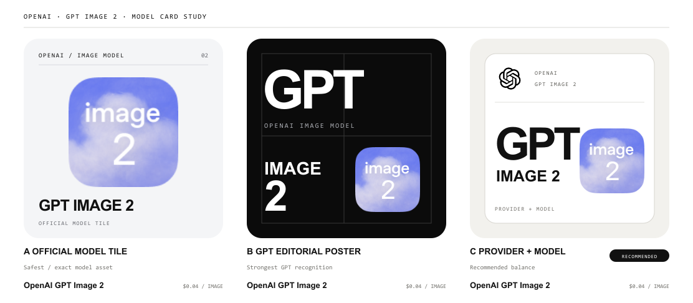

# Home — OpenAI GPT Image 2 model-card study

Status: owner decision recorded 2026-07-28. Use the original official
model-specific icon without an editorial redesign.

## Decision to make

The current abstract illustration does not identify OpenAI or GPT Image 2. The cover must be model-specific at rail-card size while preserving the existing homepage layout.

## Official evidence

- OpenAI identifies the wordmark as its primary logo, requires prescribed clear space, and says not to alter, crop, texture, or combine it with the Blossom. The Blossom must remain unmodified, monochrome, secondary, and placed with ample open space: <https://openai.com/brand/>
- OpenAI’s help center shows the official ChatGPT icon as a black Blossom on white: <https://help.openai.com/en/articles/7905742-what-does-the-official-chatgpt-ios-app-icon-look-like>
- The official model catalog supplies a dedicated GPT Image 2 icon and describes the model as its state-of-the-art image generation and editing model: <https://developers.openai.com/api/docs/models/gpt-image-2>
- The official ChatGPT Images launch emphasizes precise editing, instruction following, transformations, and stronger text rendering. A model card should therefore communicate an image product rather than a generic “AI” abstraction: <https://openai.com/index/new-chatgpt-images-is-here/>

## Visual philosophy — Recognizable, exact, quiet

The card is a catalog identifier, not an independent brand campaign. Recognition should come from the exact model name and official assets, not from a newly invented symbol.

OpenAI’s marks keep their supplied proportions and colors. Any editorial layer lives around them, never inside them. White space is functional: it protects the provider identity and prevents the rail from becoming a wall of decorative noise.

The cover uses two levels of identity. “GPT” provides immediate family recognition; the official “image 2” tile provides model-level specificity. The existing card footer remains the authoritative name and provider label.

Three structures tested a spectrum from strict official-asset usage to stronger
editorial recognition. The owner rejected the redesign layer in favor of the
original model icon, so the production card uses the official GPT Image 2 tile
directly.

## Candidate comparison

### A — Official model tile

Uses the official GPT Image 2 model icon as the dominant object. It is the safest and most literal option, but “GPT” recognition depends more on the text.

### B — GPT editorial poster

Uses large exact “GPT” typography plus the complete official model icon. It is the fastest to recognize in a moving rail, but has the strongest editorial voice.

### C — Provider + model lockup

Keeps the official ChatGPT mark small and protected, pairs it with exact GPT
Image 2 naming, and retains the official model icon. This direction was not
selected because the catalog should not redesign model identity.

## Implementation boundary

The approved implementation replaces only:

`public/homepage/production/models/image/gpt-image-2.png`

Do not change card dimensions, rail spacing, typography below the cover, or any other model cover during this key-slice approval.

## Asset provenance

- `official-gpt-image-2.png` — downloaded from the official OpenAI developer model page asset.
- `official-chatgpt-icon.png` — downloaded from the official OpenAI Help Center app-icon article.
- Both remain unmodified inside the candidates; only placement and scale change.
