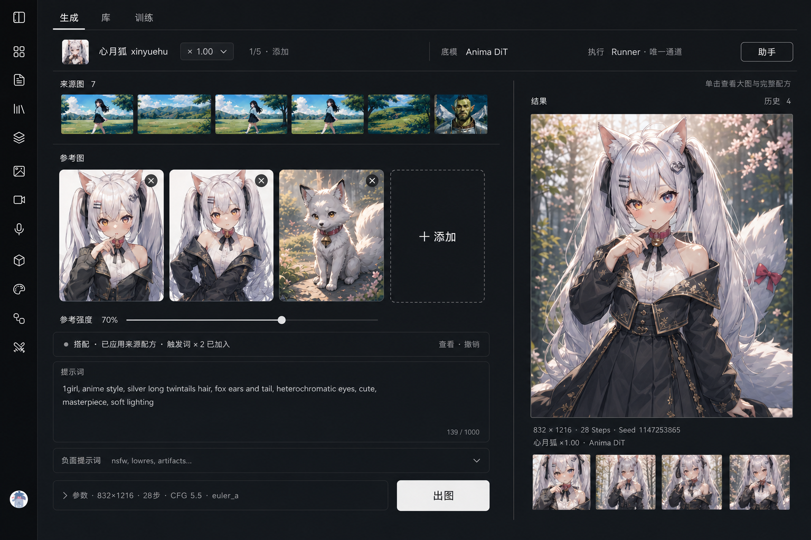
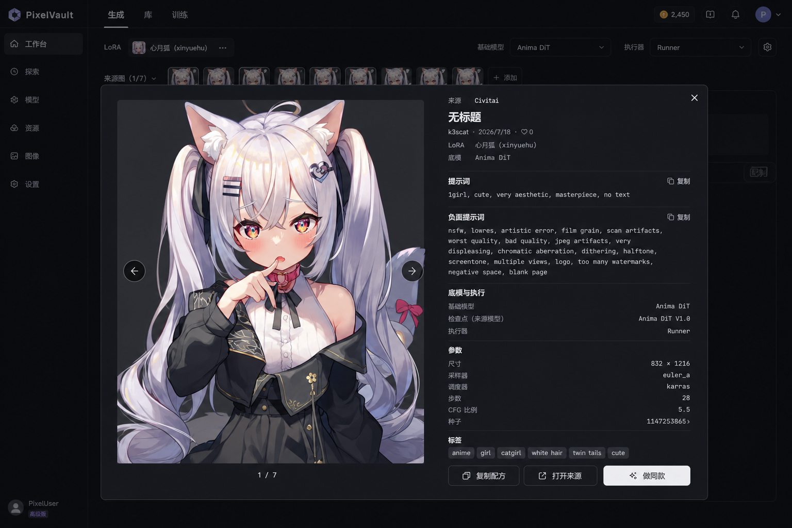

# LoRA Generate 页面设计

> 状态：**桌面关键切片已确认 / 已进入限定实施交接（2026-07-19）**。本文记录 owner 逐项确认后的 Generate 结构、状态和行为边界；页面文档本身不扩张修改范围，桌面实现只按 [`../../plans/lora-ui-refactor-claude-handoff-2026-07.md`](../../plans/lora-ui-refactor-claude-handoff-2026-07.md) 授权。移动端结构、完整视觉 token 数值和全部高保真状态仍需后续补齐。
>
> 上游业务契约：[`../domains/lora.md`](../domains/lora.md)。当前可运行功能与回归依据：[`lora-workbench.md`](lora-workbench.md)。Library 已确认方向：[`lora-library.md`](lora-library.md)。逐项决策账本与未选方向：[`../../plans/lora-visual-redesign-2026-07.md`](../../plans/lora-visual-redesign-2026-07.md)。

## 1. 页面职责

Generate 负责把已经选择的 LoRA、底模、来源证据、用户参考图、Prompt 和真实生成参数组织为一次可检查、可迭代的出图任务。唯一主工作流是：

**当前装配 → 生成输入 → 出图 → 结果**

来源配方与助手属于按需辅助层，只能修改或解释主台中的真实内容，不能重排主台、创建第二套生成骨架，或让结果区失去可用尺寸。

本页不负责 LoRA 发现与收藏、完整来源浏览、训练任务或长期资产管理；这些分别流转到 Library、Train 和资产域。

## 2. 已确认方向

- 结构方向：**A「并排监视台」**。
- 核心关系：桌面端左侧完整输入、右侧稳定结果，保持“改输入 → 出图 → 对照结果继续修改”的最短闭环。
- 装配身份：顶部无卡片装配行；来源图是其下独立的效果证据带，不使用常驻左侧装配脊柱。
- 视觉方法：借鉴 Claude.ai / ChatGPT 产品工作台的任务聚焦、排版主导、克制容器和按需控件，不复制其品牌皮肤。
- 明暗基调：中性深炭工作台。避免纯黑大块、蓝黑浮层、发光渐变、玻璃效果、card/pill 堆叠和装饰性 chrome。
- 未选方向：B「居中工作单」和 C「装配脊柱」只保留在 active plan 中作为比较证据，不进入实现阅读链。

## 3. 已确认桌面关键切片

该图确认桌面主状态的结构、比例、注意力顺序和内容边界，不是具体颜色、字号、圆角、阴影或间距数值的像素规范。图中状态为：**已挂载 LoRA、助手关闭、已有参考图、搭配提醒收起、Negative Prompt 收起、参数收起、已有生成结果**。

### 3.1 顶部与来源证据

1. 应用模式导航“生成 / 库 / 训练”直接位于内容顶部，不增加“工作台”标题栏。
2. 导航下只有一条无外层卡片的装配行，按顺序呈现当前 LoRA、权重、容量、底模身份、执行通道与助手入口。
3. 底模身份与执行通道必须分层表达。当前 Anima DiT 只支持 Runner 时显示静态“Runner · 唯一通道”，不得伪造成 fal/Runner 下拉。
4. 来源图带位于装配行下方，横向展示 LoRA 的效果证据。已挂载时出现；未挂载时整条消失，不保留空容器。
5. 单击来源图打开共享的“大图 + 右侧参数库”modal，不在主台同时常驻缩略图和完整配方。

### 3.2 左侧输入区

1. 助手关闭的正常桌面状态占主台约 60%。内容按自然文档流排列，不做固定高度面板。
2. 参考图位于 Prompt 上方。已有内容时使用较大的预览卡横排，单图可预览/移除，末尾保留同尺寸“＋ 添加”；下方只有一个全局参考强度。
3. 没有参考图时只显示低高度添加入口，不预留大卡片高度，也不显示无效的参考强度。
4. 搭配提醒默认是一行状态条；点击后在原位置向下展开差异、保留项、应用与撤销，不挤出第二个工作区。
5. Prompt 是主编辑面，桌面默认高度约 200–240px，并允许继续向下扩展。参考图与参数不得把它压缩成短输入条。
6. Negative Prompt 默认折叠；已有内容时在标题行显示可理解的摘要。
7. 参数是 disclosure，不是 Switch。收起时显示尺寸、Steps、CFG、采样器等摘要；详细参数从操作行下方向下展开，不反向挤压 Prompt。
8. 桌面“出图”只出现一次，位于左侧参数摘要同一条自然流操作行。不使用 sticky/fixed 底栏，也不在结果列重复。

### 3.3 右侧结果区

1. 助手关闭的正常桌面状态占主台约 40%，大结果图是绝对主角。
2. 单击大图打开现有全屏/大图预览。
3. 图片下只显示尺寸、Steps、Seed、当前 LoRA 与底模等可核对元信息。
4. 生成超过一张后显示本次会话缩略历史；点击缩略图切换主图。该记录刷新即清空，不描述为长期资产。
5. 结果沿现有链路自动持久化，不显示“入库”。普通结果不显示“做同款”“重出”或没有真实动作支撑的更多菜单。

## 4. 来源配方 modal

Library 样例图与 Generate 来源图共用同一个 dialog 行为和字段结构：

- 桌面端使用大尺寸 modal；左侧固定展示大图，右侧独立滚动展示 Prompt、Negative Prompt、底模/checkpoint、尺寸、采样器、调度器、Steps、CFG、Seed、标签与复制动作。
- 点击遮罩、按 Esc 或关闭按钮退出；关闭后焦点回到触发图片，主台结构、输入和滚动位置不变。
- Generate variant 增加“做同款”。它只把真实可用的 Prompt、Negative Prompt、底模和参数应用到主台并关闭 modal，不自动发起付费生成。
- 主台已有输入时，“做同款”必须进入搭配提醒，不得静默覆盖。

确认图：

## 5. 状态矩阵

| 状态              | 主台保持不变的部分           | 允许变化的部分                                                   |
| ----------------- | ---------------------------- | ---------------------------------------------------------------- |
| 已挂载 · 助手关闭 | 60/40 输入与结果骨架         | 显示 LoRA 装配与来源图带                                         |
| 未挂载 · 助手关闭 | 输入 → 出图 → 结果顺序       | 装配行退化为底模与去 Library 入口；来源图带消失                  |
| 已挂载 · 助手打开 | 输入和结果顺序、可用尺寸底线 | 助手可读取 LoRA、触发词、来源配方、参考图、底模和参数            |
| 未挂载 · 助手打开 | 纯底模生成主线               | 助手只读取底模、Prompt、Negative、参考图和参数，不伪造 LoRA 语义 |
| 搭配提醒展开      | 装配、Prompt、结果位置关系   | 状态条在原位向下展开，应用后写回主台                             |

助手桌面目标宽度约 380px。扣除助手后主台仍至少有 900px 时才停靠，此时输入不得低于约 540px、结果不得低于约 360px；不足时改为右侧覆盖式。关闭助手后恢复 60/40 与原滚动位置。助手建议必须先进入可审阅变更卡，用户点击“应用”后才写入搭配提醒；助手不能静默改写或直接出图。

## 6. 共享行为与页面专属边界

### 共享行为

- 应用 shell、模式导航行为和 i18n 基础。
- ResponsiveOverlay/dialog 的键盘、Esc、遮罩关闭、焦点圈定与 focus return。
- 图片上传、粘贴、最近素材、素材库选择、预览和移除能力。
- 生成 loading/error/disabled/success、参数校验和现有持久化链路。
- 图标语义、ARIA、键盘路径、命中区和 reduced-motion 底线。

### Generate 专属外观与 token 作用域

实现时由 LoRA Generate 的 domain/page token 负责工作区表面、发丝分隔、输入表面、结果监视面、弱文本、焦点和主要动作层级；不得把这些视觉值写回全局组件皮肤。具体 token 名称和值尚未拍板，不能从确认图取色或把现有全站 card/pill 样式当作默认答案。

## 7. 三个标志性组件

1. **装配与来源证据头**：一行读完当前 LoRA、底模和执行身份，下一行用来源图证明效果。
2. **参考图 + Prompt 输入栈**：大参考图承担视觉判断，Prompt 保有稳定创作空间，搭配和高级参数按需展开。
3. **稳定结果监视列**：大图持续可见，元信息可核对，会话历史轻量切换，不与输入争夺主动作。

## 8. 与其他域的差异和非目标

- 不得像 Studio Image 的浅色底部 composer 或“结果漂浮在输入之外”的结构；LoRA Generate 的装配证据与大结果必须和输入形成稳定同屏关系。
- 不得像 Library 的搜索筛选与单列效果流；Generate 不承担发现和收藏。
- 不得像 Canvas 的无限空间、节点或关系编辑；Generate 是有明确开始与结果的线性迭代台。
- 不得把 Train 表单、Gallery 社交动作、Assets 文件管理或 Prompts 模板管理藏入高级设置。

## 9. 尚未确认与实现门

- 移动端主结构、移动端是否使用底部 sticky 出图，以及软键盘下的操作可达性。
- 助手停靠态与覆盖态的高保真切片、移动端近全屏 sheet。
- loading、error、disabled、空结果、多挂载和参数展开态的最终视觉细节。
- 域级与页面级 token 的具体值、组件 variants 和动效参数。

已确认的桌面方向 A 可以按 Claude 实施任务包进入小切片实现；未确认的移动端、助手高保真皮肤和 token 数值不得在实现中自行补造。每个桌面切片仍需对照 `docs/checklists/ui.md` 并由 owner 真机目验，不能把部分桌面落地描述成整页响应式完成。

## Last Verified

2026-07-19：owner 逐项确认顶部装配、来源图、参考图、Prompt/参数、结果列、助手阈值和桌面出图动作，并确认修订后的 A「并排监视台」桌面关键切片。确认图由 imagegen 根据低保真 A 结构和已确认参考图区域生成；仅沉淀文档与图片资产，未修改运行代码。
