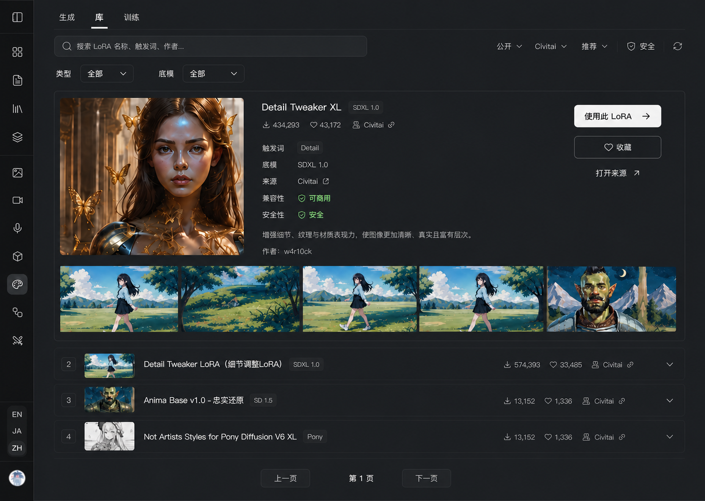

# LoRA Library 页面设计

> 状态：**桌面关键切片已确认 / 已进入限定实施交接（2026-07-19）**。本文记录 owner 逐项确认后的 Library 结构与内容边界；页面文档本身不扩张修改范围，桌面实现只按 [`../../plans/lora-ui-refactor-claude-handoff-2026-07.md`](../../plans/lora-ui-refactor-claude-handoff-2026-07.md) 授权。响应式与未确认状态不得由实现会话自行补造。
>
> 上游业务契约：[`../domains/lora.md`](../domains/lora.md)。当前可运行功能与回归依据：[`lora-workbench.md`](lora-workbench.md)。

## 1. 页面职责

Library 是 `/studio/lora` 的高频默认入口，负责发现、判断和管理可用于生成的 LoRA 资源。它首先帮助用户回答三个问题：

1. 这个 LoRA 的效果是否符合预期？
2. 它是否适配当前底模与使用条件？
3. 是否要收藏、查看来源，或立即挂载后进入 Generate？

Library 不承担提示词编辑、来源配方回放或完整生成器职责。

## 2. 已确认方向

- 结构方向：**聚焦浏览**。
- 内容节奏：**单列宽幅效果流 + 选中项原位置展开详情**。
- 视觉方法：Claude.ai / ChatGPT 产品工作台式的任务聚焦、排版主导、克制容器与按需控件。
- 明暗基调：克制的中性深色工作台；使用柔和炭灰和细分隔组织层级，避免纯黑、蓝黑大浮层、高饱和强调、卡片/pill 堆叠。
- 页面顶部：删除内容区上方只显示“工作台”的冗余顶栏与重复账号入口；保留应用左侧 shell。

## 3. 已确认桌面关键切片

该图用于确认结构、注意力路径、控件层级和内容边界，不作为像素级 token 或移动端规格。

### 页面顺序

1. Generate / Library / Train 工作模式直接位于内容顶部，Library 为当前模式。
2. 搜索框是主要发现入口；公开/我的、来源、排序、安全与刷新保持可达，但视觉层级低于搜索和结果内容。
3. 类型与底模使用两个独立下拉/组合框，触发器持续显示当前值；底模选择需要支持检索大量候选。
4. 结果按单列宽幅节奏呈现。未展开项保持紧凑，展示缩略效果、名称、底模、来源与必要热度信息。
5. 选中项在原位置展开，不把用户带离当前浏览位置。展开内容按“效果证据 → 判断信息 → 下一步动作”组织。
6. 分页位于结果流末尾，明确提供上一页、当前页和下一页。

### 展开详情

- 大幅效果图和样例带先获得注意力。
- 中部信息保留名称、底模、来源、触发词、兼容性、安全性、作者及必要说明。
- 右侧动作固定为：**使用此 LoRA**（主）、**收藏**（次）、**打开来源**（低层级外链）。
- “使用此 LoRA”点击后立即挂载，并携带当前 LoRA 进入 Generate；不弹二次确认。
- 卡片本身的普通点击只负责打开详情，不直接挂载。
- 样例带中的单张图片可以继续打开“来源图配方详情”：在当前页面上方使用大尺寸 modal 并列展示大图与结构化配方，而不是跳转新页面或把整块配方常驻塞回 Library 行内详情。
- modal 左侧固定展示大图，右侧独立滚动参数；点击遮罩、按 Esc 或关闭按钮退出。打开与关闭不改变 Library 结果流的位置。
- 该 modal 与 Generate 的来源图详情共享 dialog 行为、图片浏览、字段结构、复制能力、焦点管理和响应式行为；不同上下文只追加各自真实动作。
- Generate variant 可以追加“做同款”，但该动作只应用真实可用配方并返回 Generate 主台，不直接发起生成；Library variant 不承担此动作。
- owner 已确认桌面 modal 关键切片：[`assets/lora-source-recipe-modal-desktop-2026-07.png`](assets/lora-source-recipe-modal-desktop-2026-07.png)。该图确认的是共享 dialog 骨架与 Generate variant，不授权从图中反推未拍板的完整 Generate 页面结构。

## 4. 明确移除的内容

Library 的行内 LoRA 详情不常驻展示以下整块能力：

- 试用提示词；
- 来源图配方；
- 带词去生成；
- 复制配方。

效果样例仍保留，用于判断 LoRA 能力。点击单张样例后允许在共享的来源图详情 modal 中阅读该图配方；配方恢复、编辑和实际生成仍属于 Generate 上下文。

## 5. 不能从关键切片擅自推导的内容

- 不得把图中的具体字号、间距、圆角、阴影或颜色数值直接升级为域级 token。
- 不得假定移动端沿用桌面单列的所有横向信息组织。
- 不得因视觉精简移除来源差异、兼容性、安全、真实分页或已接通的业务状态。
- 不得从现有运行页面复用全站 card、pill、浅色 composer 或蓝黑 overlay 皮肤作为 LoRA 默认外观。
- 已确认桌面结构可按 Claude 实施任务包进入小切片实现；完整响应式与未确认视觉选择仍需 owner 复核，键盘/焦点、加载/错误/空态则作为实现质量底线保留。

## Last Verified

2026-07-19：owner 完成方向选择与收口反馈，确认单列宽幅效果流、原位置展开详情、类型/底模双下拉、真实分页、使用/收藏/打开来源，以及移除 Library 内的常驻提示词/来源配方块；随后确认样例图与 Generate 来源图共用“大图 + 右侧参数库”的 modal 骨架。未修改运行代码。
