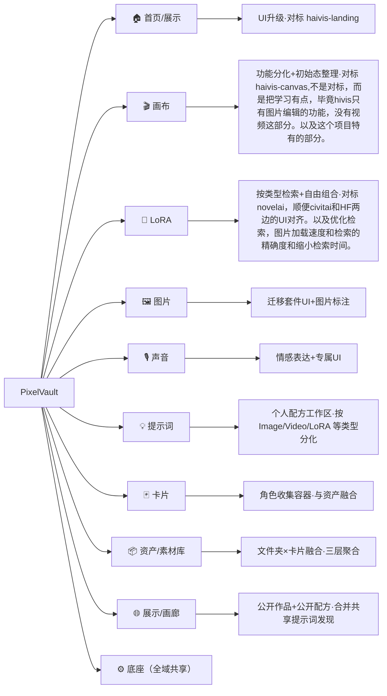
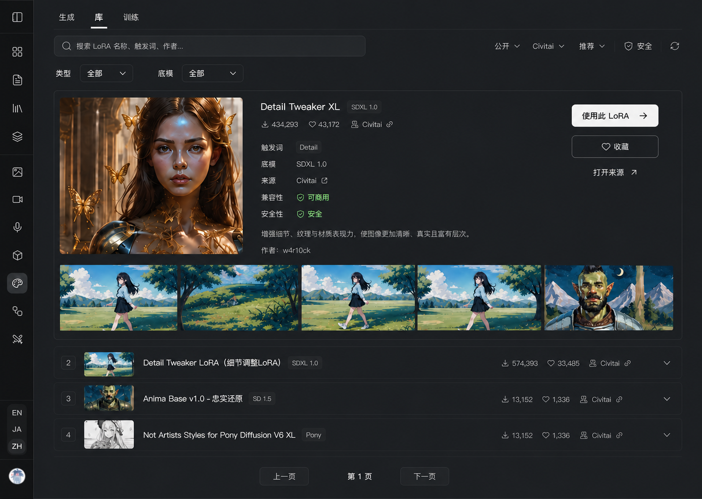

# PixelVault 项目逻辑图（你填 · 我扩充）

> **编排**：下面 §1 是**简洁结构图**（你继续在这里加/改分支）；§2 是我补的**各分支现状**（你想做 ↔ 目前真实情况，你逐条对一下）。
>
> **改 Mermaid 三招**：加节点 `父 --> ID["名字"]`／改名字改引号里的字／换方向 `TD`(上下)↔`LR`(左右)。
>
> **进度记号**：✅ 基本成熟　🔧 有主体待升级　⬜ 待做／想法阶段

---

## 1 · 结构总览

---

## 2 · 各分支现状（你想做 ↔ 现状 · 你对一下）

### 🏠 首页 / 展示　🔧

- 🎯 你想做：UI 升级；每个介绍面板升级；整体布局升级；展示公开资源。参考 [haivis-landing](ui-inspiration/haivis-landing-2026-07.md)（你喜欢的登录页 UI）。
- 📍 现状：首页「白厅画廊」已成型——整页米白 + 头尾暗书挡（hero/footer）+ 6 个真功能两栏交替（图/视频/音频/画布/LoRA/图生3D）+ 深窗 Step1–4 流程。组件 `HomepageCapabilityMatrix` / `HomepageMenu` / `HomepageRevealMotion` / `CapabilityForm`；登录 `AuthPageShell`。
- 💡 衔接：haivis-landing 你已标注（2026-07-13）——**登录改 modal 窗**、元素拆分/前后对比/文字图层/魔法擦除的**动效语法 = 喜欢**；纯黑大衬线 + 超大留白 = 仅参考。施工落点已指向 `docs/references/pages/home.md`。"展示公开资源"可复用 Gallery 公开 feed 的作品做证据。
- 登录状态

### 🎬 画布　🔧

- 🎯 你想做：学习 [haivis-canvas](ui-inspiration/haivis-canvas-2026-07.md)；整理初始状态；功能明确分化——助手、编辑图片、生成视频、管理资源（卡片收集一个角色的图片/声音）。
- 📍 现状：节点按模态收敛为 5 类；助手=剧本脑→ScriptDoc→autospawn 投影节点；两阶段脚本流（大纲→镜头）引擎已落、**UI 两道门待做**；cast v2（缩略图/特写/自动编号/视频引用）已交付；视频汇点用 Seedance reference。services `node-workflow`/`script-breakdown`/`story`；核心状态 `studio-context.tsx`（47 files 高风险）。
- 💡 衔接：haivis-canvas 你已确认整套 CSS/助手布局作为**画布重构对标**（大画布 + 可收起固定右助手 / 选中对象近场工具条 / 附件·模态·模型·思考独立披露）。落点 `docs/references/pages/node-canvas.md`。你说的三件事分别落到：**编辑图片**→图片域迁移/编辑能力接进画布；**生成视频**→视频汇点(已有)；**管理资源(卡片)**→卡片×资产融合（见下）。

### 🧬 LoRA　🔧

- 🎯 你想做：参考 novelai 升级生成页；检索功能（人物 lora / 衣服 lora / 表情 lora …）；生成时自由搭配组合 lora。
- 📍 现状：已拆独立域（/studio/lora：生成/训练/库[公开|我的]）；recipe-first（还原 + 定制）；**多 LoRA 混挂 + 配方面板是现状已有**（别重造）；danbooru 词库 + prompt-tag 引擎；runner（RunPod ComfyUI）已上线、底模按需下载；搜索走 multi-search。
- 💡 衔接：你要的"自由搭配组合"——多挂已有基础，**缺的是按类型（人物/衣服/表情）检索的分类标签 + 组合 UI**。NovelAI 方向明确。当前业务收口施工图见 `docs/references/pages/lora-workbench.md`；旧评审 `docs/archive/reviews/2026-07-02-lora-domain-ui-review.md` 仅作历史依据，未来视觉需重新走域级确认。
  

### 🖼 图片　🔧（后端比你以为的多）

- 🎯 你想做：升级 UI（方向未定）；服装迁移 / 动作复刻 / 图片设计 / 画风迁移；图片标注（框选标注改哪里，精确修改）。原话："这些目前还想不到怎么去设计"。
- 📍 现状：**迁移套件后端已建骨架**——`image-transform.service.ts` 是 5 维度策略：**画风迁移(style) ✅、动作复刻(pose) ✅ 已实现**；服装迁移(garment)/背景/细节 = schema 已预留、目前返回 501 待实现。另有 inpaint/outpaint 编辑器、**元素拆分**（`LayerDecomposePanel` + `extracted-element` service）、KeepChange、变体网格。constants `transform-dimensions` / `style-presets` / `edit-tasks`。
- 💡 衔接：所以动作复刻/画风迁移**不用从零设计，后端已通、缺入口 UI**；服装迁移只差实现一个 handler（架构位已留）。"图片标注"你之前设想过（框选区域+挂注释·DevTools 检查器式·编号框上图+指令进 prompt），可直接从那个设想起步——正好呼应 haivis"图上叠交互证据"。

### 🎙 声音　🔧

- 🎯 你想做：最需要升级情感表达；UI 特定化升级。
- 📍 现状：VoiceCard 角色声音库（可绑 CharacterCard）；services `audio-reference` / `fish-audio-voice`；`AudioTranscribeDialog` / `StudioAudioFeedback`。
- 💡 衔接：**情感表达已有施工基准** `docs/plans/audio-domain-design-2026-07.md`（audioKind 属性 / 情绪默认有意图→Creative 无→Natural；**Phase A 情绪见效最先**）。你这条和已拍板方向完全一致，可直接进 Phase A。

### 💡 提示词　🔧（产品边界已重定，待 UI 试点）

- 🎯 你想做：收敛为个人配方工作区；删除“我的模板/共享提示词库”双层级；把类型导航放到最上层，以 `/prompts/image`、`/prompts/video`、`/prompts/lora`、`/prompts/audio` 独立路由承载各自配方结构；进入类型页先找和复用已有配方，新建/编辑居次。
- 📍 现状：`/prompts` 仍是 Recipe 模板 + `InspirationPrompt` 灵感库双 Tab；共享库、clone API/service/hook 和公开 Recipe merge 均仍在运行，尚未删除。
- 💡 衔接：公共配方发现并入 Gallery；Prompts 只保留草稿、从 Gallery 保存、编辑、版本、标签、作品血缘和送往创作域。后续删除范围与未决项见 `domains/prompts.md`；进入 UI 设计时按 `../scenes/ui-page.md` 单独启动该域流程。
- 🧭 设计边界：Image / Video / LoRA / Audio 不是通用配方表单的四个筛选态，而是四份独立契约；例如 Image 只负责 Prompt / Negative Prompt，不出现 LoRA 参数。

### 🃏 卡片　✅（域已完整）

- 🎯 你想做：（你在画布/资产里提到）角色收集容器——一个角色的图片、声音等聚在一起。
- 📍 现状：Cards 域已很完整——`character-card`(角色一致性) / `style-card`(画风) / `background-card`(背景) / `card-recipe`(配方) 四类 service + scoring + refine + cardify；大量组件（`CharacterCardManager` / `StyleCardManager` / `CardifyPreview`）。
- 💡 衔接：你说的"卡片收集角色的图/声音" + "文件夹和卡片融合"是**同一个设想**——把角色卡升级成"一个角色的图/视频/音频/3d 聚合容器"。见资产分支。

### 📦 资产 / 素材库　✅（大体完成，缺架构升级）

- 🎯 你想做：大体完成；文件夹和卡片融合管理；一个文件夹装一个角色的图/视频/音频/3d；再用场景或项目包含这些卡片。
- 📍 现状：私有素材库（浏览/上传/文件夹/批量/详情复用）；services `collection` / `project`；四模态（图/视频/音频/3d）。P0 待办=检索露出 + picker 场景化重设计（`assets-optimization` 调研）。
- 💡 衔接：你的信息架构设想 = **三层聚合：角色卡（聚合一个角色的多模态素材）→ 场景/项目（聚合多张卡）**。现状 collection/project/cards 是分开的，融合它们是一个跨 **卡片×资产×画布** 的架构升级，值得单独拉一张施工图。

### 🌐 展示 / 画廊　✅

- 🎯 你想做：优化 UI；承接公开作品自带配方的发现与复用；可能做社区管理。
- 📍 现状：公开 feed + 详情（gallery）；Profile 创作者主页（/u）；follow/like service；`GalleryAdvancedFilters` / `GalleryFilterBar`。
- 💡 衔接：公共单位仍是作品/图集，Prompt、模型、参数、seed、LoRA 等作为经授权清洗的作品配方展开、比较和复用；Prompts 不再另做公共 feed。⚠ "社区管理"仍不是当前主定位。

### ⚙ 底座（全域共享，你没提，仅登记）

- Providers ×10 · Runner(ComfyUI/RunPod) · R2 归档 · Clerk/Credit/i18n · model-router/model-health。一般不作为需求域，除非要动模型阵容或执行架构。

> **次要域**（Arena 模型对战 / Storyboard 分镜 / 3D）：你这次没提，按 `product.md` 是 gate 住的（图片和 LoRA 完善后再推），先不展开。

---

## 变更记录

| 日期       | 变更                                                                                                        | 谁            |
| ---------- | ----------------------------------------------------------------------------------------------------------- | ------------- |
| 2026-07-16 | 建立协作骨架                                                                                                | Claude        |
| 2026-07-16 | owner 填 6 域想法                                                                                           | owner         |
| 2026-07-16 | 补 提示词/卡片 分支 + 各域现状核实扩充（读 haivis 双文档 + 核实 image-transform 等代码）                    | Claude        |
| 2026-07-19 | Prompts 收敛为个人配方工作区；共享提示词发现并入 Gallery，独立共享库与 `InspirationPrompt` 链路列入后续删除 | owner + Codex |
