# Haivis 画布工作区 UI 拆解（2026-07）

> 状态：**owner 已确认的画布对标输入**（2026-07-13）。结构、CSS 密度与助手交互值得学习；采用时仍翻译进 PixelVault 的深炭制片桌、纸卡与自适应命中区/a11y 规则，不做 1:1 复制。
>
> 来源：`haivis.ai/images/projects/<project-id>` · 截图日期：2026-07-13 · 视口：桌面宽屏。
>
> 相关案例：[Haivis 官网](haivis-landing-2026-07.md)。

## 一句话判断

这套画布最值得参考的是**空间分工**：画布负责直接操作对象，右栏负责用自然语言发起生成，底部 dock 负责插入与切换工具；只有当前对象被选中时，编辑能力才在对象附近出现。它不是靠更多面板体现专业，而是让控制在需要时靠近目标出现。

2026-07-13 owner 进一步确认：不仅交互方法值得参考，**整套工作区 CSS 的克制、密度、层级和助手布局也作为 PixelVault 画布重构的明确对标**。这里的“对标”指复用尺度关系与交互语法，不是把暖炭画布改成 Haivis 白板或复制蓝紫选中色。

## 工作区骨架

```text
顶栏：返回 / 项目名                           额度 / 账户
┌───────────────────────────────┬─────────────┐
│                               │ 对话标题与会话动作 │
│                               │             │
│        无限画布               │ AI 助手      │
│   选中对象 → 上方上下文工具条   │             │
│   快捷编辑 → 对象下方 prompt   │             │
│                               │             │
│ HUD：图层 / 历史 / 缩放          │ composer    │
│          底部创建工具 dock       │ +/模式/模型/发送 │
└───────────────────────────────┴─────────────┘
```

界面有三类控制面：

1. **永久控制**：项目导航、画布 HUD、底部 dock、右侧助手；
2. **选择控制**：对象边框、尺寸、上下文工具条；
3. **临时控制**：上传、历史、分享、模态、模型、思考模式等 popover，以及快捷编辑 prompt。

## 截图索引

### 01 · 空画布与常驻区域

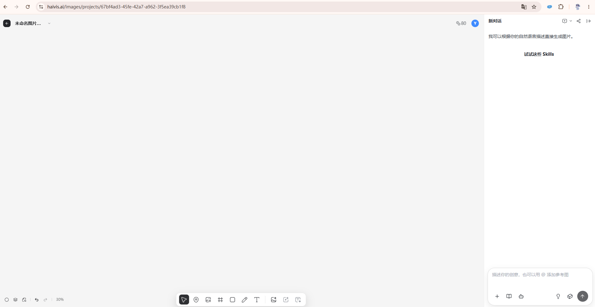

- 画布占据绝大多数视口，右侧助手保持固定窄栏。
- 顶部没有传统应用导航条，只保留返回、项目名、额度与账户。
- 工具被拆到左下 HUD、底部 dock 和右侧 composer，中心保持干净。

### 02 · 图片选中态

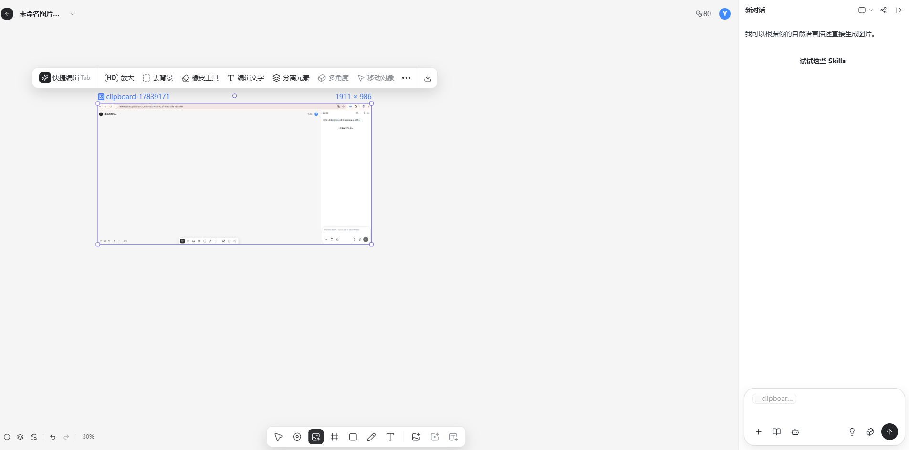

- 图片用细蓝紫边框、四角把手、顶部文件名与尺寸表达选中状态。
- 对象工具条悬浮在图片上方，而不是占用固定属性栏。
- 助手里出现当前图片引用 chip，画布选择与对话上下文产生联系。

### 03 · 画布插入菜单

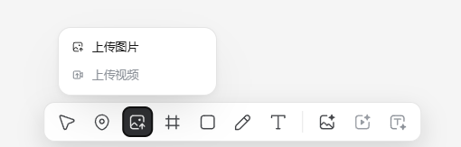

- 图片按钮既是当前激活工具，也是上传菜单入口。
- 上传图片可用、上传视频不可用；不支持能力保留可见但降级。
- 菜单贴近触发器，用户不会离开当前画布上下文。

### 04 · 历史会话

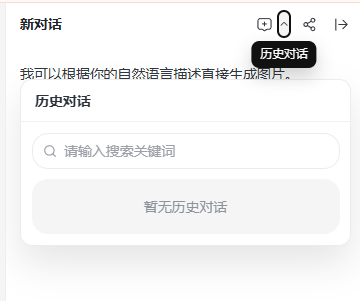

- 历史记录是右栏内的临时层，不跳转到新页面。
- 搜索和空态都收在同一 popover 内，当前画布仍可感知。

### 05 · 分享当前对话

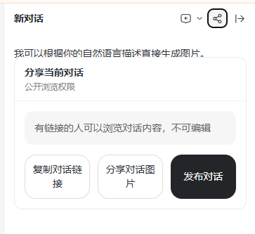

- 明确说明“有链接的人只读”，先交代权限再给动作。
- 复制链接、分享图片、发布对话被区分成三个不同结果。
- 发布使用深色主按钮，其余动作保持次级。

### 06 · 助手附件来源

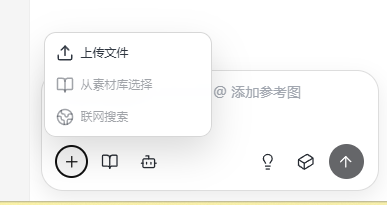

- `+` 只负责上下文来源：上传文件、素材库、联网搜索。
- 素材库是弱化状态，避免让不可用入口看起来可执行。
- 附件入口与画布底部“上传图片”看似接近，但一个给对话上下文，一个向画布插入对象。

### 07 · 生成模态

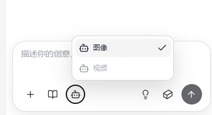

- 图像 / 视频在一个极短菜单里切换；当前选择用浅底和勾号确认。
- 视频不可用时保留架构位置，但不允许误触。
- 模态从模型选择中分离，减少单个菜单里的异构信息。

### 08 · 模型选择

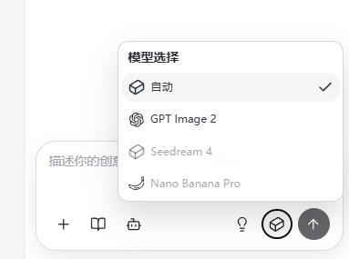

- `自动` 是默认首项，具体模型作为可选控制。
- 可用与不可用模型仍在同一列表中，能力边界可见。
- 模型菜单只显示名称，没有在此层堆参数、价格或能力说明。

### 09 · 思考模式

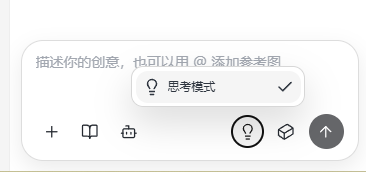

- 独立灯泡按钮承载推理模式，激活时用环形描边表达状态。
- popover 只有一个选项，说明这是模式开关而非设置页。
- 它与模型选择并列，避免把“模型是谁”和“怎么运行”混为一件事。

### 10 · 图片上下文工具条

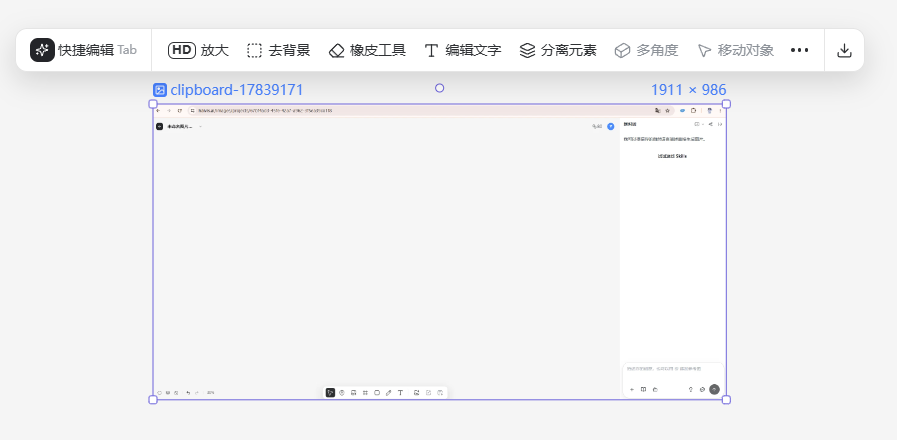

- 高频动作按意图排列：快速编辑、放大、去背景、橡皮、文字、元素拆分，再到实验能力和更多。
- 工具条与选中对象同宽度区域对齐，空间归属明确。
- 下载被分隔到最右侧，和编辑动作区分。

### 11 · 快捷编辑 prompt

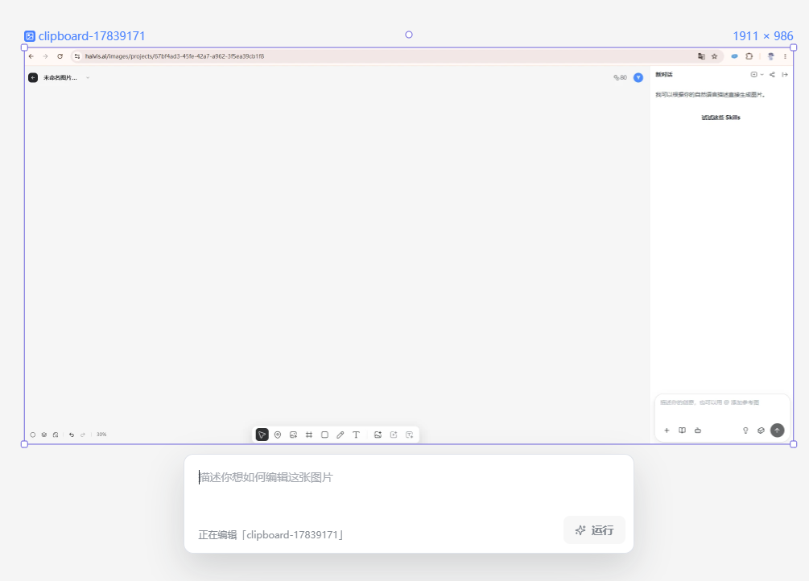

- 点“快捷编辑”后，prompt 面板出现在对象下方，形成“工具 → 对象 → 指令”的垂直关系。
- 面板明确显示正在编辑的文件名，降低误改其他对象的风险。
- `运行` 是面板内唯一主动作，没有把模型与高级参数同时暴露。

## 信息架构与渐进披露

Haivis 把复杂度分成四层，而不是塞进一个属性面板：

| 层级            | 何时可见     | 内容                             | 价值                               |
| --------------- | ------------ | -------------------------------- | ---------------------------------- |
| L0 · 工作区骨架 | 始终         | 画布、助手、dock、HUD            | 建立稳定空间记忆                   |
| L1 · 对象选中态 | 选中对象     | 边框、名称、尺寸、工具条         | 显示“我正在操作谁”                 |
| L2 · 单项工具   | 点击工具     | 上传、模型、历史、分享等 popover | 一次只处理一个选择                 |
| L3 · 任务面板   | 发起复杂编辑 | 快捷编辑 prompt                  | 给任务足够空间，同时保持对象上下文 |

值得注意的是，右侧助手 composer 自身也遵循相同分层：输入框常驻；附件、模态、模型、思考模式各自从独立按钮展开；发送始终固定在最右。

## Live CSS 与交互核验（2026-07-13）

本节不是从截图估算，而是在 owner 当前登录页面、桌面视口内读取真实 DOM、computed style，并逐项打开菜单核验。页面可见 viewport 为 1247×912；首次 browser comment 截图为 947×912，同一套布局规则成立。

### 页面几何与密度

| 部位          | 实测值 / CSS                                                                                    | 为什么观感更稳                                                 |
| ------------- | ----------------------------------------------------------------------------------------------- | -------------------------------------------------------------- |
| 页面壳        | `position: fixed; inset: 0; overflow: hidden`；底色 `#f4f4f3`；正文 `#202124`                   | 工作区严格占满视口，没有外层页面 padding 与第二层卡片边界      |
| 主分栏        | `grid-template-columns: minmax(0,1fr) 360px`                                                    | 画布与助手是两个稳定空间，不是浮层互相压住                     |
| 助手展开      | 固定 360px、全高、白底、左侧 `#eee` 1px 分隔；无圆角、无投影、无 backdrop blur                  | 右栏像工作区的一部分，不像叠在画布上的第三张卡                 |
| 助手收起      | 第二列从 360px 动画到 0；aside 保持 mounted，改 `pointer-events:none + opacity:0`；画布同步扩宽 | 状态连续、会话不丢、画布真的获得空间                           |
| 展开/收起动效 | grid columns + aside opacity/位移，`300ms ease-out`                                             | 同一空间变化走同一轨道，没有 mount 闪现                        |
| 字体基准      | `html 14px`、body 13px；主要工具正文 14/20，小字 12/16，权重 500/600                            | 信息密度高但层级仍清楚；优点来自统一刻度，不是把所有字随意缩小 |
| 画布控制      | 容器高 44px、外圆角 12px、内圆角 8px、边框 `#e5e5e5`                                            | 上下文工具条和底部 dock 看起来属于同一个系统                   |

Haivis 页面内可读到的核心变量：

| Token                                                       | 值                            |
| ----------------------------------------------------------- | ----------------------------- |
| `--canvas-control-height`                                   | `44px`                        |
| `--canvas-control-radius` / `--canvas-control-inner-radius` | `12px` / `8px`                |
| `--canvas-control-border`                                   | `#E5E5E5`                     |
| `--canvas-control-hover-bg`                                 | `#F5F5F5`                     |
| `--canvas-control-shadow`                                   | `0 10px 28px rgba(0,0,0,.14)` |
| `--canvas-control-menu-shadow`                              | `0 12px 26px rgba(0,0,0,.10)` |
| `--canvas-chat-composer-border`                             | `#DDDDDD`                     |
| `--canvas-chat-primary-pill-bg`                             | `#242529`                     |
| `--canvas-chat-soft-pill-bg`                                | `#F5F5F5`                     |
| `--canvas-text-size` / line-height                          | `14px` / `20px`               |
| `--canvas-text-small-size` / line-height                    | `12px` / `16px`               |

这套变量好看的关键不是具体 hex，而是**控制、菜单、composer、文字各只有一组尺寸语言**。PixelVault 应把比例翻译成 `node-*` 域 token，不能把 Haivis 变量或色值直接外搬。

### 三档浮层，不滥用卡片

1. **常驻控制条**：44px 高、12px 圆角、1px 边框、`0 10px 28px / .14` 投影。
2. **小菜单 / 历史 / 分享**：距助手左右 16px、顶部约 76px；12px 圆角、`#ececec` 边框、`0 18px 38px / .10` 投影、z30。
3. **对象任务面板**：快捷编辑在目标下方，12px 圆角、`#dfe3ea` 边框、`0 18px 44px / .16` 投影、z40；textarea 14/20、最小 76px，底部明确写“正在编辑谁”，只有一个运行主动作。

消息区本身反而几乎不用气泡：正文直接排在白底上，结果图片只用 4px 圆角和柔和灰底。复杂度集中在内容，不再给每条消息套卡片。

### 助手四层结构

```text
Header：会话名 | 新建 / 历史 / 分享 / 收起
Message stream：用户意图 / 自动路由标记 / 工具名 / 结果图 / 结果说明
Composer input：可见的当前图片引用 chip + 自然语言输入
Composer tools：附件 / Skills / 模态 | 思考 / 模型 / 发送
```

实测交互：

- **历史**：助手内 popover，带搜索与空态，不离开画布。
- **分享**：先写清“有链接的人只读、不可编辑”，再给复制链接 / 分享图片 / 发布三个结果不同的动作。
- **附件**：上传文件可用；素材库与联网搜索保留位置但禁用。
- **Skills**：显示带标题与结果描述的成套工作流，不只是一个 icon 列表。
- **Agent**：实质是图像/视频模态菜单；视频当前禁用。这个命名不适合原样搬到 PixelVault。
- **思考模式**：独立单项菜单，不与模型混在一起。
- **模型**：自动 / GPT Image 2 可用，其他模型显式禁用；选择层不堆参数。
- **收起**：画布同步扩宽，顶栏出现“打开对话”入口；会话 DOM 不卸载。

### 图片对象交互

- 图片被选中后才出现工具条；工具顺序为快捷编辑、放大、去背景、橡皮、文字、分离元素、实验能力、更多、下载。
- 点击快捷编辑后，上方长工具条暂退，目标下方换成单任务 prompt 面板，避免两套编辑控制同时抢焦点。
- “更多”不是再塞 AI 能力，而是对象管理：复制、创建副本、层级前后、水平/垂直翻转、删除。
- 生成结果进入助手消息流，同时仍作为画布对象存在；自然语言操作和直接对象操作形成一条连续反馈链。

### 与 PixelVault 现状的同屏差异

| 维度              | Haivis                            | PixelVault `/studio/node` 当前实测                              | 重构含义                                               |
| ----------------- | --------------------------------- | --------------------------------------------------------------- | ------------------------------------------------------ |
| 助手空间          | 360px 全高 grid 列                | 约 395×593 浮动 overlay，四周留空                               | 默认态改稳定分栏；展开 ScriptDoc 可保留更宽状态        |
| 助手 chrome       | 1px 分隔，无圆角/投影/模糊        | 18px 圆角 + 边框 + backdrop blur + `0 20px 60px rgba(0,0,0,.5)` | 当前过重；去掉“浮动玻璃卡”感                           |
| Node composer     | 338×121，输入与工具在一个白色壳内 | 约 393×193，外层分隔 + 大输入区 + 文本按钮                      | 收紧垂直高度，把次级能力拆成稳定小入口                 |
| Studio Image 助手 | —                                 | 448px 全高，但与 Node 助手是另一套 header/composer              | 共享视觉 shell，保留两边业务差异                       |
| 对象工具          | 选中后近场出现                    | 节点主要靠卡内控件和详情面板                                    | 给图片对象补 L1 上下文工具层，不给全部节点同一长工具条 |
| 页面密度          | 14px root、13–14px UI             | 16px root、16px 默认 UI                                         | 只做画布域密度 token，严禁全局改 root 字号             |

### PixelVault 两套助手的代码边界

- Node 是流式、text-only 的画布助手：节点摘要/引用、route、BYOK、research、ScriptDoc 与应用确认已经存在；图片附件、视觉理解、图片编辑执行、历史、分享尚不存在。
- Studio Image 实际与 video/audio 共用 `StudioAssistantDock` / `PromptAssistantPanel`：非流式、单参考图、语言/route/research、填入/追加/复制已经存在；它是 prompt 助手，不是图片编辑执行器。
- 可共享层只到 `AssistantDockFrame` / `AssistantHeader` / `AssistantComposerShell` / `AssistantMessageViewport` 与持久宽度原语；两套 hook、消息类型、API/service/system prompt 不合并。
- 现成地基优先复用 `ui/prompt-input.tsx` 的 IME/触屏 focus 处理，以及 `ImagePickerPopoverBody`、`MainModelPicker`、ResponsiveDialog/Popover 和 motion token。
- Node 还有四个先修风险：16 条消息 schema 在 service 截断前拒绝长会话、retry 重复 user turn、切项目不按 `projectId` 隔离、Studio 三模态共用 singleton 会话。历史 UI 之前先修这些正确性问题。

### 不能照搬的 CSS / 交互

- 助手头部 icon hit area 实测约 26–27px，composer icon 约 32px。PixelVault 采用更均衡的自适应规则：fine pointer 紧凑控件至少 32px、常规控件 36px；coarse pointer/touch 至少 44px；不照搬 26px 的头部目标。
- Haivis 结果图 hover 会 `500ms scale(1.05)`；PixelVault 没有明确操作反馈需求时不复制这种装饰动效。
- Haivis 会显示若干禁用能力；PixelVault 默认“不支持不渲染”，只有能解释产品边界时才允许保留禁用项。
- 不全局设置 `html { font-size:14px }`；只在画布域建立 14/20、12/16 的文字 token，并逐项过可读性。
- 不复制纯白画布、蓝紫选框和“Agent”命名；保留暖炭/纸卡/石绿与真实 capability 名称。

## 可复用设计模式

| 模式                       | Haivis 的做法              | 为什么有效                 | PixelVault 的翻译方式                                                   |
| -------------------------- | -------------------------- | -------------------------- | ----------------------------------------------------------------------- |
| 低 chrome 画布             | 大面积空白，只留必要 HUD   | 作品和空间关系成为主角     | 画布 chrome 保持克制，但沿用当前暖炭与场记卡体系，不改成白板            |
| 选择驱动工具               | 工具条只在选中图片后出现   | 未选中时不制造噪音         | 节点/散图选中后显示与类型匹配的近场动作                                 |
| 工具靠近对象               | 工具条在上、prompt 在下    | 视觉上明确动作属于谁       | 可用于图片节点快捷编辑；重参数仍进现有详情面板                          |
| 永久区与临时层分离         | dock 常驻，选项用 popover  | 保持空间稳定，又不牺牲能力 | 复用 PixelVault 的 `ResponsiveOverlay`，移动端改 Drawer                 |
| 对话引用当前对象           | composer 显示图片引用 chip | 自然语言操作不丢对象上下文 | 助手引用选中节点/素材时显示明确 chip 与移除入口                         |
| 模态 / 模型 / 运行方式分开 | 三个独立按钮               | 用户可建立不同心智模型     | Studio/助手可复用，但必须由 capability 决定是否渲染                     |
| 自动模型优先               | 自动置顶，专家可手选       | 新用户少决策，专家有控制   | 只在自动路由真实存在且可解释时使用，不做假自动                          |
| 权限先于分享动作           | 先说明只读范围             | 降低误分享焦虑             | 项目/对话分享必须先写清谁能看、能否编辑、是否公开                       |
| 不支持显性降级             | 视频、部分模型置灰         | 用户看见产品边界           | PixelVault 当前规则更严格：通常“不支持不渲染”；只有教育价值明确时才置灰 |

## 设计评议

### Anti-pattern verdict

**通过，但视觉个性弱于营销页。** 它没有常见 AI 深色霓虹、玻璃渐变或卡片宫格；工作区更接近 Figma / Miro 一类成熟白板范式。差异化主要来自“直接操作画布 + AI 助手”的组合和克制披露，而不是独特视觉造型。若脱离真实功能，仅保留白底、浮动圆角 dock 和线性图标，仍容易变成通用 SaaS 画布。

### 做得好的部分

1. **空间职责稳定**：画布、助手、插入工具不会因任务变化频繁换位。
2. **上下文连续**：选中对象、助手引用 chip、快捷编辑面板都持续告诉用户当前目标。
3. **控制拆分合理**：附件、模态、模型、思考模式没有混成一个“大设置”菜单。
4. **编辑能力贴近结果**：去背景、橡皮、文字和元素拆分直接出现在选中图片附近。

### 主要风险

| 风险                            | 为什么重要                                                              | 采用时的处理                                                          |
| ------------------------------- | ----------------------------------------------------------------------- | --------------------------------------------------------------------- |
| 两个 `+` / 两套上传入口语义接近 | 画布 dock 的上传是“创建对象”，助手 `+` 是“添加上下文”，新用户可能分不清 | PixelVault 必须在图标、tooltip 和反馈里明确“放到画布”与“交给助手参考” |
| icon-only 密度高                | 底部 dock、HUD、composer 大量依赖图标，首次使用发现性弱                 | 首次使用给文字标签或短时教学；tooltip 不是唯一说明                    |
| 工具条过长                      | 小画布、窄视口或多语言下容易溢出                                        | 高频动作固定，低频归更多；按对象类型与宽度动态裁剪                    |
| 浮层可能互相遮挡                | dock、对象工具条、prompt、右栏 popover 同时存在时层级复杂               | 定义同一时刻可开的浮层数量、关闭规则与 z-index 体系                   |
| 右栏固定占宽                    | 桌面清楚，平板和小屏会显著压缩画布                                      | 桌面可折叠；移动端用全屏/Drawer，不能照搬固定栏                       |
| 灰色禁用项对比偏低              | 用户可能看不清是禁用还是装饰                                            | 保证文字对比，并给原因；无教育价值时按项目规则直接不渲染              |
| 选中蓝紫色偏通用                | 与大量设计工具高度相似，品牌辨识弱                                      | 翻译成 PixelVault 已拍板的域色/选中 token，不复制色值                 |
| 空画布缺少起手势                | 截图空态几乎只有助手提示和“试试 Skills”，直接操作入口不够显眼           | PixelVault 继续坚持空态起手势，明确“拖入素材 / 创建节点 / 从脚本开始” |

## PixelVault 采纳分级

### A · 可直接采用的方法

- 选中对象后才出现类型相关工具；
- 当前对象名称、尺寸或类型与选中框一起显示；
- 助手引用画布对象时使用可见 chip；
- 复杂编辑指令贴近目标对象展开；
- 分享前先解释权限结果；
- 发送按钮位置稳定，次级控制独立展开。

### B · 需要翻译后采用

- 白色无限画布 → 保留 PixelVault 当前暖炭制片桌与节点语义；
- 底部通用工具 dock → 先与现有 CastDock / 画布 HUD 合并，不新增第四套常驻工具区；
- 图片编辑长工具条 → 按节点类型裁剪，只放当前对象真实支持的动作；
- 固定右侧助手 → 桌面 dock + 移动端 `ResponsiveOverlay`；
- 禁用能力可见 → 结合 PixelVault“不支持不渲染”规则逐项判断；
- 自动模型 → 需要真实路由、失败解释和最终所用模型可追溯。

### C · 不应照搬

- 不把 PixelVault 的语义节点画布降成无结构白板；
- 不同时新增底部 dock、固定属性栏和对象工具条造成多套入口；
- 不用 icon-only 取代关键任务名称；
- 不让右侧助手成为所有操作的第二套重复入口；
- 不用置灰项预告尚未确定的 provider / model 能力；
- 不复制蓝紫选中框、纯白画布和通用线性图标作为品牌语言。

## 与 PixelVault 现有画布的关系

Haivis 是“自由对象编辑画布”，PixelVault 当前是“带生成语义和素材收割规则的节点制片桌”，两者不能直接互换。

| Haivis 模式        | PixelVault 当前语义        | 候选启发                                                 |
| ------------------ | -------------------------- | -------------------------------------------------------- |
| 图片对象           | 散图 / 图片节点 / 参考资产 | 选中后出现近场快捷动作                                   |
| 底部插入 dock      | CastDock + 画布工具 HUD    | 检查入口是否可进一步收敛，不新增竞争 dock                |
| 右侧 AI 助手       | 剧本笺 / 助手 dock         | 引用选中节点 chip、保持对象上下文                        |
| 快捷编辑 prompt    | 节点轻编辑 / 详情面板      | 轻任务近场完成，重参数继续展开详情                       |
| 元素拆分等图片工具 | Studio 图像编辑能力        | 由 capability 驱动出现在图片节点，不给所有节点同一工具条 |
| 分享对话           | 项目/任务分享              | 权限说明先于复制或发布动作                               |

这些只作为后续画布评审的证据输入。任何采用都需要回到 `docs/references/pages/node-canvas.md` 的当前模型、`docs/plans/canvas-baseline.md` 与在飞 S5/S6 任务包核对，不能从本文直接施工。

## Owner 已确认的学习范围（2026-07-13）

- `空间`：采用“大画布 + 可收起的固定右侧助手”，默认态不再让助手浮盖在节点上。
- `操作`：采用“选中图片后出现上下文工具条；复杂任务在对象附近或专用大面板展开”。
- `生成`：采用“附件 / workflow skill / 模态 / 思考 / 模型独立披露”的结构纪律，但每个按钮必须有 PixelVault 真实后端能力。
- `助手头部`：画布助手与 Studio Image 助手都对齐“会话名 + 新建 / 历史 / 分享 / 收起”的空间结构；历史、分享需要先补真实持久化与权限能力，不能只画按钮。
- `CSS`：学习 44px 控制条壳、桌面 32/36px 内部命中区、12/8px 圆角、1px 边框、三档阴影、14/20 + 12/16 排版和低 chrome；触屏命中区提升到 44px；翻译进现有材质与 token，不复制纯白/蓝紫品牌外观。
- `共享边界`：Node 与 Studio Image 共享 assistant shell/header/composer primitives；Node 保留节点引用、助手路由、ScriptDoc 与“应用前询问”，Studio Image 保留提示词模式、参考图、语言/API route 等业务能力。

## Source of Truth

- 视觉证据：本目录 `assets/haivis-canvas/01`–`11` 十一张 owner 提供截图。
- 来源页面：`haivis.ai/images/projects/<project-id>`（2026-07-13 在 owner 当前登录态实时核验 DOM、computed style 与可逆菜单交互；未发送消息、运行生成或改变分享权限）。
- PixelVault 画布边界：`docs/references/pages/node-canvas.md`、`docs/plans/canvas-baseline.md`、`docs/brand-dna.md`、`docs/forbidden.md`。
- PixelVault 代码复核：`StudioNodeAssistantDock.tsx`、`AssistantConversation.tsx`、`StudioAssistantDock.tsx`、`PromptAssistantPanel.tsx`、`StudioNodeWorkbench.tsx`、`ui/prompt-input.tsx`（2026-07-13，只读）。

## Last Verified

- Date: 2026-07-13 · Method: 逐张截图拆解 + Haivis 登录态页面 DOM/computed-style 实测 + 历史/分享/附件/Skills/模态/思考/模型/收起/快捷编辑/更多菜单逐项可逆核验 + PixelVault `/studio/node` 与 `/studio/image` 助手同屏 computed-style 对照；未发送消息、运行生成或改产品代码。
