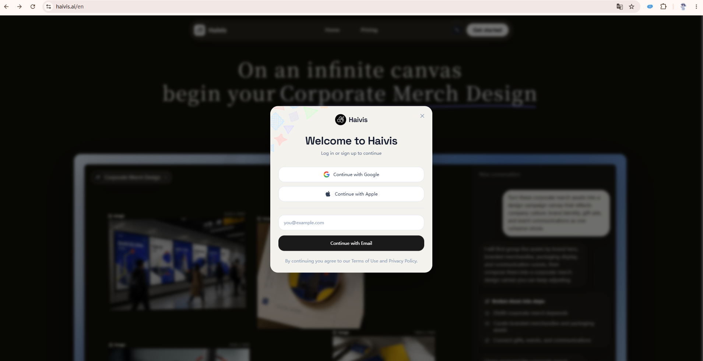
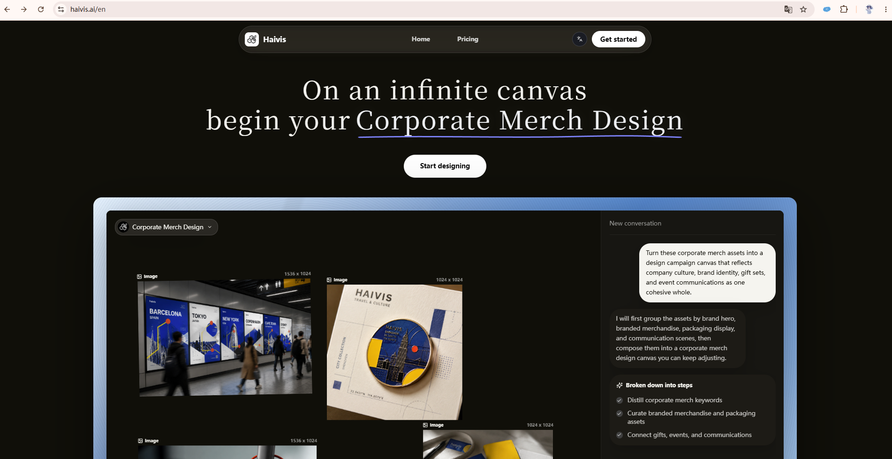
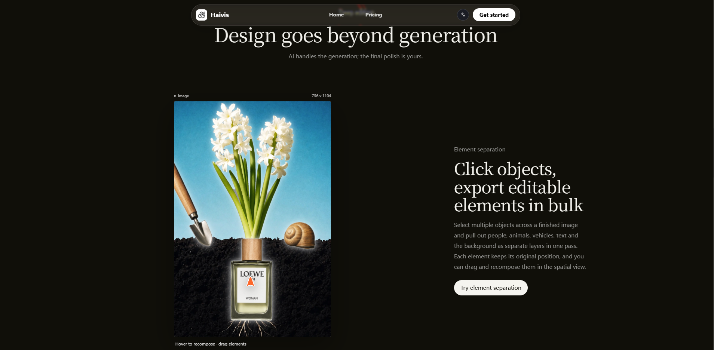
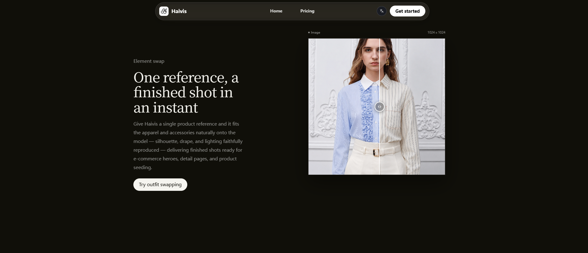
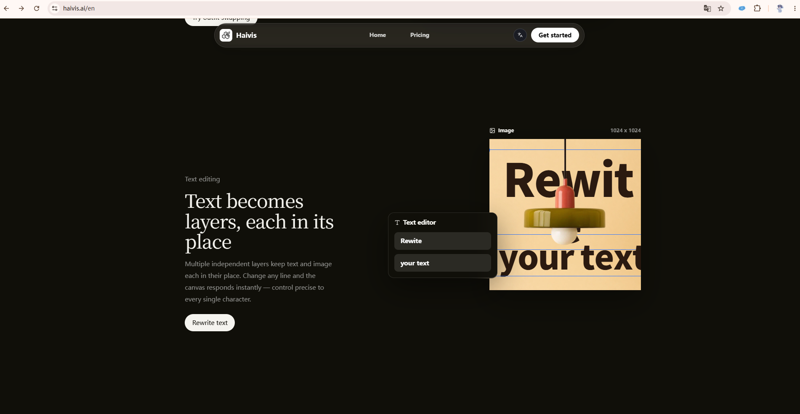
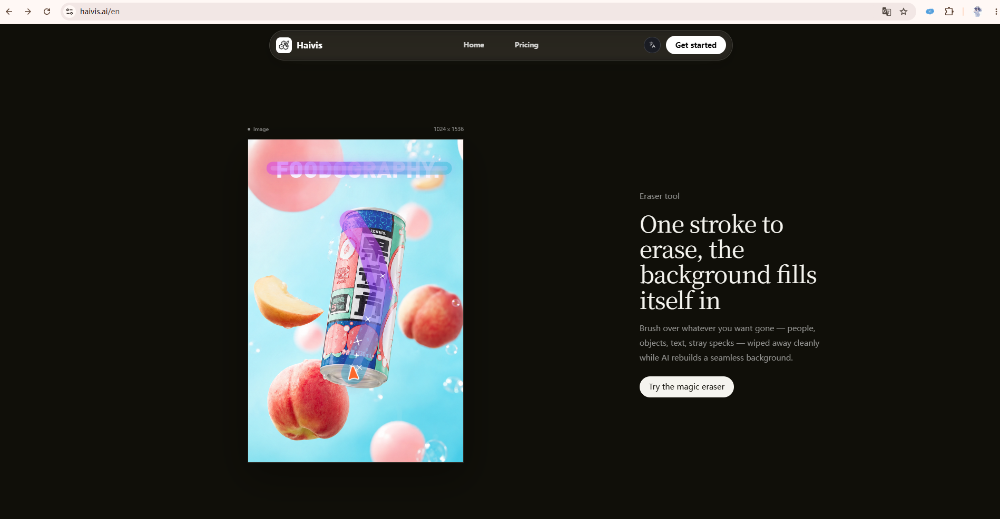

# Haivis 官网 UI 拆解（2026-07）

> 状态：**owner-curated inspiration**。这是设计参考，不是 PixelVault 规范、品牌拍板或施工图。
>
> 来源：[haivis.ai/en](https://haivis.ai/en) · 截图日期：2026-07-13 · 视口：桌面宽屏。
>
> 相关案例：[Haivis 画布工作区](haivis-canvas-2026-07.md)。

## 为什么值得收录

Haivis 没有用常见 AI 产品的紫蓝渐变、发光卡片和能力宫格，而是让**作品与真实操作证据成为页面主角**。它最有价值的不是黑底、大衬线或胶囊导航，而是三件事：

1. **chrome 后退**：导航、标签、按钮保持低存在感，让生成作品先被看到；
2. **功能被演示，不只被描述**：前后对比、图层编辑、元素拆分、擦除等交互直接叠在结果图上；
3. **长页有节奏**：居中宣言开场，随后用左右交替的「作品证据 + 短文案」章节推进。

## 截图索引

### 01 · 登录层



- 页面整体压暗并模糊，认证卡保持高亮，任务切换非常明确。
- 第三方登录、邮箱、条款按熟悉顺序组织，认知成本低。
- 卡片左上少量彩色线稿只承担品牌识别，没有扩散到整个页面。

### 02 · Hero 与产品全景



- 两行大标题 + 一条手绘下划线建立编辑式宣言感。
- 单一主 CTA 下方立刻给出产品全景，不让用户只读口号。
- 蓝色外框只包住产品演示，是全屏少数色彩之一，注意力指向明确。

### 03 · 元素拆分



- 左侧作品，右侧功能解释；图片占据更强视觉权重。
- 图片上方保留类型和尺寸元数据，让演示更像真实工具而非广告 mockup。
- 「Hover to recompose · drag elements」把交互提示贴在证据附近。

### 04 · 元素替换 / 前后对比



- 文案与图片左右换位，维持长页节奏。
- before/after 滑杆比并排两张图更直接，变化发生在同一空间坐标中。
- 操作柄位于画面中心，用户无需阅读即可理解可拖动。

### 05 · 文字图层编辑



- 小型编辑浮层与画布重叠，把「文字是可编辑图层」具象化。
- 蓝色选择线只出现在正在编辑的对象上，色彩承担状态而非装饰。
- 文案、编辑器与结果图形成因果链：选择文字 → 修改 → 画面响应。

### 06 · 魔法擦除



- 擦除笔迹直接显示在作品上，功能不需要额外流程图解释。
- 高彩作品与近乎无彩的页面 chrome 形成清晰主次。
- 右侧说明控制在一个标题、一段正文、一个 CTA，避免与作品竞争。

## 页面骨架

```text
悬浮胶囊导航
  ↓
编辑式 Hero 宣言
  ↓
产品全景（宽幅工作区证据）
  ↓
章节标题：Design goes beyond generation
  ↓
作品左 / 文案右：元素拆分
  ↓
文案左 / 作品右：元素替换
  ↓
文案左 / 作品右：文字图层
  ↓
作品左 / 文案右：魔法擦除
```

核心节奏不是标准等高卡片网格，而是**大留白中的单一能力章节**。每一屏只解释一件事，并用布局换位避免机械重复。

## 可复用设计模式

| 模式          | Haivis 的做法                    | 为什么有效                   | PixelVault 的翻译方式                                        |
| ------------- | -------------------------------- | ---------------------------- | ------------------------------------------------------------ |
| 作品优先      | 页面无彩，作品高彩               | 创作工具的价值由结果证明     | 营销页、Gallery、Studio 空态都可让作品发色，chrome 退后      |
| 证据式叙事    | 把编辑器、选区、拖拽柄叠在作品上 | 用户一眼看到“能怎么改”       | 展示真实 Studio / Node Workflow 操作片段，不做抽象功能图标墙 |
| 左右交替章节  | 每个能力占一个宽屏章节           | 形成阅读节奏，又保持单点聚焦 | 首页能力叙事可用；高密度工作台内部不使用                     |
| 同位前后对比  | 一张图内拖动分隔线               | 变化可比较、空间关系不丢失   | 图像编辑、LoRA 训练结果、增强/修复效果可复用                 |
| 工具元数据边  | 图片上方标 Image、尺寸           | 增加专业工具可信度           | 用真实模型、尺寸、来源、耗时等字段，但只显示对决策有用的信息 |
| 低色彩 chrome | 色彩集中在作品和当前状态         | 层级稳定，避免 AI 科技感     | 符合“作品自己发色”；域色只留给选中/状态/工具痕迹             |
| 窄文案列      | 标题、短段落、单 CTA             | 减少营销噪音                 | 每个能力说明只保留“用户结果 + 一个动作”                      |
| 模态任务切换  | 背景压暗模糊，认证卡独立         | 清晰切换到登录任务           | 可借鉴信息层级；具体白卡和装饰线稿不直接复制                 |

## 视觉语言拆解

### 层级

- **一级**：高对比大衬线标题、作品本身；
- **二级**：功能章节标题、单一 CTA；
- **三级**：灰色正文、类型与尺寸元数据；
- **状态层**：对比滑杆、选区线、笔刷轨迹、浮动编辑器。

页面没有让多个一级元素同时争夺注意力。即使 Hero 下方是复杂工作区，外部蓝框也把它收成一个整体。

### 字体

- 展示标题使用高反差衬线体，负责“编辑部 / 时尚设计工具”的性格；
- 导航、正文、按钮使用中性无衬线，负责工具可信度与可读性；
- 类型反差承担了品牌表达，比用更多色彩和装饰更克制。

PixelVault 当前主轴仍在重议，并已单独拍板“人声手写 / 机器声无衬线”的双层字体方向，因此**不可直接引入 Haivis 的大衬线标题**。可借鉴的是“人格字体与工具字体明确分工”的方法。

### 色彩

- 基底接近黑色，正文使用暖白与分级灰；
- 页面 chrome 基本无彩，作品承担主要颜色；
- 蓝色只在产品全景边框、交互选区等关键位置出现。

这与 PixelVault “作品自己发色、工具色只做状态”的方向相容，但 Haivis 的纯黑营销面不等于 PixelVault 待议的奶油纸 / 暖炭世界。

### 空间与节奏

- 内容列宽收窄、左右留白巨大，呈现画册跨页感；
- 功能章节之间用大段垂直空间分隔，而不是靠卡片边框；
- 图片与文案的重心交替，制造滚动节拍。

适合营销叙事和作品浏览，不适合参数密集、频繁操作的 Studio 主工作区。

## 设计评议

### Anti-pattern verdict

**通过，AI 模板感较低。** 没有紫蓝渐变、霓虹光晕、玻璃卡片堆叠、同构能力宫格或泛滥的 icon badge。它仍使用了常见的胶囊导航和 pill CTA，但整体被编辑式排版、强作品证据与克制色彩拉回了品牌语境。

### 做得好的部分

1. **价值可见**：每个功能都与结果图绑定，避免“AI can do anything”的空泛表达。
2. **层级果断**：一屏一个能力，作品、标题、CTA 的主次几乎无需学习。
3. **展示与产品同构**：浮动编辑器、选区、尺寸标签让营销页看起来来自真实产品逻辑。

### 主要风险

| 风险                     | 为什么重要                                                   | 采用时的处理                                               |
| ------------------------ | ------------------------------------------------------------ | ---------------------------------------------------------- |
| 留白过大                 | 宽屏很高级，但会拉长功能浏览距离；移动端若只是纵向堆叠会显空 | 保留“单屏单能力”，压缩章节间距并为移动端重排               |
| 灰字与微型元数据对比偏低 | 小尺寸类型、尺寸标签可能难读                                 | PixelVault 必须按 AA 校准，元数据字号不低于现有 token 地板 |
| 功能理解依赖动效         | 静态截图里元素拆分、擦除前后不一定完整可见                   | 提供 reduced-motion 下的静态前后态或显式状态标签           |
| 浮动导航可能遮挡内容     | 截图 05 顶部可见上一章节 CTA 被悬浮导航/滚动位置挤压         | sticky 区域预留安全间距，章节锚点考虑导航高度              |
| 认证卡较通用             | 白色 SaaS 卡 + 第三方登录结构清楚但品牌记忆较弱              | 只借鉴任务层级，不把它当 PixelVault 的视觉模板             |

## PixelVault 采纳分级

### A · 可直接采用的方法

- 作品优先、chrome 后退；
- 功能用真实操作证据表达；
- 同位 before/after 比较；
- 一屏单一能力 + 单一 CTA；
- 状态色只落在被操作对象上。

### B · 需要翻译后采用

- 大衬线标题 → 翻译成 PixelVault 的“人声手写 / 机器声正体”分工；
- 纯黑长页 → 翻译成拍板后的纸面 / 暖炭材质；
- 胶囊悬浮导航 → 仅在营销页评估，不进入工作台默认 chrome；
- 巨量留白 → 营销页保留，Studio / Node Workflow 转为专业密度。

### C · 不应照搬

- 不把 Haivis 的黑白、高反差衬线直接变成 PixelVault 品牌；
- 不把所有功能都包装成 pill CTA；
- 不在高频工作区使用营销页级的超大垂直间距；
- 不为了“高级感”降低正文和元数据对比度；
- 不把概念 mockup 当作真实产品能力证据。

## 可落到 PixelVault 的候选场景

| 场景                     | 可借鉴内容                                  | 需要另立施工图                                       |
| ------------------------ | ------------------------------------------- | ---------------------------------------------------- |
| 首页改版                 | Hero 后立刻展示真实工作区；能力章节左右交替 | 是，进入 `references/pages/home.md` 前先走营销页调研 |
| Gallery / Assets 详情    | 作品主导、chrome 后退、元数据边             | 是，需结合真实操作出口与移动端                       |
| Studio 编辑能力介绍      | 图上叠真实工具状态，不用功能卡片墙          | 是，不改变 Studio 主工作区密度                       |
| LoRA 效果说明            | before/after 同位滑杆                       | 是，需定义基准图、结果图和无障碍替代                 |
| Node Workflow onboarding | 用真实节点操作片段解释“吞噬/装配”           | 是，需与当前画布施工图保持一致                       |

## 待 owner 继续标注

后续再收类似案例时，可以给每个模式标一个简单判断：

- `喜欢`：希望进入 PixelVault 候选设计语言；
- `仅参考`：认可解决方法，不认可外观；
- `不要`：明确排除。

本案例当前默认判断：**方法喜欢，品牌外观仅参考**。

### Owner 标注（2026-07-13）

| 部分                                                   | 判断       | 备注                                                                   |
| ------------------------------------------------------ | ---------- | ---------------------------------------------------------------------- |
| 登录层（截图 01）                                      | **喜欢**   | 一律 **modal 窗**，不要整页跳转；外观不抄彩线稿                        |
| 元素拆分 / 前后对比 / 文字图层 / 魔法擦除 **动效语法** | **喜欢**   | 图上叠交互证据才是首页核心；按项目 **ready** 能力映射，hidden 不上首页 |
| 纯黑页 + 大衬线品牌皮                                  | **仅参考** | 不照搬                                                                 |
| 超大留白 / 悬浮胶囊导航                                | **仅参考** | 营销可用，不进 Studio 默认 chrome                                      |

施工落点：`docs/references/pages/home.md`。

## Source of Truth

- 视觉证据：本目录 `assets/haivis/01`–`06` 六张 owner 提供截图。
- 来源页面：[haivis.ai/en](https://haivis.ai/en)（本次未以实时网页核验交互细节，结论以截图可见内容为准）。
- PixelVault 设计边界：`docs/brand-dna.md`、`docs/forbidden.md` 与对应 domain/page 文档；旧方向见 `docs/archive/design/design-direction-worknotes-2026-07.md`，仅作历史证据。

## Last Verified

- Date: 2026-07-13 · Method: 逐张截图视觉拆解 + 当前 PixelVault 设计文档边界核对；未改产品代码。
