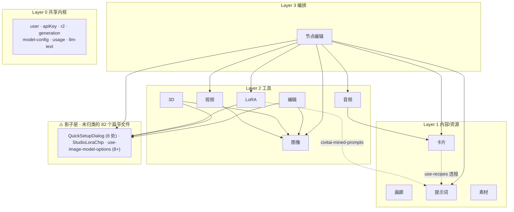

# PixelVault 架构契约 — Spec 1 设计文档

**日期**：2026-05-28
**目标**：在不停机、不重写功能的前提下，立一份"加新功能时该把代码放哪、能调谁、不能调谁"的明确契约；并通过一次小迁移（提示词模块）验证契约可落地。
**主线**：降低后续新功能成本（架构债清理）。

---

## 1. 背景

PixelVault 当前有 11 个产品模块（4 个内容域 + 6 个工具 + 1 个编排器），但代码物理布局是扁平的：

- `src/services/` 56+ 个文件全在顶层，按名字前缀区分模块归属
- `src/hooks/` 60+ 个文件同上
- `src/components/business/studio/` 82 个 `.tsx` 文件混在顶层

由此产生 4 类痛点（用户实测）：

1. 加新功能不知道放哪
2. 跨模块调用扣不出来
3. 公共能力散落各处
4. 改底层动全身（如 `src/types/index.ts` 被 189 处引用）

---

## 2. 当前实际依赖关系（实证）

基于代码 import 关系扫描（不是猜测）：



**关键发现**：

| #   | 现象                                                    | 含义                                                                      |
| --- | ------------------------------------------------------- | ------------------------------------------------------------------------- |
| 1   | `QuickSetupDialog.tsx` 被 8 个模块用                    | 影子共享层 — 必须正式化                                                   |
| 2   | Cards / LoRA → Prompts                                  | "Prompts" 这个名字混淆了两件事：模板内容（L1）和提示词工程能力（应在 L0） |
| 3   | `recipe` / `card-recipe` / `recipe-compiler` 三套同义词 | 概念混乱，归属不清                                                        |
| 4   | Node 同时调用 6 个模块                                  | 合法（它就是编排器），但需要明确"它能依赖什么"契约                        |

---

## 3. 目标架构

### 3.1 五层模型

```
┌──────────────────────────────────────────────────────────────────────┐
│ Layer 3  编排器                                                       │
│   节点编辑 Node                                                       │
│   规则：可调任意下层；下层不知道 Node 存在                              │
└──────────────────────────────────────────────────────────────────────┘
                                ↑
┌──────────────────────────────────────────────────────────────────────┐
│ Layer 2  生成工具 (Studio Tools)                                       │
│   图像 │ 视频 │ 音频 │ 3D │ 编辑 │ LoRA                                │
│   规则：互不调用；可调 L1.5 / L1 / L0                                  │
└──────────────────────────────────────────────────────────────────────┘
                                ↑
┌──────────────────────────────────────────────────────────────────────┐
│ Layer 1.5  Studio Shared (跨工具共享 UI / Hook)                        │
│   QuickSetupDialog · 通用 model options · 通用生成预览 · 通用空状态     │
│   规则：被 2+ 工具用、不含特定工具业务逻辑                              │
└──────────────────────────────────────────────────────────────────────┘
                                ↑
┌──────────────────────────────────────────────────────────────────────┐
│ Layer 1  内容/资源域                                                   │
│   画廊 Gallery │ 提示词 Prompts │ 素材 Assets │ 卡片 Cards             │
│   规则：互不调用；只调 L0                                              │
└──────────────────────────────────────────────────────────────────────┘
                                ↑
┌──────────────────────────────────────────────────────────────────────┐
│ Layer 0  Shared Kernel                                                │
│   基础设施: r2 · db · logger · with-retry · circuit-breaker            │
│   身份/计费: user · apiKey · usage                                     │
│   AI 引擎: model-config · model-router · llm-text                      │
│             prompt-compiler · prompt-enhance · prompt-guard            │
│             scene-prompt-compiler · prompt-assistant                   │
│   生成核心: generation · execution-callback                            │
│   规则：被所有层调用；自身不依赖任何上层                                │
└──────────────────────────────────────────────────────────────────────┘
```

### 3.2 铁律（四条）

1. **箭头只向下** —— 任意模块只能依赖更低层的模块。L3 → L2 → L1.5 → L1 → L0。
2. **同层互不调用** —— L1 四个内容域之间、L2 六个工具之间、L1.5 内部各组件之间，不允许相互 import。
3. **公开 API 通过 index 暴露** —— 每个模块根目录有 `index.ts`，列出"外部可用"的 services / hooks / components。模块内部其他文件视为 private，跨模块 import 必须经过 index。
4. **L0 不依赖上层** —— Shared Kernel 不能 import L1 及以上的任何东西。

### 3.3 依赖示例与说明

下列依赖**符合**铁律（向下箭头），但因为容易被误判为违规，明确列出：

- **L2 工具 → L1 内容域**（合法的向下依赖）：图像工具从 提示词 拉模板、Audio 从 Cards 拉 voice-card 都属于此类。
- **L1.5 → L1**（合法）：仅当共享组件需要展示内容域数据时（如 QuickSetupDialog 显示 model 选项）。
- **L3 → 任意下层**（合法）：Node 编排器调任何下层都合法。

**明确禁止**（这些是真正的违规）：

- L1 → L1（任何）—— 内容域之间互不调用
- L0 → L1 及以上（任何）—— Shared Kernel 不依赖业务层
- L2 → L2（任何）—— 工具之间互不调用
- L1.5 → L2 / L3（任何）—— Studio Shared 不能反向依赖工具
- 跨过模块 `index.ts` 直接 import 内部文件

---

## 4. 模块边界与 Public API

### 4.1 当前模块归属表

下表给出**重组后**的归属。括号内是当前位置（仅在和目标不一致时标注）。

| 模块               | 层级 | services                                                                                                                                                                                                                                                                                                                                                                     | hooks                                                                                                                   | components                                                                             | api                                                                                                      |
| ------------------ | ---- | ---------------------------------------------------------------------------------------------------------------------------------------------------------------------------------------------------------------------------------------------------------------------------------------------------------------------------------------------------------------------------- | ----------------------------------------------------------------------------------------------------------------------- | -------------------------------------------------------------------------------------- | -------------------------------------------------------------------------------------------------------- |
| **画廊 Gallery**   | L1   | `gallery.*`, `like`, `follow`, `collection`, `generation`                                                                                                                                                                                                                                                                                                                    | `use-gallery`, `use-like`, `use-follow`, `use-collections`, `use-creator-profile`                                       | `gallery/`, `GalleryDetail*`, `CreatorProfileView`                                     | `/api/gallery`, `/likes`, `/follows`, `/collections`                                                     |
| **提示词 Prompts** | L1   | `prompt-feedback`, `seedance-prompt-plan`, **`inspiration` (从 Assets 移入)**                                                                                                                                                                                                                                                                                                | `use-prompt-feedback`, `use-seedance-prompt-plan`, **`use-inspirations` (从 Assets 移入)**, `use-civitai-mined-prompts` | `PromptTemplate*`, **`inspiration/` (从 Assets 移入)**                                 | `/api/prompt`, `/api/inspiration`                                                                        |
| **素材 Assets**    | L1   | (清空 — 只留 asset 上传/管理相关)                                                                                                                                                                                                                                                                                                                                            | (清空)                                                                                                                  | `AssetDetailSheet`, `AssetSelectorDialog`, `KreaAssetBrowser`                          | `/api/assets`                                                                                            |
| **卡片 Cards**     | L1   | `character-card`, `background-card`, `style-card`, `voice-card`, `card-recipe`, `recipe`                                                                                                                                                                                                                                                                                     | `use-character-cards`, `use-background-cards`, `use-style-cards`, `use-voice-cards`, `use-card-recipes`, `use-recipes`  | `CharacterCard*`, `StyleCardManager`, `image-card/`                                    | `/api/character-cards`, `/background-cards`, `/style-cards`, `/voice-cards`, `/card-recipes`, `/recipes` |
| **图像 Image**     | L2   | `generate-image`, `image-edit`, `image-transform`, `image-analysis`, `image-3d-prep`, `image-preview-derivative`, `image-decompose`                                                                                                                                                                                                                                          | `use-image-model-options`, `use-image-upload`, `use-image-transform`, `use-inpaint`                                     | `ImageCard`, `ImageDetailModal`, `StudioInputImage`, `StudioCanvas`                    | `/api/generate-image`, `/image`, `/images`                                                               |
| **视频 Video**     | L2   | `generate-video`, `video-script`, `video-scene-orchestrator`, `video-pipeline`, `video-merge`, `video-reference`                                                                                                                                                                                                                                                             | `use-generate-video`, `use-video-script`, `use-scene-orchestrator`, `use-storyboard`                                    | `StudioVideoParams`, `VideoPlayer`, `ScriptEditor`, `StoryCard`                        | `/api/generate-video`, `/video-script`                                                                   |
| **音频 Audio**     | L2   | `generate-audio`, `fish-audio-voice`, `audio-reference`                                                                                                                                                                                                                                                                                                                      | `use-audio-model-options`                                                                                               | `StudioAudioParams`, `VoiceSelector`, `VoiceTrainer`                                   | `/api/generate-audio`, `/voices`                                                                         |
| **3D**             | L2   | `generate-3d`                                                                                                                                                                                                                                                                                                                                                                | `use-generate-3d`                                                                                                       | `Studio3DWorkspace`, `ModelViewer`, `WireframeModelPreview`                            | `/api/generate-3d`                                                                                       |
| **编辑 Edit**      | L2   | `extracted-element` (+ 共用 image-edit/image-decompose)                                                                                                                                                                                                                                                                                                                      | `use-layer-decompose`, `use-extracted-elements`                                                                         | `studio/edit/`, `EditWorkspaceShell`, `ExtractedElementsGrid`                          | `/api/extracted-elements`                                                                                |
| **LoRA**           | L2   | `lora-asset`, `civitai-lora`, `lora-training`, `civitai-token`                                                                                                                                                                                                                                                                                                               | `use-lora-assets`, `use-civitai-lora-library`, `use-active-lora-stack`, `use-lora-training`, `use-civitai-token`        | `studio/lora/`, `LoraWorkbench`, `ActiveLoraBar`, `StudioLoraChip`                     | `/api/lora-assets`, `/lora-training`                                                                     |
| **节点 Node**      | L3   | **拥有**：`node-workflow`, `node-assistant`, `node-planner-route`, `script-breakdown`, `story`<br>**使用（不拥有）**：`video-script` (Video), `recipe-compiler` (待 Spec 3 归属), `scene-prompt-compiler` (L0 Kernel), `studio-generate` (L0 Kernel)；character-card / background-card (Cards)                                                                               | `use-node-workflow`, `use-node-media-generation`, `use-node-selection`, `use-character-image-generation`                | `studio/node/`, `StudioNodeWorkbench`, `CharacterImage*`, `Canvas*`                    | `/api/node-workflow/*`, `/api/studio/node-assistant`                                                     |
| **Studio Shared**  | L1.5 | (无 services — 纯 UI 层)                                                                                                                                                                                                                                                                                                                                                     | `use-model-options` (从 image 中提取的通用版本)                                                                         | `QuickSetupDialog`, `StudioToolbar`, `StudioPromptArea`（拆分后）, `GenerationPreview` | (无 API)                                                                                                 |
| **Shared Kernel**  | L0   | `user`, `apiKey`, `usage`, `model-config`, `model-router`, `model-health`, `llm-text`, `generation`, `execution-callback`, `execution-outbox`, `execution-worker`, `studio-generate`, **`prompt-compiler` (从顶层移入)**, **`prompt-enhance` (从顶层移入)**, **`prompt-guard` (从 lib 移入)**, **`scene-prompt-compiler` (从顶层移入)**, **`prompt-assistant` (从顶层移入)** | **`use-prompt-enhance` (从顶层移入)**, **`use-prompt-assistant` (从顶层移入)**                                          | (无 components — 纯能力层)                                                             | (无业务 API)                                                                                             |

### 4.2 Public API 形式

每个模块根目录加 `index.ts`，明确导出。例：

```ts
// src/services/prompts/index.ts
// 外部可用：
export { promptFeedbackService } from './prompt-feedback.service'
export { seedancePromptPlanService } from './seedance-prompt-plan.service'
export { inspirationService } from './inspiration.service'
// 不导出内部 helper / mapper / private 函数
```

跨模块 import 必须是：

```ts
import { promptFeedbackService } from '@/services/prompts' // ✓
import { promptFeedbackService } from '@/services/prompts/prompt-feedback.service' // ✗ 跨过 public API
```

---

## 5. 加新功能决策树

加一个新功能时，按下列流程决定代码归属：

```
1. 这个功能是用户能在 sidebar 看到的入口吗？
   ├─ 是 → 它本身是一个模块。问下一题。
   └─ 否 → 它属于某个现有模块。问 Q3。

2. 它是「编排多个工具的产物」吗？（一次操作驱动多个工具）
   ├─ 是 → L3 编排器（新增或挂在 Node 下）
   └─ 否 → 它是 L1 内容 / L2 工具 / L1.5 共享 UI？
              ├─ 用户管理内容（CRUD）→ L1
              ├─ 用户用它做一件创作 → L2
              └─ 是多个工具共用的 UI → L1.5

3. 它是「能力」还是「业务」？
   ├─ 通用、可被多模块复用的纯能力（无 UI、不依赖业务上下文）→ L0 Shared Kernel
   ├─ 只有这一个模块用 → 留在该模块内
   └─ 2+ 工具用、但有 UI → L1.5 Studio Shared
```

---

## 6. 命名与物理布局约定

### 6.1 目标目录结构

```
src/
├── services/
│   ├── kernel/              # L0 共享能力（含 prompt-engineering 等）
│   ├── gallery/             # L1 内容域
│   ├── prompts/
│   ├── assets/
│   ├── cards/
│   ├── image/               # L2 工具
│   ├── video/
│   ├── audio/
│   ├── 3d/
│   ├── edit/
│   ├── lora/
│   └── node/                # L3 编排
├── hooks/                   # 同上结构
├── components/business/
│   ├── shared/              # L1.5 跨工具共享
│   ├── gallery/             # L1
│   ├── prompts/
│   ├── assets/
│   ├── cards/
│   ├── image/               # L2
│   ├── video/
│   ├── ...
│   └── node/                # L3
└── constants/               # 同上结构
```

### 6.2 命名规则

- service 文件：`<domain>.service.ts`（无前缀，因目录已分模块）
- hook 文件：`use-<name>.ts`
- component 文件：PascalCase `.tsx`
- 模块根 `index.ts` 列出 public exports

### 6.3 兼容期

物理重组在 Spec 2+ 分模块进行。本 Spec 只重组 Prompts 一个模块作为样板，其他模块保持现状但**新文件必须按新结构落位**。

---

## 7. ESLint 强制规则

引入 `eslint-plugin-boundaries` 或等效的 `import/no-restricted-paths` 规则，在 `eslint.config.mjs` 中定义层级图，强制：

- L1 内容域之间不可 import
- L2 工具之间不可 import
- L0 不可 import 上层
- 跨模块 import 必须经过 `<module>/index.ts`（开发期警告，不阻止）

**作用范围（重要）**：本 Spec 中 ESLint 规则**只针对 Prompts 模块新结构（`src/{services,hooks,components}/prompts/`、`src/{services,hooks}/kernel/`）和新文件**启用 `error` 级别。其他模块（仍在扁平结构下）通过 `ignorePatterns` 暂缓 —— 等各自 Spec 落地完目录化后再开启。

**Prompts 模块开启后的预期违规**：0 条（迁移完成后，所有跨模块调用经过 public API，所有原"违规"路径已变合法）。

**已知但本 Spec 不修复的违规**（其他模块开启时将暴露，归后续 Spec 处理）：

- `Cards/use-recipes` → `Prompts` —— 已通过 prompt-engineering 下沉 L0 解决，Cards 实际调的是 L0
- `LoRA/use-civitai-mined-prompts` —— 已迁入 Prompts 模块作为 mined-prompts 来源
- 82 个扁平 studio 文件交叉 import → Spec 2 清理

---

## 8. Pilot 迁移 — 提示词模块（本 Spec 范围内执行）

挑提示词作为 pilot 的原因：**它同时压测「层级下沉」「内容域之间清理」「目录化样板」三个变化**，验证契约能落地。

### 8.1 三个动作

**动作 1 — 下沉：把"提示词工程能力"从 Prompts 模块（L1）移到 Shared Kernel（L0）**

涉及文件：

```
src/services/prompt-compiler.service.ts          → src/services/kernel/prompt-compiler.service.ts
src/services/prompt-enhance.service.ts           → src/services/kernel/prompt-enhance.service.ts
src/services/scene-prompt-compiler.service.ts    → src/services/kernel/scene-prompt-compiler.service.ts
src/services/prompt-assistant.service.ts         → src/services/kernel/prompt-assistant.service.ts
src/lib/prompt-guard.ts                          → src/services/kernel/prompt-guard.ts
src/hooks/use-prompt-enhance.ts                  → src/hooks/kernel/use-prompt-enhance.ts
src/hooks/use-prompt-assistant.ts                → src/hooks/kernel/use-prompt-assistant.ts
```

更新所有调用方 import 路径。Cards / LoRA / Video / Node / Image 当前对这些的"违规调用"自动变合法（它们调的是 L0 不是 L1）。

**动作 2 — 平移：把灵感库从 Assets 模块移到 Prompts 模块**

涉及文件：

```
src/services/inspiration.service.ts              → src/services/prompts/inspiration.service.ts
src/hooks/use-inspirations.ts                    → src/hooks/prompts/use-inspirations.ts
src/components/business/inspiration/             → src/components/business/prompts/inspiration/
src/app/api/inspiration/                          → 保持路径（用户面 URL），但归属注释为 Prompts
src/constants/inspiration.ts (如有)              → src/constants/prompts/inspiration.ts
```

`PromptTemplatePicker` 从"跨模块调用 Assets"变为"模块内调用"。

**动作 3 — 样板：把 Prompts 模块剩余文件目录化**

```
src/services/prompt-feedback.service.ts          → src/services/prompts/prompt-feedback.service.ts
src/services/seedance-prompt-plan.service.ts     → src/services/prompts/seedance-prompt-plan.service.ts
src/hooks/use-prompt-feedback.ts                 → src/hooks/prompts/use-prompt-feedback.ts
src/hooks/use-seedance-prompt-plan.ts            → src/hooks/prompts/use-seedance-prompt-plan.ts
src/hooks/use-civitai-mined-prompts.ts           → src/hooks/prompts/use-civitai-mined-prompts.ts
                                                    （注：归 Prompts 模块，因为是提示词来源）
src/components/business/PromptTemplate*.tsx     → src/components/business/prompts/
src/components/business/CopyPromptButton.tsx     → src/components/business/prompts/
```

新建 `src/services/prompts/index.ts`、`src/hooks/prompts/index.ts`、`src/components/business/prompts/index.ts` 列出 public exports。

### 8.2 行为保留契约（重要）

**本 Spec 的核心承诺：零运行时行为变更。** 唯一允许的变化是文件位置 + import 路径 + 新增 index.ts + ESLint 配置。

**明确允许的变化**：

- 文件路径迁移（如 `src/services/prompt-enhance.service.ts` → `src/services/kernel/prompt-enhance.service.ts`）
- 调用方 import 路径更新（指向新位置）
- 新增 `index.ts` 做 re-export
- 新增 ESLint `boundaries` / `import/no-restricted-paths` 配置
- 新增 codemod 脚本

**明确禁止的变化**（如出现需推回 Spec 1.1 处理）：

- 任何函数签名 / 参数 / 返回值类型修改
- 任何运行时副作用变化
- 任何 API URL 改动
- 任何数据库 schema 改动
- 任何 React 组件 props / 渲染输出改动
- 任何 i18n key 改动
- 删除"看似没人用"的 export（除非 lint + grep 全代码库都确认无引用）

### 8.3 三个易踩坑细节（必须显式检查）

文件物理移动看似简单，但有 3 个陷阱会导致"build 通过但行为变了"。每个动作完成后**强制检查**：

**陷阱 1：`'server-only'` 指令丢失**

当前 `prompt-compiler.service.ts` 等顶部有 `import 'server-only'`，移动文件时**必须**保留。否则客户端代码理论上能 import 服务端代码，泄露 API key 或导致 hydration 错误。

检查命令：

```bash
# 迁移前后对比 'server-only' 出现位置
git diff HEAD~1 -- 'src/services/**' 'src/hooks/**' | grep -E "^[+-].*server-only"
```

**陷阱 2：新增循环依赖**

下沉到 L0 后，如果 kernel 中的 service 反过来 import 了 L1+ 的东西（出于历史耦合），会形成循环。TypeScript 编译可能通过，但运行时初始化顺序出错。

检查命令：

```bash
# 用 madge 检测循环依赖
npx madge --circular --extensions ts,tsx src/services src/hooks
```

如有新增循环，必须解开（一般是把被 L0 反向依赖的部分也下沉，或抽 interface）。

**陷阱 3：`index.ts` re-export 不完整**

新增 `src/services/prompts/index.ts` 后，必须导出所有原本被外部使用的 named export。漏掉一个就报 runtime error。

检查命令：

```bash
# 列出迁移前该模块的所有 export，对比 index.ts 是否覆盖
git show HEAD~1:src/services/prompt-feedback.service.ts | grep -E "^export"
# 然后人工核对 src/services/prompts/index.ts
```

**优先用 `export *`** 而不是命名 re-export，可以一次性覆盖；只对需要刻意隐藏的内部 helper 用显式排除。

### 8.4 每个动作的验证流程

每一步（动作 1 / 2 / 3）独立 commit，commit 前必须全部通过：

```bash
# 1. 静态检查
npm run lint                      # 含新增的 boundary 规则
npx tsc --noEmit                  # 类型完整性

# 2. 构建
npm run build                     # Next.js 生产构建（含 server-only 边界检查）

# 3. 单元测试
npx vitest run --reporter=verbose

# 4. 循环依赖检查
npx madge --circular --extensions ts,tsx src/

# 5. E2E 烟雾测试（核心路径）
npx playwright test e2e/mobile.spec.ts --project=mobile

# 6. 手工烟雾测试（生产同等环境）
npm run dev
# 在浏览器逐项验证：
#  - /prompts 页面正常加载
#  - 灵感库 tab 切换正常
#  - 新建模板、编辑模板正常
#  - 在 Studio 内调用模板 → 模板内容正确填入
#  - prompt-enhance（增强按钮）正常
#  - prompt-assistant（AI 改写）正常
#  - LoRA 卡片的 mined prompts 正常
#  - Cards 编辑里的 recipe 调用正常
#  - Node 节点编排里 scene-prompt 编译正常
```

**任一项失败 → 回滚到本动作前的 commit → 修干净再重试**。不允许"先 push 后修"。

### 8.5 ESLint 规则启用

在所有迁移完成后，本 Spec 同时引入 ESLint 层级规则。已知违规预期在迁移后基本归零（除 recipe 相关，归 Spec 3 处理）。规则作用范围按 §7 限定（仅 Prompts + Kernel 路径），其他模块通过 `ignorePatterns` 暂缓。

---

## 9. 不在本 Spec 范围内 / 后续路线图

明确**不做**的事，避免范围蔓延：

- ❌ 把所有 82 个扁平 studio 组件按模块拆分（→ Spec 2: Studio Shared 层正式化）
- ❌ 清理 `recipe` / `card-recipe` / `recipe-compiler` 三套同义词（→ Spec 3: Cards 模块清理）
- ❌ 拆分 `LoraWorkbench.tsx` (1,993 行)、`use-node-workflow.ts` (1,695 行)、`Studio3DWorkspace.tsx` (2,815 行)（→ Spec 4-6: 各模块内部重构）
- ❌ 修复 long-video 恢复语义、execution-callback 事务包裹（→ Spec 7: 生成可靠性）
- ❌ Node 模块的 UX 改进、Assistant 智能度提升（→ 等架构稳定后开新 spec）
- ❌ 不重命名 / 不改用户可见 URL

### 后续 Spec 优先级建议

按"对降低新功能成本的杠杆率"排序：

1. **Spec 2**：Studio Shared 层正式化（处理 82 个扁平文件 + QuickSetupDialog + use-image-model-options 拆分） — 收益最大，因为后续每个 Studio 工具改动都受益
2. **Spec 3**：Cards 模块清理（recipe 命名归一） — 解锁 Node 内"角色/背景"扩展
3. **Spec 4**：Image 模块内部目录化 + 大文件拆分 — Image 被最多东西依赖
4. **Spec 5**：Node 模块内部拆分（`use-node-workflow.ts` 1,695 行） — 为 Node 后续大改预留空间

---

## 10. 成功标准

本 Spec 落地后，下面任一情况应能成立：

1. 给一个 PR 描述（"加一个新的提示词增强能力"），按决策树判断它应放在 `src/services/kernel/` 下，并通过 ESLint 检查
2. 新人/Claude 读完 §3-§5 即可独立判断"加这个新功能放哪"
3. Cards / LoRA / Video / Node 对提示词工程的依赖在 ESLint 中显示"合法"（因为已下沉 L0）
4. 灵感库的代码 100% 在 `src/{services,hooks,components}/prompts/` 下
5. ESLint 在 Prompts 模块 + Kernel 范围内 `error` 级别违规数 = 0（其他模块通过 ignorePatterns 暂缓，待后续 Spec 启用）
6. **用户可见行为零变化** —— `/prompts` 页面、灵感库、Studio 内调用模板、prompt-enhance、prompt-assistant、LoRA mined prompts、Card recipe、Node scene-prompt 全部保持迁移前的行为，通过 §8.4 手工烟雾测试逐项验证
7. **无新增循环依赖** —— `npx madge --circular` 输出为空
8. **无 `'server-only'` 边界泄露** —— 所有原带 `import 'server-only'` 的文件在新位置仍保留该指令

---

## 11. 风险与缓解

| 风险                                                   | 缓解                                                                                                |
| ------------------------------------------------------ | --------------------------------------------------------------------------------------------------- |
| 路径变化太多，import 改不完                            | 用 codemod 脚本（jscodeshift / ts-morph）批量重写 import，不手改；TypeScript 编译兜底（漏改即报错） |
| `'server-only'` 指令在文件迁移中丢失，泄露服务端代码   | §8.3 陷阱 1：用 `git diff` 对比迁移前后；CI 加 grep 守卫拦截缺失情况                                |
| 新增循环依赖导致运行时初始化错乱                       | §8.3 陷阱 2：每个动作后跑 `npx madge --circular`，发现循环必须解开才能 commit                       |
| `index.ts` re-export 漏导出，调用方 runtime 报错       | §8.3 陷阱 3：优先用 `export *` 而非命名 re-export；与迁移前的 `export` 列表逐项对比                 |
| Pilot 迁移破坏运行时                                   | §8.4：每个动作独立 commit，跑 `lint + tsc + build + vitest + madge + playwright + 手工烟雾测试`     |
| ESLint 规则误判                                        | 作用范围限定（§7 仅 Prompts/Kernel 路径 + 新文件）；如出现意外违规切回 warn → 修干净 → 再切 error   |
| 后续 spec 拖延，本 spec 成为孤岛                       | 在 §9 写明优先级和触发条件，建议 Spec 2 紧跟本 Spec 之后                                            |
| Recipe / 82 个扁平文件违规进入 ESLint error 后阻塞开发 | ESLint 规则**只针对新路径 + Prompts 模块**生效；其他模块用 ignorePatterns 暂缓，等 Spec 2+ 逐个开启 |

---

## 附录 A：检测到的影子层完整清单（供 Spec 2 参考）

来自 cross-module dependency 扫描，下列文件被 5+ 模块使用，应在 Spec 2 中正式提为 L1.5：

- `src/components/business/studio/QuickSetupDialog.tsx`（8 处）
- `src/hooks/use-image-model-options.ts`（8+ 处）—— 需拆为 generic + image-specific
- `src/components/business/studio/StudioPromptArea.tsx`（多模块复用 prompt 输入逻辑）
- `src/components/business/studio/StudioLoraChip.tsx`（4+ 处）—— LoRA 拥有，外部消费方需通过 LoRA 模块 public API 调用
- `src/components/business/studio/StudioToolbar.tsx`、`StudioDockPanelArea.tsx`、`GenerationPreview.tsx` 等

## 附录 B：本 Spec 涉及文件变更概览

- **移动文件**：约 15 个（提示词模块文件归位 + 5 个 L0 下沉）
- **新建文件**：3 个 `index.ts`（prompts services / hooks / components）+ 1 个 ESLint 规则配置
- **修改 import**：预计 30–60 处调用方
- **不动**：所有 React 组件渲染逻辑、所有 API 路由 URL、所有数据库 schema、所有用户可见行为

---

## 12. 附：Pilot 完成后的样子（直观）

完成本 Spec 后，目录树看起来是：

```
src/services/
├── kernel/
│   ├── prompt-compiler.service.ts          ← 下沉到这里
│   ├── prompt-enhance.service.ts
│   ├── prompt-guard.ts
│   ├── scene-prompt-compiler.service.ts
│   ├── prompt-assistant.service.ts
│   ├── llm-text.service.ts                 ← 已在 L0 性质，逻辑归位
│   ├── model-config.service.ts
│   ├── ... (其他 kernel)
│   └── index.ts
├── prompts/
│   ├── prompt-feedback.service.ts
│   ├── seedance-prompt-plan.service.ts
│   ├── inspiration.service.ts              ← 从 Assets 移入
│   └── index.ts
├── lora-asset.service.ts                   ← 暂留顶层（Spec 4 再目录化）
├── generate-image.service.ts               ← 暂留顶层
└── ...

src/hooks/
├── kernel/
│   ├── use-prompt-enhance.ts
│   ├── use-prompt-assistant.ts
│   └── index.ts
├── prompts/
│   ├── use-prompt-feedback.ts
│   ├── use-seedance-prompt-plan.ts
│   ├── use-inspirations.ts                 ← 从 Assets 移入
│   ├── use-civitai-mined-prompts.ts
│   └── index.ts
└── ...

src/components/business/
├── prompts/
│   ├── PromptTemplatePicker.tsx
│   ├── PromptTemplateDetailEditor.tsx
│   ├── PromptAssistantPanel.tsx
│   ├── CopyPromptButton.tsx
│   ├── inspiration/                        ← 从 Assets 移入
│   └── index.ts
└── ... (其他保持原位)
```

ESLint 配置 `eslint.config.mjs` 增加层级规则块，对 `src/services/prompts/`、`src/services/kernel/`、`src/hooks/prompts/`、`src/hooks/kernel/` 启用 boundaries 检查。
