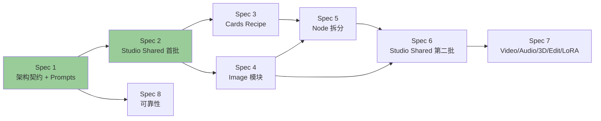

# PixelVault 架构清理 Roadmap

**最后更新**：2026-05-28
**主线**：降低后续新功能成本（架构债清理）
**总体目标**：让 11 个产品模块各自有清晰的物理目录、明确的 public API、ESLint 守护的边界规则。

---

## 全图

| Spec        | 标题                                                                       | 范围                                                                                                                       | 状态      | 大小                          |
| ----------- | -------------------------------------------------------------------------- | -------------------------------------------------------------------------------------------------------------------------- | --------- | ----------------------------- |
| **Spec 1**  | [架构契约 + Prompts pilot](./2026-05-28-architecture-contract-design.md)   | 5 层架构、铁律、决策树；prompt-engineering 下沉 L0；inspiration 归 Prompts                                                 | 🚀 已落地 | ~15 文件移动                  |
| **Spec 2**  | [Studio Shared 层首批 16 文件](./2026-05-28-spec-2-studio-shared-layer.md) | 16 SHARED → L1.5；删 2 死文件；ESLint 扩展                                                                                 | 🚀 已落地 | ~18 文件移动                  |
| **Spec 3**  | [Cards 模块目录化 + Recipe 三套归位](./2026-05-28-spec-3-cards-module.md)  | 修正 Spec 1 的 recipe 归属错判：recipe → Prompts、card-recipe → Cards、recipe-compiler → L0；Cards 模块目录化；ESLint 扩展 | 🚀 已落地 | 中（~38 文件 + 1 重命名）     |
| **Spec 4**  | [Image 模块目录化](./2026-05-28-spec-4-image-module.md)                    | services/image/ + hooks/image/ + components/business/image/；ESLint 扩展                                                   | ✅ 已定稿 | 中（~30 文件）                |
| **Spec 5a** | [Node 模块目录化](./2026-05-28-spec-5a-node-directorialization.md)         | Node services/hooks/components 子目录化；2 flat 归位（**不**拆 hook）                                                      | ✅ 已定稿 | 中（~45 文件）                |
| Spec 5b     | Node use-node-workflow hook 拆 3 段                                        | `use-node-workflow.ts` 1,695 行拆 use-node-graph-state + use-node-layout + use-node-execution；public API 不变             | ⏳ 待写   | 大（hook 内部重构）           |
| Spec 6      | Studio Shared 第二批 + 4 巨型拆分                                          | 拆 `StudioPromptArea` 1371 / `StudioLoraChip` 889 / `GenerationPreview` 667 / `DockPanelArea` 571；剩余 24 SHARED 归位     | ⏳ 待写   | 大                            |
| Spec 7      | 其他 L2 模块目录化                                                         | Video / Audio / 3D / Edit / LoRA 各自的 services / hooks / components 目录化                                               | ⏳ 待写   | 中（可拆 5 个小 spec 或合并） |
| Spec 8      | 生成可靠性                                                                 | long-video 恢复语义、execution-callback 事务包裹、监控补全                                                                 | ⏳ 待写   | 中                            |

---

## 推荐执行顺序与依赖

**顺序解释**：

1. **Spec 1 → Spec 2**：Spec 2 依赖 Spec 1 的 L1.5 概念 + ESLint 配置基础
2. **Spec 2 → Spec 3**：Cards 在 recipe 清理时会调 prompt-engineering（已在 L0），需先有干净的 L0
3. **Spec 3 → Spec 5**：Node 拆分时会触碰 recipe 编译路径，先把 recipe 名字理顺
4. **Spec 2 → Spec 4**：Image 模块目录化时会动到一些 image-owned 扁平文件，需要 L1.5 边界已清晰（知道哪些是 image-owned 哪些是 shared）
5. **Spec 4 + Spec 5 → Spec 6**：拆 4 巨型时（PromptArea / LoraChip / GenerationPreview / DockPanelArea），需要知道拆出的子部分归谁 —— 取决于 Image / Node 内部结构已清晰
6. **Spec 6 → Spec 7**：Studio Shared 完全清理后，剩余 L2 工具模块的清理是套路化复制
7. **Spec 8** 与重构主线并行 —— 是行为修复，不是结构调整

**并行可能性**：

- Spec 3（Cards）和 Spec 4（Image）可并行（不互相依赖）
- Spec 8（可靠性）可在 Spec 1 完成后任意时机插入

---

## 每个待写 Spec 的预期范围

### Spec 3 — Cards Recipe 命名归一

**问题**：`recipe.service` / `card-recipe.service` / `recipe-compiler.service` 三个文件，被 Cards / Node / Image / Video 都用，归属不清。

**计划**：

- 概念归一为 "Card Recipe"（卡片配方）—— 业务概念归 Cards
- `recipe-compiler` 是 "把 Card Recipe 编译为 Prompt" —— 是 prompt engineering 子集 → 下沉 L0 Kernel
- 重命名 `recipe.service` → `card-recipe.service`（合并）；旧 `card-recipe.service` 已是该名
- Cards 模块物理目录化：`src/services/cards/`、`src/hooks/cards/`、`src/components/business/cards/`（含 `image-card/` 子目录）
- 调用方 import 路径更新

**预期大小**：10 文件移动 / 重命名，30-50 处 import 改动。

**风险**：`recipe-compiler` 下沉到 L0 后是否会产生 L0 → L1 反向依赖（如果 compiler 内部 import 了 Card 类型）。需要先验证。

### Spec 4 — Image 模块目录化

**问题**：

- `src/services/` 顶层 7 个 `image-*` / `generate-image*` 文件
- `src/hooks/` 顶层 4 个 `use-image-*` / `use-inpaint*` 文件
- 6 个 image-owned 扁平 studio 组件（CompareGrid / StudioGenerationErrorDialog / StudioImageAdvancedParams / StudioKeepChangePanel / StudioResultFeedback / VariantGrid）

**计划**：

- 全部目录化到 `src/{services,hooks,components/business}/image/`
- 建 public API index.ts
- 启用 Image 模块 ESLint boundary 规则
- 不在本 spec 拆 `generate-image.service.ts`（如果大）—— 内部拆分单独再开

**预期大小**：~20 文件移动，50-80 处 import。

**风险**：`image-3d-prep.service` 被 3D 模块用，需保持 Image 的 public API 暴露它，否则 3D 用不到。

### Spec 5 — Node 模块拆分 + 归位

**问题**：

- `use-node-workflow.ts` **1,695 行** —— orchestrator hook 同时管 layout / generation / state
- 2 个 node-owned 扁平（VoiceSelector / FishVoiceLibraryDialog）—— 实际是 Node 的角色 voice 选择
- Node 内部 services 已扁平

**计划**：

- 拆 `use-node-workflow.ts` 为 3 段：
  - `use-node-graph-state.ts` —— 节点 / 连线状态
  - `use-node-layout.ts` —— 自动布局
  - `use-node-execution.ts` —— 触发生成 + 状态追踪
- VoiceSelector / FishVoiceLibraryDialog → `components/business/node/`
- `services/node/` 子目录（容纳 node-workflow / node-assistant / node-planner-route / script-breakdown / story）
- 启用 Node 模块 ESLint boundary

**预期大小**：1 个大 hook 拆 3 段 + 12 文件移动，60-100 处 import。

**风险**：hook 拆分是逻辑变更（虽然功能不变），比单纯文件移动风险高。需要充分的手工烟雾测试 + e2e。

### Spec 6 — Studio Shared 第二批 + 4 巨型拆分

**问题**：4 个巨型 SHARED 文件 + 24 个剩余 SHARED 文件还在 flat 层。

**计划**（4 巨型逐个分析后再决定具体拆法，本 outline 给方向）：

- `StudioPromptArea.tsx` (1,371) —— 拆 "prompt input 核心" + "image-mode 扩展" + "video-mode 扩展" + ...，input 核心进 L1.5，扩展按模式分到各 L2 工具
- `StudioLoraChip.tsx` (889) —— LoRA 内部状态 + 触发器；LoRA 拥有，UI 暴露通过 LoRA public API，调用方在 L2
- `GenerationPreview.tsx` (667) —— 通用预览（L1.5）+ 各模态特化（各 L2）
- `StudioDockPanelArea.tsx` (571) —— 容器逻辑（L1.5）+ 内部 child panels（各 L2）
- 24 剩余 SHARED 中：能进 L1.5 的进 L1.5，能归 L2 的归 L2，剩余怀疑 SHARED 的逐个 grep 复核

**预期大小**：最大的 spec。可能再拆为 Spec 6a (4 巨型) + Spec 6b (24 剩余)。

**Spec 4 遗留**：StudioCanvas / StudioBottomDock 当前 import 5 个 Image (L2) 组件，构成 L1.5 → L2 上向依赖。需要拆分或重定位才能让 L1.5 ESLint 规则把 Image 也加入禁止列表。

**风险**：拆分逻辑组件是真正的代码改动，不是单纯搬位置。需要充分测试。

### Spec 7 — 其他 L2 工具目录化（合并版）

**问题**：Video / Audio / 3D / Edit / LoRA 各模块的 services / hooks / components 还在扁平结构。

**计划**：每个模块按 Spec 4 (Image) 的模式目录化。可以：

- **A. 一个大 spec**：5 个模块一次全做（套路化）
- **B. 5 个小 spec**：每个模块一份，并行可能性最大

**预期大小**：每模块 ~10-20 文件移动。合并版总计约 80 文件。

**风险**：本质同 Spec 4，套路成熟后风险递减。

### Spec 8 — 生成可靠性

**问题**：

- long-video 失败后恢复语义未定（哪些 segment 重做、哪些保留）
- execution-callback 完成时未事务包裹，crash 可能留 orphan 记录
- 监控 / 告警空白

**计划**：

- long-video segment-level idempotent 恢复
- execution-callback 完成路径加 DB transaction
- 关键 service 加 metric（Datadog / Sentry / 内置 logger 自定义）
- 增加 panic recovery test

**预期大小**：中。涉及 service / API route 改动，与重构主线独立。

**风险**：会动到运行时逻辑（与 Spec 1-7 不同），需要更厚的测试 + 灰度。

---

## 全部完成后的"终态"

| 度量                                          | Before            | After                                     |
| --------------------------------------------- | ----------------- | ----------------------------------------- |
| `src/services/` 顶层文件数                    | 56+               | ~5（只剩纯共享：execution-\* 等少数文件） |
| `src/hooks/` 顶层文件数                       | 60+               | ~5                                        |
| `src/components/business/studio/` 顶层 `.tsx` | 82                | 0（全分到各模块或 studio-shared 子目录）  |
| 模块边界 ESLint 覆盖                          | 0%                | 100%（所有跨模块 import 经 public API）   |
| 文件 >1000 行                                 | 6 个              | 0 个（拆完）                              |
| 已知架构违规                                  | 4 处 + 影子层     | 0 处                                      |
| 加新功能"该放哪"决策时间                      | 30+ 分钟 / 凭感觉 | < 5 分钟 / 看决策树                       |

---

## 暂不打算做的事（明确放弃）

- ❌ 重命名 / 改用户可见 URL
- ❌ 改数据库 schema
- ❌ 改 i18n key
- ❌ 推翻 Clerk / Prisma / Next.js App Router 等基础选型
- ❌ 把模块拆成独立 npm package / monorepo workspace（除非业务上需要外部复用）
- ❌ 引入 DDD / Hexagonal 等重型架构概念（保持当前的轻量分层）

---

## 进度跟踪

每个 Spec 落地后，更新本文件的状态列（✅ 已落地 / 🔄 进行中 / ⏳ 待写）。
